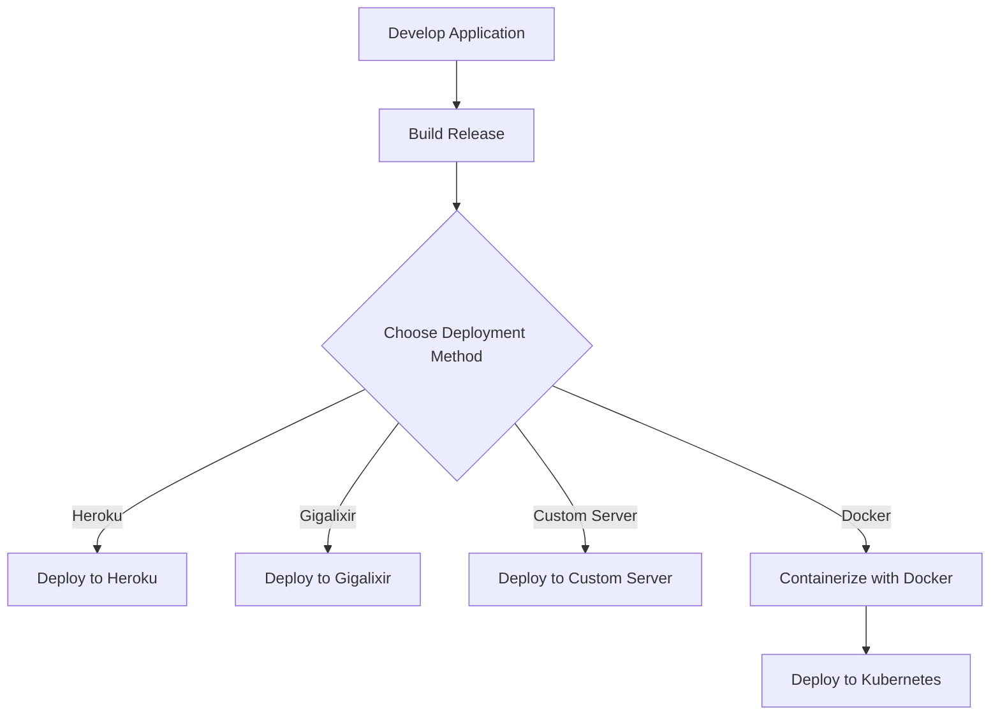

## 15.11. Deployment Strategies

Deploying Elixir applications, especially those built with the Phoenix Framework, requires a solid understanding of various deployment strategies to ensure scalability, reliability, and maintainability. In this section, we will delve into the intricacies of building standalone releases, explore hosting options, and discuss the role of containerization in modern deployment practices.

### Releases

Releases are self-contained packages of your Elixir applications, including all necessary dependencies and the Erlang runtime. They allow for easy deployment and management of your application in production environments. Let's explore how to build releases using Mix and Distillery.

#### Building Releases with Mix

Mix, the build tool that comes with Elixir, supports creating releases natively since Elixir 1.9. This approach simplifies the deployment process by bundling your application with its dependencies and the Erlang VM into a single package.

**Steps to Build a Release with Mix:**

1. **Configure Your Application:**
   Ensure your `mix.exs` file is properly configured with the necessary dependencies and application settings.

2. **Add a Release Configuration:**
   In your `mix.exs`, add a release configuration under the `def project do` block:

   ```elixir
   def project do
     [
       app: :my_app,
       version: "0.1.0",
       elixir: "~> 1.11",
       start_permanent: Mix.env() == :prod,
       deps: deps(),
       releases: [
         my_app: [
           include_erts: true,
           applications: [runtime_tools: :permanent]
         ]
       ]
     ]
   end
   ```

3. **Build the Release:**
   Run the following command to build the release:

   ```bash
   MIX_ENV=prod mix release
   ```

4. **Deploy the Release:**
   The release will be located in `_build/prod/rel/my_app`. You can copy this directory to your production server and start the application using the `bin/my_app start` command.

#### Building Releases with Distillery

Distillery was the primary tool for building releases before Elixir 1.9. While Mix now provides native support, Distillery is still widely used and offers additional features.

**Steps to Build a Release with Distillery:**

1. **Add Distillery to Your Project:**
   Add Distillery as a dependency in your `mix.exs`:

   ```elixir
   defp deps do
     [
       {:distillery, "~> 2.0"}
     ]
   end
   ```

2. **Initialize Distillery:**
   Run the following command to initialize Distillery:

   ```bash
   mix release.init
   ```

3. **Configure the Release:**
   Edit the `rel/config.exs` file to configure your release. You can specify the release name, version, and other options.

4. **Build the Release:**
   Use the following command to build the release:

   ```bash
   MIX_ENV=prod mix release
   ```

5. **Deploy the Release:**
   Similar to the Mix release, deploy the release package to your production server and start it using the generated scripts.

#### Key Considerations for Releases

- **Include ERTS:** Including the Erlang Runtime System (ERTS) ensures that your application runs with the correct version of Erlang, independent of the host environment.
- **Configuration Management:** Use environment variables or configuration files to manage application settings in different environments.
- **Hot Code Upgrades:** Elixir supports hot code upgrades, allowing you to update a running system without downtime. This requires careful planning and versioning of your application.

### Hosting Options

Choosing the right hosting platform is crucial for the performance and reliability of your Elixir applications. Let's explore some popular hosting options.

#### Deploying to Heroku

Heroku is a platform-as-a-service (PaaS) that simplifies deployment by abstracting infrastructure management. It is a great choice for quick deployments and scaling applications.

**Steps to Deploy to Heroku:**

1. **Create a Heroku Account:**
   Sign up for a Heroku account if you don't already have one.

2. **Install the Heroku CLI:**
   Download and install the Heroku CLI from [Heroku's website](https://devcenter.heroku.com/articles/heroku-cli).

3. **Create a Heroku Application:**
   Use the Heroku CLI to create a new application:

   ```bash
   heroku create my-phoenix-app
   ```

4. **Configure Buildpacks:**
   Set the buildpacks for Elixir and Node.js (for Phoenix):

   ```bash
   heroku buildpacks:set https://github.com/HashNuke/heroku-buildpack-elixir
   heroku buildpacks:add --index 1 https://github.com/gjaldon/heroku-buildpack-phoenix-static
   ```

5. **Deploy Your Application:**
   Push your code to Heroku:

   ```bash
   git push heroku main
   ```

6. **Manage Your Application:**
   Use the Heroku dashboard or CLI to manage your application's environment variables, scaling, and logs.

#### Deploying to Gigalixir

Gigalixir is a hosting platform specifically designed for Elixir applications. It offers features like zero-downtime deployments and built-in clustering.

**Steps to Deploy to Gigalixir:**

1. **Create a Gigalixir Account:**
   Sign up for an account at [Gigalixir](https://gigalixir.com).

2. **Install the Gigalixir CLI:**
   Install the CLI tool:

   ```bash
   pip install gigalixir
   ```

3. **Create a Gigalixir Application:**
   Create a new application:

   ```bash
   gigalixir create my-phoenix-app
   ```

4. **Deploy Your Application:**
   Deploy your application using Git:

   ```bash
   git push gigalixir main
   ```

5. **Manage Your Application:**
   Use the Gigalixir CLI to scale your application, manage environment variables, and monitor performance.

#### Deploying to Custom Servers

For more control over your infrastructure, you can deploy Elixir applications to custom servers. This approach requires managing the server environment, security, and scaling.

**Steps to Deploy to a Custom Server:**

1. **Provision a Server:**
   Use a cloud provider like AWS, Google Cloud, or DigitalOcean to provision a server.

2. **Install Dependencies:**
   Ensure the server has the necessary dependencies, including Erlang, Elixir, and any system libraries your application requires.

3. **Deploy the Release:**
   Copy the release package to the server and start the application using the provided scripts.

4. **Configure a Reverse Proxy:**
   Use a reverse proxy like Nginx or Apache to handle HTTPS and route traffic to your application.

5. **Monitor and Scale:**
   Implement monitoring and scaling solutions to ensure your application remains performant and reliable.

### Containerization

Containerization is a powerful deployment strategy that encapsulates your application and its dependencies into a single container image. This ensures consistency across different environments and simplifies scaling.

#### Using Docker for Consistent Deployment Environments

Docker is the most popular containerization platform, allowing you to build, ship, and run applications in containers.

**Steps to Containerize an Elixir Application with Docker:**

1. **Create a Dockerfile:**
   Define a Dockerfile to specify the build process and runtime environment for your application.

   ```dockerfile
   # Use the official Elixir image
   FROM elixir:1.11

   # Install Hex and Rebar
   RUN mix local.hex --force && \
       mix local.rebar --force

   # Set the working directory
   WORKDIR /app

   # Copy the mix files and install dependencies
   COPY mix.exs mix.lock ./
   RUN mix deps.get

   # Copy the application source code
   COPY . .

   # Compile the application
   RUN mix compile

   # Expose the port the app runs on
   EXPOSE 4000

   # Start the application
   CMD ["mix", "phx.server"]
   ```

2. **Build the Docker Image:**
   Use the Docker CLI to build the image:

   ```bash
   docker build -t my-phoenix-app .
   ```

3. **Run the Docker Container:**
   Start a container from the image:

   ```bash
   docker run -p 4000:4000 my-phoenix-app
   ```

4. **Deploy to a Container Orchestration Platform:**
   Use platforms like Kubernetes or Docker Swarm to manage and scale your containers in production.

#### Key Considerations for Containerization

- **Environment Consistency:** Containers ensure that your application behaves the same way in development, testing, and production environments.
- **Scalability:** Containers can be easily scaled horizontally by running multiple instances across different nodes.
- **Security:** Ensure your container images are secure by regularly updating base images and scanning for vulnerabilities.

### Visualizing Deployment Strategies

To better understand the deployment strategies discussed, let's visualize the process using a Mermaid.js diagram.


```mermaid
graph TD;
    A[Develop Application] --> B[Build Release];
    B --> C{Choose Deployment Method};
    C -->|Heroku| D[Deploy to Heroku];
    C -->|Gigalixir| E[Deploy to Gigalixir];
    C -->|Custom Server| F[Deploy to Custom Server];
    C -->|Docker| G[Containerize with Docker];
    G --> H[Deploy to Kubernetes];
```

**Diagram Description:** This flowchart illustrates the process of developing an Elixir application, building a release, and choosing a deployment method. Options include deploying to Heroku, Gigalixir, custom servers, or containerizing with Docker for deployment on platforms like Kubernetes.

### Knowledge Check

Before we conclude, let's reinforce the key concepts covered in this section with a few questions and exercises.

#### Questions

1. What are the benefits of using releases for deploying Elixir applications?
2. How does containerization improve deployment consistency?
3. What are the key differences between deploying to Heroku and Gigalixir?

#### Exercises

1. **Build a Release with Mix:**
   Create a simple Phoenix application and build a release using Mix. Deploy it to a local server and test its functionality.

2. **Containerize an Application:**
   Take an existing Elixir application and create a Dockerfile to containerize it. Run the container locally and ensure it operates correctly.

3. **Deploy to Heroku:**
   Deploy a Phoenix application to Heroku and configure environment variables for a production environment.

### Summary

In this section, we explored various deployment strategies for Elixir applications, including building releases with Mix and Distillery, deploying to hosting platforms like Heroku and Gigalixir, and leveraging Docker for containerization. Each strategy offers unique benefits and considerations, allowing you to choose the best approach for your application's needs.

Remember, deployment is a critical aspect of application development, and mastering these strategies will ensure your Elixir applications are robust, scalable, and maintainable.

## Quiz Time!



### What is the primary purpose of building a release in Elixir?

- [x] To bundle the application with its dependencies and the Erlang runtime for easy deployment.
- [ ] To compile the application for development purposes.
- [ ] To create a backup of the application code.
- [ ] To generate documentation for the application.

> **Explanation:** Building a release bundles the application with its dependencies and the Erlang runtime, making it easy to deploy in production environments.

### Which tool is used for building releases in Elixir 1.9 and later?

- [x] Mix
- [ ] Distillery
- [ ] Rebar
- [ ] Hex

> **Explanation:** Mix provides native support for building releases in Elixir 1.9 and later, simplifying the deployment process.

### What is a key advantage of deploying to Heroku?

- [x] Abstracts infrastructure management, allowing for quick deployments and scaling.
- [ ] Requires manual server configuration and management.
- [ ] Provides built-in support for Docker containers.
- [ ] Offers unlimited free hosting for Elixir applications.

> **Explanation:** Heroku abstracts infrastructure management, making it easy to deploy and scale applications without dealing with server configurations.

### How does Docker improve deployment consistency?

- [x] By encapsulating the application and its dependencies into a single container image.
- [ ] By providing a graphical interface for managing deployments.
- [ ] By automatically optimizing application code for performance.
- [ ] By offering free cloud hosting for containerized applications.

> **Explanation:** Docker encapsulates the application and its dependencies into a container image, ensuring consistent behavior across different environments.

### What is the role of a reverse proxy in deploying to custom servers?

- [x] To handle HTTPS and route traffic to the application.
- [ ] To compile the application code for production.
- [ ] To manage database connections.
- [ ] To generate application logs.

> **Explanation:** A reverse proxy handles HTTPS and routes incoming traffic to the application, enhancing security and performance.

### Which platform is specifically designed for hosting Elixir applications?

- [x] Gigalixir
- [ ] AWS
- [ ] Google Cloud
- [ ] Azure

> **Explanation:** Gigalixir is specifically designed for hosting Elixir applications, offering features like zero-downtime deployments and clustering.

### What is a common use case for hot code upgrades in Elixir?

- [x] Updating a running system without downtime.
- [ ] Compiling the application for development purposes.
- [ ] Generating application documentation.
- [ ] Backing up application data.

> **Explanation:** Hot code upgrades allow you to update a running system without downtime, ensuring continuous availability.

### What is the purpose of the `EXPOSE` directive in a Dockerfile?

- [x] To specify the port the application runs on.
- [ ] To compile the application code.
- [ ] To install dependencies.
- [ ] To generate application logs.

> **Explanation:** The `EXPOSE` directive specifies the port the application runs on, allowing it to be accessed from outside the container.

### Which command is used to start an Elixir application release?

- [x] `bin/my_app start`
- [ ] `mix phx.server`
- [ ] `elixir --start`
- [ ] `iex -S mix`

> **Explanation:** The `bin/my_app start` command is used to start an Elixir application release, executing the bundled runtime and application code.

### True or False: Distillery is still a viable option for building releases in Elixir.

- [x] True
- [ ] False

> **Explanation:** While Mix now provides native support for releases, Distillery remains a viable option, offering additional features for complex deployment scenarios.


