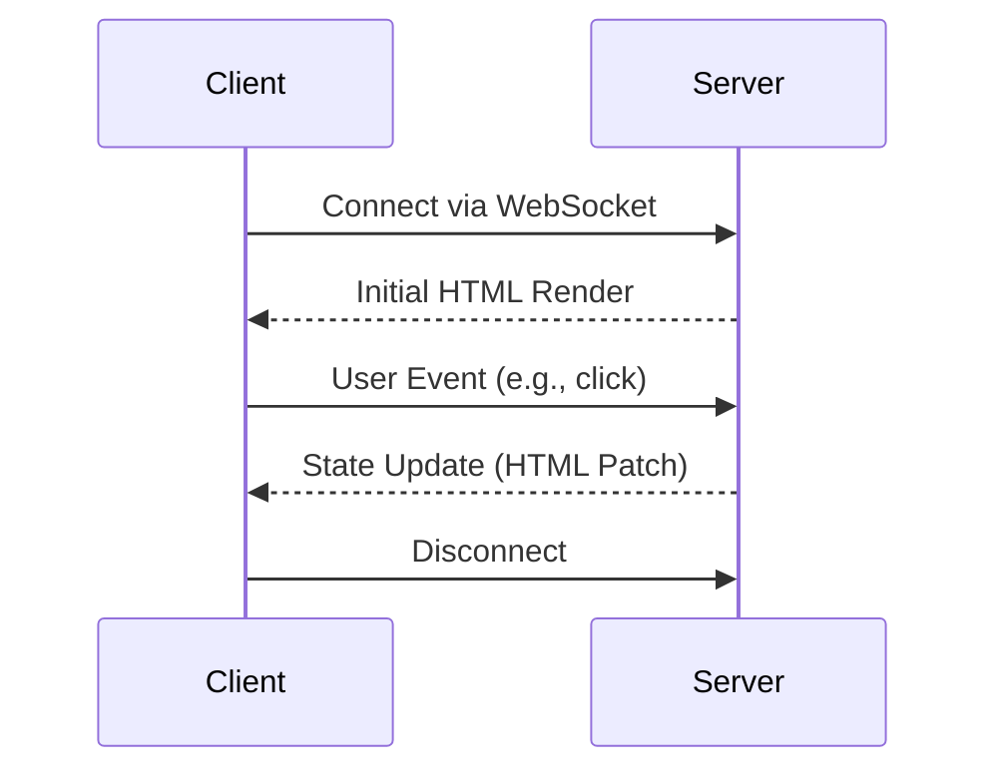

## 15.12. Phoenix LiveView and Interactive Applications

Phoenix LiveView is a groundbreaking technology that allows developers to build rich, real-time user interfaces without writing a single line of JavaScript. By leveraging the power of Elixir and the Phoenix framework, LiveView enables server-rendered HTML to be dynamically updated in response to user interactions, creating a seamless and interactive experience. In this section, we will explore the core concepts of Phoenix LiveView, delve into state management, and examine various use cases where LiveView shines.

### LiveView Overview

Phoenix LiveView is a library that brings the power of server-side rendering to real-time applications. It allows developers to create interactive web applications where the server maintains the state and updates the client view in real-time. This approach eliminates the need for complex JavaScript frameworks on the client side, simplifying the development process and reducing the potential for bugs.

#### Key Features of Phoenix LiveView

- **Real-Time Updates**: LiveView uses WebSockets to push updates from the server to the client, ensuring that the user interface is always in sync with the server state.
- **Server-Side Rendering**: All rendering logic is handled on the server, which means you can leverage the full power of Elixir and Phoenix to generate dynamic content.
- **Minimal JavaScript**: By handling most interactions on the server, LiveView reduces the need for JavaScript, leading to cleaner and more maintainable codebases.
- **Seamless Integration**: LiveView integrates seamlessly with existing Phoenix applications, allowing you to incrementally adopt it in your projects.

#### How LiveView Works

LiveView operates by maintaining a persistent WebSocket connection between the client and the server. When a user interacts with the page, events are sent to the server, which processes them and updates the state. The server then sends the updated HTML back to the client, which patches the DOM to reflect the changes.

```elixir
defmodule MyAppWeb.CounterLive do
  use Phoenix.LiveView

  def mount(_params, _session, socket) do
    {:ok, assign(socket, count: 0)}
  end

  def render(assigns) do
    ~L"""
    <div>
      <h1>Counter: <%= @count %></h1>
      <button phx-click="increment">Increment</button>
    </div>
    """
  end

  def handle_event("increment", _value, socket) do
    {:noreply, update(socket, :count, &(&1 + 1))}
  end
end
```

In this example, we define a simple counter application using LiveView. The `mount/3` function initializes the state, the `render/1` function generates the HTML, and the `handle_event/3` function processes user interactions.

### State Management

State management in Phoenix LiveView is a critical aspect that determines how your application responds to user interactions and updates the UI. Since LiveView operates on the server, all state changes occur there, and the client receives updates via WebSockets.

#### Initializing State

The `mount/3` callback is used to initialize the state when a LiveView is first rendered. This function is called when the LiveView is mounted, and it receives parameters, session data, and the socket. You can use this function to set up initial state values.

```elixir
def mount(_params, _session, socket) do
  {:ok, assign(socket, count: 0)}
end
```

#### Updating State

State updates are handled through events. When a user interacts with the UI, an event is triggered and sent to the server. The `handle_event/3` callback processes these events and updates the state accordingly.

```elixir
def handle_event("increment", _value, socket) do
  {:noreply, update(socket, :count, &(&1 + 1))}
end
```

In this example, the `increment` event updates the `count` state by incrementing it by one.

#### Managing Complex State

For more complex applications, you may need to manage a more intricate state. LiveView provides several functions to help with this, such as `assign/3`, `update/3`, and `put_flash/3`. These functions allow you to manipulate the state and provide feedback to the user.

```elixir
def handle_event("add_item", %{"item" => item}, socket) do
  items = socket.assigns.items ++ [item]
  {:noreply, assign(socket, items: items)}
end
```

### Use Cases

Phoenix LiveView is versatile and can be used in a variety of scenarios. Here are some common use cases where LiveView excels:

#### Form Validations

LiveView can handle real-time form validations, providing instant feedback to users as they fill out forms. This improves the user experience by reducing the need for page reloads and allowing users to correct errors immediately.

```elixir
def handle_event("validate", %{"user" => user_params}, socket) do
  changeset = User.changeset(%User{}, user_params)
  {:noreply, assign(socket, changeset: changeset)}
end
```

#### Dynamic Content Updates

LiveView is ideal for applications that require dynamic content updates, such as dashboards or news feeds. By pushing updates from the server, LiveView ensures that users always see the most current information.

```elixir
def handle_info(:update_news, socket) do
  news = fetch_latest_news()
  {:noreply, assign(socket, news: news)}
end
```

#### Games

LiveView can be used to create simple multiplayer games where the server manages the game state and updates all connected clients in real-time. This approach simplifies the development of real-time games by centralizing the game logic on the server.

```elixir
def handle_event("move", %{"direction" => direction}, socket) do
  new_position = calculate_new_position(socket.assigns.position, direction)
  {:noreply, assign(socket, position: new_position)}
end
```

### Best Practices

When working with Phoenix LiveView, there are several best practices to keep in mind to ensure your applications are efficient and maintainable.

#### Optimize State Updates

Minimize the amount of data sent over the WebSocket by only updating the parts of the state that have changed. Use the `assign/3` function to update specific keys in the socket's assigns.

#### Use Components

Break down complex LiveViews into smaller, reusable components. This improves code organization and makes it easier to manage state and events.

```elixir
defmodule MyAppWeb.CounterComponent do
  use Phoenix.LiveComponent

  def render(assigns) do
    ~L"""
    <div>
      <h1>Counter: <%= @count %></h1>
      <button phx-click="increment">Increment</button>
    </div>
    """
  end
end
```

#### Handle Long-Running Tasks

Offload long-running tasks to background processes to avoid blocking the LiveView. Use `Task` or `GenServer` to handle these tasks and send updates to the LiveView when they are complete.

```elixir
def handle_event("start_task", _value, socket) do
  Task.start(fn -> perform_long_task() end)
  {:noreply, socket}
end
```

### Visualizing LiveView Architecture

To better understand how Phoenix LiveView operates, let's visualize the architecture using a Mermaid.js diagram.



**Diagram Description**: This sequence diagram illustrates the interaction between the client and server in a Phoenix LiveView application. The client connects to the server via WebSocket, receives the initial HTML render, sends user events to the server, and receives state updates as HTML patches.

### Try It Yourself

To get hands-on experience with Phoenix LiveView, try modifying the counter example to include a decrement button. Experiment with adding new features, such as resetting the counter or persisting the count in a database.

### References and Links

- [Phoenix LiveView Documentation](https://hexdocs.pm/phoenix_live_view/Phoenix.LiveView.html)
- [Elixir Forum: LiveView Discussions](https://elixirforum.com/c/phoenix-liveview/)

### Knowledge Check

- How does Phoenix LiveView handle real-time updates?
- What is the role of the `mount/3` function in a LiveView?
- How can you optimize state updates in a LiveView application?

### Embrace the Journey

Remember, mastering Phoenix LiveView is just the beginning. As you continue to explore its capabilities, you'll discover new ways to create interactive and engaging web applications. Keep experimenting, stay curious, and enjoy the journey!

## Quiz: Phoenix LiveView and Interactive Applications



### What is the primary benefit of using Phoenix LiveView?

- [x] Building real-time user interfaces without JavaScript
- [ ] Faster client-side rendering
- [ ] Improved SEO
- [ ] Enhanced security

> **Explanation:** Phoenix LiveView allows developers to build real-time user interfaces without the need for JavaScript, simplifying the development process.

### How does LiveView maintain a connection between the client and server?

- [x] WebSockets
- [ ] HTTP requests
- [ ] AJAX
- [ ] REST API

> **Explanation:** LiveView uses WebSockets to maintain a persistent connection between the client and server for real-time updates.

### Which function is used to initialize state in a LiveView?

- [x] mount/3
- [ ] render/1
- [ ] handle_event/3
- [ ] update/3

> **Explanation:** The `mount/3` function is used to initialize state when a LiveView is first rendered.

### What is a common use case for Phoenix LiveView?

- [x] Real-time form validations
- [ ] Static content rendering
- [ ] Batch processing
- [ ] Data encryption

> **Explanation:** LiveView is commonly used for real-time form validations, providing instant feedback to users.

### How can you optimize state updates in a LiveView application?

- [x] Update only the parts of the state that have changed
- [ ] Use global variables
- [ ] Send full HTML pages
- [ ] Avoid using WebSockets

> **Explanation:** Optimizing state updates involves updating only the parts of the state that have changed to minimize data sent over WebSockets.

### What is the purpose of the `handle_event/3` function?

- [x] To process user interactions and update state
- [ ] To render HTML
- [ ] To initialize state
- [ ] To manage WebSocket connections

> **Explanation:** The `handle_event/3` function processes user interactions and updates the state in a LiveView.

### Which of the following is a best practice when using LiveView?

- [x] Break down complex LiveViews into smaller components
- [ ] Use JavaScript for all interactions
- [ ] Avoid using WebSockets
- [ ] Store state on the client

> **Explanation:** Breaking down complex LiveViews into smaller components improves code organization and maintainability.

### What is a key feature of Phoenix LiveView?

- [x] Server-side rendering
- [ ] Client-side routing
- [ ] Static file serving
- [ ] Database management

> **Explanation:** Phoenix LiveView features server-side rendering, allowing dynamic content generation on the server.

### True or False: LiveView requires extensive JavaScript knowledge.

- [x] False
- [ ] True

> **Explanation:** One of the main benefits of LiveView is that it reduces the need for JavaScript, allowing developers to focus on Elixir and server-side logic.

### How can you handle long-running tasks in a LiveView application?

- [x] Offload them to background processes
- [ ] Use synchronous functions
- [ ] Block the WebSocket connection
- [ ] Avoid using tasks

> **Explanation:** Long-running tasks should be offloaded to background processes to avoid blocking the LiveView and maintain responsiveness.


