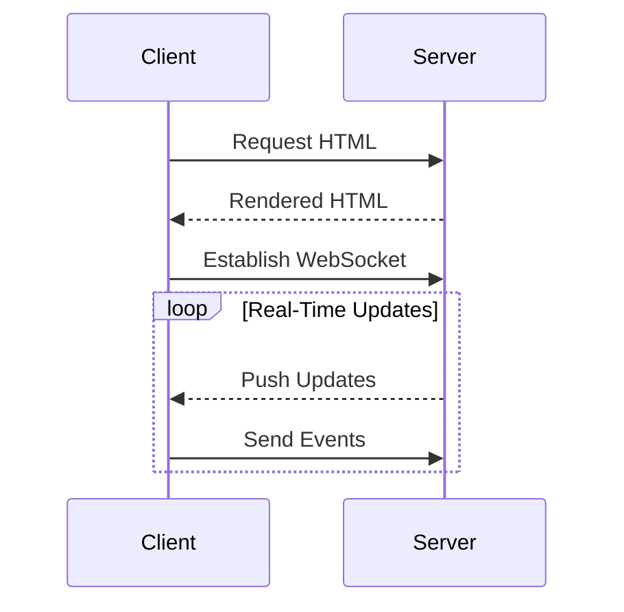

## 15.12. Phoenix LiveView and Interactive Applications

As web applications continue to evolve, the demand for real-time interactivity has become paramount. Phoenix LiveView offers a groundbreaking approach to building rich, interactive user interfaces without the need for client-side JavaScript frameworks. This section explores the core concepts of Phoenix LiveView, delves into state management, and provides practical examples to help you create dynamic web applications efficiently.

### LiveView Overview

Phoenix LiveView is an innovative technology that allows developers to build real-time web interfaces using Elixir and the Phoenix framework. By leveraging server-rendered HTML and WebSockets, LiveView eliminates the need for complex JavaScript frameworks, simplifying the development process while maintaining high performance and responsiveness.

#### Key Benefits of Phoenix LiveView

- **Reduced Complexity**: By handling both server and client-side logic in Elixir, LiveView reduces the need for JavaScript, streamlining the development process.
- **Real-Time Updates**: LiveView uses WebSockets to push updates from the server to the client, ensuring that users receive the latest data instantly.
- **SEO-Friendly**: Since LiveView renders HTML on the server, it remains accessible to search engines, enhancing SEO capabilities.
- **Unified Codebase**: Developers can maintain a single codebase for both server and client logic, improving maintainability and reducing potential bugs.

### Building Rich, Real-Time User Interfaces Without JavaScript

Phoenix LiveView empowers developers to create interactive applications without relying on JavaScript frameworks. By using Elixir's powerful functional programming capabilities, LiveView manages real-time updates and user interactions seamlessly.

#### How LiveView Works

At its core, LiveView operates by establishing a WebSocket connection between the server and the client. This connection allows the server to push updates to the client whenever the state changes, ensuring that the user interface remains synchronized with the server state.

```elixir
defmodule MyAppWeb.CounterLive do
  use Phoenix.LiveView

  def mount(_params, _session, socket) do
    {:ok, assign(socket, :count, 0)}
  end

  def handle_event("increment", _value, socket) do
    {:noreply, update(socket, :count, &(&1 + 1))}
  end

  def render(assigns) do
    ~L"""
    <div>
      <h1>Count: <%= @count %></h1>
      <button phx-click="increment">Increment</button>
    </div>
    """
  end
end
```

In this example, a simple counter application is created using LiveView. The `mount/3` function initializes the state, while `handle_event/3` manages user interactions. The `render/1` function generates the HTML content, which is dynamically updated based on the state.

#### Try It Yourself

Experiment with the code by adding a "decrement" button to decrease the count. Observe how LiveView handles state updates and renders changes in real-time.

### State Management

State management is a critical aspect of building interactive applications. In LiveView, state is maintained on the server, ensuring consistency and reliability across user sessions.

#### Handling Server-Side State Updates

LiveView manages state updates through a series of lifecycle callbacks. These callbacks allow developers to define how the application responds to user actions and external events.

- **Mounting**: The `mount/3` function initializes the state when the LiveView is first rendered.
- **Event Handling**: The `handle_event/3` function processes user interactions, updating the state as needed.
- **Rendering**: The `render/1` function generates the HTML content based on the current state.

```elixir
defmodule MyAppWeb.TodoLive do
  use Phoenix.LiveView

  def mount(_params, _session, socket) do
    {:ok, assign(socket, todos: [])}
  end

  def handle_event("add_todo", %{"todo" => todo}, socket) do
    {:noreply, update(socket, :todos, &[todo | &1])}
  end

  def render(assigns) do
    ~L"""
    <div>
      <h1>Todo List</h1>
      <ul>
        <%= for todo <- @todos do %>
          <li><%= todo %></li>
        <% end %>
      </ul>
      <input type="text" phx-change="add_todo" placeholder="Add a new todo"/>
    </div>
    """
  end
end
```

In this example, a basic todo list application is implemented using LiveView. The state is managed server-side, ensuring that all clients receive consistent updates.

#### State Synchronization

LiveView ensures that the client and server states remain synchronized by leveraging the WebSocket connection. This synchronization is crucial for maintaining a seamless user experience, especially in collaborative or multi-user applications.

### Use Cases for Phoenix LiveView

Phoenix LiveView is versatile and can be applied to a wide range of use cases, from simple form validations to complex interactive applications.

#### Form Validations

LiveView simplifies form validations by handling them server-side. This approach reduces the need for client-side validation logic and ensures that all validation rules are consistently enforced.

```elixir
defmodule MyAppWeb.RegistrationLive do
  use Phoenix.LiveView

  def mount(_params, _session, socket) do
    {:ok, assign(socket, changeset: %{})}
  end

  def handle_event("validate", %{"user" => user_params}, socket) do
    changeset = User.changeset(%User{}, user_params)
    {:noreply, assign(socket, changeset: changeset)}
  end

  def render(assigns) do
    ~L"""
    <form phx-change="validate">
      <input type="text" name="user[name]" placeholder="Name" />
      <input type="email" name="user[email]" placeholder="Email" />
      <button type="submit">Register</button>
    </form>
    <%= if @changeset.valid? do %>
      <p>Form is valid!</p>
    <% else %>
      <p>Form is invalid!</p>
    <% end %>
    """
  end
end
```

In this example, a registration form is validated server-side using LiveView. The `handle_event/3` function processes form inputs and updates the changeset, which is then rendered to provide feedback to the user.

#### Dynamic Content Updates

LiveView excels at handling dynamic content updates, such as live notifications, real-time data feeds, and interactive dashboards.

```elixir
defmodule MyAppWeb.StockTickerLive do
  use Phoenix.LiveView

  def mount(_params, _session, socket) do
    {:ok, assign(socket, prices: fetch_stock_prices())}
  end

  def handle_info(:update_prices, socket) do
    {:noreply, assign(socket, prices: fetch_stock_prices())}
  end

  def render(assigns) do
    ~L"""
    <div>
      <h1>Stock Prices</h1>
      <ul>
        <%= for {ticker, price} <- @prices do %>
          <li><%= ticker %>: $<%= price %></li>
        <% end %>
      </ul>
    </div>
    """
  end

  defp fetch_stock_prices do
    # Simulate fetching stock prices
    [{"AAPL", 150.00}, {"GOOGL", 2800.00}, {"AMZN", 3400.00}]
  end
end
```

This example demonstrates a stock ticker application that updates stock prices in real-time. The `handle_info/2` function periodically fetches new prices and updates the state, which is then rendered to the client.

#### Games and Interactive Experiences

LiveView is well-suited for building real-time games and interactive experiences, where responsiveness and low latency are critical.

```elixir
defmodule MyAppWeb.PongLive do
  use Phoenix.LiveView

  def mount(_params, _session, socket) do
    {:ok, assign(socket, ball_position: {50, 50}, player_position: 50)}
  end

  def handle_event("move_player", %{"direction" => direction}, socket) do
    new_position = update_player_position(socket.assigns.player_position, direction)
    {:noreply, assign(socket, player_position: new_position)}
  end

  def render(assigns) do
    ~L"""
    <div>
      <h1>Pong Game</h1>
      <div id="game">
        <div id="ball" style="left: <%= elem(@ball_position, 0) %>px; top: <%= elem(@ball_position, 1) %>px;"></div>
        <div id="player" style="left: <%= @player_position %>px;"></div>
      </div>
      <button phx-click="move_player" phx-value-direction="left">Left</button>
      <button phx-click="move_player" phx-value-direction="right">Right</button>
    </div>
    """
  end

  defp update_player_position(position, "left"), do: max(position - 10, 0)
  defp update_player_position(position, "right"), do: min(position + 10, 100)
end
```

In this example, a simple Pong game is implemented using LiveView. The game state is managed on the server, and user interactions are processed in real-time, providing a smooth gaming experience.

### Visualizing Phoenix LiveView Architecture

To better understand how LiveView operates, let's visualize its architecture using a sequence diagram.


```mermaid
sequenceDiagram
    participant Client
    participant Server
    Client->>Server: Request HTML
    Server-->>Client: Rendered HTML
    Client->>Server: Establish WebSocket
    loop Real-Time Updates
        Server-->>Client: Push Updates
        Client->>Server: Send Events
    end
```

**Diagram Description**: This sequence diagram illustrates the interaction between the client and server in a Phoenix LiveView application. The client requests rendered HTML, establishes a WebSocket connection, and receives real-time updates from the server.

### Design Considerations

When building applications with Phoenix LiveView, consider the following design principles:

- **State Management**: Ensure that state changes are minimal and efficient to reduce server load and latency.
- **Scalability**: Design your application to handle multiple concurrent connections, leveraging Elixir's concurrency model.
- **Security**: Since LiveView handles server-side logic, ensure that user inputs are validated and sanitized to prevent security vulnerabilities.

### Elixir Unique Features

Phoenix LiveView leverages Elixir's unique features, such as its concurrency model and functional programming paradigm, to deliver high-performance, real-time applications. The use of processes and message passing ensures that LiveView applications remain responsive and scalable.

### Differences and Similarities with Other Patterns

Phoenix LiveView shares similarities with traditional server-rendered applications but differs in its use of WebSockets for real-time updates. Unlike client-side JavaScript frameworks, LiveView maintains a unified codebase, reducing complexity and improving maintainability.

### Knowledge Check

- **Question**: What is the primary advantage of using Phoenix LiveView over traditional JavaScript frameworks?
- **Question**: How does LiveView handle real-time updates between the server and client?
- **Question**: Describe a use case where Phoenix LiveView would be particularly beneficial.

### Embrace the Journey

Remember, this is just the beginning of your journey with Phoenix LiveView. As you continue to explore its capabilities, you'll discover new ways to build interactive and engaging web applications. Keep experimenting, stay curious, and enjoy the process!

### References and Links

- [Phoenix LiveView Documentation](https://hexdocs.pm/phoenix_live_view/Phoenix.LiveView.html)
- [Elixir Lang](https://elixir-lang.org/)
- [Phoenix Framework](https://www.phoenixframework.org/)

## Quiz Time!



### What is a key benefit of using Phoenix LiveView?

- [x] Reduced complexity by handling both server and client logic in Elixir
- [ ] Increased reliance on JavaScript frameworks
- [ ] Separate codebases for server and client
- [ ] Limited real-time capabilities

> **Explanation:** Phoenix LiveView reduces complexity by allowing developers to manage both server and client logic within Elixir, eliminating the need for separate JavaScript frameworks.

### How does Phoenix LiveView maintain real-time updates?

- [x] By using WebSockets to push updates from the server to the client
- [ ] Through periodic HTTP requests
- [ ] By polling the server every few seconds
- [ ] Using client-side JavaScript

> **Explanation:** Phoenix LiveView uses WebSockets to maintain a persistent connection, allowing the server to push real-time updates to the client.

### Which function initializes the state in a LiveView module?

- [x] `mount/3`
- [ ] `handle_event/3`
- [ ] `render/1`
- [ ] `update/3`

> **Explanation:** The `mount/3` function is responsible for initializing the state when a LiveView is first rendered.

### In LiveView, where is the state managed?

- [x] On the server
- [ ] On the client
- [ ] In a database
- [ ] In cookies

> **Explanation:** In Phoenix LiveView, the state is managed on the server, ensuring consistency across user sessions.

### What is a common use case for Phoenix LiveView?

- [x] Real-time form validations
- [ ] Static web pages
- [ ] Complex JavaScript animations
- [ ] Server-side image processing

> **Explanation:** Phoenix LiveView is commonly used for real-time form validations, among other interactive applications.

### How does LiveView handle user interactions?

- [x] Through the `handle_event/3` function
- [ ] By modifying the DOM directly
- [ ] Using client-side JavaScript
- [ ] Through HTTP requests

> **Explanation:** The `handle_event/3` function processes user interactions and updates the state accordingly.

### Which of the following is a benefit of server-rendered HTML in LiveView?

- [x] SEO-friendly content
- [ ] Increased client-side complexity
- [ ] Reduced server performance
- [ ] Limited interactivity

> **Explanation:** Server-rendered HTML in LiveView is SEO-friendly because it can be indexed by search engines.

### What is the role of the WebSocket connection in LiveView?

- [x] To enable real-time communication between the client and server
- [ ] To serve static files
- [ ] To handle database queries
- [ ] To manage user sessions

> **Explanation:** The WebSocket connection in LiveView enables real-time communication, allowing the server to push updates to the client.

### Why is LiveView considered a unified codebase solution?

- [x] Because it combines server and client logic in Elixir
- [ ] Because it separates server and client code
- [ ] Because it relies heavily on JavaScript
- [ ] Because it uses multiple programming languages

> **Explanation:** LiveView is considered a unified codebase solution because it allows developers to manage both server and client logic within Elixir, reducing complexity.

### True or False: Phoenix LiveView requires client-side JavaScript frameworks for real-time updates.

- [ ] True
- [x] False

> **Explanation:** False. Phoenix LiveView does not require client-side JavaScript frameworks for real-time updates, as it handles them using server-rendered HTML and WebSockets.


