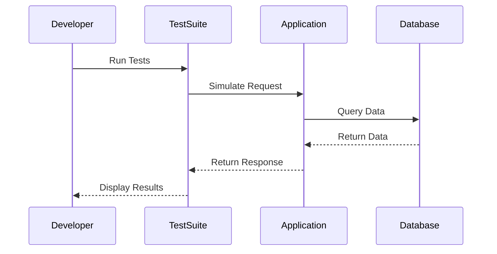

## 15.13. Testing Phoenix Applications

Testing is a critical aspect of software development, ensuring that applications behave as expected and are free from defects. In the world of Elixir and the Phoenix framework, testing is not just a best practice but a necessity for building reliable, maintainable, and scalable web applications. In this section, we will explore the various testing strategies available for Phoenix applications, focusing on unit testing, integration testing, and acceptance testing.

### Unit Testing

Unit testing is the foundation of any testing strategy. It involves testing individual components of an application in isolation to ensure they function correctly. In Phoenix applications, unit testing typically covers controllers, views, and channels.

#### Writing Tests for Controllers

Controllers are responsible for handling incoming requests, processing them, and returning responses. Testing controllers involves verifying that they correctly handle different request scenarios, such as valid inputs, invalid inputs, and edge cases.

```elixir
defmodule MyAppWeb.UserControllerTest do
  use MyAppWeb.ConnCase, async: true

  alias MyApp.Accounts
  alias MyApp.Accounts.User

  @valid_attrs %{name: "John Doe", email: "john@example.com"}
  @invalid_attrs %{name: nil, email: nil}

  test "creates user and redirects when data is valid", %{conn: conn} do
    conn = post(conn, Routes.user_path(conn, :create), user: @valid_attrs)
    assert redirected_to(conn) == Routes.user_path(conn, :index)
    assert Accounts.get_user_by_email("john@example.com")
  end

  test "does not create user and renders errors when data is invalid", %{conn: conn} do
    conn = post(conn, Routes.user_path(conn, :create), user: @invalid_attrs)
    assert html_response(conn, 200) =~ "can't be blank"
  end
end
```

In this example, we use `ConnCase` to set up the test environment. We test the `create` action of the `UserController` to ensure it behaves correctly with valid and invalid data.

#### Writing Tests for Views

Views in Phoenix are responsible for rendering templates. Testing views involves verifying that the correct data is passed to the templates and that the templates render the expected HTML.

```elixir
defmodule MyAppWeb.UserViewTest do
  use MyAppWeb.ConnCase, async: true

  alias MyAppWeb.UserView

  test "renders user.json" do
    user = %{id: 123, name: "John Doe", email: "john@example.com"}
    rendered = UserView.render("user.json", user: user)
    assert rendered == %{
      id: 123,
      name: "John Doe",
      email: "john@example.com"
    }
  end
end
```

Here, we test the `UserView` to ensure it correctly renders a user as JSON. This type of testing is crucial for APIs where the response format must be precise.

#### Writing Tests for Channels

Channels in Phoenix enable real-time communication between the server and clients. Testing channels involves simulating client-server interactions and verifying that messages are correctly broadcasted and received.

```elixir
defmodule MyAppWeb.UserChannelTest do
  use MyAppWeb.ChannelCase, async: true

  alias MyAppWeb.UserChannel

  setup do
    {:ok, _, socket} =
      UserSocket
      |> socket("user_id", %{some: :assign})
      |> subscribe_and_join(UserChannel, "user:lobby")

    {:ok, socket: socket}
  end

  test "broadcasts are pushed to the client", %{socket: socket} do
    push(socket, "new_msg", %{"body" => "Hello, World!"})
    assert_broadcast "new_msg", %{"body" => "Hello, World!"}
  end
end
```

In this example, we test the `UserChannel` to ensure that messages sent by the client are correctly broadcasted to other clients.

### Integration Testing

Integration testing involves testing the interaction between different components of an application. In Phoenix, integration testing often involves simulating HTTP requests and verifying the entire request-response cycle.

#### Using `Phoenix.ConnTest` for Request-Response Cycles

`Phoenix.ConnTest` is a powerful tool for simulating HTTP requests in tests. It allows us to test the entire stack, from the router to the controller, and verify the response.

```elixir
defmodule MyAppWeb.PageControllerTest do
  use MyAppWeb.ConnCase, async: true

  test "GET / renders the index page", %{conn: conn} do
    conn = get(conn, "/")
    assert html_response(conn, 200) =~ "Welcome to Phoenix!"
  end

  test "GET /about renders the about page", %{conn: conn} do
    conn = get(conn, "/about")
    assert html_response(conn, 200) =~ "About Us"
  end
end
```

In this example, we use `get/2` to simulate GET requests to the root and about pages of our application. We then verify that the responses contain the expected content.

### Acceptance Testing

Acceptance testing involves testing the application from the user's perspective. It typically involves automating browser interactions to ensure the application behaves correctly in real-world scenarios.

#### Automating Browser Interactions with Tools like Wallaby

Wallaby is a popular tool for acceptance testing in Elixir. It allows us to automate browser interactions and verify that the application behaves as expected.

```elixir
defmodule MyAppWeb.UserAcceptanceTest do
  use Wallaby.Feature

  feature "user can sign up", %{session: session} do
    session
    |> visit("/sign_up")
    |> fill_in(Query.text_field("Name"), with: "John Doe")
    |> fill_in(Query.text_field("Email"), with: "john@example.com")
    |> click(Query.button("Sign Up"))
    |> assert_has(Query.text("Welcome, John Doe!"))
  end
end
```

In this example, we use Wallaby to automate the process of signing up a new user. We visit the sign-up page, fill in the form, submit it, and verify that the welcome message is displayed.

### Try It Yourself

To solidify your understanding of testing Phoenix applications, try modifying the examples above. For instance, add more test cases to cover edge scenarios, or experiment with different tools and libraries for acceptance testing.

### Visualizing the Testing Process

To better understand the testing process in Phoenix applications, let's visualize the flow of a typical test suite using a sequence diagram.



This diagram illustrates the interaction between the developer, test suite, application, and database during the testing process. It highlights the flow of data and the role of each component in ensuring the application behaves as expected.

### References and Links

For more information on testing Phoenix applications, consider exploring the following resources:

- [Phoenix Testing Guide](https://hexdocs.pm/phoenix/testing.html)
- [Wallaby Documentation](https://hexdocs.pm/wallaby/readme.html)
- [ExUnit Documentation](https://hexdocs.pm/ex_unit/ExUnit.html)

### Knowledge Check

- What are the key components of unit testing in Phoenix applications?
- How does `Phoenix.ConnTest` facilitate integration testing?
- What role does Wallaby play in acceptance testing?

### Embrace the Journey

Remember, testing is an ongoing process that evolves with your application. As you continue to develop and refine your Phoenix applications, keep experimenting with different testing strategies and tools. Stay curious, and enjoy the journey of building robust and reliable web applications!

### Quiz: Testing Phoenix Applications



### What is the primary purpose of unit testing in Phoenix applications?

- [x] To test individual components in isolation
- [ ] To test the entire application as a whole
- [ ] To automate browser interactions
- [ ] To simulate HTTP requests

> **Explanation:** Unit testing focuses on testing individual components, such as controllers and views, in isolation to ensure they function correctly.

### Which tool is commonly used for acceptance testing in Phoenix applications?

- [ ] ExUnit
- [x] Wallaby
- [ ] Phoenix.ConnTest
- [ ] Ecto

> **Explanation:** Wallaby is a popular tool for acceptance testing in Elixir, allowing developers to automate browser interactions.

### What does `Phoenix.ConnTest` help with in testing?

- [ ] Automating browser interactions
- [x] Simulating HTTP request-response cycles
- [ ] Testing individual components in isolation
- [ ] Managing database transactions

> **Explanation:** `Phoenix.ConnTest` is used to simulate HTTP requests and test the entire request-response cycle in Phoenix applications.

### In the context of Phoenix testing, what is a "feature"?

- [ ] A unit test
- [ ] An integration test
- [x] An acceptance test
- [ ] A database query

> **Explanation:** In Wallaby, a "feature" refers to an acceptance test that automates browser interactions to test the application from the user's perspective.

### What is the role of `ConnCase` in Phoenix testing?

- [x] To set up the test environment for controller tests
- [ ] To automate browser interactions
- [ ] To simulate HTTP requests
- [ ] To manage database transactions

> **Explanation:** `ConnCase` is used to set up the test environment for controller tests, providing utilities for simulating HTTP requests.

### Which of the following is NOT a focus of unit testing?

- [ ] Testing individual components
- [ ] Ensuring correct function behavior
- [x] Testing user interactions
- [ ] Verifying data processing logic

> **Explanation:** Unit testing focuses on testing individual components and their behavior, not on testing user interactions, which is the focus of acceptance testing.

### What is the main advantage of using Wallaby for acceptance testing?

- [ ] It simplifies unit testing
- [x] It automates browser interactions
- [ ] It manages database transactions
- [ ] It simulates HTTP requests

> **Explanation:** Wallaby automates browser interactions, making it ideal for acceptance testing where user interactions are tested.

### How does `Phoenix.ConnTest` contribute to integration testing?

- [ ] By automating browser interactions
- [ ] By testing individual components
- [x] By simulating HTTP request-response cycles
- [ ] By managing database transactions

> **Explanation:** `Phoenix.ConnTest` is used to simulate HTTP requests and test the integration of different components in Phoenix applications.

### What is the purpose of the `setup` block in a channel test?

- [ ] To automate browser interactions
- [x] To prepare the test environment and join channels
- [ ] To simulate HTTP requests
- [ ] To manage database transactions

> **Explanation:** The `setup` block in a channel test is used to prepare the test environment, including subscribing and joining channels.

### True or False: Integration testing in Phoenix involves testing the interaction between different components of an application.

- [x] True
- [ ] False

> **Explanation:** Integration testing focuses on testing the interaction between different components, such as controllers, views, and models, in an application.


