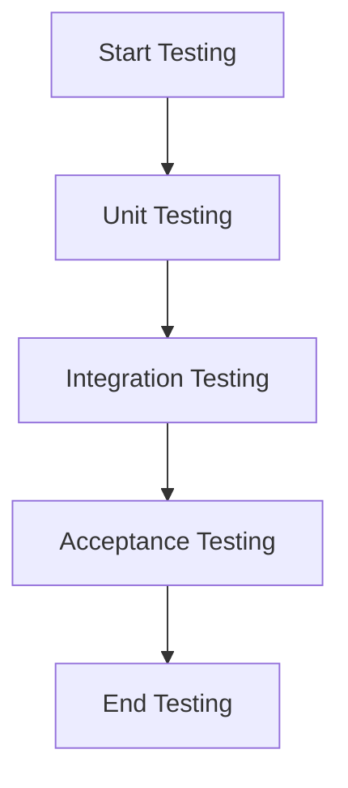

## 15.13. Testing Phoenix Applications

Testing is a crucial aspect of software development, ensuring that applications behave as expected and are free from defects. In the world of web development with the Phoenix Framework, testing is not just an afterthought but an integral part of the development process. In this section, we will delve into the various testing methodologies applicable to Phoenix applications, including unit testing, integration testing, and acceptance testing. By the end of this guide, you will have a thorough understanding of how to implement these testing strategies to build robust and reliable web applications.

### Unit Testing in Phoenix

Unit testing focuses on testing individual components of your application in isolation. In Phoenix applications, this typically involves testing controllers, views, and channels. Unit tests are designed to be fast and provide immediate feedback to developers.

#### Writing Tests for Controllers

Controllers in Phoenix handle HTTP requests and return responses. Testing controllers involves verifying that they correctly process requests and return the expected responses.

```elixir
defmodule MyAppWeb.PageControllerTest do
  use MyAppWeb.ConnCase, async: true

  test "GET / renders the index page", %{conn: conn} do
    conn = get(conn, "/")
    assert html_response(conn, 200) =~ "Welcome to Phoenix!"
  end
end
```

In this example, we use `ConnCase` to set up a connection for testing. The `get/2` function simulates a GET request to the specified path, and `html_response/2` checks the response status and content.

#### Testing Views

Views in Phoenix are responsible for rendering templates. Testing views ensures that the correct data is passed to templates and that they render as expected.

```elixir
defmodule MyAppWeb.PageViewTest do
  use MyAppWeb.ConnCase, async: true

  test "renders page title" do
    assert MyAppWeb.PageView.render("index.html", %{}) =~ "Welcome to Phoenix!"
  end
end
```

Here, we directly test the rendering of a template by calling the `render/3` function on the view module.

#### Testing Channels

Channels in Phoenix enable real-time communication. Testing channels involves simulating client-server interactions and verifying message handling.

```elixir
defmodule MyAppWeb.RoomChannelTest do
  use MyAppWeb.ChannelCase, async: true

  test "joins the room channel successfully", %{socket: socket} do
    {:ok, _, socket} = subscribe_and_join(socket, "room:lobby", %{})
    assert socket.topic == "room:lobby"
  end
end
```

In this test, we use `ChannelCase` to set up a socket connection. The `subscribe_and_join/3` function simulates a client joining a channel, and we assert that the topic is correct.

### Integration Testing

Integration testing involves testing how different parts of the application work together. In Phoenix, this often means testing request-response cycles using `Phoenix.ConnTest`.

#### Using `Phoenix.ConnTest`

`Phoenix.ConnTest` provides utilities for simulating HTTP requests and inspecting responses. This is particularly useful for testing the integration of controllers, views, and templates.

```elixir
defmodule MyAppWeb.UserControllerTest do
  use MyAppWeb.ConnCase, async: true

  test "POST /users creates a new user", %{conn: conn} do
    user_params = %{name: "John Doe", email: "john@example.com"}
    conn = post(conn, Routes.user_path(conn, :create), user: user_params)

    assert redirected_to(conn) == Routes.user_path(conn, :index)
    assert get_flash(conn, :info) == "User created successfully."
  end
end
```

In this example, we simulate a POST request to create a new user and verify that the response redirects to the user index page with a success message.

### Acceptance Testing

Acceptance testing focuses on testing the application from the user's perspective. This involves automating browser interactions to verify that the application behaves as expected in real-world scenarios.

#### Automating Browser Interactions with Wallaby

Wallaby is a tool that provides browser-based acceptance testing for Phoenix applications. It allows you to simulate user interactions and verify the resulting behavior.

```elixir
defmodule MyAppWeb.UserFlowTest do
  use MyAppWeb.FeatureCase, async: true

  test "user can sign up and log in", %{session: session} do
    session
    |> visit("/sign_up")
    |> fill_in("Name", with: "Jane Doe")
    |> fill_in("Email", with: "jane@example.com")
    |> fill_in("Password", with: "password")
    |> click_button("Sign Up")
    |> assert_text("Welcome, Jane Doe!")

    session
    |> visit("/log_in")
    |> fill_in("Email", with: "jane@example.com")
    |> fill_in("Password", with: "password")
    |> click_button("Log In")
    |> assert_text("Logged in successfully.")
  end
end
```

In this test, we simulate a user signing up and logging in by filling out forms and clicking buttons. We then verify that the expected text appears on the page.

### Visualizing the Testing Workflow

Understanding the flow of testing in a Phoenix application can be enhanced by visualizing the process. Below is a diagram that represents the testing workflow in Phoenix applications.


```mermaid
graph TD;
    A[Start Testing] --> B[Unit Testing]
    B --> C[Integration Testing]
    C --> D[Acceptance Testing]
    D --> E[End Testing]
```

**Diagram Description:** This flowchart illustrates the sequential process of testing in Phoenix applications, starting with unit testing, followed by integration testing, and concluding with acceptance testing.

### Try It Yourself

To deepen your understanding, try modifying the code examples provided:

- **Controller Test:** Add a test case for a non-existent route and verify that it returns a 404 status.
- **View Test:** Test a different template and ensure it renders correctly with various data inputs.
- **Channel Test:** Simulate sending a message to a channel and verify the server's response.
- **Integration Test:** Add more assertions to check for specific HTML elements or JSON responses.
- **Acceptance Test:** Extend the user flow to include password recovery and verify the process.

### References and Further Reading

- [Phoenix Testing Guide](https://hexdocs.pm/phoenix/testing.html)
- [Wallaby Documentation](https://hexdocs.pm/wallaby/readme.html)
- [ExUnit Documentation](https://hexdocs.pm/ex_unit/ExUnit.html)

### Knowledge Check

- What are the key differences between unit, integration, and acceptance testing?
- How does `Phoenix.ConnTest` facilitate integration testing?
- Why is acceptance testing important in web applications?

### Embrace the Journey

Testing is an ongoing process that evolves as your application grows. Remember, this is just the beginning. As you progress, you'll build more complex and interactive web applications. Keep experimenting, stay curious, and enjoy the journey!

## Quiz Time!



### What is the primary focus of unit testing in Phoenix applications?

- [x] Testing individual components in isolation
- [ ] Testing the entire application as a whole
- [ ] Simulating user interactions
- [ ] Testing network connectivity

> **Explanation:** Unit testing focuses on testing individual components, such as controllers and views, in isolation.

### Which module provides utilities for simulating HTTP requests in Phoenix?

- [x] Phoenix.ConnTest
- [ ] Phoenix.Controller
- [ ] Phoenix.Router
- [ ] Phoenix.View

> **Explanation:** `Phoenix.ConnTest` provides utilities for simulating HTTP requests and inspecting responses.

### What is the purpose of acceptance testing?

- [x] Testing the application from the user's perspective
- [ ] Testing individual functions
- [ ] Testing database queries
- [ ] Testing network protocols

> **Explanation:** Acceptance testing focuses on testing the application from the user's perspective by automating browser interactions.

### What tool is commonly used for browser-based acceptance testing in Phoenix?

- [x] Wallaby
- [ ] ExUnit
- [ ] Mix
- [ ] Dialyzer

> **Explanation:** Wallaby is a tool used for browser-based acceptance testing in Phoenix applications.

### In a controller test, what function is used to simulate a GET request?

- [x] get/2
- [ ] post/2
- [ ] put/2
- [ ] delete/2

> **Explanation:** The `get/2` function is used to simulate a GET request in controller tests.

### What does the `assert_text/2` function do in a Wallaby test?

- [x] Verifies that the specified text appears on the page
- [ ] Clicks a button with the specified text
- [ ] Fills in a form field with the specified text
- [ ] Submits a form with the specified text

> **Explanation:** The `assert_text/2` function verifies that the specified text appears on the page in a Wallaby test.

### What is the purpose of using `ConnCase` in tests?

- [x] To set up a connection for testing
- [ ] To test database queries
- [ ] To simulate user interactions
- [ ] To compile the application

> **Explanation:** `ConnCase` is used to set up a connection for testing in Phoenix applications.

### Which function is used to simulate a client joining a channel in a channel test?

- [x] subscribe_and_join/3
- [ ] broadcast/3
- [ ] push/3
- [ ] handle_in/3

> **Explanation:** The `subscribe_and_join/3` function is used to simulate a client joining a channel in a channel test.

### What is the main advantage of using Wallaby for acceptance testing?

- [x] Automating browser interactions
- [ ] Testing individual functions
- [ ] Compiling the application
- [ ] Debugging network issues

> **Explanation:** Wallaby automates browser interactions, making it ideal for acceptance testing.

### True or False: Integration testing in Phoenix involves testing request-response cycles.

- [x] True
- [ ] False

> **Explanation:** Integration testing in Phoenix involves testing request-response cycles to verify how different parts of the application work together.




