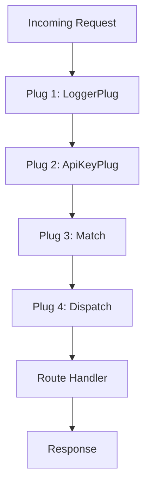

## 15.14. Middleware and Plug

In the world of Elixir web development, **Plug** is a cornerstone technology that enables developers to build robust and scalable web applications. It serves as the foundation for the Phoenix Framework, providing a set of composable modules that handle HTTP requests and responses. In this section, we will delve into the intricacies of Plug, explore how to create custom plugs, and understand the role of Plug Router in building lightweight web applications or APIs.

### Understanding Plug

Plug is a specification for composable modules in Elixir web applications. It provides a standard interface for building middleware components that can be reused across different applications. The primary goal of Plug is to offer a simple and consistent way to handle HTTP requests and responses.

#### Key Concepts of Plug

- **Plug Specification**: At its core, Plug defines a simple interface with two functions: `init/1` and `call/2`. The `init/1` function is used to initialize any options or configurations, while the `call/2` function processes the incoming connection.

- **Connection Struct**: Plug operates on a connection struct (`Plug.Conn`), which represents the HTTP request and response. This struct contains information such as request headers, parameters, and the response body.

- **Plug Pipeline**: Plugs are typically organized into a pipeline, where each plug processes the connection and passes it to the next plug in the sequence. This allows for modular and reusable code.

#### Basic Plug Example

Let's start with a simple example of a plug that logs incoming requests:

```elixir
defmodule LoggerPlug do
  import Plug.Conn

  def init(options), do: options

  def call(conn, _opts) do
    IO.puts("Received request: #{conn.method} #{conn.request_path}")
    conn
  end
end
```

- **Explanation**: This plug logs the HTTP method and request path of each incoming request. The `init/1` function simply returns the options, and the `call/2` function logs the request details before returning the connection.

### Custom Plugs

Creating custom plugs allows developers to encapsulate specific functionality and reuse it across different parts of an application. Custom plugs can be used for tasks such as authentication, logging, and request transformation.

#### Writing a Custom Plug

Let's create a custom plug that checks for an API key in the request headers:

```elixir
defmodule ApiKeyPlug do
  import Plug.Conn

  def init(options), do: options

  def call(conn, _opts) do
    case get_req_header(conn, "api-key") do
      ["valid_api_key"] -> conn
      _ -> 
        conn
        |> send_resp(401, "Unauthorized")
        |> halt()
    end
  end
end
```

- **Explanation**: This plug checks for the presence of a valid API key in the request headers. If the key is valid, the request proceeds; otherwise, a 401 Unauthorized response is sent, and the request is halted.

#### Using Custom Plugs in a Pipeline

Custom plugs can be integrated into a Plug pipeline to process requests in a specific order. Here's an example of using the `ApiKeyPlug` in a pipeline:

```elixir
defmodule MyApp.Router do
  use Plug.Router

  plug ApiKeyPlug
  plug :match
  plug :dispatch

  get "/hello" do
    send_resp(conn, 200, "Hello, world!")
  end

  match _ do
    send_resp(conn, 404, "Not found")
  end
end
```

- **Explanation**: In this example, the `ApiKeyPlug` is used to authenticate requests before they reach the route handlers. The `:match` and `:dispatch` plugs are standard components of a Plug Router.

### Plug Router

Plug Router is a lightweight alternative to full-fledged web frameworks like Phoenix. It allows developers to build simple web applications or APIs using the Plug specification.

#### Building a Simple Web Application with Plug Router

Let's build a basic web application using Plug Router:

```elixir
defmodule SimpleApp.Router do
  use Plug.Router

  plug :match
  plug :dispatch

  get "/" do
    send_resp(conn, 200, "Welcome to SimpleApp!")
  end

  get "/about" do
    send_resp(conn, 200, "About SimpleApp")
  end

  match _ do
    send_resp(conn, 404, "Page not found")
  end
end

# To run the application, we need to start a Plug adapter, such as Cowboy:
defmodule SimpleApp do
  use Application

  def start(_type, _args) do
    children = [
      {Plug.Cowboy, scheme: :http, plug: SimpleApp.Router, options: [port: 4000]}
    ]

    opts = [strategy: :one_for_one, name: SimpleApp.Supervisor]
    Supervisor.start_link(children, opts)
  end
end
```

- **Explanation**: This example demonstrates a simple web application with two routes: the root path (`/`) and an about page (`/about`). The application is started using the Cowboy HTTP server.

#### Advantages of Using Plug Router

- **Lightweight**: Plug Router is ideal for small applications or APIs where the full power of Phoenix is not required.
- **Flexibility**: Developers have complete control over the request processing pipeline, allowing for custom middleware and routing logic.
- **Performance**: Plug Router is highly performant due to its minimalistic design and efficient handling of HTTP requests.

### Visualizing Plug Middleware Flow

To better understand how Plug middleware works, let's visualize the flow of a request through a Plug pipeline:



- **Description**: This diagram illustrates the flow of an incoming request through a series of plugs, culminating in a route handler that generates a response.

### Design Considerations

When designing middleware with Plug, consider the following:

- **Order Matters**: The order of plugs in a pipeline is crucial, as each plug can modify the connection before passing it to the next plug.
- **Performance**: Minimize the number of plugs in a pipeline to reduce latency and improve performance.
- **Reusability**: Design plugs to be reusable across different applications or parts of an application.

### Elixir Unique Features

Elixir's functional programming paradigm and concurrency model make it uniquely suited for building efficient and scalable web applications. Plug leverages these features to provide a robust middleware framework that is both powerful and easy to use.

### Differences and Similarities

Plug is often compared to middleware frameworks in other languages, such as Rack in Ruby or Express in Node.js. While the core concept of middleware is similar, Plug's functional approach and integration with Elixir's concurrency model set it apart.

### Try It Yourself

To deepen your understanding of Plug, try modifying the examples provided:

- **Experiment with Custom Plugs**: Create a plug that adds a custom header to each response.
- **Build a RESTful API**: Use Plug Router to build a simple API with CRUD operations.
- **Integrate with Phoenix**: Explore how Plug is used within the Phoenix Framework to handle requests.

### Knowledge Check

- **What is the primary purpose of Plug in Elixir web applications?**
- **How does the `init/1` function differ from the `call/2` function in a plug?**
- **What is the role of the `Plug.Conn` struct?**
- **How can custom plugs be reused across different applications?**
- **What are the advantages of using Plug Router for lightweight web applications?**

### Summary

In this section, we've explored the powerful capabilities of Plug in Elixir web development. From understanding the core concepts of Plug to creating custom middleware and building lightweight applications with Plug Router, we've covered a wide range of topics that are essential for mastering Elixir's web development ecosystem. Remember, the journey doesn't end here—continue experimenting, building, and refining your skills to become an expert in Elixir web development.

## Quiz: Middleware and Plug



### What is the primary purpose of Plug in Elixir web applications?

- [x] To provide a standard interface for building middleware components
- [ ] To replace the Phoenix Framework
- [ ] To handle database connections
- [ ] To manage user sessions

> **Explanation:** Plug provides a standard interface for building middleware components in Elixir web applications.

### How does the `init/1` function differ from the `call/2` function in a plug?

- [x] `init/1` initializes options, while `call/2` processes the connection
- [ ] `init/1` processes the connection, while `call/2` initializes options
- [ ] Both functions perform the same task
- [ ] Neither function is used in Plug

> **Explanation:** The `init/1` function initializes options, and the `call/2` function processes the connection.

### What is the role of the `Plug.Conn` struct?

- [x] It represents the HTTP request and response
- [ ] It manages database transactions
- [ ] It handles user authentication
- [ ] It is used for logging

> **Explanation:** The `Plug.Conn` struct represents the HTTP request and response in Plug.

### How can custom plugs be reused across different applications?

- [x] By designing them to be modular and independent
- [ ] By hardcoding application-specific logic
- [ ] By using global variables
- [ ] By embedding them in the application code

> **Explanation:** Custom plugs can be reused by designing them to be modular and independent.

### What are the advantages of using Plug Router for lightweight web applications?

- [x] Lightweight, flexible, and performant
- [ ] Requires less code than Phoenix
- [ ] Automatically scales with traffic
- [ ] Provides built-in database support

> **Explanation:** Plug Router is lightweight, flexible, and performant, making it ideal for lightweight web applications.

### What is the function of the `halt/1` function in a plug?

- [x] It stops the request processing pipeline
- [ ] It logs the request details
- [ ] It initializes the connection
- [ ] It sends a response to the client

> **Explanation:** The `halt/1` function stops the request processing pipeline in a plug.

### How does Plug differ from middleware frameworks in other languages?

- [x] It uses a functional approach and integrates with Elixir's concurrency model
- [ ] It is object-oriented
- [ ] It is not compatible with web servers
- [ ] It requires a database connection

> **Explanation:** Plug uses a functional approach and integrates with Elixir's concurrency model, setting it apart from other middleware frameworks.

### What is the purpose of the `Plug.Router` module?

- [x] To build lightweight web applications or APIs
- [ ] To manage user sessions
- [ ] To handle database connections
- [ ] To replace the Phoenix Framework

> **Explanation:** The `Plug.Router` module is used to build lightweight web applications or APIs.

### How can you integrate a custom plug into a Plug pipeline?

- [x] By adding it to the pipeline using the `plug` macro
- [ ] By embedding it in the application code
- [ ] By using global variables
- [ ] By hardcoding application-specific logic

> **Explanation:** Custom plugs can be integrated into a Plug pipeline using the `plug` macro.

### True or False: Plug is only used within the Phoenix Framework.

- [ ] True
- [x] False

> **Explanation:** False. Plug is a standalone specification that can be used independently of the Phoenix Framework.



Remember, mastering Plug and middleware in Elixir is a journey. Keep experimenting, stay curious, and enjoy the process of building powerful web applications with Elixir!
