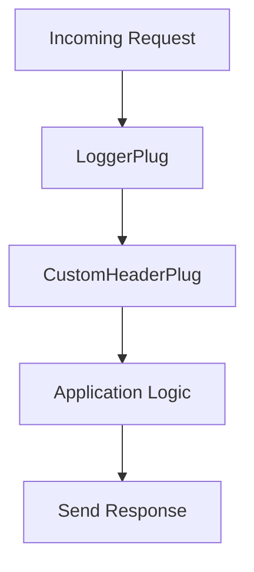

## 15.14. Middleware and Plug

In the world of web development with Elixir, **Plug** serves as the backbone for building modular and composable web applications. It is a specification for composing middleware modules and is a fundamental component of the Phoenix Framework. In this section, we will delve into the depths of Plug, explore how to create custom Plugs, and understand how to use Plug Router to build lightweight web applications or APIs.

### Understanding Plug

Plug is a specification for composable modules between web applications. It is inspired by Rack in the Ruby ecosystem and WSGI in Python, providing a common interface for web servers and web applications. Plug is a cornerstone for building web applications in Elixir, offering a simple and flexible way to handle HTTP requests and responses.

#### Key Concepts of Plug

1. **Connection Struct**: At the heart of Plug is the `Plug.Conn` struct, which represents the connection between the client and server. It holds request and response data, including headers, parameters, and the request body.

2. **Plug Specification**: A Plug is a module that implements two functions: `init/1` and `call/2`. The `init/1` function is used for initialization, while the `call/2` function receives a connection and options, returning an updated connection.

3. **Middleware Composition**: Plugs can be composed to form a pipeline, allowing for modular and reusable request processing. This composition is achieved using the `Plug.Builder` module, which provides macros for defining plug pipelines.

#### Example of a Simple Plug

Let's start with a simple example of a Plug that logs request information:

```elixir
defmodule LoggerPlug do
  import Plug.Conn

  def init(options) do
    options
  end

  def call(conn, _opts) do
    IO.puts("Request received: #{conn.method} #{conn.request_path}")
    conn
  end
end
```

In this example, `LoggerPlug` logs the HTTP method and request path of incoming requests. The `init/1` function simply returns the options unchanged, while the `call/2` function logs the request and returns the connection.

### Custom Plugs

Custom Plugs allow developers to create middleware tailored to their application's specific needs. This flexibility is one of the strengths of the Plug ecosystem, enabling developers to encapsulate logic in reusable components.

#### Writing Custom Middleware

To write a custom Plug, you need to define a module with `init/1` and `call/2` functions. Here's an example of a custom Plug that adds a custom header to the response:

```elixir
defmodule CustomHeaderPlug do
  import Plug.Conn

  def init(default) do
    default
  end

  def call(conn, header_value) do
    conn
    |> put_resp_header("x-custom-header", header_value)
  end
end
```

In this example, `CustomHeaderPlug` adds a custom header to the response. The `init/1` function receives a default value for the header, and the `call/2` function uses `put_resp_header/3` to add the header to the connection.

#### Using Custom Plugs in a Plug Pipeline

Custom Plugs can be used in a Plug pipeline, allowing for modular request processing. Here's an example of how to use `LoggerPlug` and `CustomHeaderPlug` in a pipeline:

```elixir
defmodule MyApp do
  use Plug.Builder

  plug LoggerPlug
  plug CustomHeaderPlug, "MyCustomValue"

  plug :hello_world

  def hello_world(conn, _opts) do
    send_resp(conn, 200, "Hello, world!")
  end
end
```

In this example, `MyApp` uses `Plug.Builder` to define a pipeline that includes `LoggerPlug`, `CustomHeaderPlug`, and a custom function plug `:hello_world`. The `hello_world/2` function sends a "Hello, world!" response.

### Plug Router

While Phoenix Framework is often used for building robust web applications, Plug Router provides a lightweight alternative for building simple web applications or APIs. Plug Router is a minimalistic web server that can handle routing and request processing without the overhead of a full-fledged framework.

#### Building a Simple Web Application with Plug Router

Here's an example of a simple web application using Plug Router:

```elixir
defmodule SimpleRouter do
  use Plug.Router

  plug :match
  plug :dispatch

  get "/hello" do
    send_resp(conn, 200, "Hello, Plug!")
  end

  match _ do
    send_resp(conn, 404, "Oops! Not found.")
  end
end
```

In this example, `SimpleRouter` uses `Plug.Router` to define a simple web application with two routes: a GET request to `/hello` and a catch-all route that returns a 404 response.

#### Running the Plug Router

To run the Plug Router, you need to start a web server. Here's how you can do it using `Plug.Cowboy`:

```elixir
defmodule SimpleApp do
  use Application

  def start(_type, _args) do
    children = [
      {Plug.Cowboy, scheme: :http, plug: SimpleRouter, options: [port: 4000]}
    ]

    opts = [strategy: :one_for_one, name: SimpleApp.Supervisor]
    Supervisor.start_link(children, opts)
  end
end
```

In this example, `SimpleApp` starts a Cowboy server with `SimpleRouter` as the plug, listening on port 4000.

### Visualizing Plug Middleware Flow

Let's visualize the flow of a request through a Plug pipeline using a Mermaid.js diagram:


```mermaid
graph TD;
    A[Incoming Request] --> B[LoggerPlug];
    B --> C[CustomHeaderPlug];
    C --> D[Application Logic];
    D --> E[Send Response];
```

**Diagram Description**: This diagram represents the flow of an incoming request through a series of Plugs in a pipeline. The request first passes through `LoggerPlug`, then `CustomHeaderPlug`, followed by the application logic, and finally, a response is sent back to the client.

### Design Considerations

When designing middleware with Plug, consider the following:

- **Order Matters**: The order of Plugs in a pipeline affects the request processing flow. Ensure that Plugs are ordered logically to achieve the desired behavior.
  
- **Performance**: Each Plug adds overhead to request processing. Keep pipelines efficient by minimizing unnecessary Plugs.
  
- **Reusability**: Design Plugs to be modular and reusable across different applications or contexts.
  
- **Error Handling**: Implement error handling within Plugs to gracefully handle exceptions and ensure robust applications.

### Elixir Unique Features

Elixir's functional programming paradigm and concurrency model make it uniquely suited for building scalable and efficient web applications. Plug leverages these features to provide a powerful and flexible middleware system.

- **Immutability**: Plug.Conn is immutable, ensuring that data is not accidentally modified during request processing.
  
- **Concurrency**: Elixir's lightweight processes enable handling a large number of concurrent requests efficiently.

### Differences and Similarities

Plug is often compared to other middleware systems like Rack (Ruby) and WSGI (Python). While they share similar goals, Plug's functional nature and integration with Elixir's concurrency model set it apart.

### Try It Yourself

To get hands-on experience, try modifying the code examples above:

- Add a new custom Plug that logs response times.
- Modify `SimpleRouter` to include additional routes and logic.
- Experiment with different Plug orders to see how it affects request processing.

### Knowledge Check

- What is the purpose of the `Plug.Conn` struct?
- How do you define a custom Plug in Elixir?
- What is the role of `Plug.Router` in a web application?

### Summary

In this section, we explored the power of Plug in Elixir for building modular and efficient web applications. We learned how to create custom Plugs, use Plug Router for lightweight applications, and design middleware pipelines. Remember, mastering Plug is a step towards building scalable and robust web applications in Elixir. Keep experimenting and enjoy the journey!

## Quiz Time!



### What is the primary purpose of Plug in Elixir?

- [x] To provide a specification for composable modules in web applications
- [ ] To replace the Phoenix Framework
- [ ] To handle database connections
- [ ] To serve static files

> **Explanation:** Plug provides a specification for composable modules in Elixir web applications, allowing for modular and reusable request processing.

### Which function is used to initialize a Plug?

- [x] init/1
- [ ] call/2
- [ ] start/0
- [ ] setup/1

> **Explanation:** The `init/1` function is used to initialize a Plug with options.

### What does the `Plug.Conn` struct represent?

- [x] The connection between the client and server
- [ ] A database transaction
- [ ] An HTTP request header
- [ ] A static file

> **Explanation:** `Plug.Conn` represents the connection between the client and server, holding request and response data.

### How do you add a custom header to a response in a Plug?

- [x] Use `put_resp_header/3` in the `call/2` function
- [ ] Use `send_resp/3` directly
- [ ] Modify the `Plug.Conn` struct directly
- [ ] Use `get_resp_header/3`

> **Explanation:** `put_resp_header/3` is used in the `call/2` function to add a custom header to the response.

### What is the role of `Plug.Router`?

- [x] To handle routing and request processing in lightweight web applications
- [ ] To manage database connections
- [ ] To serve static files
- [ ] To replace the Phoenix Framework

> **Explanation:** `Plug.Router` is used to handle routing and request processing in lightweight web applications or APIs.

### In a Plug pipeline, what is the significance of order?

- [x] Order affects the request processing flow
- [ ] Order determines the number of concurrent requests
- [ ] Order affects database query performance
- [ ] Order is irrelevant

> **Explanation:** The order of Plugs in a pipeline affects the request processing flow, determining the sequence of middleware execution.

### How can you run a Plug Router?

- [x] By starting a web server with `Plug.Cowboy`
- [ ] By using `Plug.Conn` directly
- [ ] By deploying to a Phoenix application
- [ ] By using `Plug.Static`

> **Explanation:** A Plug Router can be run by starting a web server with `Plug.Cowboy`, specifying the router as the plug.

### What is a common use case for custom Plugs?

- [x] To encapsulate reusable logic for request processing
- [ ] To manage database connections
- [ ] To serve static files
- [ ] To replace the Phoenix Framework

> **Explanation:** Custom Plugs encapsulate reusable logic for request processing, making applications modular and maintainable.

### What is a key feature of Elixir that benefits Plug's concurrency model?

- [x] Lightweight processes
- [ ] Static typing
- [ ] Object-oriented programming
- [ ] Global state

> **Explanation:** Elixir's lightweight processes enable efficient handling of a large number of concurrent requests, benefiting Plug's concurrency model.

### True or False: Plug is only used within the Phoenix Framework.

- [ ] True
- [x] False

> **Explanation:** False. While Plug is a core component of the Phoenix Framework, it can be used independently to build lightweight web applications or APIs.


