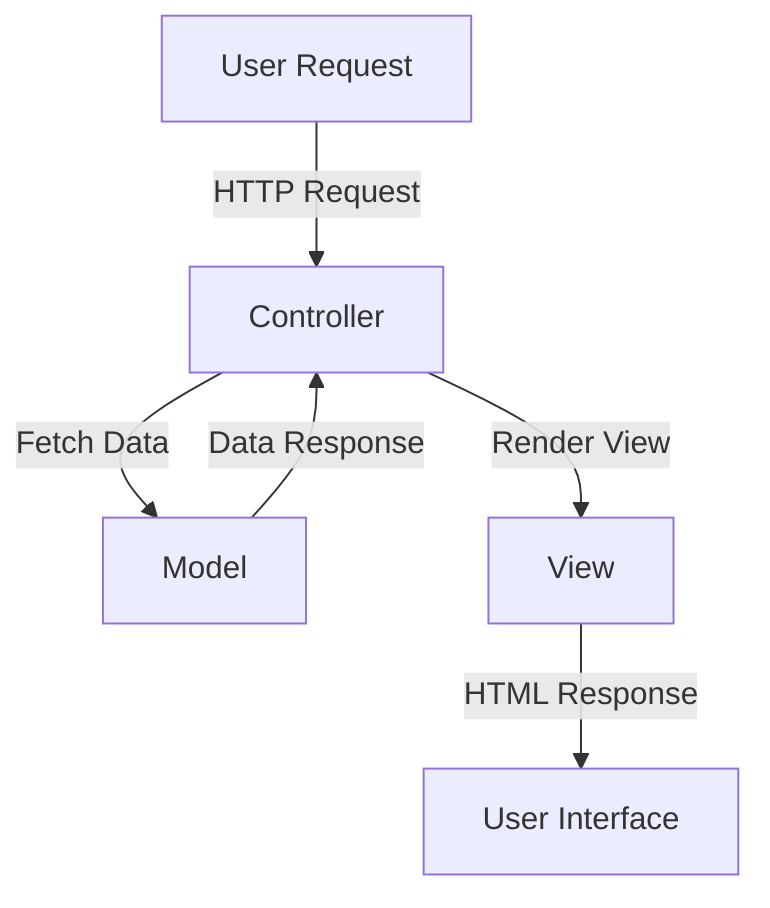

## 15.2. MVC Architecture in Phoenix

The Model-View-Controller (MVC) architecture is a design pattern that separates an application into three interconnected components. This separation helps manage complex applications by dividing the responsibilities into distinct sections, making the codebase more organized and maintainable. In the context of the Phoenix Framework, which is built on Elixir, the MVC pattern is implemented with a focus on functional programming principles, concurrency, and scalability.

### Understanding the MVC Pattern

The MVC pattern is a well-established architectural pattern used in software engineering to separate concerns within an application. Each component of the MVC architecture has a specific role:

- **Model**: Represents the data and the business logic of the application. It is responsible for managing the data, including retrieving, storing, and validating it.
- **View**: Handles the presentation layer. It is responsible for displaying the data to the user and rendering the user interface.
- **Controller**: Acts as an intermediary between the Model and the View. It processes incoming requests, interacts with the Model, and returns the appropriate View.

#### Visualizing the MVC Architecture

To better understand the interaction between these components, let's visualize the MVC architecture using a Mermaid.js diagram:



**Diagram Description**: This diagram illustrates the flow of a user request in an MVC architecture. The user request is handled by the Controller, which interacts with the Model to fetch data. The Controller then renders the View, which is sent back to the user as an HTML response.

### Components of MVC in Phoenix

In Phoenix, the MVC components are implemented using Elixir's powerful features and libraries. Let's explore each component in detail.

#### Models with Ecto

Ecto is a domain-specific language for writing queries and interacting with databases in Elixir. It provides a robust framework for defining schemas, querying data, and managing changesets.

**Key Features of Ecto Models**:
- **Schema Definitions**: Define the structure of your data and map it to database tables.
- **Querying**: Use Ecto's query syntax to retrieve and manipulate data.
- **Changesets**: Validate and transform data before it is persisted to the database.

**Example**: Defining a User Model with Ecto

```elixir
defmodule MyApp.Accounts.User do
  use Ecto.Schema
  import Ecto.Changeset

  schema "users" do
    field :name, :string
    field :email, :string
    field :age, :integer
    timestamps()
  end

  @doc false
  def changeset(user, attrs) do
    user
    |> cast(attrs, [:name, :email, :age])
    |> validate_required([:name, :email])
    |> validate_format(:email, ~r/@/)
    |> validate_number(:age, greater_than: 0)
  end
end
```

**Explanation**: This code defines a `User` schema with fields for `name`, `email`, and `age`. The `changeset` function is used to cast and validate the attributes before saving them to the database.

#### Views for Presentation Logic

Views in Phoenix are responsible for rendering templates and presenting data to the user. They are typically used to format data and generate HTML content.

**Key Features of Phoenix Views**:
- **Templates**: Use EEx (Embedded Elixir) templates to create dynamic HTML content.
- **Helpers**: Provide functions to format data and generate HTML elements.

**Example**: Creating a User View

```elixir
defmodule MyAppWeb.UserView do
  use MyAppWeb, :view

  def format_age(age) when age > 0 do
    "#{age} years old"
  end

  def format_age(_age) do
    "Age not available"
  end
end
```

**Explanation**: This view module defines a helper function `format_age` to display the user's age in a readable format.

#### Controllers for Request Handling

Controllers in Phoenix handle incoming HTTP requests, interact with the Model, and render the appropriate View. They are the central point of communication between the user and the application.

**Key Features of Phoenix Controllers**:
- **Routing**: Define routes to map HTTP requests to controller actions.
- **Actions**: Implement functions to handle specific requests and return responses.
- **Plug**: Use Plugs to compose middleware and manage request pipelines.

**Example**: Implementing a User Controller

```elixir
defmodule MyAppWeb.UserController do
  use MyAppWeb, :controller

  alias MyApp.Accounts
  alias MyApp.Accounts.User

  def index(conn, _params) do
    users = Accounts.list_users()
    render(conn, "index.html", users: users)
  end

  def show(conn, %{"id" => id}) do
    user = Accounts.get_user!(id)
    render(conn, "show.html", user: user)
  end
end
```

**Explanation**: This controller defines two actions: `index` to list all users and `show` to display a specific user. It uses the `Accounts` context to interact with the `User` model and renders the appropriate view.

### Integrating MVC Components

The true power of the MVC architecture in Phoenix comes from the seamless integration of its components. Let's explore how these components work together to handle a typical web request.

#### Request Handling Flow

1. **Routing**: The request is routed to the appropriate controller action based on the URL and HTTP method.
2. **Controller Action**: The controller action processes the request, interacts with the model to fetch or modify data, and prepares the data for the view.
3. **Model Interaction**: The model handles data retrieval, validation, and persistence.
4. **View Rendering**: The view formats the data and generates the HTML response.
5. **Response**: The generated HTML is sent back to the client as the response.

#### Example: User Registration Flow

Let's walk through a user registration flow to see how the MVC components interact.

**Step 1: User Submits Registration Form**

- The user fills out a registration form and submits it.
- The form data is sent as an HTTP POST request to the server.

**Step 2: Controller Processes the Request**

- The `UserController` receives the request and extracts the form data.
- It calls the `create_user` function in the `Accounts` context to handle the registration logic.

**Step 3: Model Validates and Saves Data**

- The `create_user` function uses the `User` model's changeset to validate the data.
- If the data is valid, it is saved to the database.

**Step 4: View Renders the Response**

- The controller renders a success message using the `UserView`.
- The view generates an HTML response with the success message.

**Step 5: Response Sent to User**

- The HTML response is sent back to the user's browser, confirming the registration.

### Code Example: User Registration

Let's implement the user registration flow in Phoenix.

**User Controller**

```elixir
defmodule MyAppWeb.UserController do
  use MyAppWeb, :controller

  alias MyApp.Accounts
  alias MyApp.Accounts.User

  def new(conn, _params) do
    changeset = Accounts.change_user(%User{})
    render(conn, "new.html", changeset: changeset)
  end

  def create(conn, %{"user" => user_params}) do
    case Accounts.create_user(user_params) do
      {:ok, user} ->
        conn
        |> put_flash(:info, "User created successfully.")
        |> redirect(to: Routes.user_path(conn, :show, user))

      {:error, %Ecto.Changeset{} = changeset} ->
        render(conn, "new.html", changeset: changeset)
    end
  end
end
```

**Accounts Context**

```elixir
defmodule MyApp.Accounts do
  alias MyApp.Repo
  alias MyApp.Accounts.User

  def create_user(attrs \\ %{}) do
    %User{}
    |> User.changeset(attrs)
    |> Repo.insert()
  end

  def change_user(%User{} = user) do
    User.changeset(user, %{})
  end
end
```

**User View**

```elixir
defmodule MyAppWeb.UserView do
  use MyAppWeb, :view
end
```

**New User Template (`new.html.eex`)**

```html
<h1>Register</h1>

<%= form_for @changeset, Routes.user_path(@conn, :create), fn f -> %>
  <div>
    <%= label f, :name %>
    <%= text_input f, :name %>
    <%= error_tag f, :name %>
  </div>

  <div>
    <%= label f, :email %>
    <%= email_input f, :email %>
    <%= error_tag f, :email %>
  </div>

  <div>
    <%= label f, :age %>
    <%= number_input f, :age %>
    <%= error_tag f, :age %>
  </div>

  <div>
    <%= submit "Register" %>
  </div>
<% end %>
```

### Try It Yourself

To deepen your understanding of the MVC architecture in Phoenix, try modifying the code examples:

- **Add a new field** to the `User` model, such as `:phone_number`, and update the changeset and form to handle it.
- **Implement a delete action** in the `UserController` to allow users to delete their accounts.
- **Create a custom view helper** to format user names in a specific way.

### Key Takeaways

- The MVC architecture in Phoenix separates concerns into Models, Views, and Controllers, making codebases more organized and maintainable.
- Ecto is used for defining models, querying data, and managing changesets.
- Views handle presentation logic and render templates using EEx.
- Controllers manage request handling, routing, and interaction between models and views.

### Further Reading

- [Phoenix Framework Guides](https://hexdocs.pm/phoenix/overview.html)
- [Ecto Documentation](https://hexdocs.pm/ecto/Ecto.html)
- [Elixir Lang](https://elixir-lang.org/)

### Quiz: MVC Architecture in Phoenix



### What is the primary role of the Model in the MVC architecture?

- [x] To manage the data and business logic of the application.
- [ ] To handle user requests and render views.
- [ ] To display data to the user.
- [ ] To manage the application's routing.

> **Explanation:** The Model is responsible for managing the data and business logic of the application.

### Which component of the MVC architecture is responsible for rendering templates?

- [ ] Model
- [x] View
- [ ] Controller
- [ ] Router

> **Explanation:** The View is responsible for rendering templates and presenting data to the user.

### In Phoenix, which library is used for defining schemas and querying data?

- [ ] Plug
- [ ] Phoenix
- [x] Ecto
- [ ] Elixir

> **Explanation:** Ecto is the library used for defining schemas and querying data in Phoenix.

### What is the purpose of a changeset in Ecto?

- [x] To validate and transform data before it is persisted to the database.
- [ ] To render HTML templates.
- [ ] To handle HTTP requests.
- [ ] To define routes in the application.

> **Explanation:** A changeset is used to validate and transform data before it is persisted to the database.

### Which function in the UserController is responsible for creating a new user?

- [ ] index
- [ ] show
- [x] create
- [ ] new

> **Explanation:** The `create` function in the UserController is responsible for creating a new user.

### What is the role of the Controller in the MVC architecture?

- [ ] To manage data and business logic.
- [ ] To render templates and present data.
- [x] To handle user requests and interact with models and views.
- [ ] To define the application's schema.

> **Explanation:** The Controller handles user requests and interacts with models and views.

### How does the View in Phoenix format data for presentation?

- [ ] By defining schemas.
- [x] By using helper functions and templates.
- [ ] By managing changesets.
- [ ] By handling HTTP requests.

> **Explanation:** The View formats data for presentation using helper functions and templates.

### What is the purpose of the `render` function in a Phoenix Controller?

- [ ] To validate data.
- [ ] To define routes.
- [x] To render a view and generate an HTML response.
- [ ] To manage database transactions.

> **Explanation:** The `render` function in a Phoenix Controller is used to render a view and generate an HTML response.

### Which component of the MVC architecture acts as an intermediary between the Model and the View?

- [ ] Model
- [ ] View
- [x] Controller
- [ ] Router

> **Explanation:** The Controller acts as an intermediary between the Model and the View.

### True or False: In Phoenix, the Router is responsible for defining the application's schema.

- [ ] True
- [x] False

> **Explanation:** False. The Router is responsible for defining routes and mapping HTTP requests to controller actions, not defining the application's schema.



Remember, mastering the MVC architecture in Phoenix is just the beginning. As you continue to explore the Phoenix Framework, you'll discover more advanced features and patterns that will enhance your web development skills. Keep experimenting, stay curious, and enjoy the journey!
