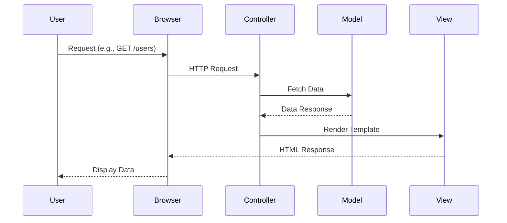

## 15.2. MVC Architecture in Phoenix

The Model-View-Controller (MVC) architecture is a cornerstone of modern web development, providing a structured approach to building applications by separating concerns. In the Phoenix Framework, this pattern is implemented to leverage Elixir's strengths, such as concurrency and fault tolerance, to create scalable and maintainable web applications. This section will delve into the intricacies of MVC in Phoenix, exploring how each component functions and interacts.

### Understanding the MVC Pattern

**Model-View-Controller (MVC)** is a software architectural pattern that divides an application into three interconnected components:

- **Model**: Manages the data, logic, and rules of the application.
- **View**: Handles the display of information, presenting data to the user.
- **Controller**: Processes incoming requests, interacts with the model, and selects a view for presentation.

This separation of concerns allows developers to manage complex applications by organizing code into logical sections.

#### Why Use MVC in Phoenix?

Phoenix leverages the MVC pattern to enhance code organization, making it easier to manage, extend, and test applications. By separating concerns, developers can focus on specific parts of the application without affecting others, promoting cleaner code and reducing the risk of errors.

### Components of MVC in Phoenix

#### Models with Ecto

In Phoenix, models are typically implemented using **Ecto**, a database wrapper and query generator for Elixir. Ecto provides a robust framework for defining schemas, querying databases, and managing changesets.

- **Schemas**: Define the structure of your data and map to database tables.
- **Changesets**: Handle data validation and casting, ensuring data integrity.
- **Queries**: Allow you to interact with the database using Elixir syntax.

**Example of a Model in Phoenix:**

```elixir
defmodule MyApp.Accounts.User do
  use Ecto.Schema
  import Ecto.Changeset

  schema "users" do
    field :name, :string
    field :email, :string
    field :age, :integer

    timestamps()
  end

  def changeset(user, attrs) do
    user
    |> cast(attrs, [:name, :email, :age])
    |> validate_required([:name, :email])
    |> validate_format(:email, ~r/@/)
    |> validate_number(:age, greater_than: 0)
  end
end
```

**Key Points:**

- **Schemas** define the shape of your data.
- **Changesets** validate and transform data before it is persisted.

#### Views for Presentation Logic

Views in Phoenix are responsible for rendering templates and presenting data to the user. They act as a bridge between the controller and the templates, often containing helper functions to format data.

- **Templates**: Use EEx (Embedded Elixir) for dynamic content rendering.
- **Helpers**: Provide reusable functions to format data, such as dates or currency.

**Example of a View in Phoenix:**

```elixir
defmodule MyAppWeb.UserView do
  use MyAppWeb, :view

  def format_date(date) do
    Timex.format!(date, "{Mfull} {D}, {YYYY}", :strftime)
  end
end
```

**Key Points:**

- **Views** encapsulate presentation logic, keeping templates clean.
- **Helpers** enhance reusability and maintainability.

#### Controllers for Request Handling

Controllers in Phoenix handle incoming HTTP requests, interact with models, and select views for rendering. They act as the glue between the web request and the application logic.

- **Actions**: Functions that correspond to different HTTP verbs (GET, POST, etc.).
- **Plug**: Middleware for request transformations and filtering.

**Example of a Controller in Phoenix:**

```elixir
defmodule MyAppWeb.UserController do
  use MyAppWeb, :controller

  alias MyApp.Accounts
  alias MyApp.Accounts.User

  def index(conn, _params) do
    users = Accounts.list_users()
    render(conn, "index.html", users: users)
  end

  def create(conn, %{"user" => user_params}) do
    case Accounts.create_user(user_params) do
      {:ok, user} ->
        conn
        |> put_flash(:info, "User created successfully.")
        |> redirect(to: Routes.user_path(conn, :show, user))
      {:error, %Ecto.Changeset{} = changeset} ->
        render(conn, "new.html", changeset: changeset)
    end
  end
end
```

**Key Points:**

- **Controllers** manage the flow of data between the model and view.
- **Actions** correspond to HTTP requests, facilitating CRUD operations.

### Visualizing MVC in Phoenix

To better understand the flow of data and interactions in the MVC architecture within Phoenix, let's visualize the process using a sequence diagram.


```mermaid
sequenceDiagram
    participant User
    participant Browser
    participant Controller
    participant Model
    participant View

    User->>Browser: Request (e.g., GET /users)
    Browser->>Controller: HTTP Request
    Controller->>Model: Fetch Data
    Model-->>Controller: Data Response
    Controller->>View: Render Template
    View-->>Browser: HTML Response
    Browser-->>User: Display Data
```

**Diagram Description:**

- The user initiates a request through the browser.
- The browser sends an HTTP request to the controller.
- The controller interacts with the model to fetch or manipulate data.
- The model returns data to the controller.
- The controller passes data to the view for rendering.
- The view generates an HTML response, which is sent back to the browser.
- The browser displays the rendered page to the user.

### Advanced Concepts in MVC with Phoenix

#### Plug: Middleware for Request Handling

**Plug** is a specification for composing modules between web applications. In Phoenix, it is used extensively within controllers to manage request transformations and filtering.

- **Before Actions**: Modify requests before they reach the controller action.
- **After Actions**: Transform responses before they are sent to the client.

**Example of Using Plug in a Controller:**

```elixir
defmodule MyAppWeb.Router do
  use MyAppWeb, :router

  pipeline :browser do
    plug :accepts, ["html"]
    plug :fetch_session
    plug :fetch_flash
    plug :protect_from_forgery
    plug :put_secure_browser_headers
  end

  scope "/", MyAppWeb do
    pipe_through :browser

    get "/", PageController, :index
    resources "/users", UserController
  end
end
```

**Key Points:**

- **Plug** allows for modular and reusable request handling.
- **Pipelines** define a series of plugs to apply to requests.

#### Contexts: Organizing Business Logic

Phoenix encourages the use of **contexts** to encapsulate business logic, providing a boundary for related functionality. Contexts help in organizing code and keeping concerns separate.

- **Bounded Contexts**: Group related functionality, such as user accounts or billing.
- **Encapsulation**: Hide implementation details and expose a clean API.

**Example of a Context in Phoenix:**

```elixir
defmodule MyApp.Accounts do
  alias MyApp.Repo
  alias MyApp.Accounts.User

  def list_users do
    Repo.all(User)
  end

  def create_user(attrs \\ %{}) do
    %User{}
    |> User.changeset(attrs)
    |> Repo.insert()
  end
end
```

**Key Points:**

- **Contexts** provide a clear API for interacting with business logic.
- **Encapsulation** promotes code organization and maintainability.

### Best Practices for MVC in Phoenix

1. **Keep Controllers Thin**: Delegate business logic to models or contexts.
2. **Use Views for Presentation Logic**: Avoid complex logic in templates.
3. **Encapsulate Logic in Contexts**: Keep related functionality together.
4. **Leverage Plug for Middleware**: Use it to handle cross-cutting concerns.
5. **Test Each Component Independently**: Ensure models, views, and controllers are well-tested.

### Try It Yourself

Experiment with the provided code examples by modifying them:

- **Add a new field** to the `User` schema and update the changeset.
- **Create a new view helper** to format user information.
- **Implement a new controller action** to handle user deletion.

### Further Reading

- [Phoenix Framework Guides](https://hexdocs.pm/phoenix/overview.html)
- [Ecto Documentation](https://hexdocs.pm/ecto/Ecto.html)
- [Plug Documentation](https://hexdocs.pm/plug/Plug.html)

### Summary

The MVC architecture in Phoenix offers a powerful way to organize web applications by separating concerns into models, views, and controllers. By leveraging Elixir's strengths, Phoenix provides a robust framework for building scalable and maintainable applications. Remember, mastering MVC is a journey, and as you continue to explore and experiment, you'll gain deeper insights into building sophisticated web applications with Phoenix.

## Quiz Time!



### What is the primary purpose of the Model in MVC architecture?

- [x] To manage the data, logic, and rules of the application.
- [ ] To handle the display of information to the user.
- [ ] To process incoming requests and interact with views.
- [ ] To manage HTTP requests and responses.

> **Explanation:** The Model is responsible for managing the data, logic, and rules of the application.

### In Phoenix, which library is commonly used for implementing Models?

- [x] Ecto
- [ ] Plug
- [ ] Phoenix.HTML
- [ ] ExUnit

> **Explanation:** Ecto is used for defining schemas, querying databases, and managing changesets in Phoenix.

### What is the role of Views in the MVC pattern?

- [ ] To manage data and business logic.
- [x] To handle the display of information and presentation logic.
- [ ] To process HTTP requests and interact with the model.
- [ ] To manage application configuration and routing.

> **Explanation:** Views are responsible for handling the display of information and presentation logic in MVC.

### How do Controllers function in the MVC architecture?

- [ ] They manage data storage and retrieval.
- [x] They process incoming requests, interact with models, and select views for rendering.
- [ ] They handle presentation logic and template rendering.
- [ ] They define application routes and middleware.

> **Explanation:** Controllers process incoming requests, interact with models, and select views for rendering.

### What is the purpose of a Changeset in Ecto?

- [x] To handle data validation and casting.
- [ ] To define the structure of a database table.
- [ ] To manage HTTP request transformations.
- [ ] To render HTML templates.

> **Explanation:** Changesets in Ecto handle data validation and casting to ensure data integrity.

### Which component in Phoenix is responsible for rendering templates?

- [ ] Model
- [x] View
- [ ] Controller
- [ ] Router

> **Explanation:** Views are responsible for rendering templates and presenting data to the user.

### What is a key benefit of using Plug in Phoenix?

- [ ] It handles data validation and casting.
- [ ] It manages database queries and transactions.
- [x] It allows for modular and reusable request handling.
- [ ] It provides functions for formatting dates and currency.

> **Explanation:** Plug allows for modular and reusable request handling in Phoenix.

### What is the purpose of Contexts in Phoenix?

- [x] To encapsulate business logic and provide a boundary for related functionality.
- [ ] To render templates and present data.
- [ ] To manage HTTP request transformations.
- [ ] To define application routes and middleware.

> **Explanation:** Contexts encapsulate business logic and provide a boundary for related functionality.

### What should be avoided in Controllers for best practices?

- [ ] Delegating business logic to models or contexts.
- [x] Including complex logic and data manipulation.
- [ ] Rendering templates and selecting views.
- [ ] Handling HTTP requests and responses.

> **Explanation:** Including complex logic and data manipulation in Controllers should be avoided; this logic should be delegated to models or contexts.

### True or False: In Phoenix, Views should contain complex business logic.

- [ ] True
- [x] False

> **Explanation:** Views should not contain complex business logic; they should focus on presentation logic.



Remember, this is just the beginning. As you progress, you'll build more complex and interactive web applications with Phoenix. Keep experimenting, stay curious, and enjoy the journey!
