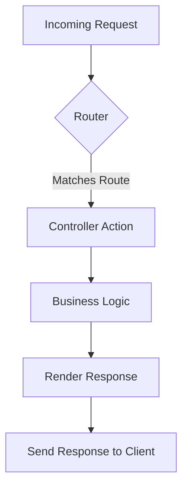
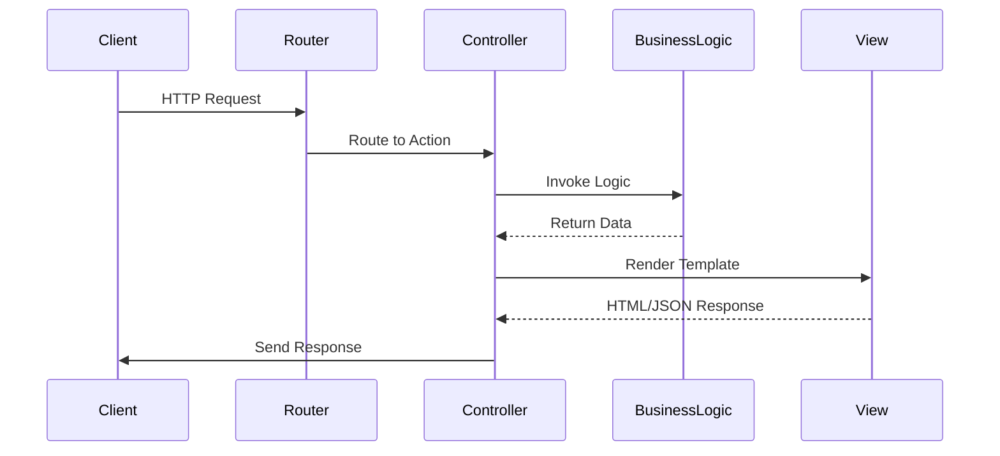

## 15.3. Routing and Controllers

In the world of web development with the Phoenix Framework, routing and controllers play a pivotal role in managing the flow of requests and responses. This section delves into the intricacies of defining routes, handling requests through controllers, and utilizing pipelines to process requests efficiently. By the end of this guide, you'll have a comprehensive understanding of how to leverage these components to build robust web applications.

### Defining Routes

Routing is the process of mapping URLs to specific controller actions. In Phoenix, this is achieved using the `Phoenix.Router` module. The router is the entry point for all requests, determining which controller and action should handle a given request based on the URL and HTTP method.

#### Mapping URLs to Controller Actions

To define routes in Phoenix, you use the `router.ex` file, typically located in the `lib/your_app_web` directory. Here's a basic example of how routes are defined:

```elixir
defmodule YourAppWeb.Router do
  use YourAppWeb, :router

  pipeline :browser do
    plug :accepts, ["html"]
    plug :fetch_session
    plug :fetch_flash
    plug :protect_from_forgery
    plug :put_secure_browser_headers
  end

  pipeline :api do
    plug :accepts, ["json"]
  end

  scope "/", YourAppWeb do
    pipe_through :browser

    get "/", PageController, :index
    get "/about", PageController, :about
    resources "/users", UserController
  end

  scope "/api", YourAppWeb do
    pipe_through :api

    resources "/posts", PostController, except: [:new, :edit]
  end
end
```

**Explanation:**

- **Pipelines**: Define a series of plugs that process requests. In this example, we have two pipelines: `:browser` and `:api`.
- **Scope**: Groups routes under a common path and allows you to apply a pipeline to them. The `"/"` scope uses the `:browser` pipeline, while the `"/api"` scope uses the `:api` pipeline.
- **Routes**: Each route maps an HTTP method and path to a controller and action. For instance, `get "/", PageController, :index` maps the root URL to the `index` action of `PageController`.

#### Visualizing Routing in Phoenix

To better understand how routing works in Phoenix, let's visualize the flow of a request through the router to the controller.



**Description**: This diagram illustrates the flow of a request in Phoenix. The router matches the incoming request to a route, which directs it to the appropriate controller action. The controller then executes business logic, renders a response, and sends it back to the client.

### Controllers

Controllers are responsible for handling incoming requests, invoking business logic, and rendering responses. They act as the intermediary between the router and the view layer.

#### Handling Incoming Requests

Controllers in Phoenix are modules that use the `Phoenix.Controller` module. They define actions that correspond to different routes. Here's an example of a simple controller:

```elixir
defmodule YourAppWeb.PageController do
  use YourAppWeb, :controller

  def index(conn, _params) do
    render(conn, "index.html")
  end

  def about(conn, _params) do
    render(conn, "about.html")
  end
end
```

**Explanation:**

- **Actions**: Functions within the controller that handle requests. The `index` action renders the `index.html` template.
- **`conn`**: The connection struct that holds request and response data.
- **`render/2`**: Renders a template and sends the response back to the client.

#### Calling Business Logic

Controllers often delegate complex logic to separate modules or contexts. This separation of concerns keeps controllers focused on handling requests and responses. Here's an example:

```elixir
defmodule YourAppWeb.UserController do
  use YourAppWeb, :controller

  alias YourApp.Accounts

  def show(conn, %{"id" => id}) do
    user = Accounts.get_user!(id)
    render(conn, "show.html", user: user)
  end
end
```

**Explanation:**

- **Delegation**: The `show` action delegates the task of fetching a user to the `Accounts` context, promoting modularity and reusability.

#### Rendering Responses

Rendering responses in Phoenix involves using the `render/2` or `render/3` functions to generate HTML or JSON output. The `render/3` function allows you to pass additional data to the template:

```elixir
defmodule YourAppWeb.PostController do
  use YourAppWeb, :controller

  def index(conn, _params) do
    posts = YourApp.Blog.list_posts()
    render(conn, "index.html", posts: posts)
  end
end
```

**Explanation:**

- **Template Rendering**: The `index` action renders the `index.html` template, passing a list of posts to it.

### Pipelines

Pipelines in Phoenix are a powerful feature that allows you to process requests through a series of plugs before they reach the controller. This is useful for tasks like authentication, logging, and request transformation.

#### Using Plugs to Process Requests

Plugs are modules that implement the `Plug` behaviour. They can be used to modify the connection struct (`conn`) or halt the request processing. Here's an example of a custom plug:

```elixir
defmodule YourAppWeb.Plugs.RequireAuth do
  import Plug.Conn
  import Phoenix.Controller

  def init(default), do: default

  def call(conn, _opts) do
    if conn.assigns[:user] do
      conn
    else
      conn
      |> put_flash(:error, "You must be logged in to access this page.")
      |> redirect(to: "/login")
      |> halt()
    end
  end
end
```

**Explanation:**

- **Plug Implementation**: The `RequireAuth` plug checks if a user is assigned to the connection. If not, it redirects to the login page and halts further processing.

#### Integrating Plugs into Pipelines

To use a plug in a pipeline, you simply add it to the pipeline definition in the router:

```elixir
pipeline :authenticated do
  plug YourAppWeb.Plugs.RequireAuth
end

scope "/", YourAppWeb do
  pipe_through [:browser, :authenticated]

  get "/dashboard", DashboardController, :index
end
```

**Explanation:**

- **Pipeline Composition**: The `:authenticated` pipeline includes the `RequireAuth` plug, ensuring that only authenticated users can access the dashboard.

### Try It Yourself

To deepen your understanding of routing and controllers in Phoenix, try modifying the code examples provided:

1. **Add a New Route**: Define a new route in the router and create a corresponding action in a controller.
2. **Create a Custom Plug**: Implement a plug that logs request details and integrate it into a pipeline.
3. **Experiment with JSON Responses**: Modify a controller action to render a JSON response instead of HTML.

### Visualizing the Request Lifecycle

To further illustrate the request lifecycle in Phoenix, let's visualize the flow from the client to the server and back:



**Description**: This sequence diagram shows the interaction between different components in a Phoenix application. The client sends an HTTP request, which is routed to a controller action. The controller invokes business logic, renders a response, and sends it back to the client.

### Key Takeaways

- **Routing**: Use `Phoenix.Router` to map URLs to controller actions, organizing routes with scopes and pipelines.
- **Controllers**: Handle requests, delegate business logic, and render responses using the `Phoenix.Controller` module.
- **Pipelines**: Process requests with plugs, enhancing functionality like authentication and logging.

### References and Further Reading

- [Phoenix Framework Guides](https://hexdocs.pm/phoenix/overview.html)
- [Plug Documentation](https://hexdocs.pm/plug/readme.html)
- [Elixir School: Phoenix](https://elixirschool.com/en/lessons/phoenix/overview/)

### Knowledge Check

- **What is the role of the router in a Phoenix application?**
- **How do controllers interact with business logic and views?**
- **What are pipelines, and how do they enhance request processing?**

### Embrace the Journey

Remember, mastering routing and controllers in Phoenix is just the beginning. As you continue to explore the Phoenix Framework, you'll discover more advanced features and patterns that will empower you to build sophisticated web applications. Keep experimenting, stay curious, and enjoy the journey!

## Quiz: Routing and Controllers



### What is the primary role of the router in a Phoenix application?

- [x] To map incoming requests to controller actions
- [ ] To handle business logic
- [ ] To render views
- [ ] To manage database connections

> **Explanation:** The router is responsible for mapping incoming requests to the appropriate controller actions based on the URL and HTTP method.

### How do controllers in Phoenix handle incoming requests?

- [x] By defining actions that correspond to routes
- [ ] By directly interacting with the database
- [ ] By managing user sessions
- [ ] By rendering HTML templates

> **Explanation:** Controllers define actions that handle requests routed to them, often delegating complex logic to other modules.

### What is the purpose of pipelines in Phoenix?

- [x] To process requests through a series of plugs before reaching controllers
- [ ] To manage database transactions
- [ ] To render JSON responses
- [ ] To handle user authentication

> **Explanation:** Pipelines allow requests to be processed through a series of plugs, enabling tasks like authentication and logging.

### Which module is used to define routes in Phoenix?

- [x] Phoenix.Router
- [ ] Phoenix.Controller
- [ ] Plug.Conn
- [ ] Ecto.Schema

> **Explanation:** The `Phoenix.Router` module is used to define routes in a Phoenix application.

### How can you render a JSON response in a controller action?

- [x] By using `json/2` function
- [ ] By using `render/2` function
- [ ] By using `html/2` function
- [ ] By using `text/2` function

> **Explanation:** The `json/2` function is used to render JSON responses in a controller action.

### What is a plug in Phoenix?

- [x] A module that implements the Plug behaviour to process requests
- [ ] A function that renders HTML templates
- [ ] A tool for managing database connections
- [ ] A library for handling user authentication

> **Explanation:** A plug is a module that implements the Plug behaviour, used to process requests in a pipeline.

### How do you apply a custom plug to a pipeline?

- [x] By adding it to the pipeline definition in the router
- [ ] By calling it directly in the controller action
- [ ] By including it in the view template
- [ ] By configuring it in the application config

> **Explanation:** Custom plugs are added to pipeline definitions in the router to process requests.

### What is the function of the `conn` struct in a controller action?

- [x] To hold request and response data
- [ ] To manage user sessions
- [ ] To interact with the database
- [ ] To render HTML templates

> **Explanation:** The `conn` struct holds request and response data, allowing controllers to handle requests.

### What does the `render/3` function do in a controller?

- [x] Renders a template and sends the response back to the client
- [ ] Fetches data from the database
- [ ] Logs request details
- [ ] Manages user authentication

> **Explanation:** The `render/3` function renders a template and sends the response back to the client.

### True or False: Pipelines can only be used for authentication purposes.

- [ ] True
- [x] False

> **Explanation:** Pipelines can be used for various purposes, including authentication, logging, and request transformation.


