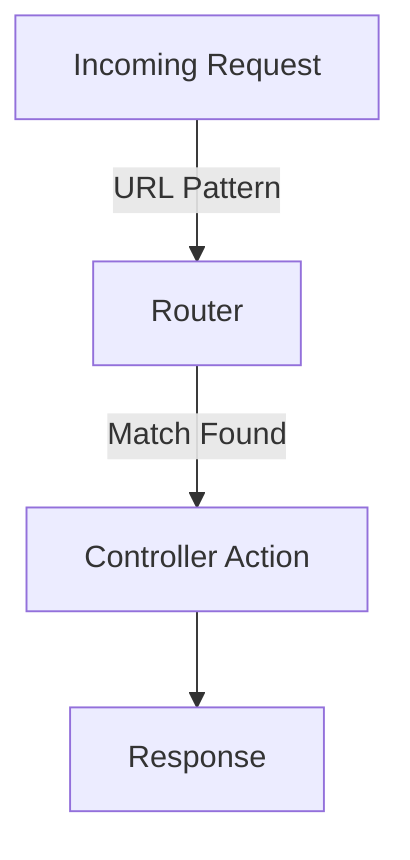
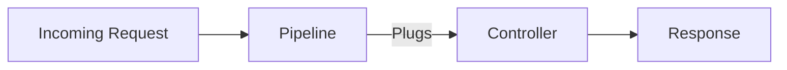

## 15.3. Routing and Controllers

In the world of web development, routing and controllers are fundamental components that define how web applications respond to client requests. In Elixir's Phoenix Framework, these concepts are elegantly implemented, offering both power and flexibility for building robust web applications. This section will delve into the intricacies of defining routes, utilizing controllers, and implementing pipelines in the Phoenix Framework.

### Defining Routes

Routing in Phoenix is handled by the `Phoenix.Router` module, which maps incoming HTTP requests to specific controller actions. This is a crucial step in ensuring that requests are directed to the appropriate parts of your application.

#### Mapping URLs to Controller Actions

To define routes in Phoenix, you typically use the `router.ex` file located in the `lib/my_app_web` directory. Here's a basic example of how routes are defined:

```elixir
defmodule MyAppWeb.Router do
  use MyAppWeb, :router

  pipeline :browser do
    plug :accepts, ["html"]
    plug :fetch_session
    plug :fetch_flash
    plug :protect_from_forgery
    plug :put_secure_browser_headers
  end

  scope "/", MyAppWeb do
    pipe_through :browser

    get "/", PageController, :index
    get "/about", PageController, :about
    resources "/users", UserController
  end
end
```

- **Explanation**: The `get` function maps a GET request to the root URL (`"/"`) to the `index` action in the `PageController`. Similarly, the `about` route is mapped to the `about` action in the same controller. The `resources` macro is used to generate RESTful routes for the `UserController`.

#### Advanced Routing Techniques

Phoenix provides several advanced routing features that allow for greater flexibility and control:

- **Named Routes**: You can name routes for easier reference in your application. This is done using the `as` option.

  ```elixir
  get "/contact", PageController, :contact, as: :contact
  ```

  - **Explanation**: This route can now be referred to as `Routes.contact_path(conn, :contact)`.

- **Route Helpers**: Phoenix generates helper functions for each route, simplifying URL generation and navigation.

- **Nested Routes**: You can nest routes within other routes to reflect hierarchical relationships.

  ```elixir
  scope "/admin", MyAppWeb.Admin do
    pipe_through :browser

    resources "/users", UserController
  end
  ```

  - **Explanation**: This creates routes under the `/admin` path, directing them to the `Admin.UserController`.

#### Visualizing Route Mapping

Below is a visual representation of how routes are mapped to controller actions in Phoenix:


```mermaid
graph TD;
    A[Incoming Request] -->|URL Pattern| B[Router]
    B -->|Match Found| C[Controller Action]
    C --> D[Response]
```

- **Description**: This diagram illustrates the flow of an incoming request through the router, matching a URL pattern, directing it to the appropriate controller action, and finally generating a response.

### Controllers

Controllers in Phoenix are responsible for handling incoming requests, invoking business logic, and rendering responses. They act as an intermediary between the router and the views/templates.

#### Handling Incoming Requests

Controllers are defined using the `Phoenix.Controller` module. Here's a simple example:

```elixir
defmodule MyAppWeb.PageController do
  use MyAppWeb, :controller

  def index(conn, _params) do
    render(conn, "index.html")
  end

  def about(conn, _params) do
    render(conn, "about.html")
  end
end
```

- **Explanation**: The `index` and `about` actions render the corresponding templates. The `conn` parameter represents the connection, which holds request and response data.

#### Calling Business Logic

Controllers often delegate business logic to context modules, keeping the controller focused on request handling. This separation of concerns enhances maintainability and testability.

```elixir
defmodule MyAppWeb.UserController do
  use MyAppWeb, :controller

  alias MyApp.Accounts

  def show(conn, %{"id" => id}) do
    user = Accounts.get_user!(id)
    render(conn, "show.html", user: user)
  end
end
```

- **Explanation**: The `show` action retrieves a user by ID using the `Accounts` context and renders the `show.html` template with the user data.

#### Rendering Responses

Phoenix controllers use the `render/3` function to render templates. You can also use `json/2` for JSON responses, making it easy to build APIs.

```elixir
defmodule MyAppWeb.Api.UserController do
  use MyAppWeb, :controller

  def index(conn, _params) do
    users = MyApp.Accounts.list_users()
    json(conn, users)
  end
end
```

- **Explanation**: The `index` action retrieves a list of users and returns it as a JSON response.

### Pipelines

Pipelines in Phoenix allow you to define a series of plugs that process requests before they reach the controller. This is useful for tasks like authentication, logging, and request transformation.

#### Using Plugs to Process Requests

Plugs are modules that implement a `call/2` function, allowing them to modify the connection. You can use built-in plugs or create custom ones.

```elixir
defmodule MyAppWeb.Router do
  use MyAppWeb, :router

  pipeline :api do
    plug :accepts, ["json"]
  end

  scope "/api", MyAppWeb.Api do
    pipe_through :api

    resources "/users", UserController
  end
end
```

- **Explanation**: The `:api` pipeline includes a plug that ensures requests accept JSON. This pipeline is applied to all routes in the `/api` scope.

#### Creating Custom Plugs

To create a custom plug, define a module with a `call/2` function and an `init/1` function for initialization.

```elixir
defmodule MyAppWeb.Plugs.RequireAuth do
  import Plug.Conn

  def init(default), do: default

  def call(conn, _opts) do
    if conn.assigns[:user] do
      conn
    else
      conn
      |> put_flash(:error, "You must be logged in to access this page.")
      |> redirect(to: "/login")
      |> halt()
    end
  end
end
```

- **Explanation**: This plug checks if a user is assigned in the connection. If not, it redirects to the login page.

#### Visualizing Pipelines

Below is a visual representation of how pipelines process requests in Phoenix:


```mermaid
graph LR;
    A[Incoming Request] --> B[Pipeline]
    B -->|Plugs| C[Controller]
    C --> D[Response]
```

- **Description**: The diagram shows an incoming request passing through a pipeline, where plugs process it before reaching the controller.

### Try It Yourself

To deepen your understanding, try modifying the code examples:

1. **Add a New Route**: Create a new route in the `router.ex` file that maps to a new action in an existing controller.
2. **Create a Custom Plug**: Implement a custom plug that logs request details to the console.
3. **Experiment with JSON Responses**: Modify a controller action to return a JSON response instead of rendering a template.

### Knowledge Check

- **Question**: What is the purpose of the `pipeline` in Phoenix routing?
- **Challenge**: Implement a nested route structure and explain its benefits.

### Key Takeaways

- **Routing**: Phoenix's routing system is powerful and flexible, allowing for complex URL patterns and route management.
- **Controllers**: Controllers handle requests, invoke business logic, and render responses, acting as a bridge between the router and views.
- **Pipelines**: Use pipelines to process requests with plugs, enhancing modularity and reusability.

### Embrace the Journey

Routing and controllers are foundational elements of web development in Phoenix. As you experiment and build more complex applications, you'll gain a deeper understanding of how these components work together. Keep exploring, stay curious, and enjoy the journey!

## Quiz Time!



### What module is used to define routes in Phoenix?

- [x] Phoenix.Router
- [ ] Phoenix.Controller
- [ ] Phoenix.Endpoint
- [ ] Phoenix.View

> **Explanation:** Routes in Phoenix are defined using the `Phoenix.Router` module.

### How can you name a route in Phoenix?

- [x] Using the `as` option
- [ ] Using the `name` function
- [ ] By defining a helper function
- [ ] By setting a route variable

> **Explanation:** The `as` option is used to name routes in Phoenix, allowing for easier reference.

### What is the primary role of a controller in Phoenix?

- [x] Handle requests and render responses
- [ ] Define URL patterns
- [ ] Manage database connections
- [ ] Serve static files

> **Explanation:** Controllers handle incoming requests, invoke business logic, and render responses.

### Which function is used to render a template in a controller?

- [x] render/3
- [ ] json/2
- [ ] html/2
- [ ] send_resp/3

> **Explanation:** The `render/3` function is used to render templates in a controller.

### What is a plug in Phoenix?

- [x] A module that processes requests
- [ ] A function that renders templates
- [ ] A helper for generating URLs
- [ ] A data structure for managing state

> **Explanation:** A plug is a module that processes requests, typically used in pipelines.

### How can you create a custom plug in Phoenix?

- [x] Define a module with `call/2` and `init/1` functions
- [ ] Use the `plug` macro in a controller
- [ ] Create a function with `plug/2` signature
- [ ] Implement a `plug` interface

> **Explanation:** Custom plugs are created by defining a module with `call/2` and `init/1` functions.

### What is the purpose of the `pipe_through` macro?

- [x] To apply a pipeline to a scope of routes
- [ ] To define a new plug
- [ ] To render a JSON response
- [ ] To connect to a database

> **Explanation:** The `pipe_through` macro is used to apply a defined pipeline to a scope of routes.

### How do you return a JSON response in a controller?

- [x] Use the `json/2` function
- [ ] Use the `render/3` function
- [ ] Use the `html/2` function
- [ ] Use the `send_resp/3` function

> **Explanation:** The `json/2` function is used to return JSON responses in a controller.

### What is the benefit of using nested routes?

- [x] Reflect hierarchical relationships
- [ ] Simplify URL patterns
- [ ] Reduce the number of controllers
- [ ] Increase performance

> **Explanation:** Nested routes reflect hierarchical relationships, organizing routes more logically.

### True or False: Pipelines can only contain built-in plugs.

- [ ] True
- [x] False

> **Explanation:** Pipelines can contain both built-in and custom plugs.


