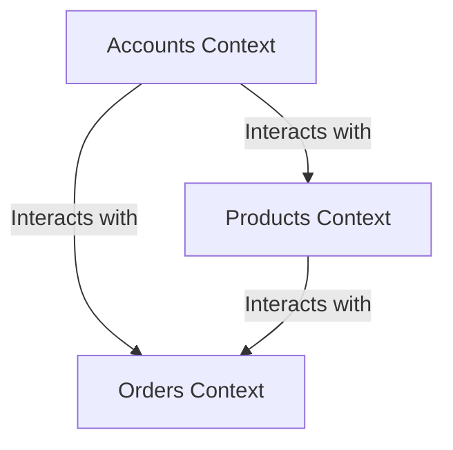

## 15.4. Contexts and Application Boundaries

In the realm of web development with the Phoenix Framework, organizing business logic is a crucial aspect of building maintainable and scalable applications. Elixir introduces the concept of contexts to help developers encapsulate related functionality and define clear interfaces and boundaries within their applications. This section will delve into the intricacies of contexts and application boundaries, providing expert insights and practical examples to guide you in structuring your Elixir applications effectively.

### Organizing Business Logic

#### Encapsulating Related Functionality within Contexts

Contexts in Elixir serve as a way to group related functionality, providing a clear separation of concerns within your application. By encapsulating business logic within contexts, you can achieve a modular design that enhances maintainability and scalability. Let's explore how to effectively use contexts in your Elixir applications.

#### Understanding Contexts

A context is essentially a module that groups related functions and data structures. It acts as a boundary that defines a specific area of your application's domain. For example, in an e-commerce application, you might have contexts such as `Accounts`, `Products`, and `Orders`. Each context is responsible for handling its own business logic and data interactions.

```elixir
defmodule MyApp.Accounts do
  alias MyApp.Repo
  alias MyApp.Accounts.User

  def list_users do
    Repo.all(User)
  end

  def get_user!(id) do
    Repo.get!(User, id)
  end

  def create_user(attrs \\ %{}) do
    %User{}
    |> User.changeset(attrs)
    |> Repo.insert()
  end

  def update_user(%User{} = user, attrs) do
    user
    |> User.changeset(attrs)
    |> Repo.update()
  end

  def delete_user(%User{} = user) do
    Repo.delete(user)
  end
end
```

In this example, the `Accounts` context encapsulates all the functionality related to user management. It provides a clear interface for interacting with user data, making it easier to manage and evolve the user-related features of your application.

#### Benefits of Using Contexts

- **Separation of Concerns**: Contexts help separate different areas of your application's domain, making it easier to manage and understand the codebase.
- **Encapsulation**: By encapsulating related functionality, contexts prevent the leakage of implementation details, promoting a clean and maintainable architecture.
- **Reusability**: Contexts can be reused across different parts of your application, reducing code duplication and enhancing consistency.
- **Testability**: With well-defined boundaries, contexts make it easier to write unit tests for specific areas of your application, improving test coverage and reliability.

### Bounded Contexts

#### Defining Clear Interfaces and Boundaries within the Application

Bounded contexts are a concept borrowed from Domain-Driven Design (DDD) that help define clear interfaces and boundaries within your application. In Elixir, bounded contexts can be implemented using contexts to ensure that each part of your application has a well-defined responsibility and interacts with other parts through explicit interfaces.

#### Implementing Bounded Contexts

To implement bounded contexts in your Elixir application, follow these steps:

1. **Identify Domain Areas**: Begin by identifying the different domain areas within your application. These could be based on business processes, user interactions, or data models.

2. **Define Contexts**: For each domain area, define a context that encapsulates the related functionality. Ensure that each context has a clear responsibility and does not overlap with other contexts.

3. **Establish Interfaces**: Define explicit interfaces for each context, specifying how other parts of the application can interact with it. This could involve defining public functions, data structures, and communication protocols.

4. **Enforce Boundaries**: Ensure that each context operates independently and does not directly access the internals of other contexts. Use dependency injection and messaging patterns to facilitate communication between contexts.

#### Example: E-commerce Application

Let's consider an example of an e-commerce application with bounded contexts for `Accounts`, `Products`, and `Orders`.

```elixir
defmodule MyApp.Products do
  alias MyApp.Repo
  alias MyApp.Products.Product

  def list_products do
    Repo.all(Product)
  end

  def get_product!(id) do
    Repo.get!(Product, id)
  end

  def create_product(attrs \\ %{}) do
    %Product{}
    |> Product.changeset(attrs)
    |> Repo.insert()
  end

  def update_product(%Product{} = product, attrs) do
    product
    |> Product.changeset(attrs)
    |> Repo.update()
  end

  def delete_product(%Product{} = product) do
    Repo.delete(product)
  end
end

defmodule MyApp.Orders do
  alias MyApp.Repo
  alias MyApp.Orders.Order

  def list_orders do
    Repo.all(Order)
  end

  def get_order!(id) do
    Repo.get!(Order, id)
  end

  def create_order(attrs \\ %{}) do
    %Order{}
    |> Order.changeset(attrs)
    |> Repo.insert()
  end

  def update_order(%Order{} = order, attrs) do
    order
    |> Order.changeset(attrs)
    |> Repo.update()
  end

  def delete_order(%Order{} = order) do
    Repo.delete(order)
  end
end
```

In this example, each context (`Products` and `Orders`) encapsulates its own functionality and provides a clear interface for interacting with the respective domain area. This separation ensures that changes in one context do not directly impact other contexts, promoting a modular and maintainable architecture.

#### Visualizing Contexts and Application Boundaries

To better understand the concept of contexts and application boundaries, let's visualize the structure of an Elixir application using a Mermaid.js diagram.



**Diagram Description**: This diagram illustrates the interaction between different contexts in an Elixir application. Each context operates independently but can interact with other contexts through well-defined interfaces.

### Design Considerations

When designing contexts and application boundaries, consider the following:

- **Granularity**: Determine the appropriate level of granularity for your contexts. Too many contexts can lead to complexity, while too few can result in tightly coupled code.
- **Communication**: Establish clear communication patterns between contexts. Use messaging, events, or function calls to facilitate interaction while maintaining boundaries.
- **Evolution**: Design contexts to be flexible and adaptable to changes in business requirements. Ensure that changes in one context do not ripple through the entire application.
- **Testing**: Write comprehensive tests for each context to ensure that they function correctly and independently. Use mocks and stubs to simulate interactions between contexts.

### Elixir Unique Features

Elixir offers several unique features that enhance the implementation of contexts and application boundaries:

- **Pattern Matching**: Use pattern matching to define clear and concise interfaces for your contexts. This allows for more readable and maintainable code.
- **Concurrency**: Leverage Elixir's concurrency model to handle communication between contexts efficiently. Use processes and message passing to decouple contexts and improve scalability.
- **Functional Programming**: Embrace functional programming principles to create pure and immutable contexts. This reduces side effects and enhances testability.

### Differences and Similarities

Contexts in Elixir are similar to modules in other programming languages, but they provide a higher level of abstraction by grouping related functionality. Unlike traditional modules, contexts focus on encapsulating business logic and defining clear boundaries within the application.

### Try It Yourself

To gain a deeper understanding of contexts and application boundaries, try the following exercises:

1. **Create a New Context**: Define a new context in your Elixir application for a specific domain area. Implement functions to handle data interactions and business logic within the context.

2. **Refactor Existing Code**: Identify areas of your application where business logic is scattered across multiple modules. Refactor the code to encapsulate the logic within a context, ensuring clear boundaries and interfaces.

3. **Implement Communication**: Establish communication between contexts using message passing or function calls. Ensure that each context operates independently and interacts with other contexts through explicit interfaces.

### Knowledge Check

- What is the purpose of contexts in Elixir applications?
- How do bounded contexts help define clear interfaces and boundaries within an application?
- What are the benefits of encapsulating business logic within contexts?
- How can you implement communication between contexts in an Elixir application?
- What design considerations should you keep in mind when defining contexts and application boundaries?

### Embrace the Journey

Remember, mastering contexts and application boundaries is just the beginning of building robust and maintainable Elixir applications. As you progress, you'll discover more advanced techniques and patterns to enhance your application's architecture. Keep experimenting, stay curious, and enjoy the journey!

## Quiz: Contexts and Application Boundaries



### What is the primary purpose of contexts in Elixir applications?

- [x] To encapsulate related functionality and define clear boundaries
- [ ] To handle database interactions exclusively
- [ ] To manage user authentication
- [ ] To provide a user interface

> **Explanation:** Contexts in Elixir are used to encapsulate related functionality and define clear boundaries within an application, promoting separation of concerns and modularity.

### How do bounded contexts help in application design?

- [x] By defining clear interfaces and boundaries
- [ ] By increasing the number of modules
- [ ] By reducing the need for testing
- [ ] By eliminating the need for documentation

> **Explanation:** Bounded contexts help define clear interfaces and boundaries within an application, ensuring that each part has a well-defined responsibility and interacts with others through explicit interfaces.

### What is a key benefit of using contexts in Elixir?

- [x] Improved maintainability and scalability
- [ ] Faster database queries
- [ ] Reduced code size
- [ ] Enhanced user interface design

> **Explanation:** Contexts improve maintainability and scalability by encapsulating related functionality and promoting a modular design.

### Which Elixir feature enhances the implementation of contexts?

- [x] Pattern matching
- [ ] Object-oriented programming
- [ ] Global variables
- [ ] Inheritance

> **Explanation:** Pattern matching in Elixir allows for defining clear and concise interfaces for contexts, enhancing readability and maintainability.

### What should be considered when designing contexts?

- [x] Granularity and communication patterns
- [ ] Database schema design
- [ ] User interface layout
- [ ] Color scheme

> **Explanation:** When designing contexts, consider the appropriate level of granularity and establish clear communication patterns between contexts.

### How can communication between contexts be facilitated?

- [x] Using message passing or function calls
- [ ] By sharing global variables
- [ ] Through direct database access
- [ ] By using inheritance

> **Explanation:** Communication between contexts can be facilitated using message passing or function calls, ensuring that each context operates independently.

### What is a common pitfall when using contexts?

- [x] Overlapping responsibilities between contexts
- [ ] Too few contexts
- [ ] Excessive use of global variables
- [ ] Lack of user interface design

> **Explanation:** A common pitfall is having overlapping responsibilities between contexts, which can lead to tightly coupled code and reduced maintainability.

### What is the role of pattern matching in contexts?

- [x] To define clear and concise interfaces
- [ ] To handle user authentication
- [ ] To manage database connections
- [ ] To provide a user interface

> **Explanation:** Pattern matching is used to define clear and concise interfaces for contexts, enhancing code readability and maintainability.

### How do contexts contribute to testability?

- [x] By providing well-defined boundaries for unit testing
- [ ] By reducing the need for tests
- [ ] By increasing code complexity
- [ ] By eliminating the need for documentation

> **Explanation:** Contexts contribute to testability by providing well-defined boundaries, making it easier to write unit tests for specific areas of the application.

### True or False: Contexts in Elixir are similar to traditional modules but focus on encapsulating business logic.

- [x] True
- [ ] False

> **Explanation:** True. Contexts in Elixir are similar to traditional modules but provide a higher level of abstraction by focusing on encapsulating business logic and defining clear boundaries.


