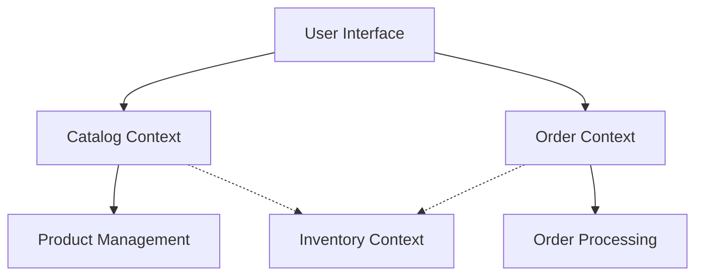

## 15.4. Contexts and Application Boundaries

In the realm of web development with the Phoenix Framework, organizing business logic effectively is crucial for building scalable, maintainable, and robust applications. This section delves into the concept of contexts and application boundaries, providing expert guidance on encapsulating related functionality and defining clear interfaces within your Elixir applications.

### Organizing Business Logic

In traditional object-oriented programming, business logic is often organized into classes and objects, which can lead to tightly coupled systems that are difficult to manage as they grow. Elixir, with its functional programming paradigm, offers a different approach through the use of contexts.

#### Encapsulating Related Functionality Within Contexts

Contexts in Elixir serve as a boundary for related functionality, allowing you to encapsulate business logic and data management within a specific domain. This approach promotes separation of concerns and helps maintain a clean architecture.

**Key Benefits of Using Contexts:**

- **Separation of Concerns:** By dividing your application into contexts, you can isolate different parts of your business logic, making it easier to manage and understand.
- **Improved Maintainability:** Changes in one context are less likely to affect others, reducing the risk of introducing bugs.
- **Enhanced Reusability:** Contexts can be reused across different parts of your application or even in other projects.

**Creating a Context:**

Let's explore how to create a context in a Phoenix application. Suppose we are building an e-commerce platform with a context for managing products.

```elixir
# lib/my_app/catalog.ex
defmodule MyApp.Catalog do
  alias MyApp.Repo
  alias MyApp.Catalog.Product

  @doc """
  Returns the list of products.
  """
  def list_products do
    Repo.all(Product)
  end

  @doc """
  Gets a single product.
  """
  def get_product!(id), do: Repo.get!(Product, id)

  @doc """
  Creates a product.
  """
  def create_product(attrs \\ %{}) do
    %Product{}
    |> Product.changeset(attrs)
    |> Repo.insert()
  end

  @doc """
  Updates a product.
  """
  def update_product(%Product{} = product, attrs) do
    product
    |> Product.changeset(attrs)
    |> Repo.update()
  end

  @doc """
  Deletes a product.
  """
  def delete_product(%Product{} = product) do
    Repo.delete(product)
  end
end
```

In this example, the `Catalog` context encapsulates all operations related to products, including listing, retrieving, creating, updating, and deleting products. This encapsulation provides a clear interface for interacting with product data, making it easier to manage and extend.

**Try It Yourself:**

- Add a function to search for products by name within the `Catalog` context.
- Modify the `create_product` function to include additional validation logic.

### Bounded Contexts

Bounded contexts are a concept borrowed from Domain-Driven Design (DDD), where they define clear interfaces and boundaries within an application. In Elixir, bounded contexts help delineate the scope of a context, ensuring that it remains focused on a specific domain.

#### Defining Clear Interfaces and Boundaries

Bounded contexts in Elixir can be thought of as the boundaries within which a context operates. They define the limits of a context's responsibilities and interactions with other parts of the application.

**Key Principles of Bounded Contexts:**

- **Explicit Interfaces:** Define clear and explicit interfaces for interacting with a context. This ensures that other parts of the application interact with the context in a controlled manner.
- **Isolation:** Keep the implementation details of a context hidden from other parts of the application. This isolation prevents unintended dependencies and coupling.
- **Consistency:** Ensure that all operations within a context adhere to the same rules and logic, maintaining consistency across the application.

**Implementing Bounded Contexts:**

To implement bounded contexts in Elixir, it's essential to define clear interfaces and encapsulate logic within modules. Let's enhance our `Catalog` context to demonstrate this concept.

```elixir
# lib/my_app/catalog.ex
defmodule MyApp.Catalog do
  alias MyApp.Repo
  alias MyApp.Catalog.Product

  def list_products do
    Repo.all(Product)
  end

  def get_product!(id), do: Repo.get!(Product, id)

  def create_product(attrs \\ %{}) do
    %Product{}
    |> Product.changeset(attrs)
    |> Repo.insert()
  end

  def update_product(%Product{} = product, attrs) do
    product
    |> Product.changeset(attrs)
    |> Repo.update()
  end

  def delete_product(%Product{} = product) do
    Repo.delete(product)
  end

  defp validate_product_name(%{name: name}) when is_binary(name) and byte_size(name) > 0 do
    :ok
  end
  defp validate_product_name(_), do: {:error, "Invalid product name"}
end
```

In this enhanced `Catalog` context, we've added a private function `validate_product_name` to encapsulate validation logic. This function is not exposed outside the context, ensuring that the validation logic remains isolated and consistent.

**Try It Yourself:**

- Add a new function to the `Catalog` context to handle product price updates, including validation logic for price changes.
- Create a separate context for managing orders and define clear interfaces for interacting with the `Catalog` context.

### Visualizing Contexts and Application Boundaries

To better understand how contexts and application boundaries work together, let's visualize the relationship between different contexts in an application.


```mermaid
graph TD;
    A[User Interface] --> B[Catalog Context];
    A --> C[Order Context];
    B --> D[Product Management];
    C --> E[Order Processing];
    B -.-> F[Inventory Context];
    C -.-> F;
```

**Diagram Description:**

- **User Interface:** Represents the entry point for users interacting with the application.
- **Catalog Context:** Manages product-related functionality, including product management and inventory interactions.
- **Order Context:** Handles order-related functionality, including order processing and interactions with the catalog for product information.
- **Inventory Context:** Manages inventory-related functionality, interacting with both the catalog and order contexts.

This diagram illustrates how different contexts interact within an application, each with its own responsibilities and boundaries.

### References and Links

For further reading on contexts and application boundaries in Elixir and Phoenix, consider exploring the following resources:

- [Phoenix Contexts Guide](https://hexdocs.pm/phoenix/contexts.html)
- [Domain-Driven Design: Tackling Complexity in the Heart of Software](https://www.amazon.com/Domain-Driven-Design-Tackling-Complexity-Software/dp/0321125215)
- [Elixir School: Contexts](https://elixirschool.com/en/lessons/advanced/contexts/)

### Knowledge Check

- What are the benefits of using contexts in Elixir applications?
- How do bounded contexts help maintain application boundaries?
- What are some best practices for defining interfaces within a context?

### Embrace the Journey

Remember, mastering contexts and application boundaries in Elixir is a journey. As you continue to build and refine your applications, you'll gain a deeper understanding of how to organize business logic effectively. Keep experimenting, stay curious, and enjoy the process of building robust and maintainable applications with Elixir and the Phoenix Framework.

### Quiz Time!



### What is the primary purpose of using contexts in Elixir applications?

- [x] To encapsulate related functionality and promote separation of concerns.
- [ ] To increase the complexity of application architecture.
- [ ] To eliminate the need for modules in Elixir.
- [ ] To replace the need for testing in applications.

> **Explanation:** Contexts are used to encapsulate related functionality, promoting separation of concerns and improving maintainability.

### How do bounded contexts contribute to application design?

- [x] By defining clear interfaces and boundaries within the application.
- [ ] By merging unrelated functionalities into a single module.
- [ ] By increasing coupling between different parts of the application.
- [ ] By eliminating the need for explicit interfaces.

> **Explanation:** Bounded contexts help define clear interfaces and boundaries, ensuring isolation and consistency within the application.

### What is a key benefit of encapsulating logic within a context?

- [x] Improved maintainability and reduced risk of introducing bugs.
- [ ] Increased complexity and difficulty in understanding the application.
- [ ] Elimination of the need for testing.
- [ ] Increased coupling between different parts of the application.

> **Explanation:** Encapsulating logic within a context improves maintainability and reduces the risk of introducing bugs by isolating changes.

### How can you ensure consistency within a bounded context?

- [x] By adhering to the same rules and logic across all operations within the context.
- [ ] By allowing different parts of the context to define their own rules.
- [ ] By merging unrelated functionalities into a single module.
- [ ] By eliminating the need for explicit interfaces.

> **Explanation:** Consistency is ensured by adhering to the same rules and logic across all operations within the context.

### What is the role of private functions within a context?

- [x] To encapsulate logic that should not be exposed outside the context.
- [ ] To eliminate the need for public functions.
- [ ] To increase the complexity of the context.
- [ ] To replace the need for modules in Elixir.

> **Explanation:** Private functions encapsulate logic that should not be exposed outside the context, ensuring isolation and consistency.

### How do contexts improve reusability in Elixir applications?

- [x] By encapsulating related functionality that can be reused across different parts of the application.
- [ ] By merging unrelated functionalities into a single module.
- [ ] By eliminating the need for testing.
- [ ] By increasing coupling between different parts of the application.

> **Explanation:** Contexts encapsulate related functionality, allowing it to be reused across different parts of the application or in other projects.

### What is a key principle of bounded contexts?

- [x] Explicit interfaces and isolation of implementation details.
- [ ] Merging unrelated functionalities into a single module.
- [ ] Eliminating the need for testing.
- [ ] Increasing coupling between different parts of the application.

> **Explanation:** Bounded contexts emphasize explicit interfaces and isolation of implementation details to prevent unintended dependencies.

### What is the relationship between contexts and bounded contexts?

- [x] Contexts encapsulate related functionality, while bounded contexts define the boundaries within which contexts operate.
- [ ] Contexts and bounded contexts are unrelated concepts.
- [ ] Bounded contexts eliminate the need for contexts.
- [ ] Contexts increase coupling between different parts of the application.

> **Explanation:** Contexts encapsulate related functionality, while bounded contexts define the boundaries within which contexts operate.

### How can you visualize the relationship between different contexts in an application?

- [x] By using diagrams to illustrate the interactions and boundaries between contexts.
- [ ] By merging unrelated functionalities into a single module.
- [ ] By eliminating the need for explicit interfaces.
- [ ] By increasing coupling between different parts of the application.

> **Explanation:** Diagrams can be used to visualize the interactions and boundaries between different contexts in an application.

### True or False: Bounded contexts eliminate the need for explicit interfaces.

- [ ] True
- [x] False

> **Explanation:** Bounded contexts emphasize the importance of explicit interfaces to define clear boundaries and interactions within the application.




