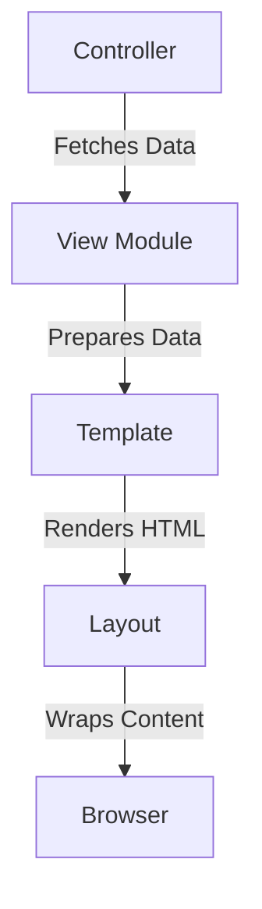

## 15.5. Templating with EEx and Phoenix Templates

In the world of web development, creating dynamic and interactive user interfaces is crucial. Elixir, with its Phoenix framework, offers a powerful templating system that allows developers to build robust web applications. This section will delve into the intricacies of templating in Elixir using Embedded Elixir (EEx) and Phoenix Templates. We will explore writing dynamic templates, rendering views, and creating reusable layout structures and components.

### Embedded Elixir (EEx)

Embedded Elixir (EEx) is a templating engine that allows you to embed Elixir code within a text document. This is particularly useful for generating HTML dynamically. EEx provides a simple and efficient way to create templates that can include logic and dynamic content.

#### Writing Dynamic Templates with Elixir Code Embedded

EEx templates are essentially text files with embedded Elixir code. The code is enclosed within `<%= %>` for expressions that return values and `<% %>` for control structures that do not return values. Let's look at a basic example:

```elixir
# greeting.eex
<%= if user do %>
  Hello, <%= user.name %>!
<% else %>
  Hello, Guest!
<% end %>
```

In this example, we use an `if` statement to check if a `user` is present. If so, we greet the user by name; otherwise, we greet a guest. The `<%= %>` tags are used to output the result of the expression.

#### EEx Syntax and Usage

EEx provides several constructs for embedding Elixir code:

- **Expressions**: Use `<%= expression %>` to evaluate and output the result.
- **Control Structures**: Use `<% control_structure %>` for logic without output.
- **Comments**: Use `<%# comment %>` to add comments that won't appear in the output.

Here's a more complex example demonstrating loops and conditionals:

```elixir
# list.eex
<ul>
<%= for item <- items do %>
  <li><%= item %></li>
<% end %>
</ul>
```

This template generates an unordered list from a list of items. The `for` loop iterates over each item, embedding it within a list item (`<li>`).

#### Try It Yourself

Experiment with EEx by creating a template that displays a list of products with their prices. Add a conditional to highlight products on sale.

### Rendering Views

In Phoenix, views are responsible for preparing data for templates. They act as the intermediary between the controller and the template, ensuring that the data is in the correct format for rendering.

#### Using View Modules to Prepare Data for Templates

Phoenix views are modules that contain functions to transform and prepare data. By convention, views are named after the corresponding controller, with a `View` suffix. For example, a `ProductController` would have a `ProductView`.

Here's a simple example of a view module:

```elixir
defmodule MyAppWeb.ProductView do
  use MyAppWeb, :view

  def format_price(price) do
    "$#{Float.round(price, 2)}"
  end
end
```

In this example, the `format_price/1` function formats a price as a string with two decimal places. This function can be used in templates to display prices consistently.

#### Rendering Templates with Views

To render a template with a view, you typically use the `render/3` function in the controller. Here's an example:

```elixir
defmodule MyAppWeb.ProductController do
  use MyAppWeb, :controller

  def show(conn, %{"id" => id}) do
    product = MyApp.get_product!(id)
    render(conn, "show.html", product: product)
  end
end
```

In this example, the `show/2` action retrieves a product and renders the `show.html` template, passing the product as an assign.

#### Try It Yourself

Create a view module with a function that formats dates. Use this function in a template to display the creation date of a product.

### Layout and Components

Layouts and components are essential for creating reusable and consistent UI elements across your application. Phoenix provides powerful tools to manage these elements efficiently.

#### Creating Reusable Layout Structures

Layouts in Phoenix are templates that wrap around other templates. They typically contain common elements like headers, footers, and navigation bars. By default, Phoenix uses a layout located at `lib/my_app_web/templates/layout/app.html.eex`.

Here's a basic layout example:

```html
<!DOCTYPE html>
<html lang="en">
<head>
  <meta charset="UTF-8">
  <title><%= @page_title || "MyApp" %></title>
  <link rel="stylesheet" href="<%= Routes.static_path(@conn, "/css/app.css") %>">
</head>
<body>
  <header>
    <h1>Welcome to MyApp</h1>
  </header>
  <main>
    <%= render @view_module, @view_template, assigns %>
  </main>
  <footer>
    <p>&copy; 2024 MyApp</p>
  </footer>
</body>
</html>
```

In this layout, the `render/3` function is used to render the current view's template within the `<main>` section.

#### Creating Reusable Components

Components in Phoenix are small, reusable pieces of UI. They can be implemented as partial templates or as functions in view modules.

##### Partial Templates

Partial templates are small templates that can be included in other templates using the `render/3` function. For example, a navigation bar can be a partial template:

```elixir
# nav.html.eex
<nav>
  <ul>
    <li><a href="<%= Routes.page_path(@conn, :index) %>">Home</a></li>
    <li><a href="<%= Routes.product_path(@conn, :index) %>">Products</a></li>
  </ul>
</nav>
```

You can include this partial in your layout or other templates:

```elixir
<%= render "nav.html", assigns %>
```

##### View Functions as Components

View functions can also serve as components, encapsulating logic and rendering HTML. Here's an example of a simple component function:

```elixir
defmodule MyAppWeb.SharedView do
  use MyAppWeb, :view

  def render_button(text, url) do
    ~E"""
    <a href="<%= url %>" class="button"><%= text %></a>
    """
  end
end
```

This function generates a button with the specified text and URL. You can use it in templates like this:

```elixir
<%= MyAppWeb.SharedView.render_button("Click Me", "#") %>
```

#### Try It Yourself

Create a partial template for a footer and include it in your layout. Then, create a view function that renders a card component with a title and content.

### Visualizing Templating Workflow

To better understand how templating works in Phoenix, let's visualize the workflow using a Mermaid.js diagram:



**Diagram Description:** This diagram illustrates the flow of data from the controller to the view module, where it is prepared for the template. The template renders the HTML, which is then wrapped by the layout and sent to the browser.

### References and Links

For further reading on EEx and Phoenix Templates, consider the following resources:

- [Phoenix Framework Guides](https://hexdocs.pm/phoenix/overview.html)
- [EEx Documentation](https://hexdocs.pm/eex/EEx.html)
- [Elixir School: Phoenix Templates](https://elixirschool.com/en/lessons/phoenix/templates/)

### Knowledge Check

- What is the purpose of EEx in Elixir?
- How do you render a template with a view in Phoenix?
- What are the benefits of using layouts in web applications?
- How can you create reusable components in Phoenix?

### Embrace the Journey

Remember, mastering templating in Elixir is a journey. As you experiment with EEx and Phoenix Templates, you'll discover new ways to create dynamic and interactive web applications. Keep exploring, stay curious, and enjoy the process!

### Quiz: Templating with EEx and Phoenix Templates



### What is the primary purpose of EEx in Elixir?

- [x] To embed Elixir code within text documents for dynamic content generation.
- [ ] To compile Elixir code into machine code.
- [ ] To manage database connections.
- [ ] To handle HTTP requests.

> **Explanation:** EEx is used to embed Elixir code within text documents, allowing for dynamic content generation.

### How do you include a partial template in a Phoenix template?

- [x] Using the `render/3` function.
- [ ] Using the `include/2` function.
- [ ] Using the `import/1` function.
- [ ] Using the `require/1` function.

> **Explanation:** The `render/3` function is used to include partial templates in Phoenix.

### What is the role of a view module in Phoenix?

- [x] To prepare data for templates.
- [ ] To handle HTTP requests.
- [ ] To manage database transactions.
- [ ] To compile Elixir code.

> **Explanation:** View modules in Phoenix are responsible for preparing data for templates.

### Which tag is used in EEx to output the result of an expression?

- [x] `<%= %>`
- [ ] `<% %>`
- [ ] `<%# %>`
- [ ] `<%: %>`

> **Explanation:** The `<%= %>` tag is used to output the result of an expression in EEx.

### What is the purpose of layouts in Phoenix?

- [x] To wrap templates with common elements like headers and footers.
- [ ] To manage database connections.
- [ ] To handle HTTP requests.
- [ ] To compile Elixir code.

> **Explanation:** Layouts in Phoenix are used to wrap templates with common elements like headers and footers.

### How can you create a reusable component in Phoenix?

- [x] By using partial templates or view functions.
- [ ] By using GenServer processes.
- [ ] By using database migrations.
- [ ] By using HTTP middleware.

> **Explanation:** Reusable components in Phoenix can be created using partial templates or view functions.

### What does the `render/3` function do in a Phoenix controller?

- [x] It renders a template with the given assigns.
- [ ] It compiles Elixir code.
- [ ] It manages database transactions.
- [ ] It handles HTTP requests.

> **Explanation:** The `render/3` function in a Phoenix controller renders a template with the given assigns.

### Which of the following is a benefit of using EEx templates?

- [x] They allow for dynamic content generation.
- [ ] They improve database performance.
- [ ] They handle HTTP requests more efficiently.
- [ ] They compile Elixir code faster.

> **Explanation:** EEx templates allow for dynamic content generation, making them beneficial for web development.

### What is the syntax for comments in EEx templates?

- [x] `<%# comment %>`
- [ ] `<!-- comment -->`
- [ ] `# comment`
- [ ] `// comment`

> **Explanation:** The syntax for comments in EEx templates is `<%# comment %>`.

### True or False: Layouts in Phoenix are optional and not required for rendering templates.

- [x] True
- [ ] False

> **Explanation:** Layouts in Phoenix are optional and provide a way to wrap templates with common elements, but they are not required.




