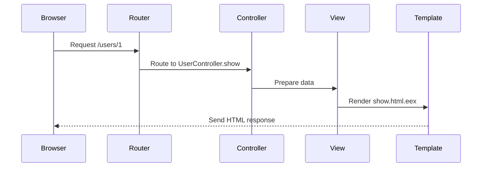

## 15.5. Templating with EEx and Phoenix Templates

Templating is a crucial aspect of web development, allowing developers to create dynamic, data-driven web pages. In the Elixir ecosystem, the Phoenix framework leverages Embedded Elixir (EEx) for templating. This section will guide you through the process of using EEx and Phoenix templates to build robust, scalable web applications.

### Embedded Elixir (EEx)

Embedded Elixir (EEx) is a powerful templating engine that allows you to embed Elixir code within HTML. This capability is essential for creating dynamic content in web applications. Let's explore how to write dynamic templates using EEx.

#### Writing Dynamic Templates with EEx

EEx templates are essentially HTML files with embedded Elixir code. They are processed at runtime, allowing you to dynamically generate HTML content based on the data provided. Here's a simple example of an EEx template:

```elixir
# simple_template.eex
<h1>Welcome, <%= @username %>!</h1>
<p>Your email is <%= @user_email %>.</p>
```

In the example above:
- `<%= ... %>` is used to output the result of Elixir expressions.
- `@username` and `@user_email` are variables passed to the template.

#### Using EEx for Logic and Iteration

EEx supports more than just outputting variables; you can include logic and iteration as well.

```elixir
# list_template.eex
<ul>
<%= for item <- @items do %>
  <li><%= item %></li>
<% end %>
</ul>
```

In this example:
- The `for` comprehension iterates over the `@items` list, outputting each item within a `<li>` tag.

#### Conditional Rendering

EEx also allows for conditional rendering using Elixir's control structures.

```elixir
# conditional_template.eex
<% if @is_admin do %>
  <p>Welcome, Admin!</p>
<% else %>
  <p>Welcome, User!</p>
<% end %>
```

This template checks the `@is_admin` flag and renders different content based on its value.

### Rendering Views

In Phoenix, views are responsible for preparing data to be rendered by templates. They act as an intermediary between controllers and templates, ensuring that the data is formatted correctly before being passed to the template.

#### Using View Modules

A view module in Phoenix is typically defined in the `lib/my_app_web/views` directory. Let's create a simple view module:

```elixir
defmodule MyAppWeb.UserView do
  use MyAppWeb, :view

  def format_email(email) do
    String.downcase(email)
  end
end
```

In this module:
- We define a function `format_email/1` that formats an email address. This function can be used within templates to ensure consistent formatting.

#### Rendering Templates from Controllers

To render a template from a controller, you use the `render/3` function:

```elixir
defmodule MyAppWeb.UserController do
  use MyAppWeb, :controller

  def show(conn, %{"id" => id}) do
    user = Repo.get!(User, id)
    render(conn, "show.html", user: user)
  end
end
```

In this example:
- The `show` action retrieves a user by ID and renders the `show.html` template, passing the `user` map as an assign.

### Layout and Components

Layouts and components are essential for creating reusable structures in your web application. They help maintain consistency across different pages and reduce code duplication.

#### Creating Reusable Layout Structures

Layouts in Phoenix allow you to define a common structure for your pages. They typically include elements like headers, footers, and navigation bars.

```elixir
# layout/app.html.eex
<!DOCTYPE html>
<html lang="en">
<head>
  <meta charset="UTF-8">
  <title><%= @page_title || "MyApp" %></title>
  <link rel="stylesheet" href="<%= Routes.static_path(@conn, "/css/app.css") %>">
</head>
<body>
  <header>
    <h1>MyApp</h1>
    <nav>
      <a href="<%= Routes.page_path(@conn, :index) %>">Home</a>
      <a href="<%= Routes.page_path(@conn, :about) %>">About</a>
    </nav>
  </header>
  <main>
    <%= @inner_content %>
  </main>
  <footer>
    <p>&copy; 2024 MyApp</p>
  </footer>
</body>
</html>
```

In this layout:
- `@inner_content` is a special assign that includes the content of the rendered template.
- The layout is applied to templates using the `:layout` option in the controller.

#### Creating Components

Components are reusable pieces of UI that can be included in multiple templates. Phoenix LiveView enhances this concept, but you can also create simple components using partial templates.

```elixir
# templates/shared/_user_card.html.eex
<div class="user-card">
  <h2><%= @user.name %></h2>
  <p>Email: <%= @user.email %></p>
</div>
```

To include this component in another template:

```elixir
<%= render "shared/user_card.html", user: @user %>
```

### Advanced Templating Techniques

Phoenix provides advanced templating features that allow you to create even more dynamic and interactive web applications.

#### Using Helpers and Functions

Phoenix views can define helper functions that are available in templates. These functions can be used to encapsulate complex logic or formatting.

```elixir
defmodule MyAppWeb.UserView do
  use MyAppWeb, :view

  def format_date(date) do
    Timex.format!(date, "{Mfull} {D}, {YYYY}")
  end
end
```

In your template, you can use this helper:

```elixir
<p>Joined on: <%= format_date(@user.joined_at) %></p>
```

#### Leveraging Phoenix LiveView

Phoenix LiveView allows you to create rich, interactive user interfaces without writing JavaScript. It uses server-rendered HTML and WebSockets to provide real-time updates.

```elixir
defmodule MyAppWeb.CounterLive do
  use Phoenix.LiveView

  def mount(_params, _session, socket) do
    {:ok, assign(socket, count: 0)}
  end

  def handle_event("increment", _value, socket) do
    {:noreply, update(socket, :count, &(&1 + 1))}
  end

  def render(assigns) do
    ~L"""
    <div>
      <h1>Counter: <%= @count %></h1>
      <button phx-click="increment">Increment</button>
    </div>
    """
  end
end
```

### Visualizing Templating with EEx and Phoenix

To better understand the flow of data and rendering in Phoenix, let's visualize the interaction between controllers, views, and templates.


```mermaid
sequenceDiagram
    participant Browser
    participant Router
    participant Controller
    participant View
    participant Template

    Browser->>Router: Request /users/1
    Router->>Controller: Route to UserController.show
    Controller->>View: Prepare data
    View->>Template: Render show.html.eex
    Template-->>Browser: Send HTML response
```

This diagram illustrates the process of handling a request in Phoenix, from routing to rendering the final HTML response.

### References and Further Reading

- [Phoenix Framework Documentation](https://hexdocs.pm/phoenix/)
- [Elixir EEx Documentation](https://hexdocs.pm/eex/EEx.html)
- [Timex Library for Date Formatting](https://hexdocs.pm/timex/Timex.html)

### Knowledge Check

- How does EEx differ from traditional templating engines?
- What role do view modules play in Phoenix?
- How can you create reusable components in Phoenix templates?

### Exercises

1. Create a Phoenix template that displays a list of users, with each user's name and email.
2. Implement a layout that includes a navigation bar and footer, and apply it to your templates.
3. Use a helper function in a view to format user data before rendering it in a template.

### Embrace the Journey

Remember, mastering templating with EEx and Phoenix is just one step in your journey to becoming a proficient Elixir developer. As you progress, you'll discover more advanced techniques and tools that will enable you to build even more dynamic and interactive web applications. Keep experimenting, stay curious, and enjoy the journey!

## Quiz Time!



### What is EEx in Elixir?

- [x] A templating engine that allows embedding Elixir code within HTML
- [ ] A database query language
- [ ] A CSS preprocessor
- [ ] A JavaScript framework

> **Explanation:** EEx stands for Embedded Elixir, a templating engine used to embed Elixir code within HTML for dynamic content generation.

### How do you render a template from a controller in Phoenix?

- [x] Using the `render/3` function
- [ ] Using the `send/2` function
- [ ] Using the `fetch/3` function
- [ ] Using the `compile/2` function

> **Explanation:** The `render/3` function is used in controllers to render templates, passing the connection, template name, and assigns.

### What is the purpose of a view module in Phoenix?

- [x] To prepare data for rendering in templates
- [ ] To handle HTTP requests
- [ ] To manage database connections
- [ ] To compile Elixir code

> **Explanation:** View modules in Phoenix are responsible for preparing and formatting data before it is rendered in templates.

### How can you include a reusable component in a Phoenix template?

- [x] Using the `render` function with the component's template path
- [ ] Using the `include` function
- [ ] Using the `import` function
- [ ] Using the `require` function

> **Explanation:** The `render` function is used to include reusable components by specifying the component's template path and any necessary assigns.

### What is the role of `@inner_content` in a Phoenix layout?

- [x] It includes the content of the rendered template
- [ ] It defines the page title
- [ ] It specifies the CSS styles
- [ ] It handles user authentication

> **Explanation:** `@inner_content` is a special assign in Phoenix layouts that includes the content of the rendered template.

### Which function is used to iterate over a list in an EEx template?

- [x] `for`
- [ ] `each`
- [ ] `map`
- [ ] `loop`

> **Explanation:** The `for` comprehension is used in EEx templates to iterate over lists and generate content for each item.

### What is the advantage of using Phoenix LiveView?

- [x] It allows creating interactive UIs without JavaScript
- [ ] It compiles Elixir code to JavaScript
- [ ] It manages database transactions
- [ ] It provides CSS styling

> **Explanation:** Phoenix LiveView enables the creation of interactive user interfaces using server-rendered HTML and WebSockets, eliminating the need for JavaScript for interactivity.

### How can you define a helper function in a Phoenix view?

- [x] By defining a function within the view module
- [ ] By creating a separate helper file
- [ ] By using a macro
- [ ] By writing a JavaScript function

> **Explanation:** Helper functions are defined within Phoenix view modules and can be used in templates for logic and formatting.

### What is the purpose of a layout in Phoenix?

- [x] To define a common structure for pages
- [ ] To handle form submissions
- [ ] To manage user sessions
- [ ] To compile assets

> **Explanation:** Layouts in Phoenix define a common structure for web pages, typically including headers, footers, and navigation.

### True or False: EEx templates can include Elixir control structures like `if` and `for`.

- [x] True
- [ ] False

> **Explanation:** EEx templates can include Elixir control structures, allowing for dynamic content generation based on logic and iteration.


