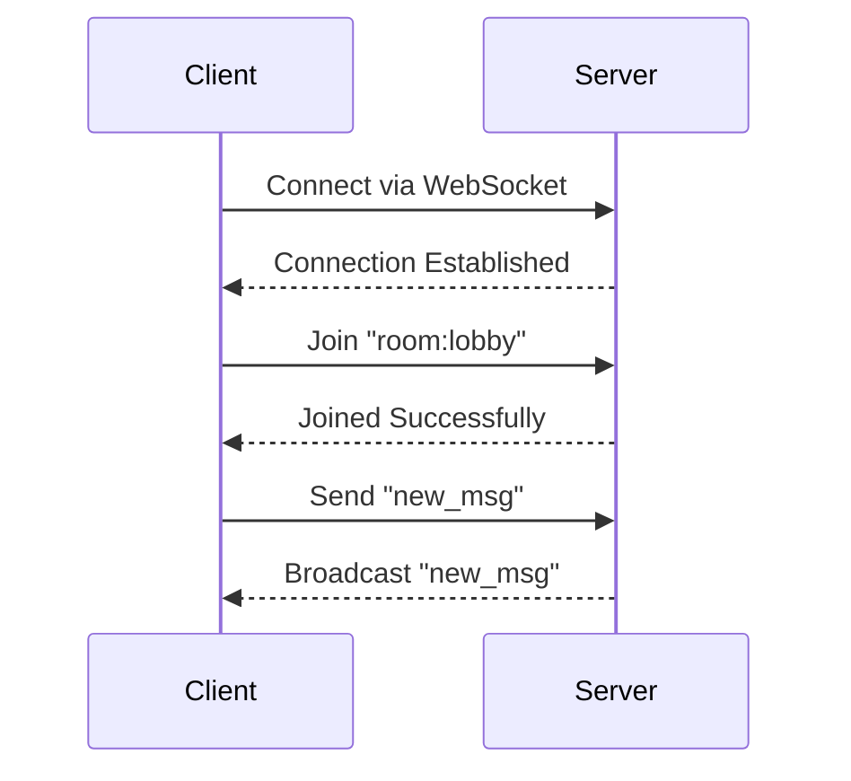

## 15.6. Real-Time Communication with Channels

Real-time communication is a cornerstone of modern web applications, enabling features like live chat, notifications, and collaborative tools. In the Elixir ecosystem, Phoenix Channels provide a powerful abstraction for implementing real-time features using WebSockets. This section delves into the architecture, implementation, and use cases of Phoenix Channels, equipping you with the knowledge to build robust real-time applications.

### Phoenix Channels: An Overview

Phoenix Channels are a core feature of the Phoenix Framework, designed to facilitate real-time communication between clients and servers. They leverage WebSockets, a protocol that allows for full-duplex communication channels over a single TCP connection. This makes them ideal for applications requiring instant data exchange.

#### Key Concepts

- **WebSockets**: A protocol providing a persistent connection between client and server, allowing for real-time data exchange.
- **Channels**: Abstractions over WebSockets in Phoenix, enabling organized communication through topics and events.
- **Topics**: Named channels for organizing messages, allowing clients to subscribe to specific streams of data.
- **Events**: Messages sent over channels, which can be broadcasted to all subscribers of a topic.

### Implementing WebSockets with Phoenix Channels

To implement real-time features using Phoenix Channels, you need to set up both the server-side and client-side components. Let's walk through the process step-by-step.

#### Server-Side Setup

1. **Define a Channel Module**: Create a channel module to handle incoming messages and broadcasts.

```elixir
defmodule MyAppWeb.ChatChannel do
  use Phoenix.Channel

  def join("room:lobby", _message, socket) do
    {:ok, socket}
  end

  def handle_in("new_msg", %{"body" => body}, socket) do
    broadcast!(socket, "new_msg", %{body: body})
    {:noreply, socket}
  end
end
```

- **join/3**: Handles client requests to join a channel. Here, we allow clients to join the "room:lobby" topic.
- **handle_in/3**: Processes incoming messages. In this example, it broadcasts a new message to all subscribers of the topic.

2. **Update the Endpoint**: Ensure your endpoint is configured to handle WebSocket connections.

```elixir
defmodule MyAppWeb.Endpoint do
  use Phoenix.Endpoint, otp_app: :my_app

  socket "/socket", MyAppWeb.UserSocket,
    websocket: true,
    longpoll: false

  # Other configurations...
end
```

3. **Define a User Socket**: The user socket is the entry point for WebSocket connections.

```elixir
defmodule MyAppWeb.UserSocket do
  use Phoenix.Socket

  channel "room:*", MyAppWeb.ChatChannel

  def connect(_params, socket, _connect_info) do
    {:ok, socket}
  end

  def id(_socket), do: nil
end
```

- **channel/2**: Maps a topic pattern to a channel module. Here, any topic starting with "room:" will use `ChatChannel`.
- **connect/3**: Authenticates and initializes the socket connection.

#### Client-Side Setup

1. **Include Phoenix JavaScript**: Add the Phoenix JavaScript client to your application.

```html
<script src="<%= Routes.static_path(@conn, "/js/phoenix.js") %>"></script>
```

2. **Establish a Socket Connection**: Use the Phoenix JavaScript library to connect to the server.

```javascript
import { Socket } from "phoenix"

let socket = new Socket("/socket", { params: { userToken: "123" } })
socket.connect()
```

3. **Join a Channel**: Connect to a specific channel and handle incoming messages.

```javascript
let channel = socket.channel("room:lobby", {})

channel.join()
  .receive("ok", resp => { console.log("Joined successfully", resp) })
  .receive("error", resp => { console.log("Unable to join", resp) })

channel.on("new_msg", payload => {
  console.log("New message:", payload.body)
})
```

- **channel.join()**: Joins the specified channel and handles success or error responses.
- **channel.on()**: Listens for specific events on the channel.

### Topics and Subscriptions

Topics in Phoenix Channels are used to organize communication streams. A topic is a string identifier that clients can subscribe to, allowing them to receive messages broadcasted to that topic.

#### Organizing Communication

1. **Naming Conventions**: Use descriptive and hierarchical naming for topics to simplify management and access control. For example, "room:lobby" or "user:123".

2. **Dynamic Topics**: You can create dynamic topics based on user actions or application state, such as "chat:#{chat_id}".

3. **Broadcasting**: Use the `broadcast!/3` function to send messages to all subscribers of a topic.

```elixir
broadcast!(socket, "new_msg", %{body: "Hello, world!"})
```

### Use Cases for Phoenix Channels

Phoenix Channels are versatile and can be used in a variety of real-time applications. Here are some common use cases:

#### Chat Applications

Real-time chat is a classic use case for Phoenix Channels. By leveraging WebSockets, you can create chat rooms where users can send and receive messages instantly.

- **Private Messaging**: Use dynamic topics to create private channels for one-on-one communication.
- **Group Chats**: Organize users into chat rooms and broadcast messages to all participants.

#### Live Updates

Applications that require live updates, such as dashboards or news feeds, can benefit from Phoenix Channels. By subscribing to relevant topics, clients can receive updates as soon as they occur.

- **Stock Tickers**: Broadcast stock price changes to subscribers in real-time.
- **Live Sports Scores**: Update users with the latest scores and events during a game.

#### Collaborative Tools

Tools that require real-time collaboration, such as document editors or project management apps, can use Phoenix Channels to synchronize changes across users.

- **Shared Document Editing**: Broadcast changes to a document to all collaborators.
- **Task Management**: Update task statuses and assignments in real-time.

### Design Considerations

When implementing real-time features with Phoenix Channels, consider the following:

- **Scalability**: Ensure your application can handle a large number of concurrent connections. Use techniques like clustering and load balancing.
- **Security**: Implement authentication and authorization to control access to channels and topics.
- **Error Handling**: Gracefully handle connection errors and disconnections to maintain a seamless user experience.

### Elixir Unique Features

Elixir's concurrency model, based on the BEAM VM, makes it particularly well-suited for real-time applications. The lightweight processes and message-passing capabilities allow for efficient handling of numerous simultaneous connections.

### Differences and Similarities

Phoenix Channels are often compared to other real-time communication solutions like Socket.IO. While both provide similar functionality, Phoenix Channels leverage Elixir's strengths in concurrency and fault tolerance, offering a more robust solution for large-scale applications.

### Try It Yourself

Experiment with the code examples provided by modifying the channel logic or creating new topics. Try implementing a simple chat application or a live update feature to see Phoenix Channels in action.

### Visualizing Phoenix Channels

Below is a sequence diagram illustrating the interaction between a client and server using Phoenix Channels:



This diagram shows the basic flow of establishing a connection, joining a channel, and broadcasting messages.

### Knowledge Check

- What are the key components of Phoenix Channels?
- How do topics help organize communication in Phoenix Channels?
- What are some common use cases for real-time communication with Phoenix Channels?

### Summary

Phoenix Channels provide a powerful and efficient way to implement real-time communication in web applications. By leveraging WebSockets and Elixir's concurrency model, you can build scalable and responsive applications that meet the demands of modern users. Remember, this is just the beginning. As you progress, you'll build more complex and interactive applications. Keep experimenting, stay curious, and enjoy the journey!

## Quiz: Real-Time Communication with Channels



### What protocol do Phoenix Channels use for real-time communication?

- [x] WebSockets
- [ ] HTTP
- [ ] FTP
- [ ] SMTP

> **Explanation:** Phoenix Channels use WebSockets to establish a persistent connection for real-time communication.

### What function is used to broadcast messages to all subscribers of a topic?

- [x] broadcast!/3
- [ ] send/2
- [ ] push/3
- [ ] emit/2

> **Explanation:** The `broadcast!/3` function is used to send messages to all subscribers of a topic in Phoenix Channels.

### What is the purpose of a topic in Phoenix Channels?

- [x] To organize communication streams
- [ ] To authenticate users
- [ ] To store user data
- [ ] To manage server resources

> **Explanation:** Topics in Phoenix Channels are used to organize communication streams, allowing clients to subscribe to specific data.

### Which module is used to define a channel in Phoenix?

- [x] Phoenix.Channel
- [ ] Phoenix.Socket
- [ ] Phoenix.Endpoint
- [ ] Phoenix.Router

> **Explanation:** The `Phoenix.Channel` module is used to define a channel in Phoenix.

### What is a common use case for Phoenix Channels?

- [x] Real-time chat applications
- [ ] Static web pages
- [ ] Batch processing
- [ ] File storage

> **Explanation:** Real-time chat applications are a common use case for Phoenix Channels due to their need for instant communication.

### How do you establish a WebSocket connection on the client side?

- [x] Using the Phoenix JavaScript library
- [ ] Using jQuery
- [ ] Using AJAX
- [ ] Using Fetch API

> **Explanation:** The Phoenix JavaScript library is used to establish a WebSocket connection on the client side.

### What is the role of the UserSocket module in Phoenix?

- [x] To handle WebSocket connections
- [ ] To manage database connections
- [ ] To render HTML templates
- [ ] To define routes

> **Explanation:** The UserSocket module in Phoenix is responsible for handling WebSocket connections.

### What is the `join/3` function used for in a channel module?

- [x] To handle client requests to join a channel
- [ ] To send messages to a client
- [ ] To close a WebSocket connection
- [ ] To authenticate a user

> **Explanation:** The `join/3` function handles client requests to join a channel in Phoenix.

### What does the `handle_in/3` function do in a channel module?

- [x] Processes incoming messages
- [ ] Sends outgoing messages
- [ ] Establishes a database connection
- [ ] Renders a view

> **Explanation:** The `handle_in/3` function processes incoming messages in a channel module.

### True or False: Phoenix Channels can only be used for chat applications.

- [ ] True
- [x] False

> **Explanation:** Phoenix Channels can be used for a variety of real-time applications, not just chat applications.


