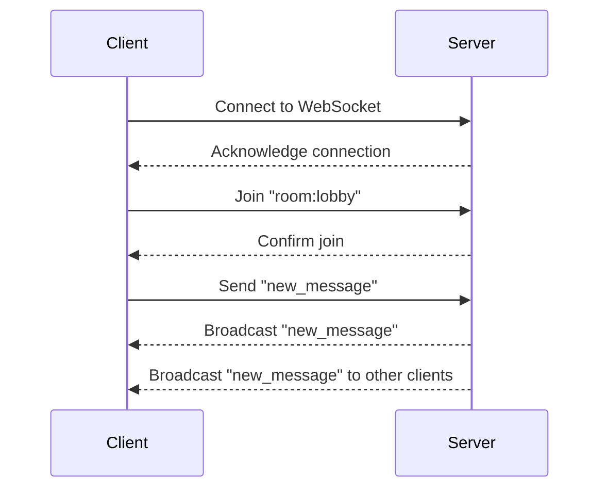

## 15.6. Real-Time Communication with Channels

Real-time communication is a cornerstone of modern web applications, enabling interactive features such as chat, live updates, and collaborative tools. In the Elixir ecosystem, Phoenix Channels provide a powerful abstraction over WebSockets, making it easier to build scalable and efficient real-time applications. In this section, we will delve into the intricacies of Phoenix Channels, exploring how they work, how to implement them, and their various use cases.

### Phoenix Channels

Phoenix Channels are a key feature of the Phoenix Framework, designed to handle real-time communication between the server and clients. They provide an abstraction over WebSockets, allowing developers to manage connections, broadcast messages, and handle events efficiently.

#### Implementing WebSockets for Real-Time Features

WebSockets are a protocol that enables two-way communication between a client and a server. Unlike HTTP, which follows a request-response model, WebSockets allow for persistent connections, enabling the server to push updates to the client without the client having to request them explicitly.

**Key Concepts of WebSockets:**

- **Full-Duplex Communication:** WebSockets allow for simultaneous two-way communication, meaning both the client and server can send messages independently.
- **Persistent Connection:** Once established, a WebSocket connection remains open, reducing the overhead of establishing new connections.
- **Low Latency:** WebSockets are designed for low-latency communication, making them ideal for real-time applications.

**Phoenix Channels and WebSockets:**

Phoenix Channels leverage WebSockets to provide a high-level API for real-time communication. They abstract away the complexities of managing WebSocket connections, allowing developers to focus on building features.

**Setting Up Phoenix Channels:**

To implement Phoenix Channels in your application, follow these steps:

1. **Define a Channel Module:**

   Create a channel module to handle incoming messages and events. This module will define the logic for joining, leaving, and handling messages on a channel.

   ```elixir
   defmodule MyAppWeb.ChatChannel do
     use Phoenix.Channel

     def join("room:lobby", _message, socket) do
       {:ok, socket}
     end

     def handle_in("new_message", %{"body" => body}, socket) do
       broadcast!(socket, "new_message", %{body: body})
       {:noreply, socket}
     end
   end
   ```

   In this example, we define a `ChatChannel` module that handles messages in a chat room. The `join/3` function is called when a client attempts to join a channel. The `handle_in/3` function processes incoming messages and broadcasts them to other clients.

2. **Configure the Endpoint:**

   Update your endpoint configuration to enable WebSockets and define the socket path.

   ```elixir
   defmodule MyAppWeb.Endpoint do
     use Phoenix.Endpoint, otp_app: :my_app

     socket "/socket", MyAppWeb.UserSocket,
       websocket: true,
       longpoll: false

     # Other configurations...
   end
   ```

   The `socket/3` macro defines a WebSocket path and associates it with a user socket module.

3. **Create a User Socket Module:**

   Define a user socket module to route incoming connections to the appropriate channels.

   ```elixir
   defmodule MyAppWeb.UserSocket do
     use Phoenix.Socket

     channel "room:*", MyAppWeb.ChatChannel

     def connect(_params, socket, _connect_info) do
       {:ok, socket}
     end

     def id(_socket), do: nil
   end
   ```

   The `channel/2` macro maps a topic pattern to a channel module. In this case, all topics starting with "room:" are routed to `ChatChannel`.

4. **Client-Side Integration:**

   On the client side, use JavaScript to establish a WebSocket connection and interact with channels.

   ```javascript
   import { Socket } from "phoenix"

   let socket = new Socket("/socket", { params: { userToken: "123" } })

   socket.connect()

   let channel = socket.channel("room:lobby", {})
   channel.join()
     .receive("ok", resp => { console.log("Joined successfully", resp) })
     .receive("error", resp => { console.log("Unable to join", resp) })

   channel.on("new_message", payload => {
     console.log("New message:", payload.body)
   })

   function sendMessage(message) {
     channel.push("new_message", { body: message })
   }
   ```

   This JavaScript code establishes a connection to the server, joins a channel, and listens for messages. The `sendMessage` function sends messages to the server.

### Topics and Subscriptions

In Phoenix Channels, communication is organized using topics. Topics are strings that represent a particular subject or channel of communication. Clients subscribe to topics to receive messages, and the server can broadcast messages to all subscribers of a topic.

#### Organizing Communication Using Topics

Topics provide a flexible way to organize and manage communication in real-time applications. They allow you to segment communication based on different criteria, such as chat rooms, user groups, or application features.

**Example of Topic Usage:**

Consider a chat application with multiple chat rooms. Each room can be represented by a unique topic, such as "room:lobby" or "room:general". Clients can join specific topics to participate in different chat rooms.

```elixir
defmodule MyAppWeb.ChatChannel do
  use Phoenix.Channel

  def join("room:" <> _room_id, _message, socket) do
    {:ok, socket}
  end

  def handle_in("send_message", %{"body" => body}, socket) do
    broadcast!(socket, "new_message", %{body: body})
    {:noreply, socket}
  end
end
```

In this example, the `join/3` function uses pattern matching to allow clients to join any room topic. The `handle_in/3` function broadcasts messages to all clients subscribed to the same room topic.

**Benefits of Using Topics:**

- **Scalability:** Topics allow you to scale your application by distributing communication across multiple channels.
- **Flexibility:** You can dynamically create and manage topics based on application needs.
- **Isolation:** Topics provide isolation between different communication streams, preventing cross-talk between unrelated channels.

#### Subscribing and Broadcasting

When a client subscribes to a topic, they receive messages broadcasted to that topic. The server can use the `broadcast/3` or `broadcast!/3` functions to send messages to all subscribers.

**Example of Broadcasting:**

```elixir
def handle_in("send_message", %{"body" => body}, socket) do
  broadcast!(socket, "new_message", %{body: body})
  {:noreply, socket}
end
```

In this example, the `broadcast!/3` function sends a "new_message" event to all clients subscribed to the same topic as the sender.

### Use Cases

Phoenix Channels are versatile and can be used in various real-time applications. Here are some common use cases:

#### Chat Applications

Chat applications are a classic example of real-time communication. With Phoenix Channels, you can build chat systems that support multiple rooms, private messaging, and real-time notifications.

**Example Chat Application:**

```elixir
defmodule MyAppWeb.ChatChannel do
  use Phoenix.Channel

  def join("room:" <> room_id, _message, socket) do
    {:ok, assign(socket, :room_id, room_id)}
  end

  def handle_in("send_message", %{"body" => body}, socket) do
    broadcast!(socket, "new_message", %{body: body, room_id: socket.assigns.room_id})
    {:noreply, socket}
  end
end
```

In this example, we use the `assign/3` function to store the room ID in the socket state, allowing us to include it in broadcasted messages.

#### Live Updates

Real-time updates are essential for applications that require instant data synchronization, such as dashboards, stock tickers, and collaborative editing tools.

**Example of Live Updates:**

```elixir
defmodule MyAppWeb.DashboardChannel do
  use Phoenix.Channel

  def join("dashboard:updates", _message, socket) do
    {:ok, socket}
  end

  def handle_in("update_data", %{"data" => data}, socket) do
    broadcast!(socket, "data_update", %{data: data})
    {:noreply, socket}
  end
end
```

In this example, the `DashboardChannel` handles real-time data updates, broadcasting changes to all connected clients.

#### Collaborative Tools

Collaborative tools, such as document editors and project management applications, benefit from real-time communication to synchronize changes between users.

**Example of Collaborative Editing:**

```elixir
defmodule MyAppWeb.EditorChannel do
  use Phoenix.Channel

  def join("editor:document:" <> doc_id, _message, socket) do
    {:ok, assign(socket, :doc_id, doc_id)}
  end

  def handle_in("edit", %{"changes" => changes}, socket) do
    broadcast!(socket, "document_update", %{changes: changes, doc_id: socket.assigns.doc_id})
    {:noreply, socket}
  end
end
```

In this example, the `EditorChannel` manages real-time document editing, broadcasting changes to all users editing the same document.

### Visualizing Phoenix Channels

To better understand how Phoenix Channels work, let's visualize the communication flow using a sequence diagram.


```mermaid
sequenceDiagram
    participant Client
    participant Server
    Client->>Server: Connect to WebSocket
    Server-->>Client: Acknowledge connection
    Client->>Server: Join "room:lobby"
    Server-->>Client: Confirm join
    Client->>Server: Send "new_message"
    Server-->>Client: Broadcast "new_message"
    Server-->>Client: Broadcast "new_message" to other clients
```

**Diagram Explanation:**

- The client initiates a WebSocket connection to the server.
- The server acknowledges the connection.
- The client joins a specific topic (e.g., "room:lobby").
- The server confirms the join request.
- The client sends a message to the server.
- The server broadcasts the message to all clients subscribed to the topic.

### Try It Yourself

To reinforce your understanding of Phoenix Channels, try modifying the code examples provided. Here are some suggestions:

1. **Add a Private Messaging Feature:**

   Modify the chat application to support private messages between users. You can use unique topics for each pair of users.

2. **Implement a Notification System:**

   Create a notification system that alerts users of new messages or events. Use topics to segment notifications based on user preferences.

3. **Build a Real-Time Dashboard:**

   Develop a dashboard that displays real-time data updates. Use channels to broadcast data changes to connected clients.

### Knowledge Check

Before we conclude, let's review some key concepts:

- **What are Phoenix Channels and how do they relate to WebSockets?**
- **How do topics help organize communication in real-time applications?**
- **What are some common use cases for Phoenix Channels?**

### Summary

In this section, we've explored the power of Phoenix Channels for real-time communication in Elixir applications. We've learned how to implement WebSockets, organize communication using topics, and explored various use cases. By leveraging Phoenix Channels, you can build scalable and efficient real-time applications that enhance user engagement and interactivity.

### Embrace the Journey

Remember, this is just the beginning. As you progress, you'll build more complex and interactive applications using Phoenix Channels. Keep experimenting, stay curious, and enjoy the journey!

## Quiz Time!



### What is the primary protocol used by Phoenix Channels for real-time communication?

- [x] WebSockets
- [ ] HTTP
- [ ] TCP
- [ ] UDP

> **Explanation:** Phoenix Channels use WebSockets to enable real-time, full-duplex communication between the client and server.

### How do Phoenix Channels organize communication?

- [x] Using topics
- [ ] Using URLs
- [ ] Using IP addresses
- [ ] Using ports

> **Explanation:** Phoenix Channels organize communication using topics, allowing clients to subscribe to specific channels of communication.

### What is a common use case for Phoenix Channels?

- [x] Chat applications
- [ ] Static websites
- [ ] Batch processing
- [ ] File storage

> **Explanation:** Chat applications are a common use case for Phoenix Channels, leveraging real-time communication capabilities.

### Which function is used to broadcast messages to all subscribers of a topic?

- [x] broadcast!/3
- [ ] send/2
- [ ] push/2
- [ ] emit/2

> **Explanation:** The `broadcast!/3` function is used to broadcast messages to all subscribers of a topic in Phoenix Channels.

### What is the role of the `join/3` function in a channel module?

- [x] To handle client requests to join a channel
- [ ] To send messages to clients
- [ ] To disconnect clients
- [ ] To log client activity

> **Explanation:** The `join/3` function handles client requests to join a channel, determining if the client can connect.

### Which JavaScript class is used to connect to a Phoenix Channel on the client side?

- [x] Socket
- [ ] Channel
- [ ] WebSocket
- [ ] Connection

> **Explanation:** The `Socket` class is used in JavaScript to establish a connection to a Phoenix Channel.

### What is a benefit of using topics in Phoenix Channels?

- [x] Scalability
- [x] Flexibility
- [ ] Complexity
- [ ] Redundancy

> **Explanation:** Topics provide scalability and flexibility by allowing communication to be segmented and managed efficiently.

### What is the purpose of the `assign/3` function in a channel module?

- [x] To store state in the socket
- [ ] To send messages to clients
- [ ] To disconnect clients
- [ ] To log client activity

> **Explanation:** The `assign/3` function is used to store state in the socket, allowing data to be accessed across different functions.

### True or False: Phoenix Channels can only be used for chat applications.

- [ ] True
- [x] False

> **Explanation:** False. Phoenix Channels can be used for a variety of real-time applications, including live updates and collaborative tools.

### What does the `handle_in/3` function do in a channel module?

- [x] Processes incoming messages from clients
- [ ] Sends messages to clients
- [ ] Disconnects clients
- [ ] Logs client activity

> **Explanation:** The `handle_in/3` function processes incoming messages from clients, determining how to handle and respond to them.


