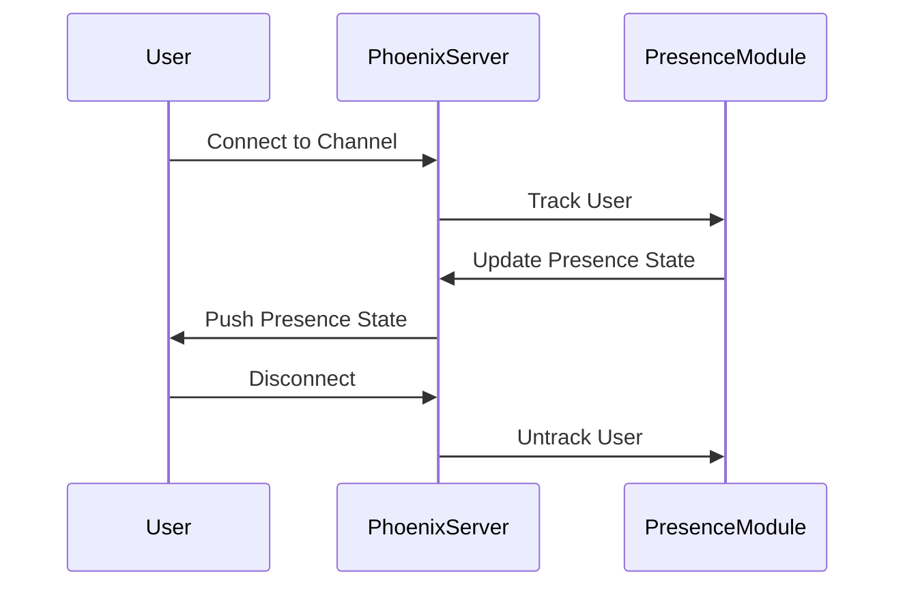

## 15.7. Presence and Trackable Users

In the realm of modern web applications, real-time user interaction is a cornerstone of engaging user experiences. Whether it's a chat application, a collaborative document editor, or an online gaming platform, knowing who is online and what they are doing is crucial. In this section, we will delve into the **Presence** module in Elixir's Phoenix Framework, which provides a robust solution for tracking user presence and activity in real-time.

### Introduction to Presence in Phoenix

The Phoenix Framework, a powerful tool for building scalable and maintainable web applications, offers a built-in **Presence** module that simplifies the task of tracking users. This module is particularly useful for applications that require real-time updates about user status, such as online indicators or active user lists.

#### Key Concepts

- **Presence Tracking**: The ability to monitor when users join or leave a channel, providing real-time updates to other users.
- **User Metadata**: Information associated with a user, such as their username, status, or any other custom data.
- **Distributed Tracking**: Ensuring that presence information is consistent across multiple nodes in a distributed system.

### Setting Up Presence in a Phoenix Application

To get started with Presence in Phoenix, you need to set up a Phoenix application with channels. Channels are the backbone of real-time communication in Phoenix, allowing you to push updates to clients over WebSockets.

#### Step 1: Create a Phoenix Project

First, create a new Phoenix project if you haven't already:

```bash
mix phx.new presence_demo
cd presence_demo
```

#### Step 2: Generate a Channel

Next, generate a channel where users will connect:

```bash
mix phx.gen.channel Room
```

This command creates a new channel module, `RoomChannel`, where we will implement our presence logic.

#### Step 3: Implement Presence in the Channel

In the `RoomChannel` module, we will use the `Phoenix.Presence` module to track users. Here's a basic implementation:

```elixir
defmodule PresenceDemoWeb.RoomChannel do
  use PresenceDemoWeb, :channel
  alias PresenceDemoWeb.Presence

  def join("room:lobby", _message, socket) do
    send(self(), :after_join)
    {:ok, socket}
  end

  def handle_info(:after_join, socket) do
    Presence.track(socket, socket.assigns.user_id, %{
      online_at: inspect(System.system_time(:seconds))
    })
    push(socket, "presence_state", Presence.list(socket))
    {:noreply, socket}
  end
end
```

- **Presence.track/3**: This function is used to track a user, associating them with a unique identifier and metadata.
- **Presence.list/1**: Retrieves the current presence information for all users in the channel.

### Visualizing Presence with Diagrams

To better understand how presence tracking works, let's visualize the flow of user presence in a Phoenix application.



**Diagram Description**: This sequence diagram illustrates the interaction between a user, the Phoenix server, and the Presence module. When a user connects, they are tracked, and their presence state is updated and pushed to other users. Upon disconnection, they are untracked.

### Advanced Features of Presence

The Presence module offers several advanced features that make it a powerful tool for real-time applications.

#### Detecting Joins and Leaves

Presence can automatically detect when users join or leave a channel, allowing you to update the UI in real-time.

```elixir
def handle_info(:after_join, socket) do
  Presence.track(socket, socket.assigns.user_id, %{
    online_at: inspect(System.system_time(:seconds))
  })
  push(socket, "presence_state", Presence.list(socket))
  {:noreply, socket}
end

def handle_out("presence_diff", diff, socket) do
  push(socket, "presence_diff", diff)
  {:noreply, socket}
end
```

- **handle_out/3**: This callback is used to handle presence diffs, which are changes in the presence state, such as users joining or leaving.

#### User Metadata

You can attach metadata to each user, which can be used to display additional information, such as their status or role.

```elixir
Presence.track(socket, socket.assigns.user_id, %{
  online_at: inspect(System.system_time(:seconds)),
  username: socket.assigns.username
})
```

### Applications of Presence

The Presence module can be used in a variety of applications to enhance user experience.

#### Online Indicators

Display online/offline status for users in a chat application or social network.

#### Active User Lists

Show a list of currently active users in a collaborative document editor or online game.

### Code Example: Building a Real-Time Chat Application

Let's build a simple real-time chat application using the Presence module to track online users.

#### Step 1: Set Up the Channel

First, set up a channel for the chat room:

```elixir
defmodule ChatAppWeb.ChatChannel do
  use ChatAppWeb, :channel
  alias ChatAppWeb.Presence

  def join("chat:lobby", _message, socket) do
    send(self(), :after_join)
    {:ok, socket}
  end

  def handle_info(:after_join, socket) do
    Presence.track(socket, socket.assigns.user_id, %{
      username: socket.assigns.username
    })
    push(socket, "presence_state", Presence.list(socket))
    {:noreply, socket}
  end

  def handle_out("presence_diff", diff, socket) do
    push(socket, "presence_diff", diff)
    {:noreply, socket}
  end
end
```

#### Step 2: Update the Client

On the client side, listen for presence updates and update the UI accordingly.

```javascript
let presence = {}

let onJoin = (id, current, newPres) => {
  if (!current) {
    console.log("User joined:", newPres.metas[0].username)
  }
}

let onLeave = (id, current, leftPres) => {
  console.log("User left:", leftPres.metas[0].username)
}

let onSync = () => {
  console.log("Presence state synced:", presence)
}

let channel = socket.channel("chat:lobby", {})
channel.join()
  .receive("ok", resp => { console.log("Joined successfully", resp) })
  .receive("error", resp => { console.log("Unable to join", resp) })

channel.on("presence_state", state => {
  presence = Presence.syncState(presence, state)
  onSync()
})

channel.on("presence_diff", diff => {
  presence = Presence.syncDiff(presence, diff)
  onJoin()
  onLeave()
})
```

### Design Considerations

When implementing presence tracking, consider the following:

- **Scalability**: Ensure your application can handle a large number of concurrent users.
- **Consistency**: In a distributed system, ensure presence information is consistent across nodes.
- **Security**: Protect user data and ensure only authorized users can access presence information.

### Elixir Unique Features

Elixir's concurrency model, based on the Actor model, makes it particularly well-suited for real-time applications. The Presence module leverages this model to efficiently track users across distributed systems.

### Differences and Similarities with Other Patterns

Presence tracking is often confused with session management. While both involve tracking users, presence focuses on real-time status updates, whereas session management deals with user authentication and authorization.

### Try It Yourself

To deepen your understanding, try modifying the code examples to:

- Add additional metadata, such as user roles or avatars.
- Implement a feature that notifies users when a specific friend comes online.
- Scale the application to handle thousands of concurrent users.

### Knowledge Check

- What is the primary purpose of the Presence module in Phoenix?
- How does the Presence module handle distributed tracking?
- What are some common applications of presence tracking?

### Summary

In this section, we've explored the powerful Presence module in Phoenix, which allows you to track user presence in real-time applications. By leveraging Elixir's concurrency model, you can build scalable and engaging user experiences. Remember, this is just the beginning. As you continue to explore Elixir and Phoenix, you'll discover even more ways to create dynamic and interactive applications. Keep experimenting, stay curious, and enjoy the journey!

## Quiz: Presence and Trackable Users



### What is the primary purpose of the Presence module in Phoenix?

- [x] To track user presence in real-time applications
- [ ] To manage user authentication and authorization
- [ ] To handle database connections
- [ ] To manage application configuration

> **Explanation:** The Presence module is designed to track user presence in real-time applications, providing updates on user status.

### How does the Presence module handle distributed tracking?

- [x] By ensuring presence information is consistent across multiple nodes
- [ ] By using a centralized database
- [ ] By relying on client-side tracking
- [ ] By using cookies

> **Explanation:** The Presence module ensures that presence information is consistent across multiple nodes in a distributed system.

### What function is used to track a user in a Phoenix channel?

- [x] Presence.track/3
- [ ] Presence.join/2
- [ ] Presence.sync/1
- [ ] Presence.update/2

> **Explanation:** Presence.track/3 is used to track a user in a Phoenix channel, associating them with a unique identifier and metadata.

### What is a common application of presence tracking?

- [x] Online indicators
- [ ] Database indexing
- [ ] File uploads
- [ ] Image processing

> **Explanation:** Presence tracking is commonly used for online indicators, showing which users are currently online.

### Which function retrieves the current presence information for all users in a channel?

- [x] Presence.list/1
- [ ] Presence.get/2
- [ ] Presence.fetch/1
- [ ] Presence.retrieve/2

> **Explanation:** Presence.list/1 retrieves the current presence information for all users in a channel.

### What callback is used to handle presence diffs in a Phoenix channel?

- [x] handle_out/3
- [ ] handle_in/2
- [ ] handle_call/3
- [ ] handle_cast/2

> **Explanation:** handle_out/3 is used to handle presence diffs, which are changes in the presence state, such as users joining or leaving.

### What is a key consideration when implementing presence tracking?

- [x] Scalability
- [ ] File storage
- [ ] Image rendering
- [ ] Audio processing

> **Explanation:** Scalability is a key consideration when implementing presence tracking to ensure the application can handle a large number of concurrent users.

### What is the difference between presence tracking and session management?

- [x] Presence tracking focuses on real-time status updates, while session management deals with authentication and authorization
- [ ] Presence tracking is for database management, while session management is for file uploads
- [ ] Presence tracking is for image processing, while session management is for video rendering
- [ ] Presence tracking is for audio processing, while session management is for text editing

> **Explanation:** Presence tracking focuses on real-time status updates, whereas session management deals with user authentication and authorization.

### What is a benefit of using Elixir's concurrency model for presence tracking?

- [x] Efficient tracking of users across distributed systems
- [ ] Faster image rendering
- [ ] Improved audio quality
- [ ] Enhanced video playback

> **Explanation:** Elixir's concurrency model, based on the Actor model, allows for efficient tracking of users across distributed systems.

### True or False: Presence tracking can be used to display active user lists in a collaborative document editor.

- [x] True
- [ ] False

> **Explanation:** Presence tracking can be used to display active user lists in applications like collaborative document editors.


