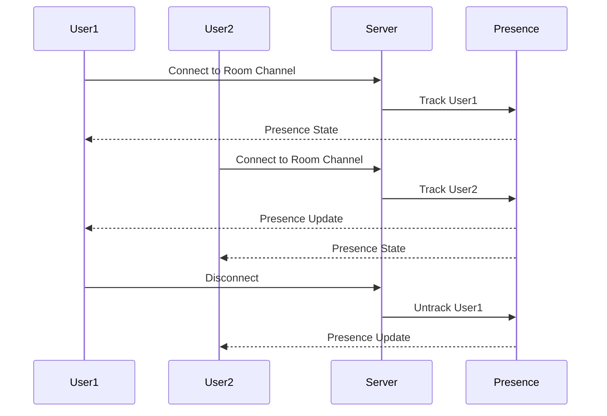

## 15.7. Presence and Trackable Users

In the world of real-time web applications, understanding and managing user presence is crucial for delivering interactive and engaging user experiences. The Phoenix Framework, a powerful web development framework for Elixir, provides a robust solution for tracking user presence through its `Phoenix.Presence` module. This module allows developers to track user presence efficiently, offering features like detecting user joins and leaves, and managing user metadata. In this section, we will delve into the intricacies of the `Phoenix.Presence` module, explore its features, and demonstrate how to build applications that leverage real-time user tracking.

### Introduction to Phoenix.Presence

The `Phoenix.Presence` module is an integral part of the Phoenix Framework, designed to handle the complexity of tracking user presence in distributed systems. Unlike traditional presence tracking mechanisms that rely on centralized databases, `Phoenix.Presence` uses a distributed approach, leveraging the capabilities of the BEAM VM to ensure scalability and fault tolerance.

#### Key Features of Phoenix.Presence

- **Real-Time Updates**: Automatically detects when users join or leave a channel, providing real-time updates to all connected clients.
- **Distributed Architecture**: Utilizes the distributed nature of Elixir and Erlang to ensure presence data is consistent across nodes.
- **User Metadata**: Allows attaching metadata to user sessions, enabling rich presence information such as user status, location, or custom attributes.
- **Conflict Resolution**: Handles conflicts gracefully, ensuring consistent presence data even in network partitions or node failures.

### Setting Up Phoenix.Presence

To start using `Phoenix.Presence`, you need to include it in your Phoenix application. Let's walk through the setup process:

1. **Add Dependencies**: Ensure your `mix.exs` file includes the necessary dependencies for Phoenix and Phoenix.Presence.

```elixir
defp deps do
  [
    {:phoenix, "~> 1.6"},
    {:phoenix_pubsub, "~> 2.0"},
    {:phoenix_html, "~> 3.0"},
    {:phoenix_live_reload, "~> 1.3", only: :dev},
    {:phoenix_live_view, "~> 0.16.0"},
    {:phoenix_ecto, "~> 4.0"},
    {:ecto_sql, "~> 3.0"},
    {:postgrex, ">= 0.0.0"},
    {:phoenix_live_dashboard, "~> 0.4"},
    {:telemetry_metrics, "~> 0.6"},
    {:telemetry_poller, "~> 0.5"},
    {:gettext, "~> 0.18"},
    {:jason, "~> 1.0"},
    {:plug_cowboy, "~> 2.0"}
  ]
end
```

2. **Configure Your Endpoint**: In your `endpoint.ex` file, ensure that the PubSub server is started.

```elixir
# lib/my_app_web/endpoint.ex
defmodule MyAppWeb.Endpoint do
  use Phoenix.Endpoint, otp_app: :my_app

  # Start the PubSub system
  pubsub_server: MyApp.PubSub
end
```

3. **Define a Presence Module**: Create a module that uses `Phoenix.Presence` to track user presence.

```elixir
# lib/my_app_web/presence.ex
defmodule MyAppWeb.Presence do
  use Phoenix.Presence,
    otp_app: :my_app,
    pubsub_server: MyApp.PubSub
end
```

4. **Integrate with Channels**: Use the presence module within your Phoenix channels to track user presence.

```elixir
# lib/my_app_web/channels/user_socket.ex
defmodule MyAppWeb.UserSocket do
  use Phoenix.Socket

  channel "room:*", MyAppWeb.RoomChannel
end

# lib/my_app_web/channels/room_channel.ex
defmodule MyAppWeb.RoomChannel do
  use MyAppWeb, :channel
  alias MyAppWeb.Presence

  def join("room:" <> _room_id, _params, socket) do
    send(self(), :after_join)
    {:ok, socket}
  end

  def handle_info(:after_join, socket) do
    Presence.track(socket, socket.assigns.user_id, %{
      online_at: inspect(System.system_time(:second))
    })
    push(socket, "presence_state", Presence.list(socket))
    {:noreply, socket}
  end
end
```

### Visualizing Presence Tracking

To better understand how `Phoenix.Presence` works, let's visualize the process using a sequence diagram.


```mermaid
sequenceDiagram
    participant User1
    participant User2
    participant Server
    participant Presence

    User1->>Server: Connect to Room Channel
    Server->>Presence: Track User1
    Presence-->>User1: Presence State
    User2->>Server: Connect to Room Channel
    Server->>Presence: Track User2
    Presence-->>User1: Presence Update
    Presence-->>User2: Presence State
    User1->>Server: Disconnect
    Server->>Presence: Untrack User1
    Presence-->>User2: Presence Update
```

### Advanced Features of Phoenix.Presence

#### Metadata Management

One of the powerful features of `Phoenix.Presence` is the ability to attach metadata to each user's session. This metadata can include user-specific information such as their status, location, or any other custom attributes. This feature is particularly useful for applications that require rich user presence information.

```elixir
def handle_info(:after_join, socket) do
  Presence.track(socket, socket.assigns.user_id, %{
    online_at: inspect(System.system_time(:second)),
    status: "online",
    location: "USA"
  })
  push(socket, "presence_state", Presence.list(socket))
  {:noreply, socket}
end
```

#### Handling Conflicts and Network Partitions

In distributed systems, network partitions and node failures are inevitable. `Phoenix.Presence` is designed to handle these scenarios gracefully. It uses a CRDT (Conflict-free Replicated Data Type) to ensure that presence data remains consistent across nodes, even in the face of network issues.

### Applications of User Presence Tracking

The ability to track user presence in real-time opens up a wide range of possibilities for building interactive applications. Here are some common use cases:

- **Online Indicators**: Display real-time online/offline status for users in chat applications or social networks.
- **Active User Lists**: Show a list of currently active users in a particular room or channel.
- **Collaborative Editing**: Track users editing a document in real-time, highlighting their presence and changes.
- **Gaming**: Monitor player presence in multiplayer games, allowing for real-time interactions and matchmaking.

### Try It Yourself

Experiment with the `Phoenix.Presence` module by modifying the code examples provided. Here are a few suggestions:

- Add additional metadata to track user activity, such as the page they are currently viewing or their role in a chat room.
- Implement a feature to notify users when someone joins or leaves a channel.
- Create a dashboard to visualize presence data in real-time.

### Knowledge Check

- How does `Phoenix.Presence` ensure consistency across distributed nodes?
- What are some common applications of user presence tracking?
- How can you attach metadata to a user's presence?

### Summary

In this section, we've explored the `Phoenix.Presence` module and its capabilities for tracking user presence in real-time applications. By leveraging Elixir's distributed nature, `Phoenix.Presence` provides a scalable and fault-tolerant solution for managing user presence data. Whether you're building a chat application, collaborative tool, or multiplayer game, understanding and utilizing `Phoenix.Presence` can significantly enhance your application's interactivity and user experience.

## Quiz Time!



### What is the primary purpose of the Phoenix.Presence module?

- [x] To track user presence in real-time
- [ ] To manage database connections
- [ ] To handle HTTP requests
- [ ] To render templates

> **Explanation:** The Phoenix.Presence module is specifically designed to track user presence in real-time applications.

### How does Phoenix.Presence handle network partitions?

- [x] By using CRDTs to ensure consistency
- [ ] By storing data in a centralized database
- [ ] By ignoring network partitions
- [ ] By disconnecting users

> **Explanation:** Phoenix.Presence uses Conflict-free Replicated Data Types (CRDTs) to maintain consistent presence data across distributed nodes, even during network partitions.

### Which of the following is a feature of Phoenix.Presence?

- [x] Real-time updates
- [ ] Static content rendering
- [ ] Session management
- [ ] File storage

> **Explanation:** Phoenix.Presence provides real-time updates by detecting when users join or leave a channel.

### What kind of metadata can be attached to a user's presence in Phoenix.Presence?

- [x] User status, location, and custom attributes
- [ ] Database connection strings
- [ ] HTML templates
- [ ] CSS stylesheets

> **Explanation:** Phoenix.Presence allows developers to attach metadata such as user status, location, and custom attributes to enhance presence information.

### In which scenarios is user presence tracking particularly useful?

- [x] Online indicators and active user lists
- [ ] Static website hosting
- [ ] File uploads
- [ ] Data encryption

> **Explanation:** User presence tracking is useful for applications that require real-time online indicators and active user lists, such as chat applications.

### What does the Presence.track function do?

- [x] Tracks a user's presence in a channel
- [ ] Disconnects a user from a channel
- [ ] Sends HTTP requests
- [ ] Renders templates

> **Explanation:** The Presence.track function is used to track a user's presence in a channel, allowing for real-time updates.

### What is the role of the PubSub server in Phoenix.Presence?

- [x] To facilitate communication between nodes
- [ ] To store user passwords
- [ ] To compile Elixir code
- [ ] To manage database migrations

> **Explanation:** The PubSub server facilitates communication between nodes, ensuring that presence data is distributed and consistent.

### How can developers visualize presence data in real-time applications?

- [x] By creating dashboards and using sequence diagrams
- [ ] By writing static HTML pages
- [ ] By using CSS animations
- [ ] By compiling JavaScript files

> **Explanation:** Developers can visualize presence data by creating dashboards and using sequence diagrams to represent real-time interactions.

### What is a common use case for Phoenix.Presence in gaming applications?

- [x] Monitoring player presence and matchmaking
- [ ] Rendering 3D graphics
- [ ] Storing game assets
- [ ] Compiling shaders

> **Explanation:** In gaming applications, Phoenix.Presence is commonly used to monitor player presence and facilitate matchmaking in real-time.

### True or False: Phoenix.Presence is only suitable for small-scale applications.

- [ ] True
- [x] False

> **Explanation:** False. Phoenix.Presence is designed for scalability and can handle large-scale applications due to its distributed architecture and use of CRDTs.



Remember, mastering the `Phoenix.Presence` module is just one step in building robust real-time applications. Keep experimenting, stay curious, and enjoy the journey of creating interactive and engaging user experiences with Elixir and the Phoenix Framework!
