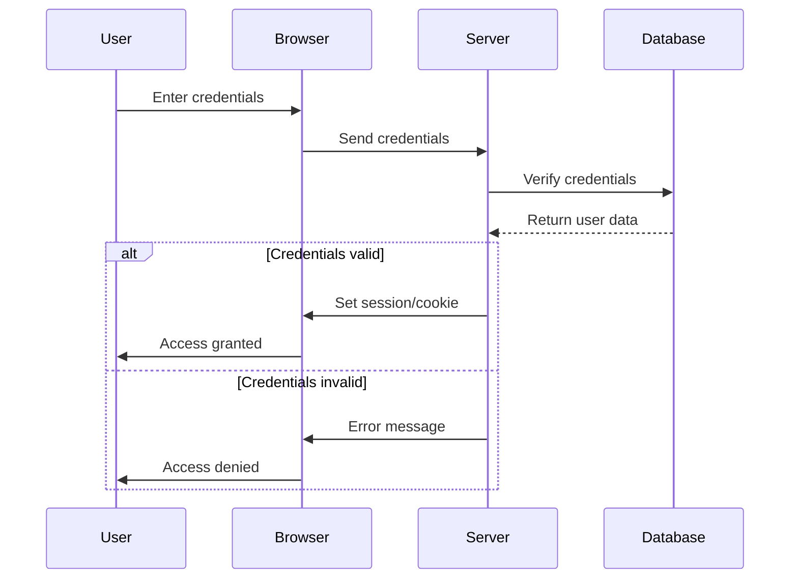

## 15.8. Authentication Strategies

In the world of web development, ensuring secure access control is paramount. As we delve into authentication strategies in Elixir, particularly within the Phoenix Framework, we will explore various methods and best practices to secure your applications. This section will cover plug-based authentication, popular libraries like Pow and Guardian, and essential best practices for handling passwords and sessions securely.

### Plug-Based Authentication

Plug is a specification for composable modules in Elixir, and it plays a crucial role in the Phoenix Framework. It allows developers to build middleware for handling requests and responses, making it an excellent tool for implementing authentication.

#### Utilizing Plugs for Session Management and Access Control

Plugs can be used to manage sessions and control access to different parts of your application. Here's how you can implement a simple plug-based authentication system:

1. **Create a Plug for Authentication**

   First, create a plug that checks if a user is authenticated:

   ```elixir
   defmodule MyAppWeb.Plugs.AuthenticateUser do
     import Plug.Conn

     def init(default), do: default

     def call(conn, _opts) do
       if get_session(conn, :user_id) do
         conn
       else
         conn
         |> put_flash(:error, "You must be logged in to access this page.")
         |> redirect(to: "/login")
         |> halt()
       end
     end
   end
   ```

   In this plug, we check if a `user_id` is present in the session. If not, the user is redirected to the login page.

2. **Add the Plug to Your Router**

   Next, add the plug to your router to protect specific routes:

   ```elixir
   defmodule MyAppWeb.Router do
     use MyAppWeb, :router

     pipeline :browser do
       plug :accepts, ["html"]
       plug :fetch_session
       plug :fetch_flash
       plug :protect_from_forgery
       plug :put_secure_browser_headers
     end

     pipeline :authenticated do
       plug MyAppWeb.Plugs.AuthenticateUser
     end

     scope "/", MyAppWeb do
       pipe_through [:browser, :authenticated]

       get "/dashboard", DashboardController, :index
     end
   end
   ```

   Here, the `:authenticated` pipeline is used to ensure that only authenticated users can access the `/dashboard` route.

3. **Handling User Sessions**

   To manage user sessions, you can use the session plug to store and retrieve user data:

   ```elixir
   defmodule MyAppWeb.SessionController do
     use MyAppWeb, :controller

     def create(conn, %{"user" => user_params}) do
       case MyApp.Accounts.authenticate_user(user_params) do
         {:ok, user} ->
           conn
           |> put_session(:user_id, user.id)
           |> put_flash(:info, "Welcome back!")
           |> redirect(to: "/dashboard")

         :error ->
           conn
           |> put_flash(:error, "Invalid credentials.")
           |> render("new.html")
       end
     end

     def delete(conn, _params) do
       conn
       |> configure_session(drop: true)
       |> put_flash(:info, "Logged out successfully.")
       |> redirect(to: "/")
     end
   end
   ```

   In this example, the `create` action authenticates the user and stores their `user_id` in the session. The `delete` action clears the session, effectively logging the user out.

### Libraries for Authentication

While plug-based authentication provides a solid foundation, using libraries can simplify the process and offer additional features. Two popular libraries in the Elixir ecosystem are Pow and Guardian.

#### Using Pow for Authentication

Pow is a robust authentication library for Phoenix applications. It provides features like user registration, password reset, and email confirmation out of the box.

1. **Installation and Setup**

   Add Pow to your `mix.exs` dependencies:

   ```elixir
   defp deps do
     [
       {:phoenix, "~> 1.5.9"},
       {:pow, "~> 1.0.24"}
     ]
   end
   ```

   Run `mix deps.get` to install the dependencies.

2. **Configure Pow**

   Configure Pow in your endpoint:

   ```elixir
   defmodule MyAppWeb.Endpoint do
     use Phoenix.Endpoint, otp_app: :my_app

     plug Plug.Session,
       store: :cookie,
       key: "_my_app_key",
       signing_salt: "random_salt"

     plug Pow.Plug.Session, otp_app: :my_app
   end
   ```

3. **Generate Pow Modules**

   Use the Pow mix task to generate necessary modules:

   ```bash
   mix pow.install
   ```

   This command will create user schemas, migrations, and context modules.

4. **Integrate Pow with Your Application**

   Update your router to use Pow's routes:

   ```elixir
   defmodule MyAppWeb.Router do
     use MyAppWeb, :router
     use Pow.Phoenix.Router

     pipeline :browser do
       plug :accepts, ["html"]
       plug :fetch_session
       plug :fetch_flash
       plug :protect_from_forgery
       plug :put_secure_browser_headers
     end

     scope "/", MyAppWeb do
       pipe_through :browser

       pow_routes()
     end
   end
   ```

   Pow provides a set of routes for user registration, login, and password management.

5. **Customizing Pow**

   Pow is highly customizable. You can override default templates and controllers to fit your application's needs. For example, to customize the registration form, create a new template in `lib/my_app_web/templates/pow/registration/new.html.eex`.

#### Using Guardian for Token-Based Authentication

Guardian is another powerful library that provides JWT (JSON Web Token) authentication for Elixir applications. It's ideal for APIs and applications that require stateless authentication.

1. **Installation and Setup**

   Add Guardian to your `mix.exs` dependencies:

   ```elixir
   defp deps do
     [
       {:phoenix, "~> 1.5.9"},
       {:guardian, "~> 2.0"}
     ]
   end
   ```

   Run `mix deps.get` to install the dependencies.

2. **Configure Guardian**

   Create a Guardian module to configure your authentication logic:

   ```elixir
   defmodule MyApp.Guardian do
     use Guardian, otp_app: :my_app

     def subject_for_token(user, _claims) do
       {:ok, to_string(user.id)}
     end

     def resource_from_claims(claims) do
       id = claims["sub"]
       user = MyApp.Accounts.get_user!(id)
       {:ok, user}
     end
   end
   ```

   Update your configuration in `config/config.exs`:

   ```elixir
   config :my_app, MyApp.Guardian,
     issuer: "my_app",
     secret_key: "your_secret_key"
   ```

3. **Implement Authentication Logic**

   Use Guardian to authenticate users and issue tokens:

   ```elixir
   defmodule MyAppWeb.SessionController do
     use MyAppWeb, :controller

     alias MyApp.Guardian

     def create(conn, %{"user" => user_params}) do
       case MyApp.Accounts.authenticate_user(user_params) do
         {:ok, user} ->
           {:ok, token, _claims} = Guardian.encode_and_sign(user)
           json(conn, %{token: token})

         :error ->
           conn
           |> put_status(:unauthorized)
           |> json(%{error: "Invalid credentials"})
       end
     end
   end
   ```

   In this example, the `create` action authenticates the user and issues a JWT token.

4. **Protecting Routes with Guardian**

   Use Guardian plugs to protect your routes:

   ```elixir
   defmodule MyAppWeb.Router do
     use MyAppWeb, :router

     pipeline :api do
       plug :accepts, ["json"]
       plug MyAppWeb.Plugs.AuthenticateUser
     end

     scope "/api", MyAppWeb do
       pipe_through :api

       get "/protected", ProtectedController, :index
     end
   end
   ```

   Create a plug to verify the token:

   ```elixir
   defmodule MyAppWeb.Plugs.AuthenticateUser do
     import Plug.Conn
     alias MyApp.Guardian

     def init(opts), do: opts

     def call(conn, _opts) do
       case Guardian.Plug.current_resource(conn) do
         nil ->
           conn
           |> put_status(:unauthorized)
           |> json(%{error: "Unauthorized"})
           |> halt()

         _user ->
           conn
       end
     end
   end
   ```

### Best Practices for Authentication

Implementing authentication is not just about writing code; it's about ensuring security and a seamless user experience. Here are some best practices to follow:

#### Secure Password Handling

- **Use Strong Hashing Algorithms**: Always hash passwords using strong algorithms like bcrypt. Elixir provides the `Comeonin` library for this purpose.
  
  ```elixir
  defmodule MyApp.Accounts do
    alias Comeonin.Bcrypt

    def hash_password(password) do
      Bcrypt.hashpwsalt(password)
    end

    def verify_password(password, hash) do
      Bcrypt.checkpw(password, hash)
    end
  end
  ```

- **Salt Passwords**: Salting adds an extra layer of security by ensuring that even if two users have the same password, their hashes will be different.

- **Enforce Strong Password Policies**: Require users to create strong passwords with a mix of characters, numbers, and symbols.

#### Session Management

- **Session Expiration**: Implement session expiration to reduce the risk of session hijacking. You can set a timeout for sessions and require re-authentication after a certain period.

- **Secure Cookies**: Use secure cookies to store session data. Ensure cookies are marked as `HttpOnly` and `Secure` to prevent client-side access and ensure they are only sent over HTTPS.

#### Token Management

- **Short-Lived Tokens**: Use short-lived tokens to minimize the impact of token theft. Implement refresh tokens for long-term access.

- **Token Revocation**: Provide a mechanism to revoke tokens when necessary, such as when a user logs out or changes their password.

- **Use HTTPS**: Always use HTTPS to encrypt data in transit, including tokens and session cookies.

### Visualizing Authentication Flow

To better understand the authentication process, let's visualize a typical authentication flow using a sequence diagram.



This diagram illustrates the interaction between the user, browser, server, and database during the authentication process.

### Try It Yourself

Now that we've covered the basics of authentication in Elixir, it's time to experiment. Try modifying the code examples to:

- Implement a password reset feature using Pow.
- Add email confirmation for new user registrations.
- Use Guardian to implement role-based access control.

### References and Links

For further reading and resources, consider exploring the following:

- [Phoenix Framework Documentation](https://hexdocs.pm/phoenix/)
- [Pow GitHub Repository](https://github.com/danschultzer/pow)
- [Guardian GitHub Repository](https://github.com/ueberauth/guardian)
- [Comeonin and Bcrypt Documentation](https://hexdocs.pm/comeonin/)

### Knowledge Check

Before we wrap up, let's reinforce what we've learned with a few questions:

1. What is the role of plugs in authentication within the Phoenix Framework?
2. How does Pow simplify user authentication in Phoenix applications?
3. What are the benefits of using JWTs with Guardian for authentication?
4. Why is it important to hash and salt passwords?
5. How can session expiration enhance security?

### Embrace the Journey

Remember, mastering authentication is a journey. As you continue to build and secure your applications, keep experimenting with different strategies and stay updated with the latest security practices. Enjoy the process, and don't hesitate to explore new tools and libraries that can enhance your authentication systems.

## Quiz: Authentication Strategies



### What is the primary role of plugs in the Phoenix Framework?

- [x] To manage request and response lifecycle, including authentication
- [ ] To handle database queries
- [ ] To render HTML templates
- [ ] To manage CSS and JavaScript files

> **Explanation:** Plugs are used to manage the request and response lifecycle, making them ideal for implementing authentication and other middleware functionalities.

### Which library provides out-of-the-box features like user registration and password reset?

- [x] Pow
- [ ] Guardian
- [ ] Comeonin
- [ ] Plug

> **Explanation:** Pow is a library that provides features like user registration, password reset, and email confirmation out of the box.

### What type of authentication does Guardian primarily support?

- [x] Token-based authentication using JWTs
- [ ] Session-based authentication
- [ ] OAuth2 authentication
- [ ] Basic authentication

> **Explanation:** Guardian supports token-based authentication using JSON Web Tokens (JWTs), making it suitable for stateless authentication.

### Why is it important to hash passwords?

- [x] To prevent storing plain text passwords and enhance security
- [ ] To make passwords easier to remember
- [ ] To increase the speed of authentication
- [ ] To reduce database storage requirements

> **Explanation:** Hashing passwords prevents storing them in plain text, enhancing security by making it difficult for attackers to retrieve the original password.

### What is a benefit of using short-lived tokens?

- [x] They minimize the impact of token theft
- [ ] They are easier to generate
- [ ] They require less storage
- [ ] They are more secure than long-lived tokens

> **Explanation:** Short-lived tokens minimize the impact of token theft by reducing the time window in which a stolen token can be used.

### How can session expiration improve security?

- [x] By reducing the risk of session hijacking
- [ ] By making sessions last longer
- [ ] By simplifying session management
- [ ] By increasing server load

> **Explanation:** Session expiration reduces the risk of session hijacking by limiting the time a session is valid, requiring re-authentication after a certain period.

### What is a key feature of secure cookies?

- [x] They are marked as HttpOnly and Secure
- [ ] They are stored in the database
- [ ] They are encrypted with a public key
- [ ] They are accessible via JavaScript

> **Explanation:** Secure cookies are marked as HttpOnly and Secure to prevent client-side access and ensure they are only sent over HTTPS.

### Which library is used for password hashing in Elixir?

- [x] Comeonin
- [ ] Pow
- [ ] Guardian
- [ ] Plug

> **Explanation:** Comeonin is a library used for password hashing in Elixir, providing strong algorithms like bcrypt.

### What is the purpose of salting passwords?

- [x] To ensure that even identical passwords have different hashes
- [ ] To make passwords taste better
- [ ] To increase password length
- [ ] To simplify password management

> **Explanation:** Salting ensures that even if two users have the same password, their hashes will be different, adding an extra layer of security.

### True or False: HTTPS is optional for secure authentication.

- [ ] True
- [x] False

> **Explanation:** HTTPS is essential for secure authentication as it encrypts data in transit, including tokens and session cookies, preventing interception by attackers.


