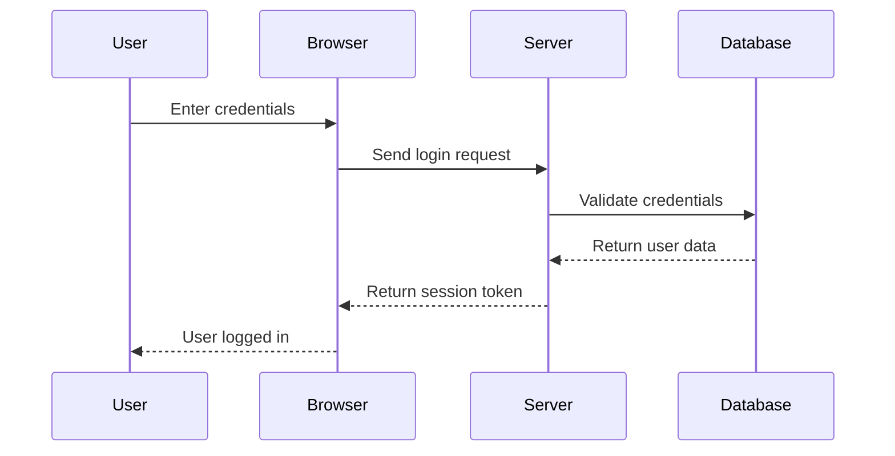

## 15.8. Authentication Strategies

Authentication is a critical aspect of web development, ensuring that users can securely access resources and services. In the Elixir ecosystem, the Phoenix Framework provides a robust foundation for implementing authentication strategies. This section will explore various authentication techniques, focusing on plug-based authentication, popular libraries like Pow and Guardian, and best practices for secure password handling and session management.

### Plug-Based Authentication

Plug is a specification for composable modules in Elixir, and it is a core component of the Phoenix Framework. It allows developers to create reusable components for handling HTTP requests. Let's delve into how we can use Plug for authentication.

#### Utilizing Plugs for Session Management and Access Control

Plugs can be used to manage sessions and control access to different parts of a web application. Here's a basic example of how to create a plug for authentication:

```elixir
defmodule MyAppWeb.Plugs.RequireAuth do
  import Plug.Conn
  import Phoenix.Controller

  def init(default), do: default

  def call(conn, _opts) do
    if conn.assigns[:current_user] do
      conn
    else
      conn
      |> put_flash(:error, "You must be logged in to access this page.")
      |> redirect(to: Routes.page_path(conn, :index))
      |> halt()
    end
  end
end
```

In this example, the `RequireAuth` plug checks if a `:current_user` is assigned to the connection. If not, it redirects the user to the index page with an error message. This plug can be added to any controller or pipeline where authentication is required.

#### Embedding Plugs in Phoenix Pipelines

Phoenix pipelines allow you to define a series of plugs that should be executed for specific routes. You can embed authentication plugs into these pipelines to ensure that certain routes are protected:

```elixir
pipeline :authenticated do
  plug MyAppWeb.Plugs.RequireAuth
end

scope "/", MyAppWeb do
  pipe_through [:browser, :authenticated]

  get "/dashboard", DashboardController, :index
end
```

In this setup, any route within the `authenticated` pipeline will require the user to be logged in.

### Libraries for Authentication

While building custom authentication systems with plugs is powerful, libraries like `Pow` and `Guardian` can simplify the process and provide additional features.

#### Using `Pow` for Authentication

`Pow` is a robust authentication library for Elixir applications. It offers features such as user registration, password reset, and email confirmation. Here's how you can set up `Pow` in a Phoenix application:

1. **Add Pow to Your Dependencies**

   Add `pow` to your `mix.exs` file:

   ```elixir
   defp deps do
     [
       {:phoenix, "~> 1.5.9"},
       {:pow, "~> 1.0.26"}
     ]
   end
   ```

2. **Configure Pow in Your Endpoint**

   Update your endpoint configuration to include Pow:

   ```elixir
   plug Pow.Plug.Session, otp_app: :my_app
   ```

3. **Generate Pow Files**

   Run the Pow installer to generate necessary files:

   ```bash
   mix pow.install
   ```

4. **Integrate Pow into Your Application**

   Update your router to use Pow's routes:

   ```elixir
   scope "/" do
     pipe_through :browser

     pow_routes()
   end
   ```

5. **Customize Pow**

   Pow is highly customizable. You can override templates and controllers to fit your application's needs.

#### Using `Guardian` for Token-Based Authentication

`Guardian` is another popular library that provides token-based authentication. It's particularly useful for APIs where session-based authentication is not feasible. Here's a basic setup for `Guardian`:

1. **Add Guardian to Your Dependencies**

   Add `guardian` to your `mix.exs` file:

   ```elixir
   defp deps do
     [
       {:guardian, "~> 2.0"}
     ]
   end
   ```

2. **Configure Guardian**

   Create a Guardian module to define your token claims and secret key:

   ```elixir
   defmodule MyApp.Guardian do
     use Guardian, otp_app: :my_app

     def subject_for_token(user, _claims) do
       {:ok, to_string(user.id)}
     end

     def resource_from_claims(claims) do
       id = claims["sub"]
       user = MyApp.Accounts.get_user!(id)
       {:ok, user}
     end
   end
   ```

3. **Implement Authentication Logic**

   Use Guardian's functions to authenticate users and generate tokens:

   ```elixir
   def authenticate_user(email, password) do
     with {:ok, user} <- MyApp.Accounts.authenticate(email, password),
          {:ok, token, _claims} <- MyApp.Guardian.encode_and_sign(user) do
       {:ok, user, token}
     else
       _ -> {:error, "Invalid credentials"}
     end
   end
   ```

4. **Protect Routes with Guardian**

   Create a plug to ensure that routes are protected by Guardian:

   ```elixir
   defmodule MyAppWeb.Plugs.AuthPipeline do
     use Guardian.Plug.Pipeline, otp_app: :my_app,
       module: MyApp.Guardian,
       error_handler: MyAppWeb.AuthErrorHandler

     plug Guardian.Plug.VerifyHeader, realm: "Bearer"
     plug Guardian.Plug.LoadResource
   end
   ```

### Best Practices for Secure Authentication

Implementing secure authentication requires careful consideration of various aspects, including password handling, session management, and data protection.

#### Secure Password Handling

- **Use Strong Hashing Algorithms**: Always hash passwords using a strong algorithm like Argon2 or Bcrypt. Avoid storing passwords in plain text.
- **Salt Passwords**: Add a unique salt to each password before hashing to protect against rainbow table attacks.
- **Implement Password Policies**: Enforce strong password policies, including minimum length and complexity requirements.

#### Session Management

- **Session Expiration**: Implement session expiration to reduce the risk of session hijacking. Consider using sliding expiration to extend sessions based on activity.
- **Secure Cookies**: Use secure cookies to store session tokens, and ensure they are marked as `HttpOnly` and `Secure` to prevent access from JavaScript and ensure they are only sent over HTTPS.

#### Protecting Against Common Vulnerabilities

- **Cross-Site Request Forgery (CSRF)**: Use CSRF tokens to protect against CSRF attacks. Phoenix includes built-in support for CSRF protection.
- **Cross-Site Scripting (XSS)**: Sanitize user inputs and output to prevent XSS attacks. Use libraries like `Phoenix.HTML` to escape HTML content.
- **Rate Limiting**: Implement rate limiting to protect against brute force attacks. Consider using libraries like `Hammer` for rate limiting.

### Visualizing Authentication Flow

To better understand the authentication process, let's visualize a typical authentication flow using a sequence diagram:


```mermaid
sequenceDiagram
    participant User
    participant Browser
    participant Server
    participant Database

    User->>Browser: Enter credentials
    Browser->>Server: Send login request
    Server->>Database: Validate credentials
    Database-->>Server: Return user data
    Server-->>Browser: Return session token
    Browser-->>User: User logged in
```

This diagram illustrates the flow of a typical login process, where the user enters their credentials, the server validates them against the database, and a session token is returned upon successful authentication.

### Try It Yourself

To deepen your understanding of authentication in Phoenix, try modifying the code examples provided:

- **Add a new plug**: Create a plug that logs each authentication attempt and stores it in the database.
- **Customize Pow**: Modify Pow's default templates to include additional fields during user registration.
- **Implement a new Guardian strategy**: Create a custom strategy for Guardian that uses a different token format.

### Knowledge Check

Before we wrap up, let's test your understanding of authentication strategies in Elixir:

- **What is the purpose of using a plug in Phoenix applications?**
- **How does Pow simplify authentication in Elixir applications?**
- **What are the key differences between session-based and token-based authentication?**

### Summary

In this section, we explored various authentication strategies in Elixir using the Phoenix Framework. We covered plug-based authentication, popular libraries like Pow and Guardian, and best practices for secure password handling and session management. By leveraging these tools and techniques, you can build secure and robust authentication systems in your Elixir applications.

Remember, this is just the beginning. As you progress, you'll discover more advanced techniques and patterns to enhance your authentication systems. Keep experimenting, stay curious, and enjoy the journey!

## Quiz Time!



### What is the primary purpose of using Plugs in Phoenix?

- [x] To manage HTTP requests and responses
- [ ] To handle database interactions
- [ ] To generate HTML templates
- [ ] To compile Elixir code

> **Explanation:** Plugs are used in Phoenix to manage HTTP requests and responses, allowing for middleware-like functionality.

### Which library is commonly used for token-based authentication in Elixir?

- [ ] Pow
- [x] Guardian
- [ ] Plug
- [ ] Ecto

> **Explanation:** Guardian is a library specifically designed for token-based authentication in Elixir applications.

### What is the main advantage of using Pow for authentication?

- [x] It provides a comprehensive set of features for user authentication.
- [ ] It is the only library that supports token-based authentication.
- [ ] It is built into the Phoenix Framework.
- [ ] It replaces the need for Plugs.

> **Explanation:** Pow offers a comprehensive set of features for user authentication, including registration, password reset, and email confirmation.

### How can you protect against CSRF attacks in Phoenix?

- [x] Use CSRF tokens
- [ ] Use HTTPS
- [ ] Use strong passwords
- [ ] Use secure cookies

> **Explanation:** CSRF tokens are used to protect against Cross-Site Request Forgery attacks by ensuring that requests are legitimate.

### What is a best practice for handling passwords in Elixir applications?

- [x] Hash passwords with a strong algorithm like Argon2 or Bcrypt.
- [ ] Store passwords in plain text for easy access.
- [ ] Use weak hashing algorithms for faster performance.
- [ ] Avoid salting passwords to simplify storage.

> **Explanation:** Hashing passwords with strong algorithms like Argon2 or Bcrypt is a best practice for secure password handling.

### What is a key difference between session-based and token-based authentication?

- [x] Session-based authentication stores session data on the server, while token-based stores it on the client.
- [ ] Token-based authentication is more secure than session-based.
- [ ] Session-based authentication does not require cookies.
- [ ] Token-based authentication is only used for mobile applications.

> **Explanation:** Session-based authentication stores session data on the server, while token-based authentication stores tokens on the client.

### How can you implement rate limiting in Elixir applications?

- [x] Use libraries like Hammer
- [ ] Use Pow
- [ ] Use Guardian
- [ ] Use Plug

> **Explanation:** Libraries like Hammer can be used to implement rate limiting in Elixir applications to prevent brute force attacks.

### What is the role of the `RequireAuth` plug in the example?

- [x] To ensure users are authenticated before accessing certain routes
- [ ] To log all HTTP requests
- [ ] To manage user sessions
- [ ] To generate HTML templates

> **Explanation:** The `RequireAuth` plug ensures that users are authenticated before accessing certain routes by checking if a `:current_user` is assigned.

### Which of the following is a security best practice for session management?

- [x] Use secure cookies
- [ ] Store session data in local storage
- [ ] Disable session expiration
- [ ] Use plain text for session tokens

> **Explanation:** Using secure cookies is a best practice for session management, ensuring that session tokens are protected.

### True or False: Guardian can be used for both session-based and token-based authentication.

- [ ] True
- [x] False

> **Explanation:** Guardian is specifically designed for token-based authentication, not session-based.


