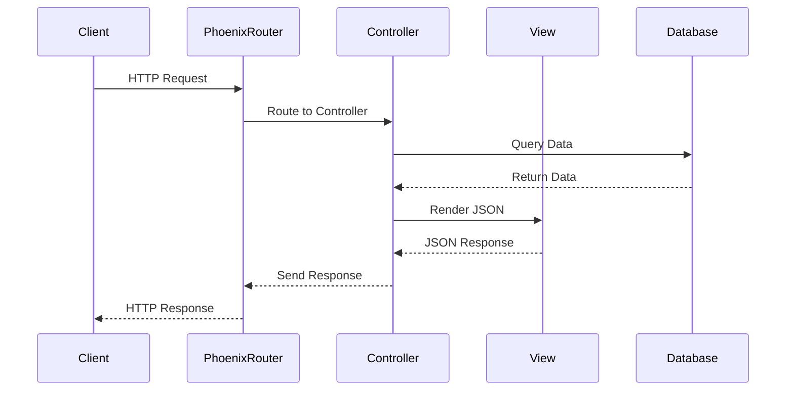

## 15.9. Building APIs with Phoenix

Building APIs with the Phoenix Framework in Elixir is a powerful way to create scalable, maintainable, and efficient web services. In this section, we will explore the key aspects of API development using Phoenix, including configuring API mode, managing versioning, and implementing security measures. By the end of this guide, you will have a comprehensive understanding of how to leverage Phoenix to build robust APIs.

### API Mode

Phoenix provides a streamlined way to create APIs by allowing developers to configure the framework in API mode. This mode is optimized for applications that do not require HTML views, focusing solely on JSON responses.

#### Configuring Phoenix for API-Only Applications

To set up a Phoenix project for API-only development, you can use the `--no-html` and `--no-webpack` flags when generating a new project. This configuration excludes HTML and JavaScript assets, resulting in a leaner application structure.

```bash
mix phx.new my_api --no-html --no-webpack
```

This command creates a new Phoenix project named `my_api` without HTML views or JavaScript assets. The resulting project structure is optimized for API development, focusing on controllers, views, and JSON responses.

#### Setting Up JSON Responses

In an API-only application, JSON is the primary format for data exchange. Phoenix makes it easy to render JSON responses using views and serializers. Here's an example of a simple controller action that returns a JSON response:

```elixir
defmodule MyApiWeb.UserController do
  use MyApiWeb, :controller

  alias MyApi.Accounts
  alias MyApiWeb.UserView

  def show(conn, %{"id" => id}) do
    user = Accounts.get_user!(id)
    render(conn, UserView, "show.json", user: user)
  end
end
```

In the `UserView`, you can define how the user data is serialized to JSON:

```elixir
defmodule MyApiWeb.UserView do
  use MyApiWeb, :view

  def render("show.json", %{user: user}) do
    %{
      id: user.id,
      name: user.name,
      email: user.email
    }
  end
end
```

### Versioning

API versioning is crucial for maintaining backward compatibility as your API evolves. Phoenix provides several strategies for managing API versions, including URL path versioning, request header versioning, and media type versioning.

#### URL Path Versioning

One of the simplest ways to version an API is by including the version number in the URL path. This approach is straightforward and easy to implement.

```elixir
scope "/api/v1", MyApiWeb do
  pipe_through :api

  resources "/users", UserController, only: [:index, :show, :create, :update, :delete]
end
```

In this example, the API version is specified in the URL path (`/api/v1`). This approach makes it clear to clients which version of the API they are interacting with.

#### Request Header Versioning

Another approach is to use custom request headers to specify the API version. This method keeps URLs clean and allows for more flexible versioning strategies.

```elixir
defmodule MyApiWeb.Plugs.ApiVersion do
  import Plug.Conn

  def init(default), do: default

  def call(conn, _default) do
    version = get_req_header(conn, "accept-version") |> List.first() || "v1"
    assign(conn, :api_version, version)
  end
end
```

You can then use the assigned version in your controllers to handle different versions of the API.

#### Media Type Versioning

Media type versioning involves specifying the API version in the `Content-Type` or `Accept` headers. This approach is more complex but offers greater flexibility.

```elixir
defmodule MyApiWeb.Plugs.ContentTypeVersion do
  import Plug.Conn

  def init(default), do: default

  def call(conn, _default) do
    content_type = get_req_header(conn, "content-type") |> List.first() || "application/vnd.myapi.v1+json"
    assign(conn, :content_type_version, content_type)
  end
end
```

### Security

Security is a critical aspect of API development. Phoenix provides several tools and best practices to secure your APIs, including authentication, rate limiting, and input validation.

#### Authentication

Implementing authentication ensures that only authorized users can access your API. Phoenix supports various authentication strategies, including token-based authentication and OAuth.

##### Token-Based Authentication

Token-based authentication is a popular choice for APIs. You can use libraries like `Guardian` to implement JWT (JSON Web Token) authentication in your Phoenix application.

```elixir
defmodule MyApiWeb.AuthPipeline do
  use Guardian.Plug.Pipeline, otp_app: :my_api,
    module: MyApi.Guardian,
    error_handler: MyApiWeb.AuthErrorHandler

  plug Guardian.Plug.VerifyHeader, realm: "Bearer"
  plug Guardian.Plug.EnsureAuthenticated
  plug Guardian.Plug.LoadResource
end
```

This pipeline verifies the JWT token in the request header and ensures the user is authenticated before accessing protected routes.

##### OAuth

For more complex authentication scenarios, you can implement OAuth using libraries like `ueberauth`. OAuth provides a standardized way to authenticate users via third-party providers.

#### Rate Limiting

Rate limiting prevents abuse by restricting the number of requests a client can make in a given time period. You can implement rate limiting using libraries like `ExRated`.

```elixir
defmodule MyApiWeb.Plugs.RateLimiter do
  import Plug.Conn

  def init(default), do: default

  def call(conn, _default) do
    case ExRated.check_rate("user:#{conn.remote_ip}", 60_000, 100) do
      {:ok, _count} -> conn
      {:error, _limit} -> send_resp(conn, 429, "Too Many Requests") |> halt()
    end
  end
end
```

This plug checks the rate limit for each request and returns a `429 Too Many Requests` response if the limit is exceeded.

#### Input Validation

Input validation is essential for preventing injection attacks and ensuring data integrity. Phoenix provides strong parameter validation through changesets.

```elixir
defmodule MyApi.Accounts.User do
  use Ecto.Schema
  import Ecto.Changeset

  schema "users" do
    field :name, :string
    field :email, :string
    field :password, :string, virtual: true
    field :password_hash, :string

    timestamps()
  end

  def changeset(user, attrs) do
    user
    |> cast(attrs, [:name, :email, :password])
    |> validate_required([:name, :email, :password])
    |> validate_format(:email, ~r/@/)
    |> validate_length(:password, min: 6)
    |> put_password_hash()
  end

  defp put_password_hash(changeset) do
    if changeset.valid? do
      put_change(changeset, :password_hash, Bcrypt.hash_pwd_salt(get_change(changeset, :password)))
    else
      changeset
    end
  end
end
```

This changeset validates user input, ensuring that required fields are present and correctly formatted.

### Try It Yourself

To solidify your understanding, try modifying the code examples provided. For instance, add a new field to the `User` schema and update the changeset to validate it. Experiment with different authentication strategies or implement a custom rate-limiting logic.

### Visualizing API Architecture

To better understand the flow of API requests in a Phoenix application, consider the following sequence diagram:



This diagram illustrates the typical flow of an API request in a Phoenix application, from the client to the database and back.

### References and Links

- [Phoenix Framework Documentation](https://hexdocs.pm/phoenix/)
- [Guardian Authentication Library](https://hexdocs.pm/guardian/)
- [ExRated Rate Limiting Library](https://hexdocs.pm/ex_rated/)
- [Ecto Changesets](https://hexdocs.pm/ecto/Ecto.Changeset.html)

### Knowledge Check

- What are the benefits of using API mode in Phoenix?
- How can you implement versioning in a Phoenix API?
- What are some common security measures for APIs?

### Embrace the Journey

Building APIs with Phoenix is a rewarding journey that empowers you to create scalable and efficient web services. Remember, this is just the beginning. As you progress, you'll discover more advanced techniques and patterns. Keep experimenting, stay curious, and enjoy the journey!

### Quiz: Building APIs with Phoenix



### What is the primary benefit of configuring Phoenix in API mode?

- [x] It optimizes the application for JSON responses.
- [ ] It includes HTML views by default.
- [ ] It automatically handles authentication.
- [ ] It simplifies database interactions.

> **Explanation:** API mode is optimized for applications that focus on JSON responses, excluding HTML views and JavaScript assets.

### How can you specify an API version using URL path versioning?

- [x] By including the version number in the URL path.
- [ ] By using custom request headers.
- [ ] By modifying the database schema.
- [ ] By changing the server configuration.

> **Explanation:** URL path versioning involves including the version number directly in the URL path, making it clear which version of the API is being accessed.

### Which library can be used for JWT authentication in Phoenix?

- [x] Guardian
- [ ] ExRated
- [ ] Plug
- [ ] Ecto

> **Explanation:** Guardian is a library that provides JWT authentication support for Phoenix applications.

### What is the purpose of rate limiting in an API?

- [x] To prevent abuse by restricting the number of requests.
- [ ] To enhance the speed of database queries.
- [ ] To simplify the API versioning process.
- [ ] To automatically validate user input.

> **Explanation:** Rate limiting helps prevent abuse by restricting the number of requests a client can make in a given time period.

### How can input validation be implemented in Phoenix?

- [x] Using changesets in Ecto.
- [ ] By modifying the router configuration.
- [ ] By using custom request headers.
- [ ] By changing the server configuration.

> **Explanation:** Ecto changesets provide a way to validate and cast user input, ensuring data integrity and preventing injection attacks.

### What is a common method for specifying API versions in request headers?

- [x] Using a custom "accept-version" header.
- [ ] Including the version in the URL path.
- [ ] Modifying the database schema.
- [ ] Changing the server configuration.

> **Explanation:** Request header versioning involves using custom headers like "accept-version" to specify the API version.

### Which plug can be used to ensure a user is authenticated in Phoenix?

- [x] Guardian.Plug.EnsureAuthenticated
- [ ] ExRated.Plug.RateLimiter
- [ ] Plug.Conn
- [ ] Ecto.Changeset

> **Explanation:** Guardian.Plug.EnsureAuthenticated is used to ensure that a user is authenticated before accessing protected routes.

### What is the role of a view in a Phoenix API application?

- [x] To render JSON responses.
- [ ] To handle database queries.
- [ ] To manage user authentication.
- [ ] To configure the router.

> **Explanation:** In a Phoenix API application, views are responsible for rendering JSON responses from the data provided by controllers.

### How does Phoenix handle different API versions in controllers?

- [x] By using assigned version information to handle requests differently.
- [ ] By modifying the database schema.
- [ ] By changing the server configuration.
- [ ] By automatically generating new routes.

> **Explanation:** Phoenix can use assigned version information (e.g., from headers or URL paths) to handle requests differently in controllers.

### True or False: Phoenix automatically includes HTML views in API mode.

- [ ] True
- [x] False

> **Explanation:** In API mode, Phoenix does not include HTML views, focusing instead on JSON responses.


