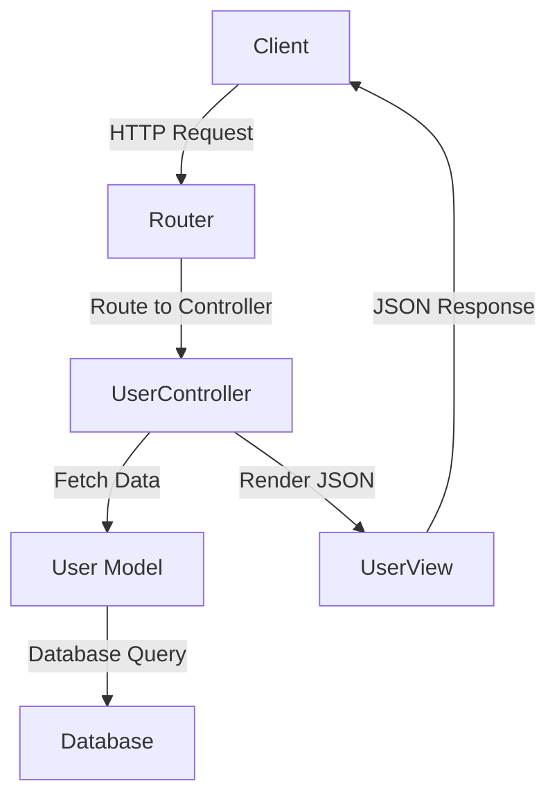

## 15.9. Building APIs with Phoenix

As expert developers and architects, you understand the importance of building efficient, scalable, and secure APIs. The Phoenix Framework, with its robust features and Elixir's concurrency model, offers an exceptional platform for developing APIs that can handle high loads and complex business logic. In this section, we will explore how to configure Phoenix for API-only applications, manage API versioning, and implement security measures.

### API Mode: Configuring Phoenix without HTML Views

Phoenix is traditionally known for building full-stack web applications, but it can be configured to serve as an API-only application. This setup minimizes overhead and optimizes performance for serving JSON responses.

#### Setting Up an API-Only Phoenix Application

To create an API-only Phoenix application, you can use the `--no-html` and `--no-webpack` flags when generating a new project. This configuration excludes HTML views and JavaScript assets, streamlining the application for API development.

```bash
mix phx.new my_api --no-html --no-webpack
```

This command creates a new Phoenix project without the default HTML and JavaScript components. The resulting project structure is leaner, focusing solely on API endpoints.

#### Configuring Endpoints for JSON Responses

In an API-only application, you'll primarily deal with JSON data. Ensure that your controllers and views are set up to handle JSON by default. In your controller, use the `render/2` function to return JSON responses:

```elixir
defmodule MyApiWeb.UserController do
  use MyApiWeb, :controller

  alias MyApi.Accounts
  alias MyApi.Accounts.User

  def index(conn, _params) do
    users = Accounts.list_users()
    render(conn, "index.json", users: users)
  end
end
```

In the view, define how the data should be serialized to JSON:

```elixir
defmodule MyApiWeb.UserView do
  use MyApiWeb, :view

  def render("index.json", %{users: users}) do
    %{data: render_many(users, MyApiWeb.UserView, "user.json")}
  end

  def render("user.json", %{user: user}) do
    %{id: user.id, name: user.name, email: user.email}
  end
end
```

### Versioning: Managing API Versions for Backward Compatibility

API versioning is crucial for maintaining backward compatibility as your API evolves. Phoenix supports several versioning strategies, including URL path versioning, header versioning, and query parameter versioning.

#### URL Path Versioning

One common approach is to include the version number in the URL path. This method is straightforward and easily visible to clients.

```elixir
scope "/api/v1", MyApiWeb do
  pipe_through :api

  resources "/users", UserController, only: [:index, :show, :create, :update, :delete]
end
```

#### Header Versioning

Another approach is to use custom headers to specify the API version. This method keeps URLs clean and allows for more flexible versioning.

```elixir
plug :accepts, ["json"]

def call(conn, _opts) do
  version = get_req_header(conn, "accept-version") |> List.first() || "v1"
  assign(conn, :api_version, version)
end
```

#### Query Parameter Versioning

You can also use query parameters to manage versions, though this is less common due to potential issues with caching and SEO.

```elixir
defmodule MyApiWeb.Plugs.Versioning do
  import Plug.Conn

  def init(default), do: default

  def call(conn, _opts) do
    version = conn.params["version"] || "v1"
    assign(conn, :api_version, version)
  end
end
```

### Security: Implementing Authentication, Rate Limiting, and Input Validation

Security is paramount when building APIs. Phoenix provides tools and best practices for securing your APIs against common vulnerabilities.

#### Authentication

Implementing authentication ensures that only authorized users can access your API. Phoenix supports various authentication strategies, including token-based authentication using libraries like Guardian.

```elixir
defmodule MyApiWeb.AuthPipeline do
  use Guardian.Plug.Pipeline, otp_app: :my_api,
    module: MyApiWeb.Guardian,
    error_handler: MyApiWeb.AuthErrorHandler

  plug Guardian.Plug.VerifyHeader, claims: %{"typ" => "access"}
  plug Guardian.Plug.EnsureAuthenticated
  plug Guardian.Plug.LoadResource
end
```

#### Rate Limiting

Rate limiting helps prevent abuse by limiting the number of requests a client can make in a given timeframe. Libraries like `ExRated` can be used to implement rate limiting in your Phoenix application.

```elixir
defmodule MyApiWeb.Plugs.RateLimiter do
  import Plug.Conn

  def init(opts), do: opts

  def call(conn, _opts) do
    case ExRated.check_rate("user:#{conn.remote_ip}", 1_000, 60_000) do
      {:ok, _count} -> conn
      {:error, _limit} -> conn |> send_resp(429, "Too Many Requests") |> halt()
    end
  end
end
```

#### Input Validation

Input validation is essential to protect your API from malicious data. Use changesets in Ecto to validate incoming data before processing.

```elixir
defmodule MyApi.Accounts.User do
  use Ecto.Schema
  import Ecto.Changeset

  schema "users" do
    field :name, :string
    field :email, :string
    field :password_hash, :string

    timestamps()
  end

  def changeset(user, attrs) do
    user
    |> cast(attrs, [:name, :email, :password])
    |> validate_required([:name, :email, :password])
    |> validate_format(:email, ~r/@/)
    |> unique_constraint(:email)
  end
end
```

### Try It Yourself

Experiment with the following modifications to deepen your understanding:

- **Add a new API version** using a different versioning strategy.
- **Implement an additional authentication strategy** such as OAuth2.
- **Enhance input validation** by adding more complex rules or custom validators.

### Visualizing API Architecture

Below is a diagram illustrating a typical API architecture using Phoenix, showcasing how different components interact.


```mermaid
graph TD;
  A[Client] -->|HTTP Request| B[Router]
  B -->|Route to Controller| C[UserController]
  C -->|Fetch Data| D[User Model]
  C -->|Render JSON| E[UserView]
  D -->|Database Query| F[Database]
  E -->|JSON Response| A
```

**Diagram Explanation:** This flowchart represents the process of handling an API request in Phoenix. The client sends an HTTP request to the router, which directs it to the appropriate controller. The controller interacts with the model to fetch data from the database, uses the view to render the data as JSON, and sends the response back to the client.

### References and Links

- [Phoenix Framework Documentation](https://hexdocs.pm/phoenix/)
- [Guardian Authentication Library](https://hexdocs.pm/guardian/)
- [ExRated Rate Limiting Library](https://hexdocs.pm/ex_rated/)
- [Ecto Changesets](https://hexdocs.pm/ecto/Ecto.Changeset.html)

### Knowledge Check

- What are the benefits of configuring Phoenix as an API-only application?
- How does URL path versioning differ from header versioning?
- Why is input validation critical in API development?

### Embrace the Journey

Building APIs with Phoenix is a rewarding endeavor that leverages Elixir's strengths in concurrency and fault tolerance. Remember, this is just the beginning. As you progress, you'll build more complex and interactive APIs. Keep experimenting, stay curious, and enjoy the journey!

## Quiz Time!



### What command is used to create an API-only Phoenix application?

- [x] `mix phx.new my_api --no-html --no-webpack`
- [ ] `mix phx.new my_api --api-only`
- [ ] `mix phx.new my_api --without-assets`
- [ ] `mix phx.new my_api --minimal`

> **Explanation:** The `--no-html` and `--no-webpack` flags are used to create an API-only Phoenix application by excluding HTML views and JavaScript assets.

### Which versioning strategy involves including the version number in the URL path?

- [x] URL Path Versioning
- [ ] Header Versioning
- [ ] Query Parameter Versioning
- [ ] Semantic Versioning

> **Explanation:** URL Path Versioning includes the version number directly in the URL path, making it easily visible to clients.

### What library can be used for token-based authentication in Phoenix?

- [x] Guardian
- [ ] Devise
- [ ] Auth0
- [ ] OAuth2

> **Explanation:** Guardian is a popular library for implementing token-based authentication in Phoenix applications.

### How can rate limiting be implemented in a Phoenix application?

- [x] Using ExRated
- [ ] Using Plug.Conn
- [ ] Using Phoenix.Router
- [ ] Using Ecto

> **Explanation:** ExRated is a library that can be used to implement rate limiting in Phoenix applications.

### Why is input validation important in API development?

- [x] To protect against malicious data
- [ ] To increase response time
- [ ] To reduce server load
- [ ] To simplify code

> **Explanation:** Input validation is crucial for protecting APIs from malicious data and ensuring data integrity.

### What does the `render/2` function do in a Phoenix controller?

- [x] Returns JSON responses
- [ ] Renders HTML templates
- [ ] Handles database queries
- [ ] Manages user authentication

> **Explanation:** In a Phoenix controller, the `render/2` function is used to return JSON responses to the client.

### Which plug is used to ensure a user is authenticated in a Phoenix application?

- [x] Guardian.Plug.EnsureAuthenticated
- [ ] Plug.Conn
- [ ] Phoenix.Router
- [ ] Ecto.Schema

> **Explanation:** Guardian.Plug.EnsureAuthenticated is used to ensure that a user is authenticated before accessing certain routes.

### What is the purpose of including timestamps in an Ecto schema?

- [x] To track creation and update times
- [ ] To manage user sessions
- [ ] To handle API versioning
- [ ] To validate input data

> **Explanation:** Timestamps in an Ecto schema are used to track the creation and update times of records.

### Which of the following is a method of API versioning?

- [x] Header Versioning
- [ ] Semantic Versioning
- [ ] Session Versioning
- [ ] Token Versioning

> **Explanation:** Header Versioning is a method of API versioning where the version is specified in the request headers.

### True or False: Phoenix can only be used for full-stack web applications.

- [ ] True
- [x] False

> **Explanation:** False. Phoenix can be configured for API-only applications by excluding HTML views and JavaScript assets.




