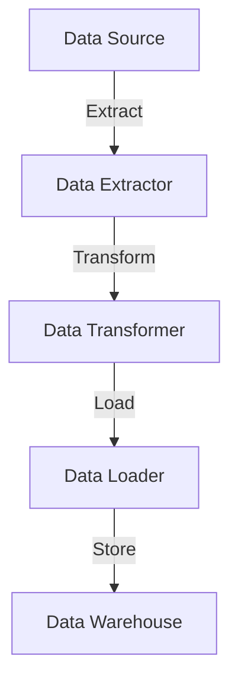

## 16.1. Introduction to Data Engineering in Elixir

In the rapidly evolving field of data engineering, Elixir has emerged as a powerful tool for building robust, scalable, and efficient data processing systems. This section delves into the role of Elixir in data engineering, highlighting its unique features and advantages, and exploring its application in Extract, Transform, Load (ETL) processes.

### The Role of Elixir in Data Engineering

Elixir, a functional programming language built on the Erlang VM (BEAM), is renowned for its concurrency and fault tolerance. These characteristics make it particularly well-suited for data-intensive applications where high availability and performance are paramount.

#### Leveraging Concurrency

Elixir's concurrency model is based on lightweight processes that run on the BEAM VM. These processes are isolated, communicate through message passing, and can be spawned in large numbers without significant overhead. This model is ideal for data engineering tasks that require parallel processing, such as handling multiple data streams or performing complex transformations concurrently.

```elixir
defmodule DataProcessor do
  def process_data(data) do
    data
    |> Enum.map(&spawn_process/1)
    |> Enum.map(&Task.await/1)
  end

  defp spawn_process(item) do
    Task.async(fn -> transform(item) end)
  end

  defp transform(item) do
    # Simulate a data transformation
    :timer.sleep(100)
    item * 2
  end
end

# Example usage
data = [1, 2, 3, 4, 5]
processed_data = DataProcessor.process_data(data)
IO.inspect(processed_data)
```

In this example, we demonstrate how Elixir can be used to process data concurrently. Each item in the data list is transformed in parallel, showcasing Elixir's ability to handle concurrent tasks efficiently.

#### Fault Tolerance and Resilience

Elixir's fault tolerance is another critical feature for data engineering. The language's "let it crash" philosophy encourages developers to design systems that can recover from failures automatically. This is achieved through supervision trees, where supervisors monitor worker processes and restart them if they fail.

```elixir
defmodule DataPipeline.Supervisor do
  use Supervisor

  def start_link(_) do
    Supervisor.start_link(__MODULE__, :ok, name: __MODULE__)
  end

  def init(:ok) do
    children = [
      {DataProcessor, []}
    ]

    Supervisor.init(children, strategy: :one_for_one)
  end
end
```

In this code snippet, we define a simple supervisor that manages a `DataProcessor` worker. If the worker crashes, the supervisor will automatically restart it, ensuring the system remains operational.

### Advantages of Using Elixir

Elixir offers several advantages for data engineering, particularly in terms of throughput, scalability, and real-time processing capabilities.

#### High Throughput and Scalability

The BEAM VM, on which Elixir runs, is designed for high concurrency and low latency. It can handle millions of processes simultaneously, making it ideal for data engineering tasks that require high throughput and scalability.

```elixir
defmodule HighThroughput do
  def simulate_load(n) do
    1..n
    |> Enum.map(&spawn_process/1)
    |> Enum.map(&Task.await/1)
  end

  defp spawn_process(i) do
    Task.async(fn -> perform_task(i) end)
  end

  defp perform_task(i) do
    # Simulate a task
    :timer.sleep(10)
    i * 2
  end
end

# Simulate high load
HighThroughput.simulate_load(100_000)
```

This example illustrates how Elixir can handle a high number of concurrent tasks, simulating a load of 100,000 tasks processed in parallel.

#### Efficient Handling of Streaming Data

Elixir's capabilities extend to efficient handling of streaming data, making it suitable for real-time data processing applications. Libraries like GenStage and Flow provide abstractions for building data pipelines that can process streams of data efficiently.

```elixir
defmodule DataStreamer do
  use GenStage

  def start_link do
    GenStage.start_link(__MODULE__, :ok, name: __MODULE__)
  end

  def init(:ok) do
    {:producer, 0}
  end

  def handle_demand(demand, state) do
    events = Enum.to_list(state..state + demand - 1)
    {:noreply, events, state + demand}
  end
end

defmodule DataConsumer do
  use GenStage

  def start_link do
    GenStage.start_link(__MODULE__, :ok, name: __MODULE__)
  end

  def init(:ok) do
    {:consumer, :the_state_does_not_matter}
  end

  def handle_events(events, _from, state) do
    Enum.each(events, fn event ->
      IO.inspect(event)
    end)
    {:noreply, [], state}
  end
end

{:ok, producer} = DataStreamer.start_link()
{:ok, consumer} = DataConsumer.start_link()

GenStage.sync_subscribe(consumer, to: producer)
```

In this example, we use GenStage to create a simple producer-consumer pipeline. The producer generates a stream of numbers, and the consumer processes each number in real-time.

### Overview of ETL Processes

ETL (Extract, Transform, Load) processes are fundamental to data engineering. They involve extracting data from various sources, transforming it into a suitable format, and loading it into a destination, such as a database or data warehouse.

#### Extracting Data

Data extraction involves retrieving data from different sources, which can include databases, APIs, or files. Elixir's libraries, such as Ecto for database interactions and HTTPoison for HTTP requests, facilitate efficient data extraction.

```elixir
defmodule DataExtractor do
  def extract_from_db(query) do
    # Simulate database extraction
    {:ok, result} = Ecto.Adapters.SQL.query(MyApp.Repo, query, [])
    result.rows
  end

  def extract_from_api(url) do
    # Simulate API extraction
    {:ok, response} = HTTPoison.get(url)
    response.body
  end
end
```

In this code snippet, we demonstrate how to extract data from a database and an API using Elixir's Ecto and HTTPoison libraries.

#### Transforming Data

Data transformation involves converting extracted data into a format suitable for analysis or storage. This can include cleaning, aggregating, or enriching the data.

```elixir
defmodule DataTransformer do
  def transform(data) do
    data
    |> Enum.map(&clean/1)
    |> Enum.map(&aggregate/1)
  end

  defp clean(item) do
    # Simulate data cleaning
    String.trim(item)
  end

  defp aggregate(item) do
    # Simulate data aggregation
    String.upcase(item)
  end
end
```

Here, we define a simple transformation process that cleans and aggregates data items.

#### Loading Data

The final step in the ETL process is loading the transformed data into a destination. This could be a database, data warehouse, or another storage system.

```elixir
defmodule DataLoader do
  def load_to_db(data) do
    # Simulate loading data into a database
    Enum.each(data, fn item ->
      Ecto.Adapters.SQL.query(MyApp.Repo, "INSERT INTO table (column) VALUES ($1)", [item])
    end)
  end
end
```

This example shows how to load transformed data into a database using Elixir's Ecto library.

### Use Cases

Elixir's strengths in concurrency, fault tolerance, and real-time processing make it well-suited for various data engineering use cases.

#### Data Pipelines

Elixir can be used to build robust data pipelines that handle large volumes of data efficiently. These pipelines can process data in real-time, making them ideal for applications that require immediate insights.

#### Analytics

Elixir's ability to handle concurrent tasks and process streaming data makes it a powerful tool for analytics applications. It can be used to build systems that analyze data in real-time, providing valuable insights quickly.

#### Monitoring Systems

Elixir's fault tolerance and resilience make it an excellent choice for building monitoring systems that require high availability. These systems can monitor data streams in real-time, alerting users to potential issues as they arise.

### Visualizing Elixir's Role in Data Engineering

To better understand Elixir's role in data engineering, let's visualize a simple ETL pipeline using Mermaid.js.



This diagram illustrates a basic ETL pipeline, where data is extracted from a source, transformed, and loaded into a data warehouse for storage and analysis.

### Knowledge Check

Before we conclude, let's reinforce what we've learned with a few questions:

- What are the key features of Elixir that make it suitable for data engineering?
- How does Elixir's concurrency model benefit data processing tasks?
- What are the steps involved in an ETL process?
- How can Elixir be used to build real-time data pipelines?

### Embrace the Journey

As we wrap up this introduction to data engineering in Elixir, remember that this is just the beginning. Elixir's capabilities extend far beyond what we've covered here, offering endless possibilities for building powerful data processing systems. Keep experimenting, stay curious, and enjoy the journey!

## Quiz: Introduction to Data Engineering in Elixir



### What is a key feature of Elixir that makes it suitable for data engineering?

- [x] Concurrency
- [ ] Object-Oriented Programming
- [ ] Manual Memory Management
- [ ] Synchronous Execution

> **Explanation:** Elixir's concurrency model, based on lightweight processes, is ideal for data engineering tasks that require parallel processing.

### How does Elixir handle concurrent tasks?

- [x] Through lightweight processes
- [ ] By using threads
- [ ] With global locks
- [ ] By blocking operations

> **Explanation:** Elixir uses lightweight processes that run on the BEAM VM, allowing for efficient concurrent task handling.

### What is the "let it crash" philosophy in Elixir?

- [x] Encouraging systems to recover from failures automatically
- [ ] Preventing any process from crashing
- [ ] Using global error handlers
- [ ] Avoiding error handling

> **Explanation:** The "let it crash" philosophy encourages designing systems that can recover from failures automatically, often using supervision trees.

### What is the purpose of an ETL process?

- [x] Extracting, transforming, and loading data
- [ ] Encrypting, transmitting, and logging data
- [ ] Evaluating, testing, and launching data
- [ ] Editing, transferring, and listing data

> **Explanation:** ETL stands for Extract, Transform, Load, which involves extracting data from sources, transforming it, and loading it into destinations.

### Which Elixir library is commonly used for database interactions?

- [x] Ecto
- [ ] Phoenix
- [ ] GenStage
- [ ] HTTPoison

> **Explanation:** Ecto is a library for interacting with databases in Elixir, providing tools for data extraction and loading.

### What is a common use case for Elixir in data engineering?

- [x] Building real-time data pipelines
- [ ] Designing static web pages
- [ ] Creating desktop applications
- [ ] Developing mobile games

> **Explanation:** Elixir is well-suited for building real-time data pipelines due to its concurrency and fault tolerance.

### How does Elixir's fault tolerance benefit data engineering applications?

- [x] By ensuring systems remain operational despite failures
- [ ] By preventing any errors from occurring
- [ ] By using global error handlers
- [ ] By avoiding error handling

> **Explanation:** Elixir's fault tolerance, achieved through supervision trees, ensures systems can recover from failures and remain operational.

### What is a key advantage of using Elixir for streaming data?

- [x] Efficient real-time processing
- [ ] Manual memory management
- [ ] Synchronous execution
- [ ] Object-oriented design

> **Explanation:** Elixir's concurrency model and libraries like GenStage make it efficient for real-time processing of streaming data.

### Which Elixir library is used for HTTP requests?

- [x] HTTPoison
- [ ] Ecto
- [ ] Phoenix
- [ ] GenStage

> **Explanation:** HTTPoison is a library for making HTTP requests in Elixir, useful for extracting data from APIs.

### True or False: Elixir can handle millions of processes simultaneously.

- [x] True
- [ ] False

> **Explanation:** The BEAM VM, on which Elixir runs, is designed to handle millions of processes simultaneously, making it ideal for high concurrency tasks.


