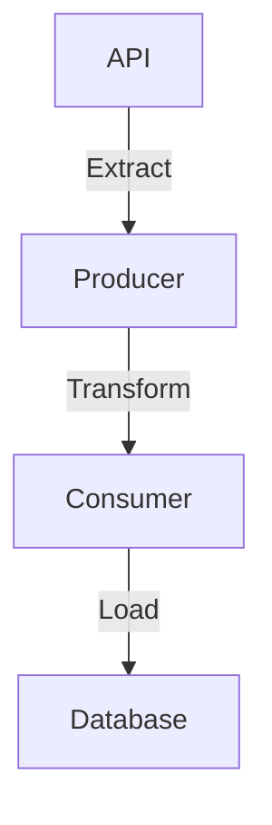

## 16.1. Introduction to Data Engineering in Elixir

Data engineering is a critical field that involves designing and building systems for collecting, storing, and analyzing data at scale. With the increasing demand for real-time data processing and analytics, choosing the right technology stack is crucial. Elixir, a functional programming language built on the Erlang VM (BEAM), offers unique advantages for data engineering tasks. In this section, we will explore how Elixir's concurrency model, fault tolerance, and other features make it an excellent choice for data-intensive applications.

### The Role of Elixir in Data Engineering

Elixir is renowned for its ability to handle concurrent processes efficiently, making it ideal for data engineering tasks that require high throughput and real-time processing. Let's delve into how Elixir's features contribute to data engineering:

#### Leveraging Elixir's Concurrency and Fault Tolerance

Elixir's concurrency model is based on the Actor model, where lightweight processes communicate through message passing. This model allows Elixir to handle thousands of concurrent processes with ease, making it perfect for data engineering tasks such as data ingestion, transformation, and real-time analytics.

- **Concurrency:** Elixir's processes are lightweight and can be spawned in large numbers without significant overhead. This is crucial for data pipelines that need to process multiple data streams simultaneously.
  
- **Fault Tolerance:** Built on the BEAM VM, Elixir inherits Erlang's "let it crash" philosophy, which promotes building systems that can recover from failures gracefully. This is essential for data engineering systems that require high availability and reliability.

#### Advantages of Using Elixir

Elixir offers several advantages that make it a compelling choice for data engineering:

- **High Throughput and Scalability:** The BEAM VM is designed for high concurrency and can efficiently manage numerous processes, leading to high throughput and scalability. This is particularly beneficial for data-intensive applications that need to handle large volumes of data.

- **Efficient Handling of Streaming Data:** Elixir's ability to process data streams in real-time makes it suitable for applications that require immediate data processing and analytics. Libraries like GenStage and Flow provide abstractions for building data processing pipelines that can handle backpressure and distribute work across multiple nodes.

- **Real-Time Processing:** Elixir's concurrency model and fault tolerance enable real-time data processing, which is crucial for applications like monitoring systems, analytics platforms, and IoT data processing.

### Overview of ETL Processes

ETL (Extract, Transform, Load) is a fundamental process in data engineering that involves extracting data from various sources, transforming it into a suitable format, and loading it into a destination system. Let's explore each component of the ETL process:

- **Extract:** This step involves collecting data from various sources such as databases, APIs, and file systems. Elixir's ability to handle concurrent connections makes it efficient for data extraction tasks.

- **Transform:** Once the data is extracted, it needs to be transformed into a format suitable for analysis. This may involve cleaning, aggregating, and enriching the data. Elixir's functional programming paradigm, with its emphasis on pure functions and immutability, facilitates the creation of robust transformation logic.

- **Load:** The final step involves loading the transformed data into a destination, such as a data warehouse or a data lake. Elixir's concurrency model ensures that data loading is efficient and can handle large volumes of data.

### Use Cases

Elixir's features make it suitable for a variety of data engineering use cases:

- **Data Pipelines:** Elixir can be used to build robust data pipelines that handle data ingestion, transformation, and loading efficiently. Its concurrency model allows for parallel processing of data streams, leading to high throughput.

- **Analytics:** Elixir's ability to process data in real-time makes it ideal for analytics platforms that require immediate insights from data. Its fault tolerance ensures that the system remains reliable even in the face of failures.

- **Monitoring Systems:** Elixir's real-time processing capabilities make it suitable for monitoring systems that need to process and analyze data continuously. Its concurrency model allows for handling multiple data streams simultaneously.

### Code Example: Building a Simple Data Pipeline

Let's build a simple data pipeline using Elixir to demonstrate its capabilities. We'll create a pipeline that extracts data from an API, transforms it, and loads it into a database.

```elixir
defmodule DataPipeline do
  use GenStage

  # Producer: Extracts data from an API
  defmodule Producer do
    use GenStage

    def start_link(initial) do
      GenStage.start_link(__MODULE__, initial, name: __MODULE__)
    end

    def init(initial) do
      {:producer, initial}
    end

    def handle_demand(demand, state) when demand > 0 do
      # Simulate data extraction from an API
      data = Enum.map(1..demand, fn _ -> %{id: :rand.uniform(1000), value: :rand.uniform(100)} end)
      {:noreply, data, state}
    end
  end

  # Consumer: Transforms and loads data into a database
  defmodule Consumer do
    use GenStage

    def start_link() do
      GenStage.start_link(__MODULE__, :ok, name: __MODULE__)
    end

    def init(:ok) do
      {:consumer, :ok}
    end

    def handle_events(events, _from, state) do
      # Transform and load data
      Enum.each(events, fn event ->
        transformed = transform(event)
        load(transformed)
      end)
      {:noreply, [], state}
    end

    defp transform(event) do
      # Transform data (e.g., multiply value by 2)
      Map.update!(event, :value, &(&1 * 2))
    end

    defp load(event) do
      # Simulate loading data into a database
      IO.inspect(event, label: "Loaded data")
    end
  end

  # Start the pipeline
  def start_pipeline do
    {:ok, producer} = Producer.start_link(:ok)
    {:ok, consumer} = Consumer.start_link()

    GenStage.sync_subscribe(consumer, to: producer)
  end
end

# Start the data pipeline
DataPipeline.start_pipeline()
```

### Visualizing the Data Pipeline

Here is a visual representation of the data pipeline we just implemented:


```mermaid
graph TD;
    A[API] -->|Extract| B[Producer];
    B -->|Transform| C[Consumer];
    C -->|Load| D[Database];
```

**Description:** This diagram illustrates the flow of data through the pipeline. Data is extracted from an API by the Producer, transformed by the Consumer, and then loaded into a Database.

### Try It Yourself

Encourage experimentation by modifying the code example above. Try changing the transformation logic or simulate a different data source. Observe how Elixir's concurrency model handles changes efficiently.

### References and Links

- [Elixir Official Website](https://elixir-lang.org/)
- [GenStage Documentation](https://hexdocs.pm/gen_stage/GenStage.html)
- [Flow Documentation](https://hexdocs.pm/flow/Flow.html)

### Knowledge Check

- What are the key advantages of using Elixir for data engineering?
- How does Elixir's concurrency model benefit data pipelines?
- Explain the ETL process and how Elixir can be used in each step.

### Embrace the Journey

Remember, this is just the beginning. As you delve deeper into data engineering with Elixir, you'll discover more advanced techniques and patterns that can enhance your data processing capabilities. Keep experimenting, stay curious, and enjoy the journey!

### Quiz Time!



### What is one of the main advantages of using Elixir for data engineering?

- [x] High throughput and scalability
- [ ] Low-level memory management
- [ ] Built-in machine learning libraries
- [ ] Native support for SQL databases

> **Explanation:** Elixir offers high throughput and scalability due to its concurrency model and the BEAM VM.

### Which Elixir feature is crucial for handling real-time data processing?

- [x] Concurrency model
- [ ] Object-oriented programming
- [ ] Static typing
- [ ] Manual memory management

> **Explanation:** Elixir's concurrency model enables efficient real-time data processing.

### In an ETL process, what does the "Transform" step involve?

- [ ] Collecting data from various sources
- [x] Converting data into a suitable format
- [ ] Loading data into a destination
- [ ] Deleting redundant data

> **Explanation:** The "Transform" step involves converting data into a format suitable for analysis.

### What is the role of the Producer in the data pipeline example?

- [x] Extracting data from an API
- [ ] Transforming data
- [ ] Loading data into a database
- [ ] Aggregating data

> **Explanation:** The Producer is responsible for extracting data from an API.

### How does Elixir's "let it crash" philosophy contribute to fault tolerance?

- [x] By allowing processes to fail and restart automatically
- [ ] By preventing any process from failing
- [ ] By ignoring errors
- [ ] By using try-catch blocks extensively

> **Explanation:** The "let it crash" philosophy allows processes to fail and restart automatically, enhancing fault tolerance.

### What is a common use case for Elixir in data engineering?

- [x] Building data pipelines
- [ ] Developing desktop applications
- [ ] Creating static websites
- [ ] Writing device drivers

> **Explanation:** Elixir is commonly used for building data pipelines due to its concurrency and fault tolerance.

### Which library is used in Elixir for building data processing pipelines?

- [x] GenStage
- [ ] Phoenix
- [ ] Ecto
- [ ] Logger

> **Explanation:** GenStage is used for building data processing pipelines in Elixir.

### What does the "Load" step in ETL involve?

- [ ] Extracting data from sources
- [ ] Transforming data
- [x] Loading transformed data into a destination
- [ ] Cleaning data

> **Explanation:** The "Load" step involves loading transformed data into a destination system.

### Why is Elixir's concurrency model beneficial for data ingestion?

- [x] It allows handling multiple data streams simultaneously
- [ ] It simplifies database queries
- [ ] It provides built-in data visualization tools
- [ ] It reduces the need for data cleaning

> **Explanation:** Elixir's concurrency model allows handling multiple data streams simultaneously, which is beneficial for data ingestion.

### True or False: Elixir is not suitable for real-time data processing.

- [ ] True
- [x] False

> **Explanation:** False. Elixir is highly suitable for real-time data processing due to its concurrency model and fault tolerance.


