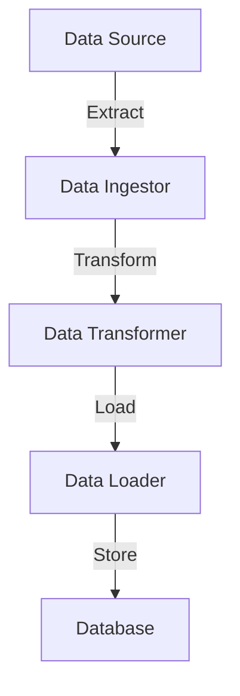

## 16.2. Building ETL Pipelines with GenStage and Flow

In the realm of data engineering, Extract, Transform, Load (ETL) processes are crucial for moving and transforming data from various sources to destinations. Elixir, with its robust concurrency model and functional programming paradigm, offers powerful tools like GenStage and Flow to build efficient ETL pipelines. In this section, we will explore how to leverage these tools to create scalable and fault-tolerant ETL systems.

### GenStage Basics

GenStage is a specification for exchanging data between Elixir processes with a focus on backpressure. It allows us to build a pipeline of processes that can produce and consume data in a controlled manner.

#### Understanding the Producer-Consumer Model

The producer-consumer model is a design pattern where producers generate data and consumers process it. In GenStage, this model is extended with the concept of demand, allowing consumers to request data from producers at their own pace, thus managing backpressure effectively.

```elixir
defmodule Producer do
  use GenStage

  def start_link(initial) do
    GenStage.start_link(__MODULE__, initial, name: __MODULE__)
  end

  def init(initial) do
    {:producer, initial}
  end

  def handle_demand(demand, state) when demand > 0 do
    events = Enum.to_list(state..state + demand - 1)
    {:noreply, events, state + demand}
  end
end

defmodule Consumer do
  use GenStage

  def start_link() do
    GenStage.start_link(__MODULE__, :ok, name: __MODULE__)
  end

  def init(:ok) do
    {:consumer, :the_state_does_not_matter}
  end

  def handle_events(events, _from, state) do
    Enum.each(events, fn event ->
      IO.inspect(event, label: "Consumed")
    end)
    {:noreply, [], state}
  end
end
```

In this example, the `Producer` generates a sequence of numbers, and the `Consumer` processes them. The consumer requests data from the producer, demonstrating the demand-driven nature of GenStage.

#### Implementing Stages for Data Ingestion and Processing

To build an ETL pipeline, we need to implement multiple stages that handle different parts of the process. Each stage can be a producer, consumer, or both (producer-consumer).

```elixir
defmodule DataIngestor do
  use GenStage

  def start_link() do
    GenStage.start_link(__MODULE__, 0)
  end

  def init(counter) do
    {:producer, counter}
  end

  def handle_demand(demand, state) do
    events = for i <- state..(state + demand - 1), do: "Data #{i}"
    {:noreply, events, state + demand}
  end
end

defmodule DataTransformer do
  use GenStage

  def start_link() do
    GenStage.start_link(__MODULE__, :ok)
  end

  def init(:ok) do
    {:producer_consumer, :ok}
  end

  def handle_events(events, _from, state) do
    transformed_events = Enum.map(events, &String.upcase/1)
    {:noreply, transformed_events, state}
  end
end

defmodule DataLoader do
  use GenStage

  def start_link() do
    GenStage.start_link(__MODULE__, :ok)
  end

  def init(:ok) do
    {:consumer, :ok}
  end

  def handle_events(events, _from, state) do
    Enum.each(events, &IO.puts("Loading #{&1}"))
    {:noreply, [], state}
  end
end
```

Here, `DataIngestor` produces raw data, `DataTransformer` transforms it, and `DataLoader` loads it to the destination. This modular approach allows us to easily extend or modify the pipeline.

### Flow for Parallel Processing

Flow is built on top of GenStage and provides a higher-level abstraction for parallel data processing. It simplifies the creation of complex data processing pipelines by handling concurrency and backpressure automatically.

#### Simplifying Parallel Computations with a Higher-Level Abstraction

Flow allows us to define computations over collections in a way that is automatically parallelized and distributed across available resources.

```elixir
alias Experimental.Flow

Flow.from_enumerable(1..1000)
|> Flow.map(&(&1 * 2))
|> Flow.partition()
|> Flow.reduce(fn -> 0 end, &(&1 + &2))
|> Enum.to_list()
```

In this example, we create a flow from a range of numbers, double each number, partition the data for parallel processing, and then reduce it to a sum. Flow handles the distribution of work across multiple cores, making it ideal for CPU-bound tasks.

#### Managing Backpressure and Demand-Driven Data Flow

Flow inherits GenStage's ability to manage backpressure, ensuring that consumers are not overwhelmed by the rate of data production.

```elixir
Flow.from_enumerable(1..1000)
|> Flow.map(&(&1 * 2))
|> Flow.partition(stages: 4)
|> Flow.reduce(fn -> 0 end, &(&1 + &2))
|> Enum.to_list()
```

By specifying the number of stages in `Flow.partition/2`, we can control the level of parallelism and ensure that our system remains responsive under load.

### Designing ETL Pipelines

Designing an ETL pipeline involves breaking down the process into distinct stages, each responsible for a specific task. This modular approach enhances maintainability and scalability.

#### Breaking Down ETL Processes into Stages

An ETL pipeline typically consists of three main stages: extraction, transformation, and loading. Each stage can be implemented as a separate GenStage process, allowing for clear separation of concerns.

```elixir
defmodule ETLPipeline do
  def start_link() do
    {:ok, _} = DataIngestor.start_link()
    {:ok, _} = DataTransformer.start_link()
    {:ok, _} = DataLoader.start_link()

    GenStage.sync_subscribe(DataTransformer, to: DataIngestor)
    GenStage.sync_subscribe(DataLoader, to: DataTransformer)
  end
end
```

In this setup, `DataIngestor` extracts data, `DataTransformer` performs transformations, and `DataLoader` loads the data to its final destination. The use of GenStage ensures that each stage can operate independently and handle its own workload.

#### Ensuring Data Integrity and Consistent Transformations

Data integrity is crucial in ETL processes. We must ensure that transformations are consistent and that data is not lost or corrupted during the process.

- **Validation**: Validate data at each stage to catch errors early.
- **Idempotency**: Design transformations to be idempotent, so they can be safely retried.
- **Logging**: Implement logging to track data flow and identify issues.

### Practical Examples

Let's explore a practical example of building an ETL pipeline to process log files.

#### Building a Pipeline to Process Log Files

Suppose we have a system that generates log files, and we want to extract useful information, transform it, and load it into a database.

```elixir
defmodule LogIngestor do
  use GenStage

  def start_link(file_path) do
    GenStage.start_link(__MODULE__, file_path)
  end

  def init(file_path) do
    {:producer, File.stream!(file_path)}
  end

  def handle_demand(demand, file_stream) do
    events = Enum.take(file_stream, demand)
    {:noreply, events, file_stream}
  end
end

defmodule LogTransformer do
  use GenStage

  def start_link() do
    GenStage.start_link(__MODULE__, :ok)
  end

  def init(:ok) do
    {:producer_consumer, :ok}
  end

  def handle_events(events, _from, state) do
    transformed_events = Enum.map(events, &parse_log/1)
    {:noreply, transformed_events, state}
  end

  defp parse_log(log_line) do
    # Parse the log line and extract relevant information
    String.split(log_line, " ")
  end
end

defmodule LogLoader do
  use GenStage

  def start_link() do
    GenStage.start_link(__MODULE__, :ok)
  end

  def init(:ok) do
    {:consumer, :ok}
  end

  def handle_events(events, _from, state) do
    Enum.each(events, &store_in_db/1)
    {:noreply, [], state}
  end

  defp store_in_db(parsed_log) do
    # Store the parsed log in the database
    IO.inspect(parsed_log, label: "Storing in DB")
  end
end
```

In this example, `LogIngestor` reads log lines from a file, `LogTransformer` parses each line, and `LogLoader` stores the parsed data in a database. This pipeline can be easily extended to handle more complex transformations or additional data sources.

#### Processing Real-Time Sensor Data

For real-time data processing, we can use a similar approach with GenStage and Flow to handle incoming sensor data.

```elixir
defmodule SensorIngestor do
  use GenStage

  def start_link() do
    GenStage.start_link(__MODULE__, :ok)
  end

  def init(:ok) do
    {:producer, :ok}
  end

  def handle_demand(demand, state) do
    events = for _ <- 1..demand, do: generate_sensor_data()
    {:noreply, events, state}
  end

  defp generate_sensor_data() do
    # Simulate sensor data generation
    %{temperature: :rand.uniform(100), humidity: :rand.uniform(100)}
  end
end

defmodule SensorTransformer do
  use GenStage

  def start_link() do
    GenStage.start_link(__MODULE__, :ok)
  end

  def init(:ok) do
    {:producer_consumer, :ok}
  end

  def handle_events(events, _from, state) do
    transformed_events = Enum.map(events, &transform_sensor_data/1)
    {:noreply, transformed_events, state}
  end

  defp transform_sensor_data(data) do
    # Transform sensor data, e.g., convert units
    %{temperature: data.temperature * 1.8 + 32, humidity: data.humidity}
  end
end

defmodule SensorLoader do
  use GenStage

  def start_link() do
    GenStage.start_link(__MODULE__, :ok)
  end

  def init(:ok) do
    {:consumer, :ok}
  end

  def handle_events(events, _from, state) do
    Enum.each(events, &store_sensor_data/1)
    {:noreply, [], state}
  end

  defp store_sensor_data(data) do
    # Store the transformed sensor data
    IO.inspect(data, label: "Storing Sensor Data")
  end
end
```

This pipeline ingests simulated sensor data, transforms it by converting temperature units, and stores the results. By using GenStage and Flow, we can handle high-throughput data streams efficiently.

### Visualizing ETL Pipelines

To better understand the flow of data through an ETL pipeline, let's visualize the process using a Mermaid.js diagram.



**Diagram Description:** This diagram represents a typical ETL pipeline where data flows from a source through the stages of ingestion, transformation, and loading, ultimately being stored in a database.

### References and Links

- [GenStage Documentation](https://hexdocs.pm/gen_stage/GenStage.html)
- [Flow Documentation](https://hexdocs.pm/flow/Flow.html)
- [Elixir's Official Website](https://elixir-lang.org/)

### Knowledge Check

- What is the role of GenStage in an ETL pipeline?
- How does Flow simplify parallel processing in Elixir?
- What are the key considerations for ensuring data integrity in ETL processes?

### Embrace the Journey

Building ETL pipelines with GenStage and Flow in Elixir is a powerful way to handle data processing tasks efficiently. Remember, this is just the beginning. As you progress, you'll be able to tackle more complex data engineering challenges. Keep experimenting, stay curious, and enjoy the journey!

## Quiz: Building ETL Pipelines with GenStage and Flow



### What is the primary purpose of GenStage in Elixir?

- [x] To manage data flow and backpressure between processes
- [ ] To handle HTTP requests
- [ ] To compile Elixir code
- [ ] To manage database connections

> **Explanation:** GenStage is designed to manage data flow and backpressure between processes, making it ideal for building ETL pipelines.

### How does Flow enhance the capabilities of GenStage?

- [x] By providing a higher-level abstraction for parallel processing
- [ ] By adding support for HTTP requests
- [ ] By simplifying database queries
- [ ] By improving error handling

> **Explanation:** Flow builds on GenStage to offer a higher-level abstraction for parallel processing, making it easier to handle complex data processing tasks.

### What is a key feature of the producer-consumer model in GenStage?

- [x] Demand-driven data flow
- [ ] Automatic database synchronization
- [ ] Real-time data visualization
- [ ] Built-in logging

> **Explanation:** The producer-consumer model in GenStage is characterized by demand-driven data flow, where consumers request data from producers as needed.

### In an ETL pipeline, what does the 'T' stand for?

- [ ] Transfer
- [x] Transform
- [ ] Transmit
- [ ] Translate

> **Explanation:** In ETL, 'T' stands for Transform, which involves converting data into a desired format or structure.

### Which Elixir module is commonly used for parallel data processing in ETL pipelines?

- [x] Flow
- [ ] Ecto
- [ ] Plug
- [ ] Phoenix

> **Explanation:** Flow is commonly used for parallel data processing in ETL pipelines due to its ability to handle concurrent tasks efficiently.

### What is a benefit of using GenStage for ETL pipelines?

- [x] It allows for modular and scalable pipeline design
- [ ] It automatically generates user interfaces
- [ ] It simplifies CSS styling
- [ ] It enhances image processing

> **Explanation:** GenStage allows for modular and scalable pipeline design, making it suitable for building complex ETL systems.

### How can data integrity be ensured in an ETL process?

- [x] By validating data at each stage
- [ ] By using CSS for styling
- [ ] By minimizing code comments
- [ ] By avoiding database transactions

> **Explanation:** Ensuring data integrity involves validating data at each stage of the ETL process to catch errors early.

### What is a common use case for ETL pipelines?

- [x] Processing log files
- [ ] Designing web pages
- [ ] Creating animations
- [ ] Developing mobile apps

> **Explanation:** ETL pipelines are commonly used for processing log files, among other data processing tasks.

### True or False: Flow automatically manages backpressure in data processing.

- [x] True
- [ ] False

> **Explanation:** True. Flow automatically manages backpressure, ensuring that consumers are not overwhelmed by data production rates.

### What is a key advantage of using Flow for data processing?

- [x] It simplifies parallel computations
- [ ] It enhances image quality
- [ ] It reduces network latency
- [ ] It automates user authentication

> **Explanation:** Flow simplifies parallel computations, making it easier to handle large-scale data processing tasks.


