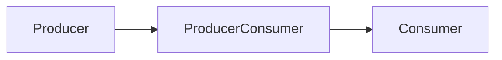
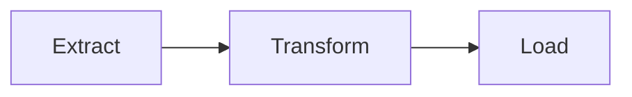
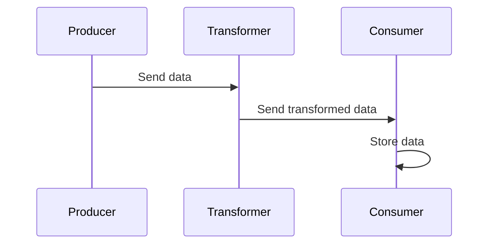

## 16.2. Building ETL Pipelines with GenStage and Flow

In the world of data engineering, ETL (Extract, Transform, Load) processes are crucial for transforming raw data into meaningful insights. Elixir, with its powerful concurrency model and functional programming paradigm, provides an excellent platform for building robust ETL pipelines. In this guide, we will explore how to leverage GenStage and Flow, two powerful libraries in the Elixir ecosystem, to construct efficient and scalable ETL pipelines.

### GenStage Basics

GenStage is a library for building producer-consumer workflows in Elixir. It provides a foundation for creating concurrent data processing pipelines, where stages can be producers, consumers, or both. Let's delve into the core concepts of GenStage.

#### Understanding the Producer-Consumer Model

The producer-consumer model is a design pattern where data is produced by one or more producers and consumed by one or more consumers. This model is ideal for scenarios where data needs to be processed in stages, with each stage performing a specific transformation or operation on the data.

In GenStage, there are three main types of stages:

- **Producer**: Generates data and sends it downstream.
- **Consumer**: Receives data and processes it.
- **ProducerConsumer**: Acts as both a producer and a consumer, receiving data, processing it, and sending it downstream.

Here's a simple diagram to illustrate the producer-consumer model in GenStage:


```mermaid
graph LR
    A[Producer] --> B[ProducerConsumer]
    B --> C[Consumer]
```

#### Implementing Stages for Data Ingestion and Processing

To implement a GenStage pipeline, we need to define each stage and its role in the data processing workflow. Let's start with a basic example of a producer-consumer setup.

1. **Producer**: Generates a stream of numbers.

```elixir
defmodule NumberProducer do
  use GenStage

  def start_link(initial) do
    GenStage.start_link(__MODULE__, initial, name: __MODULE__)
  end

  def init(initial) do
    {:producer, initial}
  end

  def handle_demand(demand, state) when demand > 0 do
    events = Enum.to_list(state..(state + demand - 1))
    {:noreply, events, state + demand}
  end
end
```

2. **Consumer**: Receives numbers and prints them.

```elixir
defmodule PrinterConsumer do
  use GenStage

  def start_link() do
    GenStage.start_link(__MODULE__, :ok, name: __MODULE__)
  end

  def init(:ok) do
    {:consumer, :ok}
  end

  def handle_events(events, _from, state) do
    Enum.each(events, &IO.inspect(&1))
    {:noreply, [], state}
  end
end
```

3. **Connecting the Stages**

```elixir
{:ok, producer} = NumberProducer.start_link(0)
{:ok, consumer} = PrinterConsumer.start_link()

GenStage.sync_subscribe(consumer, to: producer)
```

### Flow for Parallel Processing

While GenStage provides the building blocks for creating data processing pipelines, Flow offers a higher-level abstraction for parallel computations, making it easier to work with large data sets.

#### Simplifying Parallel Computations with a Higher-Level Abstraction

Flow is built on top of GenStage and simplifies the process of dividing work into parallel tasks. It is particularly useful for operations that can be performed independently on chunks of data, such as map-reduce operations.

Here's how you can use Flow to process a large list of numbers in parallel:

```elixir
alias Experimental.Flow

Flow.from_enumerable(1..1000)
|> Flow.map(&(&1 * 2))
|> Flow.partition()
|> Flow.reduce(fn -> 0 end, &(&1 + &2))
|> Flow.emit(:state)
|> Enum.to_list()
```

In this example, we create a flow from an enumerable, apply a map operation to double each number, partition the data for parallel processing, and reduce it to a sum.

#### Managing Backpressure and Demand-Driven Data Flow

One of the key features of GenStage and Flow is their ability to handle backpressure. Backpressure is a mechanism that prevents a consumer from being overwhelmed by data from a producer. In GenStage, consumers request data from producers, ensuring that they only receive as much data as they can handle.

Flow manages backpressure automatically, allowing you to focus on the logic of your data processing pipeline without worrying about data overload.

### Designing ETL Pipelines

Designing an ETL pipeline involves breaking down the process into stages, each responsible for a specific task. Let's explore how to design a robust ETL pipeline using GenStage and Flow.

#### Breaking Down ETL Processes into Stages

An ETL pipeline typically consists of the following stages:

1. **Extract**: Retrieve data from a source.
2. **Transform**: Apply transformations to clean and format the data.
3. **Load**: Store the transformed data in a target system.

Here's a diagram illustrating a simple ETL pipeline:


```mermaid
graph LR
    A[Extract] --> B[Transform]
    B --> C[Load]
```

#### Ensuring Data Integrity and Consistent Transformations

Data integrity is crucial in ETL processes. To ensure data integrity, consider the following best practices:

- **Validation**: Validate data at each stage to catch errors early.
- **Idempotency**: Design transformations to be idempotent, so they can be safely retried.
- **Logging**: Log each step of the process for auditing and debugging purposes.

### Practical Examples

Let's build a practical ETL pipeline to process log files and real-time sensor data.

#### Building a Pipeline to Process Log Files

1. **Extract Stage**: Read log files from a directory.

```elixir
defmodule LogFileProducer do
  use GenStage

  def start_link(directory) do
    GenStage.start_link(__MODULE__, directory, name: __MODULE__)
  end

  def init(directory) do
    files = File.ls!(directory)
    {:producer, {files, directory}}
  end

  def handle_demand(demand, {files, directory}) when demand > 0 do
    events = Enum.take(files, demand)
    remaining_files = Enum.drop(files, demand)
    file_contents = Enum.map(events, &File.read!(Path.join(directory, &1)))
    {:noreply, file_contents, {remaining_files, directory}}
  end
end
```

2. **Transform Stage**: Parse and filter log entries.

```elixir
defmodule LogParser do
  use GenStage

  def start_link() do
    GenStage.start_link(__MODULE__, :ok, name: __MODULE__)
  end

  def init(:ok) do
    {:producer_consumer, :ok}
  end

  def handle_events(events, _from, state) do
    parsed_logs = Enum.flat_map(events, &parse_log/1)
    {:noreply, parsed_logs, state}
  end

  defp parse_log(log_content) do
    log_content
    |> String.split("\n")
    |> Enum.filter(&String.contains?(&1, "ERROR"))
  end
end
```

3. **Load Stage**: Store the filtered logs in a database.

```elixir
defmodule LogDatabaseConsumer do
  use GenStage

  def start_link() do
    GenStage.start_link(__MODULE__, :ok, name: __MODULE__)
  end

  def init(:ok) do
    {:consumer, :ok}
  end

  def handle_events(events, _from, state) do
    Enum.each(events, &store_in_db/1)
    {:noreply, [], state}
  end

  defp store_in_db(log_entry) do
    # Insert log_entry into the database
  end
end
```

4. **Connecting the Pipeline**

```elixir
{:ok, producer} = LogFileProducer.start_link("/path/to/logs")
{:ok, parser} = LogParser.start_link()
{:ok, consumer} = LogDatabaseConsumer.start_link()

GenStage.sync_subscribe(parser, to: producer)
GenStage.sync_subscribe(consumer, to: parser)
```

#### Building a Pipeline for Real-Time Sensor Data

1. **Extract Stage**: Connect to a sensor data stream.

```elixir
defmodule SensorDataProducer do
  use GenStage

  def start_link(sensor_stream) do
    GenStage.start_link(__MODULE__, sensor_stream, name: __MODULE__)
  end

  def init(sensor_stream) do
    {:producer, sensor_stream}
  end

  def handle_demand(demand, sensor_stream) when demand > 0 do
    data = Enum.take(sensor_stream, demand)
    {:noreply, data, sensor_stream}
  end
end
```

2. **Transform Stage**: Apply transformations to the sensor data.

```elixir
defmodule SensorDataTransformer do
  use GenStage

  def start_link() do
    GenStage.start_link(__MODULE__, :ok, name: __MODULE__)
  end

  def init(:ok) do
    {:producer_consumer, :ok}
  end

  def handle_events(events, _from, state) do
    transformed_data = Enum.map(events, &transform_data/1)
    {:noreply, transformed_data, state}
  end

  defp transform_data(data) do
    # Apply transformations to data
  end
end
```

3. **Load Stage**: Send the transformed data to a monitoring system.

```elixir
defmodule MonitoringSystemConsumer do
  use GenStage

  def start_link() do
    GenStage.start_link(__MODULE__, :ok, name: __MODULE__)
  end

  def init(:ok) do
    {:consumer, :ok}
  end

  def handle_events(events, _from, state) do
    Enum.each(events, &send_to_monitoring_system/1)
    {:noreply, [], state}
  end

  defp send_to_monitoring_system(data) do
    # Send data to monitoring system
  end
end
```

4. **Connecting the Pipeline**

```elixir
{:ok, producer} = SensorDataProducer.start_link(sensor_stream)
{:ok, transformer} = SensorDataTransformer.start_link()
{:ok, consumer} = MonitoringSystemConsumer.start_link()

GenStage.sync_subscribe(transformer, to: producer)
GenStage.sync_subscribe(consumer, to: transformer)
```

### Try It Yourself

Now that we've covered the basics of building ETL pipelines with GenStage and Flow, it's time to experiment on your own. Try modifying the code examples to:

- Process different types of data, such as JSON or CSV files.
- Implement additional transformations, such as data aggregation or enrichment.
- Integrate with different data sources or targets, like cloud storage or message queues.

### Visualizing ETL Pipelines

To help visualize the flow of data through an ETL pipeline, consider using a sequence diagram. Here's an example of a sequence diagram for a simple ETL process:


```mermaid
sequenceDiagram
    participant Producer
    participant Transformer
    participant Consumer
    Producer->>Transformer: Send data
    Transformer->>Consumer: Send transformed data
    Consumer->>Consumer: Store data
```

This diagram illustrates the flow of data from the producer to the transformer and finally to the consumer, highlighting the key interactions in the pipeline.

### Knowledge Check

To reinforce your understanding of building ETL pipelines with GenStage and Flow, consider the following questions:

- What are the main components of a GenStage pipeline?
- How does Flow simplify parallel processing in Elixir?
- What strategies can you use to ensure data integrity in an ETL pipeline?

### Embrace the Journey

Building ETL pipelines with GenStage and Flow opens up a world of possibilities for efficient data processing in Elixir. Remember, this is just the beginning. As you continue to explore and experiment, you'll discover new ways to optimize and enhance your ETL processes. Stay curious, keep learning, and enjoy the journey!

## Quiz Time!



### What is the primary purpose of GenStage in Elixir?

- [x] To build producer-consumer workflows
- [ ] To handle HTTP requests
- [ ] To manage database connections
- [ ] To create user interfaces

> **Explanation:** GenStage is designed to build producer-consumer workflows for concurrent data processing.

### Which type of stage in GenStage can both receive and send data?

- [ ] Producer
- [ ] Consumer
- [x] ProducerConsumer
- [ ] Supervisor

> **Explanation:** A ProducerConsumer stage can both receive data from upstream and send data downstream.

### How does Flow simplify parallel computations in Elixir?

- [x] By providing a higher-level abstraction for parallel processing
- [ ] By managing database transactions
- [ ] By creating user interfaces
- [ ] By compiling Elixir code

> **Explanation:** Flow provides a higher-level abstraction for parallel processing, making it easier to work with large data sets.

### What is backpressure in the context of GenStage and Flow?

- [x] A mechanism to prevent consumers from being overwhelmed by data
- [ ] A method for optimizing database queries
- [ ] A tool for debugging Elixir applications
- [ ] A technique for encrypting data

> **Explanation:** Backpressure is a mechanism that ensures consumers only receive as much data as they can handle, preventing overload.

### What are the typical stages of an ETL pipeline?

- [x] Extract, Transform, Load
- [ ] Ingest, Process, Output
- [ ] Fetch, Modify, Store
- [ ] Read, Write, Execute

> **Explanation:** An ETL pipeline typically consists of Extract, Transform, and Load stages.

### What is the role of the Extract stage in an ETL pipeline?

- [x] To retrieve data from a source
- [ ] To apply transformations to data
- [ ] To store data in a target system
- [ ] To visualize data

> **Explanation:** The Extract stage is responsible for retrieving data from a source.

### How can you ensure data integrity in an ETL pipeline?

- [x] By validating data at each stage
- [ ] By ignoring errors
- [ ] By processing data in batches
- [ ] By using a single-threaded approach

> **Explanation:** Validating data at each stage helps ensure data integrity by catching errors early.

### What is a key feature of Flow that helps manage data processing?

- [x] Automatic backpressure management
- [ ] Manual memory management
- [ ] Direct database access
- [ ] Built-in user authentication

> **Explanation:** Flow automatically manages backpressure, allowing for efficient data processing without overload.

### Which Elixir library is built on top of GenStage for simplifying data processing?

- [x] Flow
- [ ] Ecto
- [ ] Phoenix
- [ ] Plug

> **Explanation:** Flow is built on top of GenStage to simplify parallel data processing.

### True or False: GenStage can only be used for batch data processing.

- [ ] True
- [x] False

> **Explanation:** GenStage can be used for both batch and real-time data processing, making it versatile for various use cases.



---
