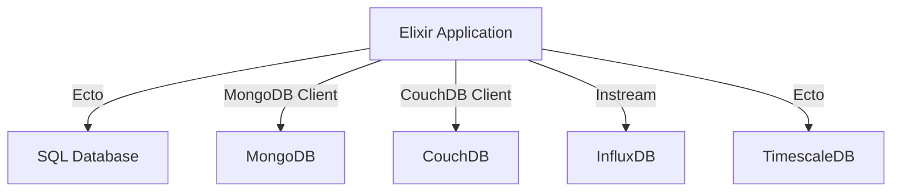

## 16.3. Integrating with Data Stores (SQL, NoSQL, Time-Series Databases)

In the realm of data engineering, integrating with various types of databases is a crucial skill for building robust applications. Elixir, with its functional programming paradigm and powerful concurrency model, offers unique advantages for managing data interactions. In this section, we'll explore how to integrate Elixir with SQL, NoSQL, and Time-Series databases, leveraging Elixir's capabilities to create scalable and efficient data-driven applications.

### SQL Databases with Ecto

Ecto is Elixir's primary database wrapper and query generator, providing a comprehensive suite for interacting with SQL databases like PostgreSQL, MySQL, and others. It offers a rich set of features for defining schemas, writing queries, and managing database migrations.

#### Connecting to SQL Databases

To connect to an SQL database using Ecto, you need to define a repository module that serves as the interface to your database. Here's a basic setup for connecting to a PostgreSQL database:

```elixir
# mix.exs
defp deps do
  [
    {:ecto_sql, "~> 3.6"},
    {:postgrex, ">= 0.0.0"}
  ]
end
```

```elixir
# config/config.exs
config :my_app, MyApp.Repo,
  username: "postgres",
  password: "postgres",
  database: "my_app_db",
  hostname: "localhost",
  show_sensitive_data_on_connection_error: true,
  pool_size: 10
```

```elixir
# lib/my_app/repo.ex
defmodule MyApp.Repo do
  use Ecto.Repo,
    otp_app: :my_app,
    adapter: Ecto.Adapters.Postgres
end
```

#### Writing Queries and Managing Migrations

Ecto provides a DSL for writing queries that are both expressive and type-safe. Here's an example of a simple query to fetch users from a `users` table:

```elixir
import Ecto.Query

def get_users do
  MyApp.Repo.all(from u in "users", select: u)
end
```

For managing database migrations, Ecto offers a set of mix tasks to create, run, and rollback migrations. Here's how you can create a migration to add a new table:

```bash
mix ecto.gen.migration create_users
```

```elixir
defmodule MyApp.Repo.Migrations.CreateUsers do
  use Ecto.Migration

  def change do
    create table(:users) do
      add :name, :string
      add :email, :string

      timestamps()
    end
  end
end
```

### NoSQL Databases

NoSQL databases offer flexible schemas and are often used for applications requiring high scalability and performance. Elixir can integrate with popular NoSQL databases like MongoDB and CouchDB using appropriate clients.

#### Integrating with MongoDB

To connect to MongoDB, you can use the `mongodb` driver for Elixir. Here's a basic example of how to set up and interact with a MongoDB database:

```elixir
# mix.exs
defp deps do
  [
    {:mongodb, "~> 0.5.1"}
  ]
end
```

```elixir
# lib/my_app/mongo.ex
defmodule MyApp.Mongo do
  use Mongo

  def start_link do
    Mongo.start_link(url: "mongodb://localhost:27017/my_db")
  end

  def insert_document(collection, document) do
    {:ok, conn} = start_link()
    Mongo.insert_one(conn, collection, document)
  end
end
```

#### Integrating with CouchDB

CouchDB is another popular NoSQL database that uses a document-oriented model. You can use the `couchdb` client to interact with CouchDB:

```elixir
# mix.exs
defp deps do
  [
    {:couchdb, "~> 0.1.0"}
  ]
end
```

```elixir
# lib/my_app/couch.ex
defmodule MyApp.Couch do
  use CouchDB

  def create_document(db, doc) do
    {:ok, conn} = CouchDB.start_link(url: "http://localhost:5984")
    CouchDB.put(conn, db, doc)
  end
end
```

### Time-Series Databases

Time-Series databases are optimized for handling time-stamped data, making them ideal for applications like monitoring, IoT, and analytics. Elixir can integrate with Time-Series databases like InfluxDB and TimescaleDB.

#### Working with InfluxDB

InfluxDB is a popular choice for time-series data. You can use the `instream` library to interact with InfluxDB:

```elixir
# mix.exs
defp deps do
  [
    {:instream, "~> 0.23"}
  ]
end
```

```elixir
# lib/my_app/influx.ex
defmodule MyApp.Influx do
  use Instream.Connection, otp_app: :my_app

  def write_data(measurement, fields, tags \\ %{}) do
    point = %{
      measurement: measurement,
      fields: fields,
      tags: tags,
      timestamp: :os.system_time(:second)
    }

    MyApp.Influx.write(point)
  end
end
```

#### Working with TimescaleDB

TimescaleDB is an extension of PostgreSQL that provides time-series capabilities. You can use Ecto to interact with TimescaleDB as you would with any PostgreSQL database, taking advantage of TimescaleDB's time-series features.

### Choosing the Right Database

Selecting the appropriate database for your application depends on several factors, including data models, scalability, and performance needs. Here's a brief guide to help you make an informed decision:

- **SQL Databases**: Ideal for structured data with complex relationships. Use when you need ACID compliance and strong consistency.
- **NoSQL Databases**: Suitable for unstructured or semi-structured data. Opt for NoSQL when you need high scalability and flexible schemas.
- **Time-Series Databases**: Best for applications that require efficient handling of time-stamped data. Choose these for monitoring, analytics, and IoT applications.

### Visualizing Database Integration

To better understand how Elixir interacts with different types of databases, let's visualize the architecture using a Mermaid.js diagram.



**Diagram Description**: This diagram illustrates how an Elixir application can connect to various databases using different libraries and clients. Ecto is used for SQL and TimescaleDB, while specific clients are used for MongoDB, CouchDB, and InfluxDB.

### Try It Yourself

Experiment with the code examples provided by modifying them to suit your specific use case. For instance, try changing the database configurations, adding new fields to your schemas, or writing more complex queries. This hands-on approach will deepen your understanding of database integration in Elixir.

### Knowledge Check

- What are the key differences between SQL and NoSQL databases?
- How does Ecto facilitate interaction with SQL databases in Elixir?
- What are the advantages of using Time-Series databases for time-stamped data?

### Summary

In this section, we've explored how to integrate Elixir with SQL, NoSQL, and Time-Series databases. By leveraging Elixir's powerful features and the right libraries, you can build scalable and efficient data-driven applications. Remember, the choice of database should align with your application's specific needs, considering factors like data structure, scalability, and performance.

## Quiz: Integrating with Data Stores (SQL, NoSQL, Time-Series Databases)



### What is Ecto primarily used for in Elixir?

- [x] Interacting with SQL databases
- [ ] Managing NoSQL databases
- [ ] Handling time-series data
- [ ] Building web applications

> **Explanation:** Ecto is a database wrapper and query generator for SQL databases in Elixir.

### Which library is used to connect Elixir to MongoDB?

- [x] mongodb
- [ ] ecto_sql
- [ ] instream
- [ ] couchdb

> **Explanation:** The `mongodb` library is used to connect Elixir applications to MongoDB databases.

### What type of data is best suited for Time-Series databases?

- [x] Time-stamped data
- [ ] Unstructured data
- [ ] Relational data
- [ ] Binary data

> **Explanation:** Time-Series databases are optimized for handling time-stamped data, making them ideal for monitoring and analytics.

### Which of the following is a NoSQL database?

- [x] MongoDB
- [ ] PostgreSQL
- [ ] TimescaleDB
- [ ] MySQL

> **Explanation:** MongoDB is a NoSQL database known for its flexible schema and scalability.

### What is the primary advantage of using NoSQL databases?

- [x] High scalability and flexible schemas
- [ ] Strong consistency and ACID compliance
- [ ] Efficient handling of time-stamped data
- [ ] Complex relationship management

> **Explanation:** NoSQL databases offer high scalability and flexible schemas, making them suitable for unstructured data.

### How can Elixir interact with InfluxDB?

- [x] Using the Instream library
- [ ] Through Ecto
- [ ] Via the MongoDB client
- [ ] Using the CouchDB client

> **Explanation:** The Instream library is used to connect Elixir applications to InfluxDB for time-series data.

### Which database is an extension of PostgreSQL for time-series data?

- [x] TimescaleDB
- [ ] MongoDB
- [ ] CouchDB
- [ ] InfluxDB

> **Explanation:** TimescaleDB is an extension of PostgreSQL that provides time-series capabilities.

### What is the role of a repository module in Ecto?

- [x] It serves as the interface to the database.
- [ ] It manages NoSQL database connections.
- [ ] It handles time-series data processing.
- [ ] It builds web application interfaces.

> **Explanation:** In Ecto, a repository module acts as the interface to the database, managing connections and queries.

### Which of the following is a key feature of SQL databases?

- [x] ACID compliance
- [ ] Flexible schemas
- [ ] High scalability
- [ ] Time-stamped data handling

> **Explanation:** SQL databases are known for their ACID compliance, ensuring strong consistency and reliability.

### True or False: Ecto can be used to interact with both SQL and NoSQL databases.

- [ ] True
- [x] False

> **Explanation:** Ecto is primarily designed for interacting with SQL databases, not NoSQL databases.



Remember, integrating with data stores is a critical aspect of building modern applications. As you continue to explore Elixir's capabilities, keep experimenting with different databases and libraries to find the best fit for your projects. Stay curious and enjoy the journey!
