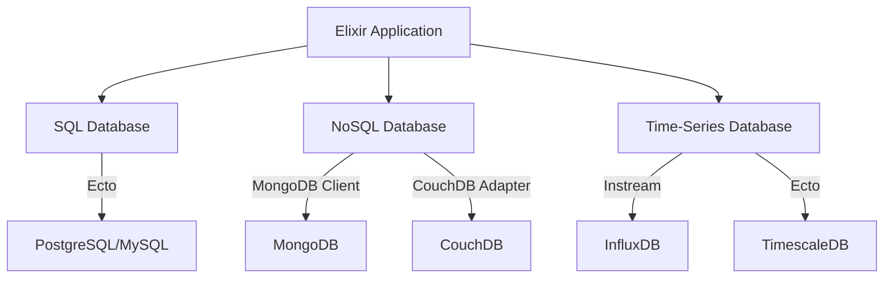

## 16.3. Integrating with Data Stores (SQL, NoSQL, Time-Series Databases)

In today's data-driven world, integrating with various types of databases is crucial for building scalable and efficient applications. Elixir, with its powerful concurrency model and functional programming paradigm, offers robust tools and libraries to connect and interact with SQL, NoSQL, and Time-Series databases. In this section, we will explore how to effectively integrate Elixir with these databases, leveraging the strengths of each to meet your application's needs.

### SQL Databases with Ecto

**Ecto** is a domain-specific language for writing queries and interacting with databases in Elixir. It is designed to work seamlessly with SQL databases like PostgreSQL, MySQL, and others. Ecto provides a comprehensive suite of tools for defining schemas, writing queries, and managing database migrations.

#### Connecting to PostgreSQL, MySQL, and Others

To connect to a SQL database using Ecto, you need to add the appropriate database adapter to your project. For PostgreSQL, you can use `postgrex`, and for MySQL, `myxql`. Let's walk through the steps of setting up a connection to a PostgreSQL database.

1. **Add Dependencies**

   First, add `ecto` and `postgrex` to your `mix.exs` file:

   ```elixir
   defp deps do
     [
       {:ecto_sql, "~> 3.6"},
       {:postgrex, ">= 0.0.0"}
     ]
   end
   ```

2. **Configure the Repo**

   Next, configure your Ecto repository in `config/config.exs`:

   ```elixir
   config :my_app, MyApp.Repo,
     username: "postgres",
     password: "postgres",
     database: "my_app_db",
     hostname: "localhost",
     pool_size: 10
   ```

3. **Define the Repo Module**

   Create a module for your repository:

   ```elixir
   defmodule MyApp.Repo do
     use Ecto.Repo,
       otp_app: :my_app,
       adapter: Ecto.Adapters.Postgres
   end
   ```

4. **Create and Migrate the Database**

   Use Mix tasks to create and migrate your database:

   ```bash
   mix ecto.create
   mix ecto.migrate
   ```

#### Writing Queries and Managing Migrations

Ecto allows you to define schemas and write queries in a way that is both expressive and type-safe. Here's how you can define a schema and perform basic CRUD operations:

1. **Define a Schema**

   Create a schema for a `User`:

   ```elixir
   defmodule MyApp.User do
     use Ecto.Schema

     schema "users" do
       field :name, :string
       field :email, :string
       timestamps()
     end
   end
   ```

2. **Perform CRUD Operations**

   Insert a new user:

   ```elixir
   user = %MyApp.User{name: "Alice", email: "alice@example.com"}
   {:ok, user} = MyApp.Repo.insert(user)
   ```

   Query users:

   ```elixir
   users = MyApp.Repo.all(MyApp.User)
   ```

   Update a user:

   ```elixir
   user = MyApp.Repo.get(MyApp.User, 1)
   changeset = Ecto.Changeset.change(user, name: "Alice Smith")
   {:ok, user} = MyApp.Repo.update(changeset)
   ```

   Delete a user:

   ```elixir
   user = MyApp.Repo.get(MyApp.User, 1)
   MyApp.Repo.delete(user)
   ```

3. **Manage Migrations**

   Create a migration file:

   ```bash
   mix ecto.gen.migration create_users
   ```

   Define the migration:

   ```elixir
   defmodule MyApp.Repo.Migrations.CreateUsers do
     use Ecto.Migration

     def change do
       create table(:users) do
         add :name, :string
         add :email, :string
         timestamps()
       end
     end
   end
   ```

   Run the migration:

   ```bash
   mix ecto.migrate
   ```

### NoSQL Databases

NoSQL databases offer flexible schemas and are designed to handle large volumes of unstructured data. Elixir can integrate with popular NoSQL databases like MongoDB and CouchDB using appropriate clients.

#### Integrating with MongoDB

To integrate with MongoDB, you can use the `mongodb` driver along with the `mongodb_ecto` adapter. Here's how you can set it up:

1. **Add Dependencies**

   Add `mongodb` and `mongodb_ecto` to your `mix.exs` file:

   ```elixir
   defp deps do
     [
       {:mongodb, "~> 0.5.1"},
       {:mongodb_ecto, "~> 0.3"}
     ]
   end
   ```

2. **Configure the Repo**

   Configure your MongoDB repository in `config/config.exs`:

   ```elixir
   config :my_app, MyApp.Repo,
     adapter: Mongo.Ecto,
     database: "my_app_db",
     hostname: "localhost"
   ```

3. **Define the Repo Module**

   Create a module for your repository:

   ```elixir
   defmodule MyApp.Repo do
     use Ecto.Repo,
       otp_app: :my_app,
       adapter: Mongo.Ecto
   end
   ```

4. **Perform CRUD Operations**

   Insert a new document:

   ```elixir
   user = %MyApp.User{name: "Bob", email: "bob@example.com"}
   {:ok, user} = MyApp.Repo.insert(user)
   ```

   Query documents:

   ```elixir
   users = MyApp.Repo.all(MyApp.User)
   ```

   Update a document:

   ```elixir
   user = MyApp.Repo.get(MyApp.User, "605c72f1e3b0f1d3c8f7e7b1")
   changeset = Ecto.Changeset.change(user, name: "Bob Smith")
   {:ok, user} = MyApp.Repo.update(changeset)
   ```

   Delete a document:

   ```elixir
   user = MyApp.Repo.get(MyApp.User, "605c72f1e3b0f1d3c8f7e7b1")
   MyApp.Repo.delete(user)
   ```

#### Integrating with CouchDB

CouchDB can be integrated using the `couchdb_adapter`. Here's a quick guide:

1. **Add Dependencies**

   Add the `couchdb_adapter` to your `mix.exs` file:

   ```elixir
   defp deps do
     [
       {:couchdb_adapter, "~> 0.1.0"}
     ]
   end
   ```

2. **Configure the Repo**

   Configure your CouchDB repository in `config/config.exs`:

   ```elixir
   config :my_app, MyApp.Repo,
     adapter: CouchDB.Adapter,
     database: "my_app_db",
     hostname: "localhost"
   ```

3. **Define the Repo Module**

   Create a module for your repository:

   ```elixir
   defmodule MyApp.Repo do
     use Ecto.Repo,
       otp_app: :my_app,
       adapter: CouchDB.Adapter
   end
   ```

4. **Perform CRUD Operations**

   The CRUD operations are similar to those in MongoDB, with slight differences in how documents are handled due to CouchDB's unique features.

### Time-Series Databases

Time-Series databases are optimized for handling time-stamped data, making them ideal for applications that require real-time analytics and monitoring. Elixir can integrate with Time-Series databases like InfluxDB and TimescaleDB.

#### Working with InfluxDB

InfluxDB is a popular choice for time-series data. You can use the `instream` library to interact with InfluxDB:

1. **Add Dependencies**

   Add `instream` to your `mix.exs` file:

   ```elixir
   defp deps do
     [
       {:instream, "~> 0.23"}
     ]
   end
   ```

2. **Configure the Connection**

   Configure your InfluxDB connection in `config/config.exs`:

   ```elixir
   config :my_app, MyApp.InfluxDB,
     host: "localhost",
     port: 8086,
     database: "my_app_db"
   ```

3. **Define the Connection Module**

   Create a module for your InfluxDB connection:

   ```elixir
   defmodule MyApp.InfluxDB do
     use Instream.Connection,
       otp_app: :my_app
   end
   ```

4. **Write and Query Data**

   Write data to InfluxDB:

   ```elixir
   point = %{
     measurement: "temperature",
     tags: %{location: "office"},
     fields: %{value: 22.5},
     timestamp: :os.system_time(:second)
   }

   MyApp.InfluxDB.write(point)
   ```

   Query data from InfluxDB:

   ```elixir
   query = "SELECT * FROM temperature WHERE location = 'office'"
   response = MyApp.InfluxDB.query(query)
   ```

#### Working with TimescaleDB

TimescaleDB is a PostgreSQL extension designed for time-series data. You can use Ecto to interact with TimescaleDB as you would with any PostgreSQL database, with additional support for time-series specific features.

1. **Add Dependencies**

   TimescaleDB uses the same dependencies as PostgreSQL, so ensure `ecto_sql` and `postgrex` are included in your `mix.exs` file.

2. **Configure the Repo**

   Configure your TimescaleDB repository in `config/config.exs`:

   ```elixir
   config :my_app, MyApp.Repo,
     username: "postgres",
     password: "postgres",
     database: "my_app_db",
     hostname: "localhost",
     pool_size: 10
   ```

3. **Define the Repo Module**

   Create a module for your repository:

   ```elixir
   defmodule MyApp.Repo do
     use Ecto.Repo,
       otp_app: :my_app,
       adapter: Ecto.Adapters.Postgres
   end
   ```

4. **Create and Manage Hypertables**

   Use SQL queries to create and manage hypertables, which are a core feature of TimescaleDB for handling time-series data.

   ```sql
   CREATE TABLE temperature (
     time TIMESTAMPTZ NOT NULL,
     location TEXT NOT NULL,
     value DOUBLE PRECISION
   );

   SELECT create_hypertable('temperature', 'time');
   ```

### Choosing the Right Database

When choosing a database for your application, consider the following factors:

- **Data Models**: SQL databases are ideal for structured data with complex relationships, while NoSQL databases are better suited for flexible schemas. Time-Series databases are optimized for time-stamped data.
- **Scalability**: NoSQL and Time-Series databases often offer better horizontal scalability than traditional SQL databases.
- **Performance Needs**: Consider the read and write performance requirements of your application. Time-Series databases excel in handling high write loads and real-time analytics.
- **Community and Support**: Evaluate the community support and available resources for each database technology.

### Visualizing Database Integration

Below is a diagram illustrating the integration of Elixir with different types of databases:


```mermaid
graph TD;
    A[Elixir Application] --> B[SQL Database]
    A --> C[NoSQL Database]
    A --> D[Time-Series Database]
    B -->|Ecto| E[PostgreSQL/MySQL]
    C -->|MongoDB Client| F[MongoDB]
    C -->|CouchDB Adapter| G[CouchDB]
    D -->|Instream| H[InfluxDB]
    D -->|Ecto| I[TimescaleDB]
```

**Diagram Description:** This diagram illustrates how an Elixir application can integrate with SQL, NoSQL, and Time-Series databases using various libraries and adapters.

### Try It Yourself

To deepen your understanding, try modifying the code examples provided:

- **Experiment with Different Queries**: Modify the queries to filter data based on different criteria or to aggregate data.
- **Integrate with a New Database**: Try integrating with another database not covered in this guide, such as Redis or Cassandra.
- **Optimize Performance**: Experiment with different configurations and indexes to optimize database performance.

### Knowledge Check

- **What are the main differences between SQL and NoSQL databases?**
- **How does Ecto facilitate database migrations in Elixir?**
- **What are the advantages of using Time-Series databases?**

### Summary

In this section, we've explored how to integrate Elixir with SQL, NoSQL, and Time-Series databases. By leveraging the right tools and libraries, you can build robust and scalable applications that efficiently handle various types of data. Remember, the choice of database should align with your application's specific needs and requirements.

## Quiz Time!



### What is Ecto primarily used for in Elixir?

- [x] Interacting with SQL databases
- [ ] Building web applications
- [ ] Creating user interfaces
- [ ] Managing server configurations

> **Explanation:** Ecto is a domain-specific language for interacting with SQL databases in Elixir.

### Which library would you use to connect Elixir to a PostgreSQL database?

- [x] postgrex
- [ ] mongodb
- [ ] instream
- [ ] couchdb_adapter

> **Explanation:** `postgrex` is the library used to connect Elixir to PostgreSQL databases.

### What is a key feature of NoSQL databases?

- [x] Flexible schemas
- [ ] Complex relationships
- [ ] Fixed table structures
- [ ] Strong ACID compliance

> **Explanation:** NoSQL databases offer flexible schemas, making them suitable for unstructured data.

### Which library is used to interact with InfluxDB in Elixir?

- [x] instream
- [ ] postgrex
- [ ] mongodb
- [ ] couchdb_adapter

> **Explanation:** `instream` is the library used to interact with InfluxDB in Elixir.

### What is a hypertable in TimescaleDB?

- [x] A table optimized for time-series data
- [ ] A relational database table
- [ ] A NoSQL document
- [ ] A type of index

> **Explanation:** A hypertable in TimescaleDB is optimized for handling time-series data.

### Which database is optimized for time-stamped data?

- [x] Time-Series databases
- [ ] SQL databases
- [ ] NoSQL databases
- [ ] Graph databases

> **Explanation:** Time-Series databases are specifically optimized for handling time-stamped data.

### What is a key advantage of using NoSQL databases?

- [x] Horizontal scalability
- [ ] Strong ACID compliance
- [ ] Complex joins
- [ ] Fixed schemas

> **Explanation:** NoSQL databases are known for their horizontal scalability.

### Which Elixir library is used for managing database migrations?

- [x] Ecto
- [ ] Instream
- [ ] MongoDB
- [ ] CouchDB

> **Explanation:** Ecto provides tools for managing database migrations in Elixir.

### How does Ecto handle database connections?

- [x] Through a repository module
- [ ] Directly in the schema
- [ ] Using a global variable
- [ ] Through a configuration file only

> **Explanation:** Ecto uses a repository module to handle database connections.

### True or False: TimescaleDB is a NoSQL database.

- [ ] True
- [x] False

> **Explanation:** TimescaleDB is a time-series database built as a PostgreSQL extension, not a NoSQL database.



Remember, this is just the beginning of your journey with Elixir and databases. As you progress, you'll discover more advanced techniques and optimizations. Keep experimenting, stay curious, and enjoy the journey!
