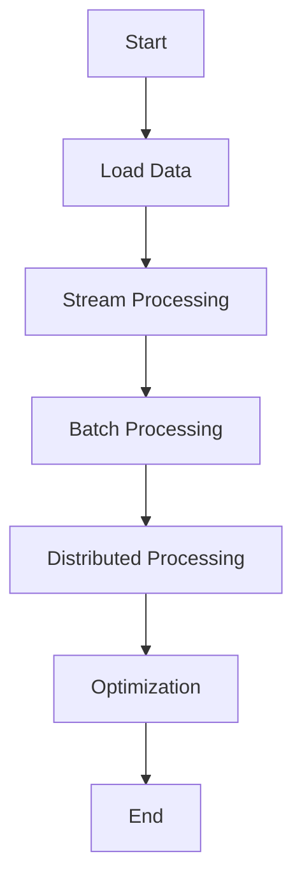

## 16.4. Handling Large Data Sets Efficiently

In the realm of data engineering, efficiently handling large data sets is a critical skill. Elixir, with its functional programming paradigm and robust concurrency model, provides powerful tools to manage and process large volumes of data. In this section, we will explore advanced techniques for handling large data sets in Elixir, focusing on memory management, batch processing, and distributed processing. We will also delve into optimization techniques to ensure your applications run smoothly and efficiently.

### Memory Management

Efficient memory management is crucial when dealing with large data sets. Elixir offers several features that help manage memory usage effectively.

#### Using Streams and Lazy Evaluation

Streams in Elixir allow for lazy evaluation, meaning data is processed only when needed. This approach can significantly reduce memory consumption when working with large data sets.

```elixir
# Example of using streams for lazy evaluation
defmodule LargeDataSetProcessor do
  def process_large_file(file_path) do
    File.stream!(file_path)
    |> Stream.map(&String.trim/1)
    |> Stream.filter(&(&1 != ""))
    |> Stream.map(&String.upcase/1)
    |> Enum.to_list()
  end
end

# Usage
LargeDataSetProcessor.process_large_file("large_data.txt")
```

In this example, `File.stream!/1` creates a stream from a file, allowing us to process each line lazily. The `Stream.map/2` and `Stream.filter/2` functions transform and filter the data without loading the entire file into memory.

#### Benefits of Lazy Evaluation

- **Reduced Memory Usage**: Only the necessary data is loaded into memory.
- **Improved Performance**: Processing is done on-the-fly, reducing the need for large memory allocations.
- **Scalability**: Easily handle data sets that exceed available memory.

### Batch Processing

Batch processing involves dividing large data sets into smaller chunks, or batches, and processing each batch independently. This approach can help optimize resource usage and improve performance.

#### Implementing Batch Processing

```elixir
defmodule BatchProcessor do
  def process_in_batches(data, batch_size) do
    data
    |> Enum.chunk_every(batch_size)
    |> Enum.each(&process_batch/1)
  end

  defp process_batch(batch) do
    # Process each batch
    IO.inspect(batch)
  end
end

# Usage
data = Enum.to_list(1..1000)
BatchProcessor.process_in_batches(data, 100)
```

In this example, `Enum.chunk_every/2` divides the data into batches of the specified size. Each batch is then processed independently.

#### Advantages of Batch Processing

- **Resource Optimization**: Limits the amount of data in memory at any given time.
- **Parallel Processing**: Batches can be processed concurrently, leveraging Elixir's concurrency model.
- **Error Handling**: Easier to isolate and handle errors within individual batches.

### Distributed Processing

Distributed processing involves spreading the workload across multiple nodes or machines, allowing for parallel execution and improved performance.

#### Leveraging Clusters

Elixir's distributed nature makes it well-suited for distributed processing. By setting up a cluster, you can distribute tasks across multiple nodes.

```elixir
defmodule DistributedProcessor do
  def distribute_tasks(data, nodes) do
    Enum.each(data, fn task ->
      node = Enum.random(nodes)
      :rpc.call(node, __MODULE__, :process_task, [task])
    end)
  end

  def process_task(task) do
    # Process the task
    IO.inspect(task)
  end
end

# Usage
nodes = [:node1@localhost, :node2@localhost]
data = Enum.to_list(1..100)
DistributedProcessor.distribute_tasks(data, nodes)
```

In this example, tasks are randomly distributed across the available nodes using `:rpc.call/4`, which allows remote procedure calls.

#### Benefits of Distributed Processing

- **Scalability**: Easily scale your application by adding more nodes.
- **Fault Tolerance**: Distribute tasks to ensure continued operation even if some nodes fail.
- **Improved Performance**: Parallel execution across nodes reduces processing time.

### Optimization Techniques

To ensure efficient handling of large data sets, it's essential to optimize your code and identify potential bottlenecks.

#### Profiling and Identifying Bottlenecks

Profiling tools like `:fprof` and `:eprof` can help identify performance bottlenecks in your application.

```elixir
# Example of using :fprof for profiling
:fprof.start()
:fprof.trace([:start, {:procs, self()}])
# Run the function you want to profile
LargeDataSetProcessor.process_large_file("large_data.txt")
:fprof.trace(:stop)
:fprof.profile()
:fprof.analyse([:totals])
```

#### Utilizing Efficient Data Structures and Algorithms

Choosing the right data structures and algorithms can significantly impact performance.

- **ETS (Erlang Term Storage)**: Use ETS for fast in-memory storage and retrieval of large data sets.
- **Efficient Algorithms**: Implement algorithms with optimal time and space complexity.

### Visualizing Data Processing

To better understand the flow of data processing in Elixir, let's visualize the process using a flowchart.



This flowchart illustrates the sequential steps involved in handling large data sets efficiently in Elixir.

### Try It Yourself

Experiment with the code examples provided. Try modifying the batch size in the batch processing example or adding more nodes in the distributed processing example. Observe how these changes affect performance and resource usage.

### References and Links

- [Elixir Streams Documentation](https://hexdocs.pm/elixir/Stream.html)
- [Erlang Term Storage (ETS) Documentation](https://erlang.org/doc/man/ets.html)
- [Elixir Distributed Systems](https://elixir-lang.org/getting-started/mix-otp/distributed-tasks.html)

### Knowledge Check

1. What is lazy evaluation, and how does it benefit memory management?
2. How can batch processing improve the performance of data processing tasks?
3. Describe the advantages of distributed processing in Elixir.
4. What tools can be used to profile and identify bottlenecks in Elixir applications?
5. How can ETS be utilized for efficient data processing?

### Embrace the Journey

Remember, mastering the art of handling large data sets is an ongoing journey. As you continue to explore Elixir's capabilities, you'll discover new ways to optimize and enhance your applications. Keep experimenting, stay curious, and enjoy the process!

## Quiz: Handling Large Data Sets Efficiently



### What is the primary benefit of using streams in Elixir?

- [x] Reduced memory usage through lazy evaluation
- [ ] Faster data processing
- [ ] Improved error handling
- [ ] Enhanced security

> **Explanation:** Streams in Elixir allow for lazy evaluation, which means data is processed only when needed, reducing memory usage.

### How does batch processing optimize resource usage?

- [x] By processing data in smaller chunks
- [ ] By increasing the processing speed
- [ ] By using more memory
- [ ] By reducing the number of nodes

> **Explanation:** Batch processing divides data into smaller chunks, limiting the amount of data in memory at any given time, optimizing resource usage.

### What is a key advantage of distributed processing in Elixir?

- [x] Scalability and fault tolerance
- [ ] Simplified code structure
- [ ] Reduced memory usage
- [ ] Improved security

> **Explanation:** Distributed processing allows tasks to be spread across multiple nodes, enhancing scalability and fault tolerance.

### Which tool can be used for profiling Elixir applications?

- [x] :fprof
- [ ] :ets
- [ ] :rpc
- [ ] :stream

> **Explanation:** :fprof is a profiling tool in Elixir that helps identify performance bottlenecks.

### How can ETS be used in Elixir?

- [x] For fast in-memory storage and retrieval
- [ ] For distributed processing
- [ ] For batch processing
- [ ] For error handling

> **Explanation:** ETS (Erlang Term Storage) is used for fast in-memory storage and retrieval of large data sets in Elixir.

### What is the purpose of lazy evaluation in Elixir?

- [x] To process data only when needed
- [ ] To increase processing speed
- [ ] To enhance security
- [ ] To simplify code

> **Explanation:** Lazy evaluation processes data only when needed, reducing memory usage and improving performance.

### What is a benefit of using efficient algorithms in data processing?

- [x] Improved time and space complexity
- [ ] Increased memory usage
- [ ] Simplified code
- [ ] Enhanced security

> **Explanation:** Efficient algorithms improve time and space complexity, leading to better performance in data processing.

### What does :rpc.call/4 do in Elixir?

- [x] Allows remote procedure calls
- [ ] Profiles application performance
- [ ] Stores data in memory
- [ ] Processes data in batches

> **Explanation:** :rpc.call/4 is used for remote procedure calls, enabling distributed processing in Elixir.

### How can you optimize Elixir applications for large data sets?

- [x] By using streams, batch processing, and distributed processing
- [ ] By increasing memory usage
- [ ] By simplifying code structure
- [ ] By enhancing security

> **Explanation:** Optimizing Elixir applications for large data sets involves using streams, batch processing, and distributed processing to manage resources efficiently.

### True or False: Distributed processing in Elixir can enhance fault tolerance.

- [x] True
- [ ] False

> **Explanation:** Distributed processing spreads tasks across multiple nodes, ensuring continued operation even if some nodes fail, enhancing fault tolerance.


