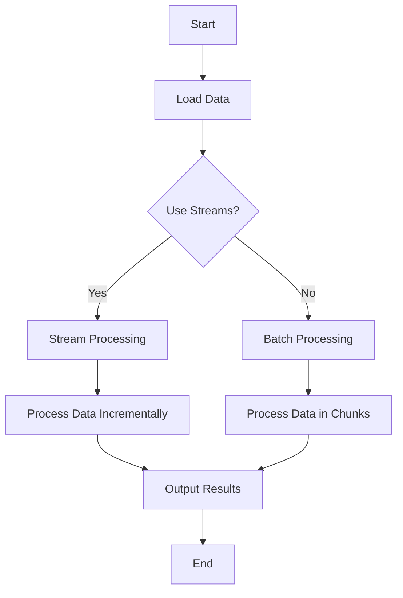

## 16.4. Handling Large Data Sets Efficiently

In the world of data engineering, efficiently handling large data sets is crucial for building scalable and performant applications. Elixir, with its functional programming paradigm and powerful concurrency model, offers several techniques to manage large data volumes effectively. In this section, we'll explore memory management, batch processing, distributed processing, and optimization techniques to handle large data sets efficiently in Elixir.

### Memory Management

Handling large data sets often requires careful memory management to avoid overwhelming system resources. Elixir provides several tools and techniques to manage memory efficiently.

#### Using Streams and Lazy Evaluation

Elixir's streams allow for lazy evaluation, which means data is processed only when needed. This approach is particularly useful when dealing with large data sets, as it minimizes memory usage by processing data incrementally.

```elixir
# Using Stream to lazily process a large list
large_list = 1..1_000_000

# Define a stream that processes the list lazily
stream = Stream.map(large_list, fn x -> x * 2 end)

# Take the first 10 elements from the stream
Enum.take(stream, 10)
# Output: [2, 4, 6, 8, 10, 12, 14, 16, 18, 20]
```

In this example, the `Stream.map/2` function creates a lazy enumerable that processes elements only when they are needed, reducing memory consumption.

#### Benefits of Lazy Evaluation

- **Reduced Memory Usage**: By processing data incrementally, you avoid loading the entire data set into memory.
- **Improved Performance**: Lazy evaluation can lead to faster execution times as operations are performed only when necessary.

### Batch Processing

Batch processing involves processing data in chunks or batches rather than all at once. This technique can significantly optimize resource usage and improve performance.

#### Implementing Batch Processing

To implement batch processing in Elixir, you can use the `Enum.chunk_every/2` function to divide data into smaller, manageable chunks.

```elixir
# Chunk the list into batches of 1000 elements each
batches = Enum.chunk_every(1..10_000, 1000)

# Process each batch
Enum.each(batches, fn batch ->
  # Perform operations on each batch
  IO.inspect(Enum.sum(batch))
end)
```

#### Advantages of Batch Processing

- **Resource Optimization**: By processing data in smaller chunks, you can better manage system resources and avoid bottlenecks.
- **Scalability**: Batch processing allows your application to handle larger data sets by distributing the workload over time.

### Distributed Processing

Elixir's concurrency model and the BEAM virtual machine make it well-suited for distributed processing. By leveraging clusters, you can distribute the workload across multiple nodes, improving scalability and fault tolerance.

#### Leveraging Clusters

To distribute processing across nodes, you can use Elixir's built-in support for distributed computing. Here's a basic example of setting up a distributed task:

```elixir
# Start a node
Node.start(:node1@localhost)

# Connect to another node
Node.connect(:node2@localhost)

# Execute a task on the remote node
:rpc.call(:node2@localhost, Enum, :sum, [1..1_000_000])
```

#### Benefits of Distributed Processing

- **Scalability**: Distributing tasks across multiple nodes allows your application to scale horizontally.
- **Fault Tolerance**: Distributed systems can continue operating even if some nodes fail, improving reliability.

### Optimization Techniques

Optimizing your Elixir application involves identifying bottlenecks and utilizing efficient data structures and algorithms.

#### Profiling and Identifying Bottlenecks

Profiling tools like `:fprof` and `:eprof` can help you identify performance bottlenecks in your application.

```elixir
# Example of using :fprof to profile a function
:fprof.apply(&Enum.sum/1, [1..1_000_000])
:fprof.profile()
:fprof.analyse()
```

#### Utilizing Efficient Data Structures and Algorithms

Choosing the right data structures and algorithms can significantly impact performance. For example, using ETS (Erlang Term Storage) for in-memory data storage can improve access times for large data sets.

```elixir
# Create an ETS table
table = :ets.new(:my_table, [:set, :public])

# Insert data into the table
:ets.insert(table, {:key, "value"})

# Retrieve data from the table
:ets.lookup(table, :key)
```

#### Key Considerations

- **Algorithm Complexity**: Choose algorithms with lower time complexity for better performance.
- **Data Structure Suitability**: Select data structures that align with your application's access patterns and requirements.

### Visualizing Data Processing Techniques

To better understand the flow of data processing in Elixir, let's visualize the process using a Mermaid.js diagram.


```mermaid
graph TD;
    A[Start] --> B[Load Data]
    B --> C{Use Streams?}
    C -->|Yes| D[Stream Processing]
    C -->|No| E[Batch Processing]
    D --> F[Process Data Incrementally]
    E --> G[Process Data in Chunks]
    F --> H[Output Results]
    G --> H
    H --> I[End]
```

**Diagram Description**: This flowchart illustrates the decision-making process for handling large data sets in Elixir. Depending on whether streams are used, data is processed either incrementally or in chunks before outputting results.

### Try It Yourself

To solidify your understanding, try modifying the provided code examples. Experiment with different batch sizes, use streams for various operations, and explore distributed processing by setting up multiple nodes.

### Knowledge Check

- What are the advantages of using streams for data processing in Elixir?
- How does batch processing help in managing large data sets?
- What are the benefits of distributed processing in Elixir?
- How can you profile an Elixir application to identify performance bottlenecks?
- Why is it important to choose the right data structures for your application?

### Conclusion

Efficiently handling large data sets in Elixir requires a combination of memory management, batch processing, distributed processing, and optimization techniques. By leveraging Elixir's powerful features and following best practices, you can build scalable and performant applications capable of handling large volumes of data.

Remember, this is just the beginning. As you progress, you'll discover more advanced techniques and tools to further enhance your data processing capabilities. Keep experimenting, stay curious, and enjoy the journey!

## Quiz Time!



### What is the primary benefit of using streams in Elixir for large data sets?

- [x] Reduced memory usage
- [ ] Faster execution time
- [ ] Easier code readability
- [ ] Improved security

> **Explanation:** Streams allow for lazy evaluation, which processes data only when needed, reducing memory usage.

### How does batch processing optimize resource usage?

- [x] By processing data in smaller chunks
- [ ] By using more CPU resources
- [ ] By increasing memory allocation
- [ ] By reducing code complexity

> **Explanation:** Batch processing divides data into smaller chunks, allowing for better resource management and avoiding bottlenecks.

### What is a key advantage of distributed processing in Elixir?

- [x] Scalability
- [ ] Simplicity
- [ ] Reduced code complexity
- [ ] Improved code readability

> **Explanation:** Distributed processing allows tasks to be spread across multiple nodes, enhancing scalability.

### Which tool can be used to profile an Elixir application?

- [x] :fprof
- [ ] Stream
- [ ] ETS
- [ ] Enum

> **Explanation:** :fprof is a profiling tool in Elixir that helps identify performance bottlenecks.

### What is the purpose of using ETS in Elixir?

- [x] In-memory data storage
- [ ] Network communication
- [ ] File system access
- [ ] Code compilation

> **Explanation:** ETS (Erlang Term Storage) is used for efficient in-memory data storage and retrieval.

### Which of the following is a benefit of lazy evaluation?

- [x] Reduced memory usage
- [ ] Increased CPU usage
- [ ] Faster disk access
- [ ] Improved network performance

> **Explanation:** Lazy evaluation processes data only when needed, reducing memory usage.

### What does the Enum.chunk_every/2 function do in Elixir?

- [x] Divides data into smaller chunks
- [ ] Combines multiple lists
- [ ] Filters data based on a condition
- [ ] Maps a function over a list

> **Explanation:** Enum.chunk_every/2 divides data into smaller chunks, facilitating batch processing.

### How can you execute a task on a remote node in Elixir?

- [x] Using :rpc.call
- [ ] Using Stream.map
- [ ] Using Enum.each
- [ ] Using ETS

> **Explanation:** :rpc.call is used to execute tasks on remote nodes in a distributed Elixir system.

### What is a key consideration when choosing data structures in Elixir?

- [x] Suitability for access patterns
- [ ] Code readability
- [ ] Network latency
- [ ] Disk space usage

> **Explanation:** Choosing data structures that align with your application's access patterns is crucial for performance.

### True or False: Distributed processing in Elixir improves fault tolerance.

- [x] True
- [ ] False

> **Explanation:** Distributed systems can continue operating even if some nodes fail, improving fault tolerance.


