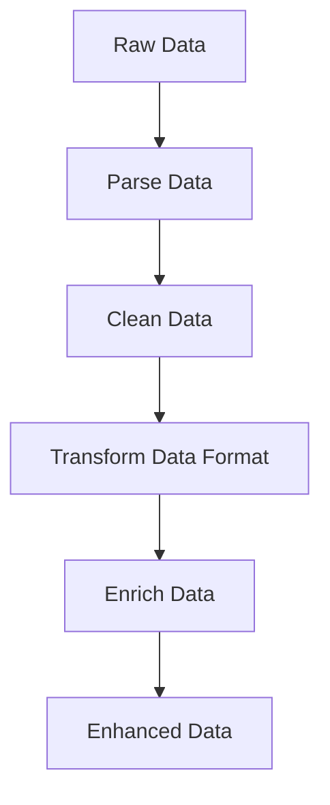

## 16.5. Data Transformation and Enrichment

In the realm of data engineering, data transformation and enrichment are crucial processes that enable the conversion of raw data into meaningful insights. Elixir, with its robust functional programming paradigm and powerful concurrency model, offers a unique set of tools and techniques to perform these tasks efficiently. In this section, we will explore advanced techniques for parsing, cleaning, transforming, and enriching data using Elixir.

### Parsing and Cleaning Data

Data parsing and cleaning are foundational steps in any data processing pipeline. In Elixir, pattern matching and regular expressions are powerful tools that can be leveraged to parse and clean data effectively.

#### Using Pattern Matching and Regular Expressions

Pattern matching is a core feature of Elixir that allows developers to destructure data and extract relevant information with ease. Regular expressions, on the other hand, provide a flexible way to search and manipulate strings based on patterns.

**Example: Parsing a CSV Line**

Let's consider a simple example where we parse a CSV line using pattern matching and regular expressions:

```elixir
defmodule CSVParser do
  def parse_line(line) do
    # Split the line by commas
    line
    |> String.split(",")
    |> Enum.map(&String.trim/1)
  end
end

# Usage
csv_line = "John Doe, 30, johndoe@example.com"
parsed_data = CSVParser.parse_line(csv_line)
IO.inspect(parsed_data) # Output: ["John Doe", "30", "johndoe@example.com"]
```

In this example, we use `String.split/2` to break the CSV line into individual fields and `Enum.map/2` with `String.trim/1` to remove any leading or trailing whitespace.

**Handling Incomplete or Malformed Data Gracefully**

When dealing with real-world data, it's common to encounter incomplete or malformed entries. Elixir's pattern matching can be used to handle such cases gracefully.

**Example: Handling Missing Fields**

```elixir
defmodule SafeCSVParser do
  def parse_line(line) do
    case String.split(line, ",") do
      [name, age, email] -> {:ok, %{name: name, age: age, email: email}}
      _ -> {:error, "Malformed CSV line"}
    end
  end
end

# Usage
csv_line = "Jane Doe, 25"
result = SafeCSVParser.parse_line(csv_line)
IO.inspect(result) # Output: {:error, "Malformed CSV line"}
```

Here, we use a `case` statement to match against the expected number of fields. If the pattern doesn't match, we return an error tuple.

### Transforming Data Formats

Data transformation often involves converting data from one format to another. Elixir provides libraries and functions to facilitate these conversions, including JSON, CSV, XML, and custom formats.

#### Converting Between JSON, CSV, XML, and Custom Formats

**JSON Conversion**

Elixir's `Jason` library is a popular choice for JSON encoding and decoding.

**Example: JSON Encoding and Decoding**

```elixir
defmodule JSONConverter do
  def encode_to_json(data) do
    Jason.encode!(data)
  end

  def decode_from_json(json_string) do
    Jason.decode!(json_string)
  end
end

# Usage
data = %{name: "Alice", age: 28}
json_string = JSONConverter.encode_to_json(data)
IO.puts(json_string) # Output: {"name":"Alice","age":28}

decoded_data = JSONConverter.decode_from_json(json_string)
IO.inspect(decoded_data) # Output: %{"name" => "Alice", "age" => 28}
```

**CSV Conversion**

For CSV conversion, the `NimbleCSV` library is a powerful tool.

**Example: CSV Encoding and Decoding**

```elixir
defmodule CSVConverter do
  alias NimbleCSV.RFC4180, as: CSV

  def encode_to_csv(data) do
    data
    |> CSV.dump_to_iodata()
    |> IO.iodata_to_binary()
  end

  def decode_from_csv(csv_string) do
    csv_string
    |> CSV.parse_string()
  end
end

# Usage
data = [["Alice", "28"], ["Bob", "34"]]
csv_string = CSVConverter.encode_to_csv(data)
IO.puts(csv_string) # Output: "Alice,28\nBob,34\n"

decoded_data = CSVConverter.decode_from_csv(csv_string)
IO.inspect(decoded_data) # Output: [["Alice", "28"], ["Bob", "34"]]
```

**XML Conversion**

For XML, the `SweetXml` library provides a convenient way to parse and transform XML data.

**Example: XML Parsing**

```elixir
defmodule XMLParser do
  import SweetXml

  def parse(xml_string) do
    xml_string
    |> xpath(~x"//person"l, name: ~x"./name/text()"s, age: ~x"./age/text()"i)
  end
end

# Usage
xml_string = """
<people>
  <person>
    <name>Charlie</name>
    <age>40</age>
  </person>
</people>
"""

parsed_data = XMLParser.parse(xml_string)
IO.inspect(parsed_data) # Output: [%{name: "Charlie", age: 40}]
```

### Data Enrichment

Data enrichment involves augmenting existing data with additional information to enhance its value. This can be achieved by integrating third-party APIs or combining datasets.

#### Augmenting Data with Additional Information

**Example: Enriching User Data with Geolocation**

Let's enrich user data by adding geolocation information using a third-party API.

```elixir
defmodule GeolocationEnrichment do
  @api_url "https://api.ipgeolocation.io/ipgeo"

  def enrich_user_data(user_data, api_key) do
    case HTTPoison.get("#{@api_url}?apiKey=#{api_key}&ip=#{user_data.ip}") do
      {:ok, %HTTPoison.Response{body: body}} ->
        {:ok, geo_info} = Jason.decode(body)
        Map.merge(user_data, geo_info)

      {:error, _reason} ->
        {:error, "Failed to fetch geolocation data"}
    end
  end
end

# Usage
user_data = %{name: "David", ip: "8.8.8.8"}
api_key = "your_api_key_here"
enriched_data = GeolocationEnrichment.enrich_user_data(user_data, api_key)
IO.inspect(enriched_data)
```

In this example, we use the `HTTPoison` library to make an HTTP request to a geolocation API and merge the response with the existing user data.

#### Integrating Third-Party APIs for Enhanced Datasets

Integrating third-party APIs can significantly enhance the datasets by providing additional context or insights.

**Example: Fetching Weather Data**

```elixir
defmodule WeatherEnrichment do
  @api_url "https://api.openweathermap.org/data/2.5/weather"

  def fetch_weather(city, api_key) do
    case HTTPoison.get("#{@api_url}?q=#{city}&appid=#{api_key}") do
      {:ok, %HTTPoison.Response{body: body}} ->
        {:ok, weather_info} = Jason.decode(body)
        weather_info

      {:error, _reason} ->
        {:error, "Failed to fetch weather data"}
    end
  end
end

# Usage
city = "London"
api_key = "your_api_key_here"
weather_data = WeatherEnrichment.fetch_weather(city, api_key)
IO.inspect(weather_data)
```

### Visualizing Data Transformation and Enrichment

To better understand the flow of data transformation and enrichment, let's visualize the process using a flowchart.



**Diagram Description:** This flowchart illustrates the sequential steps involved in data transformation and enrichment, starting from raw data and ending with enhanced data.

### Try It Yourself

Experiment with the provided code examples by modifying the input data, changing API endpoints, or adding new transformation steps. This hands-on approach will deepen your understanding of data transformation and enrichment in Elixir.

### Knowledge Check

- How can pattern matching be used to handle malformed data?
- What libraries are commonly used for JSON and CSV conversion in Elixir?
- How can third-party APIs be integrated to enrich datasets?

### Summary

In this section, we explored advanced techniques for data transformation and enrichment using Elixir. We covered parsing and cleaning data with pattern matching and regular expressions, transforming data formats between JSON, CSV, and XML, and enriching data by integrating third-party APIs. These techniques are essential for building robust data processing pipelines in Elixir.

Remember, mastering data transformation and enrichment is a continuous journey. Keep experimenting, stay curious, and enjoy the process of turning raw data into valuable insights!

## Quiz: Data Transformation and Enrichment



### What is the primary purpose of data transformation?

- [x] To convert raw data into a meaningful format
- [ ] To delete unnecessary data
- [ ] To store data in a database
- [ ] To encrypt data

> **Explanation:** Data transformation involves converting raw data into a format that is more meaningful and useful for analysis or processing.

### Which Elixir library is commonly used for JSON encoding and decoding?

- [x] Jason
- [ ] NimbleCSV
- [ ] SweetXml
- [ ] HTTPoison

> **Explanation:** Jason is a popular library in Elixir for encoding and decoding JSON data.

### How can pattern matching help in handling malformed data?

- [x] By matching expected patterns and returning error tuples for mismatches
- [ ] By automatically correcting the data
- [ ] By ignoring malformed data
- [ ] By converting data to a default format

> **Explanation:** Pattern matching allows developers to define expected data structures and handle mismatches by returning error tuples or alternative actions.

### What is the role of regular expressions in data parsing?

- [x] To search and manipulate strings based on patterns
- [ ] To convert data formats
- [ ] To store data securely
- [ ] To enrich data with additional information

> **Explanation:** Regular expressions are used to search and manipulate strings by defining patterns that match specific data structures.

### Which library is used for XML parsing in Elixir?

- [x] SweetXml
- [ ] Jason
- [ ] NimbleCSV
- [ ] HTTPoison

> **Explanation:** SweetXml is a library in Elixir used for parsing and transforming XML data.

### What is data enrichment?

- [x] Augmenting data with additional information
- [ ] Removing unnecessary data
- [ ] Encrypting data for security
- [ ] Storing data in a database

> **Explanation:** Data enrichment involves adding additional information to existing data to enhance its value and usefulness.

### How can third-party APIs be used in data enrichment?

- [x] By integrating additional data or context into existing datasets
- [ ] By storing data in the cloud
- [ ] By encrypting data for security
- [ ] By converting data formats

> **Explanation:** Third-party APIs can provide additional data or context that can be integrated into existing datasets to enrich them.

### What is the benefit of using the `HTTPoison` library in Elixir?

- [x] To make HTTP requests to external APIs
- [ ] To parse XML data
- [ ] To encode JSON data
- [ ] To split CSV lines

> **Explanation:** HTTPoison is used in Elixir to make HTTP requests to external APIs, which is useful for data enrichment and integration.

### Which of the following is a step in data transformation?

- [x] Converting data formats
- [ ] Encrypting data
- [ ] Storing data in a database
- [ ] Deleting unnecessary data

> **Explanation:** Data transformation often involves converting data from one format to another, making it more suitable for analysis or processing.

### Data transformation and enrichment are essential for building robust data processing pipelines in Elixir.

- [x] True
- [ ] False

> **Explanation:** Data transformation and enrichment are critical processes that enable the conversion of raw data into meaningful insights, making them essential for robust data processing pipelines.


