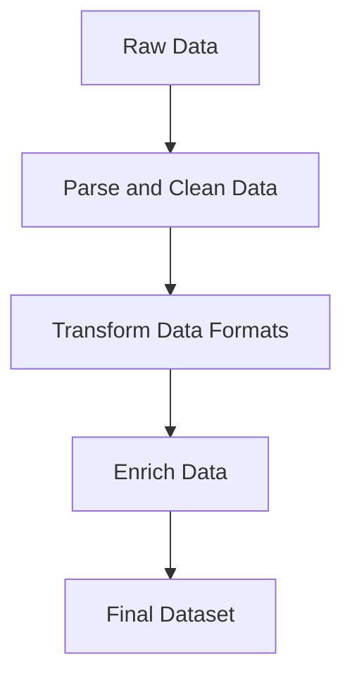

## 16.5. Data Transformation and Enrichment

In the world of data engineering, transforming and enriching data are crucial steps in preparing datasets for analysis and decision-making. Elixir, with its functional programming paradigm and powerful concurrency model, offers a robust environment for implementing these processes efficiently. In this section, we will explore how to parse and clean data, transform data formats, and enrich data using Elixir.

### Parsing and Cleaning Data

Data parsing and cleaning are foundational steps in data transformation. In Elixir, pattern matching and regular expressions are powerful tools that help in extracting and cleaning data efficiently.

#### Using Pattern Matching and Regular Expressions

Pattern matching is a fundamental feature of Elixir that allows you to destructure data with ease. Combined with regular expressions, it becomes a formidable tool for parsing complex data structures.

**Example: Parsing a CSV Line**

```elixir
defmodule CSVParser do
  def parse_line(line) do
    # Split the line by commas
    line
    |> String.split(",")
    |> Enum.map(&String.trim/1)
  end
end

# Usage
line = "John Doe, 30, johndoe@example.com"
parsed_data = CSVParser.parse_line(line)
IO.inspect(parsed_data) # ["John Doe", "30", "johndoe@example.com"]
```

In this example, we use `String.split/2` to break the CSV line into fields and `Enum.map/2` with `String.trim/1` to remove any leading or trailing whitespace.

**Example: Extracting Data with Regular Expressions**

Regular expressions in Elixir are used to match patterns within strings, making them ideal for data extraction.

```elixir
defmodule RegexExtractor do
  def extract_emails(text) do
    # Define the regex pattern for email
    regex = ~r/[a-zA-Z0-9._%+-]+@[a-zA-Z0-9.-]+\.[a-zA-Z]{2,}/

    # Find all matches in the text
    Regex.scan(regex, text)
    |> List.flatten()
  end
end

# Usage
text = "Contact us at support@example.com or sales@example.com"
emails = RegexExtractor.extract_emails(text)
IO.inspect(emails) # ["support@example.com", "sales@example.com"]
```

Here, `Regex.scan/2` is used to find all occurrences of email patterns in the provided text.

#### Handling Incomplete or Malformed Data Gracefully

When dealing with real-world data, it's common to encounter incomplete or malformed entries. Elixir's pattern matching and error handling mechanisms enable you to manage such data effectively.

**Example: Handling Missing Data**

```elixir
defmodule DataCleaner do
  def clean_data({name, age, email}) when is_binary(name) and is_binary(email) do
    {name, age || "Unknown", email}
  end

  def clean_data(_), do: {:error, "Invalid data format"}
end

# Usage
data = {"Jane Doe", nil, "janedoe@example.com"}
cleaned_data = DataCleaner.clean_data(data)
IO.inspect(cleaned_data) # {"Jane Doe", "Unknown", "janedoe@example.com"}
```

In this example, we use pattern matching to check for valid data and provide default values for missing fields.

### Transforming Data Formats

Transforming data from one format to another is a common requirement in data engineering. Elixir provides libraries and tools to facilitate conversion between various data formats like JSON, CSV, and XML.

#### Converting Between JSON, CSV, XML, and Custom Formats

**Example: JSON to Map Conversion**

Elixir's `Jason` library is a popular choice for JSON parsing and encoding.

```elixir
defmodule JSONConverter do
  def json_to_map(json_string) do
    case Jason.decode(json_string) do
      {:ok, map} -> map
      {:error, _reason} -> {:error, "Invalid JSON"}
    end
  end
end

# Usage
json_string = ~s({"name": "Alice", "age": 25})
map = JSONConverter.json_to_map(json_string)
IO.inspect(map) # %{"name" => "Alice", "age" => 25}
```

**Example: CSV to List of Maps Conversion**

For CSV parsing, the `NimbleCSV` library is efficient and easy to use.

```elixir
defmodule CSVConverter do
  require NimbleCSV.RFC4180, as: CSV

  def csv_to_list_of_maps(csv_string) do
    csv_string
    |> CSV.parse_string()
    |> Enum.map(fn [name, age, email] ->
      %{"name" => name, "age" => age, "email" => email}
    end)
  end
end

# Usage
csv_string = "Bob, 28, bob@example.com\nAlice, 25, alice@example.com"
list_of_maps = CSVConverter.csv_to_list_of_maps(csv_string)
IO.inspect(list_of_maps)
# [%{"name" => "Bob", "age" => "28", "email" => "bob@example.com"},
#  %{"name" => "Alice", "age" => "25", "email" => "alice@example.com"}]
```

**Example: XML to Map Conversion**

To work with XML, the `SweetXml` library is a great tool.

```elixir
defmodule XMLConverter do
  import SweetXml

  def xml_to_map(xml_string) do
    xml_string
    |> xpath(~x"//person"l,
      name: ~x"./name/text()"s,
      age: ~x"./age/text()"i,
      email: ~x"./email/text()"s
    )
  end
end

# Usage
xml_string = """
<people>
  <person>
    <name>Charlie</name>
    <age>32</age>
    <email>charlie@example.com</email>
  </person>
</people>
"""
map = XMLConverter.xml_to_map(xml_string)
IO.inspect(map) # [%{name: "Charlie", age: 32, email: "charlie@example.com"}]
```

### Data Enrichment

Data enrichment involves augmenting existing data with additional information to enhance its value. This can be achieved by integrating third-party APIs or using internal datasets.

#### Augmenting Data with Additional Information

**Example: Enriching User Data with Geolocation**

Let's say we have a dataset of users with IP addresses, and we want to enrich it with geolocation data.

```elixir
defmodule GeoEnricher do
  @api_url "https://api.ipgeolocation.io/ipgeo"

  def enrich_with_geolocation(ip_address) do
    # Make an HTTP request to the geolocation API
    case HTTPoison.get("#{@api_url}?apiKey=YOUR_API_KEY&ip=#{ip_address}") do
      {:ok, %HTTPoison.Response{status_code: 200, body: body}} ->
        {:ok, Jason.decode!(body)}

      {:error, _reason} ->
        {:error, "Failed to fetch geolocation data"}
    end
  end
end

# Usage
ip_address = "8.8.8.8"
{:ok, geo_data} = GeoEnricher.enrich_with_geolocation(ip_address)
IO.inspect(geo_data)
```

In this example, we use `HTTPoison` to make an HTTP request to a geolocation API and `Jason` to decode the JSON response.

#### Integrating Third-Party APIs for Enhanced Datasets

Integrating third-party APIs is a common way to enrich datasets. Elixir's concurrency model makes it easy to handle multiple API requests efficiently.

**Example: Enriching Product Data with External Reviews**

```elixir
defmodule ReviewEnricher do
  @api_url "https://api.example.com/reviews"

  def enrich_with_reviews(product_id) do
    Task.async(fn ->
      case HTTPoison.get("#{@api_url}?product_id=#{product_id}") do
        {:ok, %HTTPoison.Response{status_code: 200, body: body}} ->
          {:ok, Jason.decode!(body)}

        {:error, _reason} ->
          {:error, "Failed to fetch reviews"}
      end
    end)
  end
end

# Usage
product_id = "12345"
task = ReviewEnricher.enrich_with_reviews(product_id)
{:ok, reviews} = Task.await(task)
IO.inspect(reviews)
```

Here, we use `Task.async/1` and `Task.await/1` to handle asynchronous API requests, allowing the program to continue executing while waiting for the response.

### Visualizing Data Transformation and Enrichment

To better understand the flow of data transformation and enrichment, let's visualize the process using a flowchart.


```mermaid
graph TD;
    A[Raw Data] --> B[Parse and Clean Data];
    B --> C[Transform Data Formats];
    C --> D[Enrich Data];
    D --> E[Final Dataset];
```

**Figure 1:** Data Transformation and Enrichment Flowchart

This diagram illustrates the sequential steps involved in transforming and enriching data, starting from raw data to the final enriched dataset.

### Key Takeaways

- **Pattern Matching and Regular Expressions**: Use these powerful features to parse and clean data efficiently.
- **Data Format Conversion**: Leverage libraries like `Jason`, `NimbleCSV`, and `SweetXml` for converting data between JSON, CSV, XML, and custom formats.
- **Data Enrichment**: Augment datasets with additional information using third-party APIs and internal datasets.
- **Concurrency**: Utilize Elixir's concurrency model to handle multiple API requests and data processing tasks efficiently.

### Try It Yourself

Experiment with the code examples provided by modifying them to suit different data formats or APIs. For instance, try integrating a different API to enrich user data or transform a new data format.

### Further Reading

- [Elixir Regular Expressions](https://hexdocs.pm/elixir/Regex.html)
- [Jason Library for JSON](https://hexdocs.pm/jason/readme.html)
- [NimbleCSV Documentation](https://hexdocs.pm/nimble_csv/readme.html)
- [SweetXml for XML Parsing](https://hexdocs.pm/sweet_xml/readme.html)
- [HTTPoison for HTTP Requests](https://hexdocs.pm/httpoison/readme.html)

## Quiz Time!



### What is a common tool used in Elixir for parsing JSON data?

- [x] Jason
- [ ] NimbleCSV
- [ ] SweetXml
- [ ] HTTPoison

> **Explanation:** Jason is a popular library in Elixir for parsing and encoding JSON data.

### Which Elixir feature is particularly useful for destructuring data?

- [x] Pattern Matching
- [ ] Regular Expressions
- [ ] Macros
- [ ] GenServer

> **Explanation:** Pattern matching is a core feature of Elixir that allows for easy destructuring of data.

### How can you handle asynchronous API requests in Elixir?

- [x] Using Task.async/1 and Task.await/1
- [ ] Using GenServer
- [ ] Using Regex.scan/2
- [ ] Using String.split/2

> **Explanation:** Task.async/1 and Task.await/1 are used to handle asynchronous operations in Elixir.

### What library is suggested for CSV parsing in Elixir?

- [ ] Jason
- [x] NimbleCSV
- [ ] SweetXml
- [ ] HTTPoison

> **Explanation:** NimbleCSV is a library designed for efficient CSV parsing in Elixir.

### Which function is used to split a string by a delimiter in Elixir?

- [x] String.split/2
- [ ] Enum.map/2
- [ ] Regex.scan/2
- [ ] List.flatten/1

> **Explanation:** String.split/2 is used to split a string into parts based on a delimiter.

### What is the purpose of data enrichment?

- [x] To augment data with additional information
- [ ] To remove duplicate data
- [ ] To convert data formats
- [ ] To parse raw data

> **Explanation:** Data enrichment involves adding extra information to existing datasets to enhance their value.

### Which library is recommended for XML parsing in Elixir?

- [ ] Jason
- [ ] NimbleCSV
- [x] SweetXml
- [ ] HTTPoison

> **Explanation:** SweetXml is a library used for parsing XML data in Elixir.

### What is a key benefit of using pattern matching in data parsing?

- [x] It allows for easy extraction and validation of data structures.
- [ ] It simplifies asynchronous operations.
- [ ] It enhances data encryption.
- [ ] It improves network communication.

> **Explanation:** Pattern matching simplifies the extraction and validation of data structures in Elixir.

### How can you handle incomplete data in Elixir?

- [x] By providing default values using pattern matching
- [ ] By using macros
- [ ] By converting data formats
- [ ] By using GenServer

> **Explanation:** Pattern matching can be used to provide default values for missing data, ensuring graceful handling of incomplete datasets.

### True or False: Elixir's concurrency model makes it easy to handle multiple API requests efficiently.

- [x] True
- [ ] False

> **Explanation:** Elixir's concurrency model, based on the Actor model, allows for efficient handling of multiple concurrent operations, including API requests.



Remember, mastering data transformation and enrichment in Elixir is a journey. Keep experimenting with different datasets and APIs, and you'll continue to enhance your skills in building efficient data engineering solutions.
