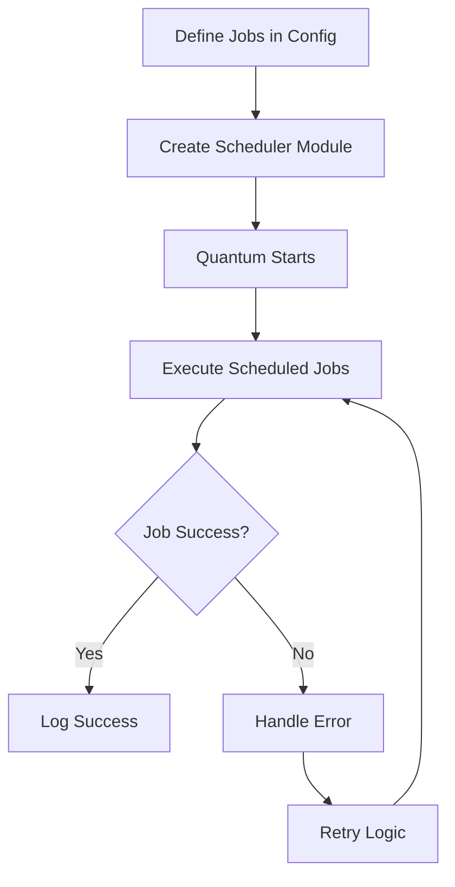

## 16.6. Scheduling and Automation with Quantum

In the realm of data engineering and ETL (Extract, Transform, Load) processes, scheduling and automation are pivotal. They ensure that data tasks are executed at the right time and in the right sequence. Elixir, with its robust concurrency model and fault-tolerant capabilities, is an excellent choice for building such systems. In this section, we delve into Quantum, a powerful Cron-like job scheduler for Elixir, and explore how it can be leveraged to automate and schedule tasks effectively.

### Introduction to Quantum

Quantum is a versatile and reliable job scheduler for Elixir, akin to Cron in Unix-like systems. It allows developers to define and manage scheduled tasks with ease, providing a flexible and expressive API. Quantum is particularly well-suited for applications that require precise timing and coordination of tasks, such as data processing pipelines, periodic data extraction, and automated reporting.

#### Key Features of Quantum

- **Cron-like Syntax**: Quantum uses a familiar Cron syntax to define job schedules, making it easy for developers to specify complex timing rules.
- **Time-Zone Support**: Quantum can handle time-zone aware scheduling, ensuring that jobs run at the correct local time, regardless of the server's time zone.
- **Error Handling**: Quantum provides mechanisms to handle errors gracefully, ensuring that scheduled tasks can recover from failures.
- **Concurrency**: Built on Elixir's concurrency model, Quantum can execute multiple jobs concurrently, leveraging the full power of the BEAM VM.

### Setting Up Scheduled Tasks

To get started with Quantum, you need to add it to your Elixir project. Let's walk through the process of setting up scheduled tasks using Quantum.

#### Step 1: Adding Quantum to Your Project

First, add Quantum to your `mix.exs` file:

```elixir
defp deps do
  [
    {:quantum, "~> 3.0"}
  ]
end
```

Run `mix deps.get` to fetch the Quantum dependency.

#### Step 2: Configuring Quantum

Next, configure Quantum in your application's configuration file. You can define your scheduled jobs in `config/config.exs`:

```elixir
config :my_app, MyApp.Scheduler,
  jobs: [
    # Every minute
    {"* * * * *", {MyApp.SomeModule, :some_function, []}},
    # Every hour at minute 0
    {"0 * * * *", {MyApp.AnotherModule, :another_function, []}}
  ]
```

In this example, `MyApp.SomeModule.some_function/0` will be executed every minute, and `MyApp.AnotherModule.another_function/0` will be executed every hour at the start of the hour.

#### Step 3: Creating the Scheduler Module

Create a scheduler module in your application:

```elixir
defmodule MyApp.Scheduler do
  use Quantum, otp_app: :my_app
end
```

This module uses Quantum and ties it to your application, allowing you to manage and execute scheduled jobs.

### Time-Zone Aware Scheduling

One of Quantum's standout features is its ability to handle time-zone aware scheduling. This is crucial for applications that operate across multiple time zones, ensuring that tasks run at the correct local time.

#### Configuring Time Zones

To configure time-zone aware scheduling, you need to specify the time zone in your job configuration:

```elixir
config :my_app, MyApp.Scheduler,
  timezone: "America/New_York",
  jobs: [
    {"0 9 * * *", {MyApp.ReportModule, :generate_daily_report, []}}
  ]
```

In this example, `MyApp.ReportModule.generate_daily_report/0` will run every day at 9 AM Eastern Time.

#### Handling Daylight Saving Time

Quantum automatically adjusts for daylight saving time changes, ensuring that jobs continue to run at the correct local time even when the clocks change.

### Error Handling and Resilience

In any scheduling system, error handling is critical. Quantum provides several mechanisms to ensure that scheduled jobs can recover from failures and continue to operate smoothly.

#### Using Retry Logic

You can implement retry logic in your job functions to handle transient errors. For example:

```elixir
defmodule MyApp.SomeModule do
  def some_function do
    try do
      # Perform the task
    rescue
      exception ->
        # Log the error and retry
        Logger.error("Error occurred: #{inspect(exception)}")
        :timer.sleep(1000)
        some_function()
    end
  end
end
```

In this example, if an error occurs, the function logs the error and retries after a short delay.

#### Monitoring Job Execution

Quantum allows you to monitor job execution and handle errors using callbacks. You can define a callback module to handle job success or failure:

```elixir
defmodule MyApp.JobCallback do
  use Quantum.Job

  def handle_event(:success, job, result) do
    Logger.info("Job #{inspect(job)} succeeded with result: #{inspect(result)}")
  end

  def handle_event(:failure, job, reason) do
    Logger.error("Job #{inspect(job)} failed with reason: #{inspect(reason)}")
  end
end
```

### Visualizing Quantum's Workflow

To better understand how Quantum operates, let's visualize its workflow using a Mermaid.js diagram.



**Diagram Description**: This diagram illustrates the workflow of Quantum in an Elixir application. Jobs are defined in the configuration, and the scheduler module is created. Quantum starts and executes scheduled jobs. If a job succeeds, it logs the success; if it fails, it handles the error and retries the job.

### Try It Yourself

To solidify your understanding of Quantum, try modifying the code examples provided. Experiment with different job schedules, time zones, and error handling strategies. For instance, you could:

- Schedule a job to run every weekday at 9 AM in your local time zone.
- Implement a retry mechanism that limits the number of retries to prevent infinite loops.
- Use a different logging strategy to capture job execution details.

### Knowledge Check

Before we wrap up, let's reinforce what we've learned with a few questions:

- How does Quantum handle time-zone aware scheduling?
- What mechanisms does Quantum provide for error handling and resilience?
- How can you implement retry logic in a Quantum job function?

### Summary

In this section, we've explored the powerful scheduling and automation capabilities of Quantum in Elixir. We've learned how to set up scheduled tasks, manage time zones, and ensure error resilience. Quantum's flexibility and reliability make it an excellent choice for automating data engineering and ETL processes in Elixir applications.

### Further Reading

For more information on Quantum and its features, check out the [Quantum GitHub repository](https://github.com/quantum-elixir/quantum-core) and the [official documentation](https://hexdocs.pm/quantum/readme.html).

## Quiz: Scheduling and Automation with Quantum



### What is Quantum in the context of Elixir?

- [x] A Cron-like job scheduler for Elixir
- [ ] A database management tool
- [ ] A web framework
- [ ] A testing library

> **Explanation:** Quantum is a Cron-like job scheduler for Elixir, designed to manage and execute scheduled tasks.

### How do you add Quantum to an Elixir project?

- [x] By adding it to the `mix.exs` file
- [ ] By installing it via npm
- [ ] By downloading a binary package
- [ ] By using a Docker container

> **Explanation:** Quantum is added to an Elixir project by including it in the `mix.exs` file as a dependency.

### What syntax does Quantum use to define job schedules?

- [x] Cron-like syntax
- [ ] JSON syntax
- [ ] XML syntax
- [ ] YAML syntax

> **Explanation:** Quantum uses a Cron-like syntax to define job schedules, making it familiar and easy to use.

### How does Quantum handle time-zone aware scheduling?

- [x] By specifying the time zone in the job configuration
- [ ] By using the server's local time zone
- [ ] By converting all times to UTC
- [ ] By ignoring time zones

> **Explanation:** Quantum handles time-zone aware scheduling by allowing developers to specify the time zone in the job configuration.

### What is a key feature of Quantum's error handling?

- [x] Retry logic
- [ ] Automatic job deletion
- [ ] Email notifications
- [ ] Job prioritization

> **Explanation:** Quantum supports retry logic, allowing jobs to recover from transient errors by retrying the execution.

### How can you monitor job execution in Quantum?

- [x] By using callbacks
- [ ] By checking log files manually
- [ ] By using a separate monitoring tool
- [ ] By querying a database

> **Explanation:** Quantum allows monitoring job execution through callbacks that handle job success or failure events.

### What is the purpose of the scheduler module in Quantum?

- [x] To manage and execute scheduled jobs
- [ ] To store job results
- [ ] To configure the database connection
- [ ] To handle HTTP requests

> **Explanation:** The scheduler module in Quantum is responsible for managing and executing scheduled jobs.

### How does Quantum adjust for daylight saving time changes?

- [x] Automatically
- [ ] Manually by the developer
- [ ] By disabling jobs during the change
- [ ] By sending notifications

> **Explanation:** Quantum automatically adjusts for daylight saving time changes, ensuring jobs run at the correct local time.

### What is a common use case for Quantum in Elixir applications?

- [x] Automating data processing pipelines
- [ ] Managing user authentication
- [ ] Rendering web pages
- [ ] Handling file uploads

> **Explanation:** Quantum is commonly used to automate data processing pipelines, ensuring tasks are executed at the right time.

### True or False: Quantum can execute multiple jobs concurrently.

- [x] True
- [ ] False

> **Explanation:** Quantum can execute multiple jobs concurrently, leveraging Elixir's concurrency model and the BEAM VM.



Remember, mastering scheduling and automation with Quantum is just one step in building robust and efficient Elixir applications. Keep exploring, experimenting, and expanding your knowledge to harness the full potential of Elixir and its ecosystem.
