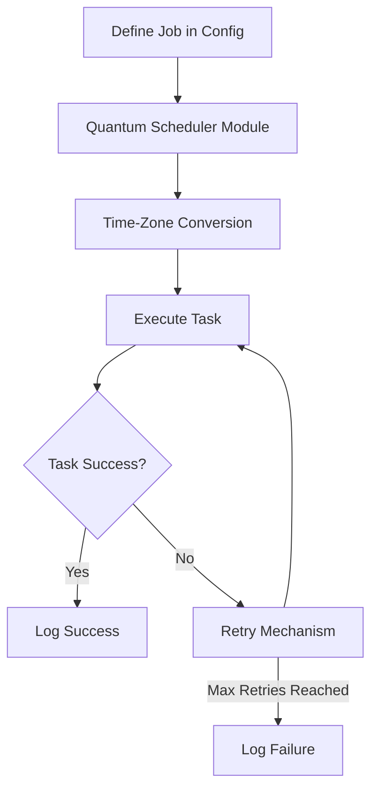

## 16.6. Scheduling and Automation with Quantum

In the realm of data engineering and ETL (Extract, Transform, Load) processes, scheduling and automation play a crucial role. Elixir, with its robust ecosystem, provides a powerful tool for these tasks: the Quantum library. Quantum is a cron-like job scheduler that allows developers to manage recurring tasks with ease and precision. In this section, we will explore how to effectively use Quantum for scheduling and automation in Elixir applications.

### Introduction to Quantum

Quantum is an open-source job scheduler for Elixir, inspired by the Unix cron system. It enables developers to define and manage scheduled tasks within their Elixir applications, providing a flexible and reliable way to automate repetitive processes. Quantum is particularly useful for tasks such as data extraction, transformation, and loading, as well as other routine maintenance tasks.

#### Key Features of Quantum

- **Cron-like Syntax**: Quantum uses a familiar cron syntax to define schedules, making it easy for developers to specify when tasks should run.
- **Time-Zone Aware**: Quantum supports time-zone aware scheduling, allowing tasks to be executed in different time zones.
- **Error Handling**: Quantum provides mechanisms for handling errors and ensuring that tasks are retried if they fail.
- **Scalability**: Quantum is designed to scale with your application, handling a large number of scheduled tasks efficiently.
- **Integration with Elixir Ecosystem**: Quantum integrates seamlessly with other Elixir libraries and tools, enhancing its functionality and ease of use.

### Setting Up Scheduled Tasks

To get started with Quantum, you need to add it to your Elixir project. This involves updating your `mix.exs` file to include Quantum as a dependency.

```elixir
defp deps do
  [
    {:quantum, "~> 3.0"}
  ]
end
```

After adding the dependency, run `mix deps.get` to fetch and compile the Quantum library.

#### Configuring Quantum

Quantum requires some initial configuration to define the jobs you want to schedule. This is typically done in your application's configuration files. Here's a basic example:

```elixir
config :my_app, MyApp.Scheduler,
  jobs: [
    {"* * * * *", {MyApp.SomeModule, :some_function, []}}
  ]
```

In this example, `MyApp.Scheduler` is the module responsible for managing scheduled tasks. The job is defined using a cron expression (`"* * * * *"`), which specifies that the task should run every minute. The task itself is defined as a tuple, with the module, function, and arguments to be executed.

#### Creating a Scheduler Module

To organize your scheduled tasks, it's a good practice to create a dedicated scheduler module in your application. This module will be responsible for defining and managing all scheduled jobs.

```elixir
defmodule MyApp.Scheduler do
  use Quantum, otp_app: :my_app
end
```

By using the `Quantum` module, you enable your scheduler to manage tasks defined in your application's configuration.

### Time-Zone Aware Scheduling

One of Quantum's standout features is its support for time-zone aware scheduling. This is particularly useful for applications that need to operate across different geographical regions.

#### Configuring Time Zones

To configure time zones in Quantum, you need to specify the desired time zone for each job. This can be done by adding a `:timezone` option to the job configuration.

```elixir
config :my_app, MyApp.Scheduler,
  jobs: [
    {"0 9 * * *", {MyApp.SomeModule, :some_function, []}, timezone: "America/New_York"}
  ]
```

In this example, the task is scheduled to run at 9 AM New York time every day. Quantum handles the conversion of time zones, ensuring that tasks are executed at the correct local time.

#### Handling Daylight Saving Time

Quantum automatically adjusts for daylight saving time changes, ensuring that your scheduled tasks run consistently throughout the year. This is particularly important for applications that rely on precise timing.

### Error Handling and Resilience

In any scheduling system, error handling and resilience are critical components. Quantum provides several mechanisms to ensure that scheduled tasks recover gracefully from failures.

#### Retry Mechanism

Quantum allows you to specify a retry mechanism for tasks that fail. This can be configured using the `:retry` option, which defines the number of retry attempts and the delay between retries.

```elixir
config :my_app, MyApp.Scheduler,
  jobs: [
    {"0 9 * * *", {MyApp.SomeModule, :some_function, []}, retry: [max_retries: 3, delay: :timer.seconds(10)]}
  ]
```

In this example, if the task fails, Quantum will attempt to retry it up to three times, with a 10-second delay between each attempt.

#### Logging and Monitoring

To effectively manage scheduled tasks, it's important to implement logging and monitoring. Quantum integrates with Elixir's logging system, allowing you to capture detailed logs of task executions and failures.

```elixir
def handle_event({:job_failed, job, reason}, state) do
  Logger.error("Job #{inspect(job)} failed with reason: #{inspect(reason)}")
  {:ok, state}
end
```

By implementing a custom event handler, you can capture and log detailed information about job failures, helping you to diagnose and resolve issues quickly.

### Visualizing Quantum's Job Scheduling

To better understand how Quantum schedules and manages jobs, let's visualize the process using a Mermaid.js diagram.


```mermaid
graph TD;
    A[Define Job in Config] --> B[Quantum Scheduler Module];
    B --> C[Time-Zone Conversion];
    C --> D[Execute Task];
    D --> E{Task Success?};
    E -->|Yes| F[Log Success];
    E -->|No| G[Retry Mechanism];
    G --> D;
    G -->|Max Retries Reached| H[Log Failure];
```

This diagram illustrates the flow of a scheduled task in Quantum. The job is defined in the configuration, processed by the Quantum scheduler, and executed with time-zone conversion. If the task fails, the retry mechanism is triggered, and failures are logged for further analysis.

### Try It Yourself

To gain hands-on experience with Quantum, try modifying the code examples provided. Experiment with different cron expressions, time zones, and retry configurations to see how Quantum handles various scheduling scenarios. This will help you understand the flexibility and power of Quantum in managing scheduled tasks.

### Conclusion

Quantum is a powerful tool for scheduling and automation in Elixir applications. Its cron-like syntax, time-zone awareness, and robust error handling make it an ideal choice for managing recurring tasks. By integrating Quantum into your Elixir projects, you can automate routine processes, improve efficiency, and ensure that your application runs smoothly across different time zones.

Remember, this is just the beginning. As you explore Quantum further, you'll discover new ways to leverage its capabilities to enhance your Elixir applications. Keep experimenting, stay curious, and enjoy the journey!

## Quiz Time!



### What is Quantum in Elixir?

- [x] A cron-like job scheduler
- [ ] A database library
- [ ] A web framework
- [ ] An authentication library

> **Explanation:** Quantum is a cron-like job scheduler for Elixir, used to manage recurring tasks.

### How do you add Quantum to an Elixir project?

- [x] Add `{:quantum, "~> 3.0"}` to the `deps` in `mix.exs`
- [ ] Add `{:quantum, "~> 3.0"}` to the `applications` in `mix.exs`
- [ ] Add `{:quantum, "~> 3.0"}` to the `config` in `mix.exs`
- [ ] Add `{:quantum, "~> 3.0"}` to the `aliases` in `mix.exs`

> **Explanation:** Quantum is added as a dependency in the `deps` section of `mix.exs`.

### What feature of Quantum allows tasks to be executed in different time zones?

- [x] Time-zone aware scheduling
- [ ] Multi-threading
- [ ] Load balancing
- [ ] Dynamic configuration

> **Explanation:** Quantum supports time-zone aware scheduling, allowing tasks to run in different time zones.

### How can you specify a retry mechanism for a Quantum job?

- [x] Use the `:retry` option in the job configuration
- [ ] Use the `:timeout` option in the job configuration
- [ ] Use the `:interval` option in the job configuration
- [ ] Use the `:priority` option in the job configuration

> **Explanation:** The `:retry` option allows you to define retry attempts and delays for failed jobs.

### What syntax does Quantum use to define job schedules?

- [x] Cron-like syntax
- [ ] JSON syntax
- [ ] YAML syntax
- [ ] XML syntax

> **Explanation:** Quantum uses a cron-like syntax to define when tasks should run.

### How can you log job failures in Quantum?

- [x] Implement a custom event handler
- [ ] Use `IO.puts` in the job function
- [ ] Use `:logger` in the job configuration
- [ ] Use `:error_logger` in the job configuration

> **Explanation:** Implementing a custom event handler allows you to capture and log job failures.

### What is the purpose of the `use Quantum, otp_app: :my_app` line in a scheduler module?

- [x] To enable the module to manage scheduled tasks
- [ ] To connect the module to a database
- [ ] To start a web server
- [ ] To authenticate users

> **Explanation:** This line enables the module to manage scheduled tasks using Quantum.

### What does the cron expression `0 9 * * *` represent?

- [x] A job that runs at 9 AM every day
- [ ] A job that runs every 9 minutes
- [ ] A job that runs every 9 hours
- [ ] A job that runs at 9 PM every day

> **Explanation:** The cron expression `0 9 * * *` specifies a job that runs at 9 AM every day.

### How does Quantum handle daylight saving time changes?

- [x] Automatically adjusts for daylight saving time
- [ ] Requires manual configuration
- [ ] Does not support daylight saving time
- [ ] Uses UTC time only

> **Explanation:** Quantum automatically adjusts for daylight saving time, ensuring consistent task execution.

### True or False: Quantum can only schedule tasks in the local time zone.

- [ ] True
- [x] False

> **Explanation:** Quantum supports time-zone aware scheduling, allowing tasks to be scheduled in different time zones.



