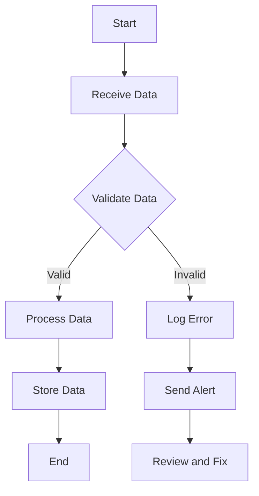

## 16.7. Data Validation and Quality Assurance

In the realm of data engineering and ETL (Extract, Transform, Load) processes, ensuring data quality and integrity is paramount. Elixir, with its robust ecosystem and functional programming paradigm, offers powerful tools and patterns for data validation and quality assurance. This section delves into the advanced techniques and best practices for implementing data validation and quality assurance in Elixir, focusing on Ecto changesets, consistency checks, automated testing, and monitoring data quality.

### Implementing Validations

Data validation is the process of ensuring that data is accurate, complete, and meets the necessary criteria before it is processed or stored. In Elixir, Ecto is the go-to library for database interactions, and it provides a powerful mechanism for data validation through changesets.

#### Using Ecto Changesets for Data Integrity

Ecto changesets are a core feature of the Ecto library, designed to handle data validation and casting. They allow you to define rules and constraints for your data, ensuring that only valid data is persisted to the database.

**Key Concepts of Ecto Changesets:**

- **Casting:** Convert external data into the appropriate types for your schema.
- **Validation:** Apply rules to ensure data meets specific criteria.
- **Constraints:** Enforce database-level constraints to maintain data integrity.

**Example: Validating User Data with Ecto Changesets**

```elixir
defmodule MyApp.User do
  use Ecto.Schema
  import Ecto.Changeset

  schema "users" do
    field :name, :string
    field :email, :string
    field :age, :integer
    timestamps()
  end

  @doc """
  Creates a changeset for user data validation.
  """
  def changeset(user, params \\ %{}) do
    user
    |> cast(params, [:name, :email, :age])
    |> validate_required([:name, :email])
    |> validate_format(:email, ~r/@/)
    |> validate_number(:age, greater_than: 0)
  end
end
```

In this example, we define a `changeset/2` function that casts and validates user data. The `validate_required/2` function ensures that the `name` and `email` fields are present, while `validate_format/3` checks that the email field contains an "@" symbol. The `validate_number/3` function ensures that the age is greater than zero.

**Try It Yourself:**

- Modify the changeset to include a validation for the uniqueness of the email field.
- Add a custom validation function to check that the name is at least three characters long.

### Consistency Checks

Consistency checks are essential for ensuring that data adheres to predefined criteria and business rules. These checks can be implemented at various stages of the data processing pipeline.

#### Ensuring Data Meets Predefined Criteria

Consistency checks can be performed using Ecto changesets, custom validation functions, or by leveraging Elixir's pattern matching capabilities.

**Example: Implementing Consistency Checks**

```elixir
defmodule MyApp.Order do
  use Ecto.Schema
  import Ecto.Changeset

  schema "orders" do
    field :status, :string
    field :total_amount, :decimal
    timestamps()
  end

  @doc """
  Creates a changeset for order data validation.
  """
  def changeset(order, params \\ %{}) do
    order
    |> cast(params, [:status, :total_amount])
    |> validate_inclusion(:status, ["pending", "completed", "canceled"])
    |> validate_number(:total_amount, greater_than: 0)
    |> check_consistency()
  end

  defp check_consistency(changeset) do
    if get_field(changeset, :status) == "completed" and get_field(changeset, :total_amount) <= 0 do
      add_error(changeset, :total_amount, "must be greater than zero for completed orders")
    else
      changeset
    end
  end
end
```

In this example, we define a `check_consistency/1` function that adds a custom error if the order status is "completed" but the total amount is not greater than zero.

**Try It Yourself:**

- Implement a consistency check that ensures the `status` field cannot be "canceled" if the `total_amount` is greater than zero.

### Automated Testing

Automated testing is a crucial aspect of data validation and quality assurance. It ensures that data processing functions behave as expected and that any changes to the codebase do not introduce regressions.

#### Writing Tests for Data Processing Functions

Elixir's ExUnit framework provides a robust testing environment for writing and running tests. You can write tests for your data processing functions to verify their correctness and reliability.

**Example: Testing Data Validation Logic**

```elixir
defmodule MyApp.UserTest do
  use ExUnit.Case
  alias MyApp.User

  test "valid changeset with valid data" do
    changeset = User.changeset(%User{}, %{name: "Alice", email: "alice@example.com", age: 30})
    assert changeset.valid?
  end

  test "invalid changeset with missing email" do
    changeset = User.changeset(%User{}, %{name: "Alice", age: 30})
    refute changeset.valid?
    assert {:email, {"can't be blank", _}} in changeset.errors
  end

  test "invalid changeset with invalid email format" do
    changeset = User.changeset(%User{}, %{name: "Alice", email: "invalid_email", age: 30})
    refute changeset.valid?
    assert {:email, {"has invalid format", _}} in changeset.errors
  end
end
```

In this example, we write tests to verify that the `User.changeset/2` function correctly validates user data. We test for valid data, missing email, and invalid email format.

**Try It Yourself:**

- Write a test case for the `Order` changeset to ensure that the consistency check for completed orders is working correctly.

### Monitoring Data Quality

Monitoring data quality involves setting up systems to detect anomalies or inconsistencies in data. This can be achieved through logging, alerts, and dashboards.

#### Setting Up Alerts for Anomalies or Inconsistencies

Elixir provides various tools and libraries for monitoring and alerting, such as Logger, Telemetry, and external services like Prometheus and Grafana.

**Example: Monitoring Data Quality with Logger**

```elixir
defmodule MyApp.DataMonitor do
  require Logger

  def monitor_data(data) do
    case validate_data(data) do
      :ok -> :ok
      {:error, reason} ->
        Logger.error("Data validation failed: #{reason}")
        :error
    end
  end

  defp validate_data(data) do
    # Implement your data validation logic here
    :ok
  end
end
```

In this example, we use Elixir's `Logger` module to log errors when data validation fails. This can be extended to send alerts to external monitoring systems.

**Try It Yourself:**

- Integrate a monitoring library like Telemetry to track data validation metrics and send alerts to a monitoring dashboard.

### Visualizing Data Validation and Quality Assurance

To better understand the flow of data validation and quality assurance processes, let's visualize the steps involved using a Mermaid.js flowchart.



**Diagram Description:**

- **Start:** The process begins with receiving data.
- **Validate Data:** Data is validated using Ecto changesets and custom checks.
- **Process Data:** Valid data is processed further.
- **Log Error:** Invalid data triggers an error log.
- **Send Alert:** Alerts are sent for anomalies or inconsistencies.
- **Review and Fix:** Errors are reviewed and fixed.
- **Store Data:** Valid data is stored in the database.
- **End:** The process concludes.

### References and Links

- [Ecto Changesets Documentation](https://hexdocs.pm/ecto/Ecto.Changeset.html)
- [ExUnit Testing Framework](https://hexdocs.pm/ex_unit/ExUnit.html)
- [Logger Module in Elixir](https://hexdocs.pm/logger/Logger.html)
- [Telemetry for Monitoring](https://hexdocs.pm/telemetry/Telemetry.html)

### Knowledge Check

- Explain the role of Ecto changesets in data validation.
- Demonstrate how to implement a custom consistency check in Elixir.
- Provide an example of writing a test for a data processing function.
- Describe how to set up monitoring and alerts for data quality.

### Embrace the Journey

Remember, mastering data validation and quality assurance in Elixir is a continuous journey. As you progress, you'll build more robust and reliable data processing systems. Keep experimenting, stay curious, and enjoy the journey!

### Quiz: Data Validation and Quality Assurance



### What is the primary purpose of Ecto changesets in Elixir?

- [x] To validate and cast data before it is persisted to the database.
- [ ] To generate database queries.
- [ ] To manage database connections.
- [ ] To handle user authentication.

> **Explanation:** Ecto changesets are used to validate and cast data, ensuring it meets specific criteria before being stored in the database.

### Which function is used to ensure a field is present in an Ecto changeset?

- [ ] validate_format/3
- [x] validate_required/2
- [ ] validate_number/3
- [ ] validate_inclusion/2

> **Explanation:** The `validate_required/2` function is used to ensure that a field is present in an Ecto changeset.

### How can you implement a custom consistency check in an Ecto changeset?

- [ ] By using the Logger module.
- [x] By defining a private function and adding errors to the changeset if conditions are not met.
- [ ] By writing a separate module for consistency checks.
- [ ] By using the validate_format/3 function.

> **Explanation:** Custom consistency checks can be implemented by defining a private function that adds errors to the changeset if certain conditions are not met.

### What is the purpose of automated testing in data validation?

- [ ] To generate random data for testing.
- [ ] To replace manual testing entirely.
- [x] To ensure data processing functions behave as expected and prevent regressions.
- [ ] To monitor data quality in real-time.

> **Explanation:** Automated testing ensures that data processing functions behave as expected and helps prevent regressions when changes are made to the codebase.

### Which Elixir module is commonly used for logging errors during data validation?

- [ ] Ecto
- [ ] ExUnit
- [x] Logger
- [ ] Telemetry

> **Explanation:** The `Logger` module is commonly used for logging errors during data validation in Elixir.

### What is a key benefit of setting up alerts for data quality monitoring?

- [ ] It eliminates the need for manual data validation.
- [x] It allows for quick detection and response to anomalies or inconsistencies.
- [ ] It automatically fixes data errors.
- [ ] It reduces the need for automated testing.

> **Explanation:** Setting up alerts allows for quick detection and response to anomalies or inconsistencies in data quality.

### How can you visualize the data validation process in Elixir?

- [ ] By writing detailed documentation.
- [ ] By using the ExUnit framework.
- [x] By creating flowcharts with tools like Mermaid.js.
- [ ] By implementing custom logging.

> **Explanation:** Tools like Mermaid.js can be used to create flowcharts that visualize the data validation process in Elixir.

### What is the role of the `validate_number/3` function in Ecto changesets?

- [ ] To ensure a field is present.
- [ ] To validate the format of a string.
- [x] To ensure a numeric field meets specific criteria.
- [ ] To cast data to the correct type.

> **Explanation:** The `validate_number/3` function is used to ensure that a numeric field meets specific criteria, such as being greater than a certain value.

### Which tool can be integrated with Elixir for monitoring data validation metrics?

- [ ] ExUnit
- [ ] Logger
- [ ] Ecto
- [x] Telemetry

> **Explanation:** Telemetry can be integrated with Elixir to monitor data validation metrics and send alerts to a monitoring dashboard.

### True or False: Ecto changesets can only be used for data validation, not for casting data.

- [ ] True
- [x] False

> **Explanation:** Ecto changesets are used for both data validation and casting, converting external data into the appropriate types for your schema.


