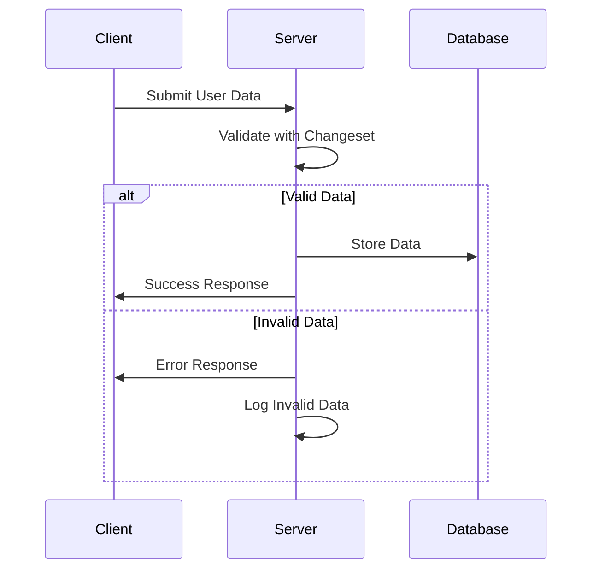

## 16.7. Data Validation and Quality Assurance

Ensuring data integrity and quality is crucial in any data engineering process. In Elixir, this can be effectively managed using a combination of Ecto changesets, consistency checks, automated testing, and monitoring strategies. In this section, we'll explore these techniques in detail, providing you with the knowledge to implement robust data validation and quality assurance processes in your Elixir applications.

### Implementing Validations

Data validation is the process of ensuring that data is accurate, complete, and meets the necessary criteria before being processed or stored. In Elixir, the Ecto library provides a powerful mechanism for data validation through changesets.

#### Using Ecto Changesets for Data Integrity

Ecto changesets are a central feature for data validation and casting in Elixir applications. They allow you to define and enforce rules for data transformations and validations.

**Key Concepts:**
- **Casting**: Transforming input data into the desired format.
- **Validation**: Ensuring the data meets specific criteria.
- **Constraints**: Database-level rules that ensure data integrity.

**Example:**

Let's create a simple example to illustrate how Ecto changesets can be used for data validation.

```elixir
defmodule MyApp.User do
  use Ecto.Schema
  import Ecto.Changeset

  schema "users" do
    field :name, :string
    field :email, :string
    field :age, :integer
    timestamps()
  end

  @doc """
  Creates a changeset for user data validation.
  """
  def changeset(user, params \\ %{}) do
    user
    |> cast(params, [:name, :email, :age])
    |> validate_required([:name, :email])
    |> validate_format(:email, ~r/@/)
    |> validate_number(:age, greater_than: 0)
  end
end
```

In this example, we define a `User` schema and a `changeset/2` function that performs the following:
- **Casting**: Converts the input parameters to the appropriate data types.
- **Validation**: Ensures that `name` and `email` are present, `email` follows a specific format, and `age` is greater than zero.

**Try It Yourself:**

Experiment with the changeset by adding new validation rules, such as checking the length of the `name` field or ensuring the `email` domain is from a specific provider.

### Consistency Checks

Consistency checks ensure that data adheres to predefined criteria, maintaining its validity and reliability throughout the processing lifecycle.

#### Ensuring Data Meets Predefined Criteria

Consistency checks can be implemented at various stages of data processing. These checks help identify anomalies or inconsistencies early, preventing potential issues downstream.

**Example:**

Consider a scenario where we need to ensure that user data is consistent with certain business rules.

```elixir
defmodule MyApp.UserConsistency do
  @doc """
  Ensures that user data is consistent with business rules.
  """
  def check_consistency(%{age: age, email: email}) do
    cond do
      age < 18 -> {:error, "User must be at least 18 years old"}
      !String.contains?(email, "@example.com") -> {:error, "Email must be from example.com"}
      true -> :ok
    end
  end
end
```

In this example, we define a `check_consistency/1` function that checks if a user's age is at least 18 and if the email domain is `example.com`.

**Try It Yourself:**

Modify the consistency check to include additional rules, such as verifying that the user's name does not contain any prohibited words.

### Automated Testing

Automated testing is essential for ensuring that data processing functions behave correctly and consistently. In Elixir, the ExUnit framework provides a robust testing environment.

#### Writing Tests for Data Processing Functions

Writing tests for data processing functions helps verify that they perform as expected and handle edge cases gracefully.

**Example:**

Let's write tests for the `User` changeset and consistency checks we defined earlier.

```elixir
defmodule MyApp.UserTest do
  use ExUnit.Case
  alias MyApp.User

  test "valid changeset" do
    changeset = User.changeset(%User{}, %{name: "Alice", email: "alice@example.com", age: 30})
    assert changeset.valid?
  end

  test "invalid changeset without name" do
    changeset = User.changeset(%User{}, %{email: "alice@example.com", age: 30})
    refute changeset.valid?
  end

  test "invalid changeset with wrong email format" do
    changeset = User.changeset(%User{}, %{name: "Alice", email: "alice.com", age: 30})
    refute changeset.valid?
  end
end

defmodule MyApp.UserConsistencyTest do
  use ExUnit.Case
  alias MyApp.UserConsistency

  test "valid user data" do
    assert UserConsistency.check_consistency(%{age: 20, email: "bob@example.com"}) == :ok
  end

  test "invalid user data with age below 18" do
    assert UserConsistency.check_consistency(%{age: 17, email: "bob@example.com"}) == {:error, "User must be at least 18 years old"}
  end
end
```

In these tests, we verify that the changeset correctly validates the input data and that the consistency checks enforce the business rules.

**Try It Yourself:**

Add more tests to cover additional scenarios, such as edge cases or invalid input data.

### Monitoring Data Quality

Monitoring data quality involves setting up systems to detect anomalies or inconsistencies in data as it flows through the system.

#### Setting Up Alerts for Anomalies or Inconsistencies

To effectively monitor data quality, consider implementing alerts that notify you of any anomalies or inconsistencies.

**Example:**

You can use tools like Prometheus and Grafana to monitor data metrics and set up alerts.

```elixir
defmodule MyApp.Metrics do
  use Prometheus.PlugExporter

  @doc """
  Increments the counter for invalid user data.
  """
  def increment_invalid_user_data() do
    Counter.inc(:invalid_user_data_count)
  end
end
```

In this example, we define a simple counter metric to track the number of invalid user data entries.

**Try It Yourself:**

Integrate this metric into your application and configure alerts in Grafana to notify you when the counter exceeds a certain threshold.

### Visualizing Data Validation and Quality Assurance

To better understand the flow of data validation and quality assurance, let's visualize the process using a sequence diagram.


```mermaid
sequenceDiagram
    participant Client
    participant Server
    participant Database

    Client->>Server: Submit User Data
    Server->>Server: Validate with Changeset
    alt Valid Data
        Server->>Database: Store Data
        Server->>Client: Success Response
    else Invalid Data
        Server->>Client: Error Response
        Server->>Server: Log Invalid Data
    end
```

**Diagram Description:**

- The client submits user data to the server.
- The server validates the data using Ecto changesets.
- If the data is valid, it is stored in the database, and a success response is sent to the client.
- If the data is invalid, an error response is sent to the client, and the invalid data is logged.

### References and Links

For further reading and deeper dives into the topics covered in this section, consider the following resources:

- [Ecto Documentation](https://hexdocs.pm/ecto/Ecto.html)
- [ExUnit Documentation](https://hexdocs.pm/ex_unit/ExUnit.html)
- [Prometheus Elixir Client](https://hex.pm/packages/prometheus_ex)
- [Grafana Documentation](https://grafana.com/docs/)

### Knowledge Check

To reinforce your understanding of data validation and quality assurance in Elixir, consider the following questions:

- How do Ecto changesets help ensure data integrity?
- What are some common consistency checks you might implement in an application?
- Why is automated testing important for data processing functions?
- How can you monitor data quality in an Elixir application?

### Embrace the Journey

Remember, data validation and quality assurance are ongoing processes that require continuous attention and improvement. As you implement these techniques in your Elixir applications, you'll gain valuable insights and experience that will enhance your skills as a software engineer or architect. Keep experimenting, stay curious, and enjoy the journey!

## Quiz Time!



### What is the primary purpose of Ecto changesets in Elixir?

- [x] To validate and transform data before storage
- [ ] To handle database migrations
- [ ] To manage application configuration
- [ ] To perform background processing

> **Explanation:** Ecto changesets are used to validate and transform data before it is stored in a database.

### Which function is used to transform input data in Ecto changesets?

- [x] cast/3
- [ ] validate/3
- [ ] transform/3
- [ ] process/3

> **Explanation:** The `cast/3` function is used to transform input data into the desired format in Ecto changesets.

### What is a common use case for consistency checks in data processing?

- [x] Ensuring data adheres to business rules
- [ ] Performing database backups
- [ ] Optimizing query performance
- [ ] Managing user sessions

> **Explanation:** Consistency checks ensure that data adheres to predefined business rules, maintaining its validity and reliability.

### Why is automated testing important in data processing?

- [x] To verify the correctness and consistency of functions
- [ ] To reduce the need for manual code review
- [ ] To improve application performance
- [ ] To manage database connections

> **Explanation:** Automated testing is crucial for verifying that data processing functions perform correctly and handle edge cases gracefully.

### How can you monitor data quality in an Elixir application?

- [x] By setting up alerts for anomalies
- [ ] By manually reviewing data entries
- [ ] By increasing server resources
- [ ] By using a different programming language

> **Explanation:** Monitoring data quality involves setting up systems to detect anomalies or inconsistencies, often through alerts.

### Which tool can be used for monitoring data metrics in Elixir?

- [x] Prometheus
- [ ] Docker
- [ ] Kubernetes
- [ ] Redis

> **Explanation:** Prometheus is a tool that can be used to monitor data metrics in Elixir applications.

### What is the purpose of the `validate_required/2` function in Ecto changesets?

- [x] To ensure certain fields are present
- [ ] To format email addresses
- [ ] To log invalid data
- [ ] To optimize query performance

> **Explanation:** The `validate_required/2` function ensures that certain fields are present in the data being validated.

### How can you handle invalid data in an Elixir application?

- [x] By logging and returning an error response
- [ ] By ignoring it
- [ ] By storing it in the database
- [ ] By converting it to a different format

> **Explanation:** Handling invalid data typically involves logging it and returning an error response to the client.

### What is a benefit of using Ecto changesets for data validation?

- [x] They provide a clear and consistent way to enforce data rules
- [ ] They automatically generate database schemas
- [ ] They improve application performance
- [ ] They manage user authentication

> **Explanation:** Ecto changesets provide a clear and consistent way to enforce data validation rules.

### True or False: Data validation is only necessary during the initial data entry phase.

- [ ] True
- [x] False

> **Explanation:** Data validation is an ongoing process that should be applied at various stages of data processing to ensure integrity and quality.


