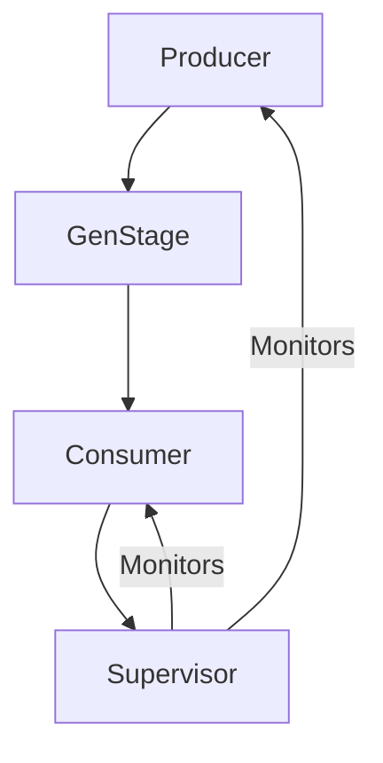

## 16.8. Case Studies in Data Engineering with Elixir

In this section, we delve into the real-world applications of Elixir in data engineering, exploring how companies have leveraged Elixir to build robust data pipelines. We will highlight success stories that demonstrate improved performance, scalability, and maintainability, and share valuable lessons learned, including best practices and common pitfalls.

### Real-World Applications

#### Exploring Companies Using Elixir for Data Pipelines

Elixir, with its functional programming paradigm and powerful concurrency model, has become a popular choice for building data pipelines. Let's explore some companies that have successfully implemented Elixir in their data engineering processes.

**1. Discord:**

Discord, a popular communication platform, uses Elixir to handle its massive data processing needs. The company chose Elixir for its ability to handle concurrent processes efficiently, which is crucial for real-time communication and data processing.

- **Challenge:** Discord needed a system that could handle millions of concurrent users and process large volumes of data in real-time.
- **Solution:** By leveraging Elixir's concurrency model and the OTP framework, Discord built a scalable and fault-tolerant system that could handle their data processing needs.
- **Outcome:** The use of Elixir allowed Discord to achieve high performance and reliability, ensuring a seamless user experience even during peak usage times.

**2. Bleacher Report:**

Bleacher Report, a sports news website, uses Elixir to power its data pipelines for real-time sports updates and notifications.

- **Challenge:** The company needed a system that could process and deliver real-time sports updates to millions of users.
- **Solution:** Elixir's ability to handle concurrent processes and its lightweight processes made it an ideal choice for building real-time data pipelines.
- **Outcome:** Bleacher Report was able to deliver real-time updates to its users with minimal latency, enhancing user engagement and satisfaction.

**3. Pinterest:**

Pinterest, a visual discovery engine, uses Elixir to process and analyze large volumes of data generated by its users.

- **Challenge:** Pinterest needed a system that could process and analyze large volumes of data in real-time to provide personalized recommendations to its users.
- **Solution:** Elixir's functional programming paradigm and concurrency model allowed Pinterest to build a scalable and efficient data processing system.
- **Outcome:** The use of Elixir enabled Pinterest to provide personalized recommendations to its users in real-time, improving user engagement and satisfaction.

### Success Stories

#### Improved Performance, Scalability, and Maintainability

The success stories of companies using Elixir for data engineering highlight the significant improvements in performance, scalability, and maintainability that can be achieved with Elixir.

**Performance:**

Elixir's concurrency model and lightweight processes allow for efficient data processing, resulting in improved performance. Companies like Discord and Bleacher Report have been able to handle large volumes of data in real-time, ensuring a seamless user experience.

**Scalability:**

Elixir's ability to handle concurrent processes and its fault-tolerant design make it an ideal choice for building scalable data pipelines. Companies like Pinterest have been able to scale their data processing systems to handle large volumes of data, ensuring that they can meet the demands of their users.

**Maintainability:**

Elixir's functional programming paradigm and clear syntax make it easy to write and maintain code. This has allowed companies to build data pipelines that are not only efficient but also easy to maintain and extend.

### Lessons Learned

#### Best Practices and Common Pitfalls

The experiences of companies using Elixir for data engineering provide valuable insights into best practices and common pitfalls.

**Best Practices:**

1. **Leverage Elixir's Concurrency Model:**

   Elixir's concurrency model is one of its key strengths. By leveraging lightweight processes and the OTP framework, companies can build efficient and scalable data pipelines.

2. **Embrace Functional Programming:**

   Elixir's functional programming paradigm encourages writing clean and maintainable code. Embrace immutability and pure functions to build robust data processing systems.

3. **Use Supervisors for Fault Tolerance:**

   Elixir's OTP framework provides powerful tools for building fault-tolerant systems. Use supervisors to monitor and restart processes in case of failures, ensuring high availability and reliability.

4. **Optimize for Performance:**

   Use Elixir's profiling tools to identify and optimize performance bottlenecks. Consider using ETS (Erlang Term Storage) for efficient data storage and retrieval.

5. **Test Thoroughly:**

   Thorough testing is crucial for building reliable data pipelines. Use Elixir's testing tools to write comprehensive tests and ensure that your system behaves as expected.

**Common Pitfalls:**

1. **Overusing Macros:**

   While macros can be powerful, overusing them can lead to complex and hard-to-maintain code. Use macros judiciously and prefer functions whenever possible.

2. **Ignoring OTP Principles:**

   Elixir's OTP framework provides powerful tools for building robust systems. Ignoring OTP principles can lead to fragile and unreliable systems.

3. **Premature Optimization:**

   While performance is important, premature optimization can lead to complex and hard-to-maintain code. Focus on writing clean and maintainable code first, and optimize only when necessary.

4. **Lack of Documentation:**

   Good documentation is crucial for maintaining and extending data pipelines. Ensure that your code is well-documented and easy to understand.

5. **Neglecting Error Handling:**

   Proper error handling is crucial for building reliable systems. Use Elixir's error handling tools to handle errors gracefully and ensure that your system can recover from failures.

### Code Examples

Let's explore some code examples that demonstrate how Elixir can be used to build data pipelines.

**Example 1: Real-Time Data Processing with GenStage**

```elixir
defmodule Producer do
  use GenStage

  def start_link(initial) do
    GenStage.start_link(__MODULE__, initial, name: __MODULE__)
  end

  def init(initial) do
    {:producer, initial}
  end

  def handle_demand(demand, state) do
    events = Enum.to_list(state..(state + demand - 1))
    {:noreply, events, state + demand}
  end
end

defmodule Consumer do
  use GenStage

  def start_link() do
    GenStage.start_link(__MODULE__, :ok, name: __MODULE__)
  end

  def init(:ok) do
    {:consumer, :ok}
  end

  def handle_events(events, _from, state) do
    Enum.each(events, fn event ->
      IO.inspect(event, label: "Processed event")
    end)
    {:noreply, [], state}
  end
end

{:ok, producer} = Producer.start_link(0)
{:ok, consumer} = Consumer.start_link()

GenStage.sync_subscribe(consumer, to: producer)
```

**Explanation:**

- **Producer:** Generates a sequence of numbers and sends them to the consumer.
- **Consumer:** Processes the events received from the producer.
- **GenStage:** Used to build a real-time data processing pipeline.

**Example 2: Fault-Tolerant Data Processing with Supervisors**

```elixir
defmodule MyApp.Application do
  use Application

  def start(_type, _args) do
    children = [
      {Producer, 0},
      Consumer
    ]

    opts = [strategy: :one_for_one, name: MyApp.Supervisor]
    Supervisor.start_link(children, opts)
  end
end
```

**Explanation:**

- **Supervisor:** Monitors the producer and consumer processes, restarting them in case of failures.
- **Fault Tolerance:** Ensures that the data processing pipeline remains available and reliable.

### Visualizing Elixir's Data Pipeline

Let's visualize the data pipeline using a Mermaid.js diagram.



**Diagram Explanation:**

- **Producer:** Generates data and sends it to the consumer via GenStage.
- **Consumer:** Processes the data received from the producer.
- **Supervisor:** Monitors the producer and consumer, ensuring fault tolerance.

### Try It Yourself

Experiment with the code examples provided. Try modifying the producer to generate different types of data or the consumer to process the data differently. Explore how changes affect the performance and reliability of the data pipeline.

### References and Links

- [Elixir Lang](https://elixir-lang.org/): Official Elixir website.
- [GenStage Documentation](https://hexdocs.pm/gen_stage/): Documentation for GenStage.
- [OTP Design Principles](https://erlang.org/doc/design_principles/des_princ.html): Erlang OTP design principles.

### Knowledge Check

- **What are the key benefits of using Elixir for data engineering?**
- **How does Elixir's concurrency model contribute to building efficient data pipelines?**
- **What are some common pitfalls to avoid when using Elixir for data engineering?**

### Embrace the Journey

Remember, this is just the beginning. As you progress, you'll build more complex and efficient data pipelines with Elixir. Keep experimenting, stay curious, and enjoy the journey!

## Quiz: Case Studies in Data Engineering with Elixir



### What is one of the key benefits of using Elixir for data engineering?

- [x] Efficient concurrency model
- [ ] Object-oriented programming
- [ ] Lack of fault tolerance
- [ ] High memory usage

> **Explanation:** Elixir's efficient concurrency model is one of its key benefits, allowing for scalable and fault-tolerant data pipelines.

### Which company uses Elixir to handle real-time sports updates?

- [ ] Discord
- [x] Bleacher Report
- [ ] Pinterest
- [ ] Facebook

> **Explanation:** Bleacher Report uses Elixir to power its data pipelines for real-time sports updates and notifications.

### What is a common pitfall when using Elixir for data engineering?

- [ ] Leveraging concurrency
- [ ] Embracing functional programming
- [x] Overusing macros
- [ ] Using supervisors

> **Explanation:** Overusing macros can lead to complex and hard-to-maintain code, making it a common pitfall.

### How does Elixir's OTP framework contribute to fault tolerance?

- [x] By using supervisors to monitor and restart processes
- [ ] By ignoring process failures
- [ ] By using macros extensively
- [ ] By avoiding concurrency

> **Explanation:** Elixir's OTP framework uses supervisors to monitor and restart processes, ensuring fault tolerance.

### What is a best practice for building reliable data pipelines in Elixir?

- [x] Thorough testing
- [ ] Ignoring error handling
- [ ] Premature optimization
- [ ] Overusing macros

> **Explanation:** Thorough testing is crucial for building reliable data pipelines, ensuring that the system behaves as expected.

### Which Elixir feature allows for efficient data storage and retrieval?

- [ ] Macros
- [x] ETS (Erlang Term Storage)
- [ ] GenStage
- [ ] Supervisors

> **Explanation:** ETS (Erlang Term Storage) allows for efficient data storage and retrieval in Elixir.

### What is a benefit of using Elixir's functional programming paradigm?

- [x] Writing clean and maintainable code
- [ ] Encouraging mutable state
- [ ] Avoiding concurrency
- [ ] Overusing macros

> **Explanation:** Elixir's functional programming paradigm encourages writing clean and maintainable code.

### Which company uses Elixir to process and analyze large volumes of data?

- [ ] Discord
- [ ] Bleacher Report
- [x] Pinterest
- [ ] Twitter

> **Explanation:** Pinterest uses Elixir to process and analyze large volumes of data generated by its users.

### What is a key component of Elixir's concurrency model?

- [x] Lightweight processes
- [ ] Heavyweight threads
- [ ] Object-oriented classes
- [ ] Macros

> **Explanation:** Elixir's concurrency model is based on lightweight processes, allowing for efficient data processing.

### True or False: Elixir's OTP framework is not suitable for building fault-tolerant systems.

- [ ] True
- [x] False

> **Explanation:** False. Elixir's OTP framework is designed to build fault-tolerant systems, using supervisors to monitor and restart processes.


