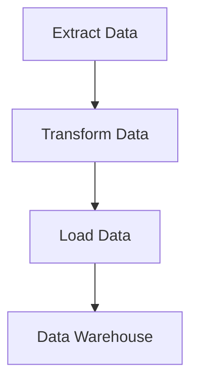

## 16.9. Best Practices and Performance Considerations

In the realm of data engineering and ETL (Extract, Transform, Load) processes, Elixir offers a robust platform for building efficient, scalable, and secure systems. This section delves into best practices and performance considerations that expert software engineers and architects should adopt to maximize the potential of Elixir in data engineering tasks.

### Efficient Coding Practices

Efficient coding is the cornerstone of any high-performance application. In Elixir, this involves writing clean, maintainable, and performant code that leverages the language's strengths.

#### Writing Clean and Maintainable Code

1. **Adopt a Consistent Coding Style**: Use tools like `mix format` to ensure consistent code formatting across your projects. This not only improves readability but also facilitates collaboration among team members.

2. **Use Descriptive Naming Conventions**: Choose meaningful names for variables, functions, and modules. This makes your code self-documenting and easier to understand.

3. **Leverage Pattern Matching**: Elixir's pattern matching is a powerful feature that can simplify your code. Use it to destructure data and handle different cases elegantly.

```elixir
defmodule DataProcessor do
  def process_data({:ok, data}) do
    # Process the data
  end

  def process_data({:error, reason}) do
    # Handle the error
  end
end
```

4. **Write Modular Code**: Break down your application into smaller, reusable modules. This promotes code reuse and simplifies testing and maintenance.

5. **Document Your Code**: Use ExDoc to generate documentation for your modules and functions. Well-documented code is easier to maintain and understand.

#### Performance Optimization

1. **Optimize Data Structures**: Choose the right data structures for your tasks. For example, use lists for sequential access and maps for key-value storage.

2. **Avoid Unnecessary Computations**: Use memoization or caching to store results of expensive computations that are used frequently.

3. **Profile and Benchmark**: Use tools like `Benchee` to profile your code and identify bottlenecks. This helps in making informed decisions about where to focus optimization efforts.

```elixir
Benchee.run(%{
  "fast function" => fn -> fast_function() end,
  "slow function" => fn -> slow_function() end
})
```

4. **Leverage Concurrency**: Elixir's lightweight processes allow you to perform tasks concurrently, improving throughput and responsiveness.

```elixir
defmodule ConcurrentProcessor do
  def process_data(data_list) do
    data_list
    |> Enum.map(&Task.async(fn -> process(&1) end))
    |> Enum.map(&Task.await/1)
  end
end
```

### Resource Management

Efficient resource management is crucial for maintaining performance and ensuring that your application can handle large volumes of data.

#### Managing RAM and CPU Usage

1. **Use Streams for Lazy Evaluation**: Streams allow you to process large datasets without loading them entirely into memory. This is particularly useful for ETL processes.

```elixir
File.stream!("large_file.csv")
|> Stream.map(&process_line/1)
|> Enum.to_list()
```

2. **Limit Process Count**: While Elixir's processes are lightweight, creating too many can still overwhelm the system. Use process pools to manage the number of concurrent processes.

3. **Monitor System Resources**: Use tools like `:observer` and `Telemetry` to monitor CPU and memory usage. This helps in identifying resource-intensive operations.

#### Scalability

Designing systems that can scale with data volume is essential for future-proofing your applications.

1. **Design for Horizontal Scalability**: Use distributed Elixir nodes to spread the load across multiple machines. This allows your system to handle increased data volumes by adding more nodes.

2. **Implement Load Balancing**: Use load balancers to distribute incoming requests evenly across your nodes, preventing any single node from becoming a bottleneck.

3. **Use GenStage and Flow**: These libraries provide abstractions for building data processing pipelines that can scale with demand.

```elixir
defmodule DataPipeline do
  use GenStage

  def start_link(_) do
    GenStage.start_link(__MODULE__, :ok, name: __MODULE__)
  end

  def init(:ok) do
    {:producer, :ok}
  end

  def handle_demand(demand, state) do
    events = generate_events(demand)
    {:noreply, events, state}
  end
end
```

### Security Considerations

Protecting sensitive data during processing is a critical aspect of data engineering.

#### Data Protection

1. **Encrypt Sensitive Data**: Use libraries like `Comeonin` and `Argon2` to encrypt sensitive information before storing or transmitting it.

2. **Implement Access Controls**: Ensure that only authorized users and processes can access sensitive data. Use role-based access control (RBAC) to manage permissions.

3. **Audit and Logging**: Maintain logs of data access and modifications to detect unauthorized activities. Use tools like `Logger` to capture and store logs securely.

4. **Regular Security Audits**: Conduct regular security audits to identify and address vulnerabilities in your system.

### Visualizing Elixir's Data Processing Flow

To better understand how data flows through an Elixir application, let's visualize a simple ETL pipeline using Mermaid.js.



**Description:** This diagram represents a basic ETL pipeline where data is extracted, transformed, and then loaded into a data warehouse.

### References and Links

- [Elixir Lang](https://elixir-lang.org/) - Official Elixir website for documentation and resources.
- [Benchee](https://github.com/bencheeorg/benchee) - A benchmarking library for Elixir.
- [Comeonin](https://github.com/riverrun/comeonin) - Password hashing library for Elixir.

### Knowledge Check

- **Question:** What are the benefits of using streams in Elixir for data processing?
- **Exercise:** Modify the `ConcurrentProcessor` module to handle errors gracefully when processing data concurrently.

### Embrace the Journey

Remember, mastering Elixir's data engineering capabilities is a journey. As you continue to explore and experiment, you'll discover new ways to optimize and secure your applications. Stay curious, keep learning, and enjoy the process!

## Quiz: Best Practices and Performance Considerations



### What is the primary benefit of using pattern matching in Elixir?

- [x] Simplifies code by destructuring data
- [ ] Increases memory usage
- [ ] Decreases code readability
- [ ] Slows down execution

> **Explanation:** Pattern matching allows for elegant and concise code by destructuring data, making it easier to handle different cases.

### Which tool can be used to format Elixir code consistently?

- [x] mix format
- [ ] Benchee
- [ ] Comeonin
- [ ] Telemetry

> **Explanation:** `mix format` is used to ensure consistent code formatting in Elixir projects.

### How can you process large datasets without loading them entirely into memory in Elixir?

- [x] Use Streams for lazy evaluation
- [ ] Use Lists for sequential access
- [ ] Use Maps for key-value storage
- [ ] Use Tuples for fixed-size collections

> **Explanation:** Streams allow for lazy evaluation, enabling the processing of large datasets without loading them entirely into memory.

### What is a key consideration when managing RAM and CPU usage in Elixir applications?

- [x] Limit the number of concurrent processes
- [ ] Use more memory-intensive data structures
- [ ] Increase the number of nodes
- [ ] Avoid using streams

> **Explanation:** Limiting the number of concurrent processes helps manage RAM and CPU usage effectively.

### Which library provides abstractions for building scalable data processing pipelines in Elixir?

- [x] GenStage
- [ ] Comeonin
- [ ] Benchee
- [ ] Logger

> **Explanation:** GenStage provides abstractions for building scalable data processing pipelines in Elixir.

### What is a recommended practice for protecting sensitive data during processing?

- [x] Encrypt sensitive data
- [ ] Store data in plain text
- [ ] Avoid logging data access
- [ ] Use weak access controls

> **Explanation:** Encrypting sensitive data is a recommended practice for protecting it during processing.

### How can you ensure that only authorized users access sensitive data in Elixir applications?

- [x] Implement role-based access control (RBAC)
- [ ] Use plain text passwords
- [ ] Disable logging
- [ ] Allow unrestricted access

> **Explanation:** Implementing role-based access control (RBAC) ensures that only authorized users can access sensitive data.

### What is the purpose of conducting regular security audits in Elixir applications?

- [x] Identify and address vulnerabilities
- [ ] Increase system complexity
- [ ] Reduce code readability
- [ ] Slow down application performance

> **Explanation:** Regular security audits help identify and address vulnerabilities in Elixir applications.

### Which tool can be used to profile and identify bottlenecks in Elixir code?

- [x] Benchee
- [ ] mix format
- [ ] Comeonin
- [ ] Logger

> **Explanation:** Benchee is a benchmarking library used to profile and identify bottlenecks in Elixir code.

### True or False: Elixir's lightweight processes allow for improved throughput and responsiveness.

- [x] True
- [ ] False

> **Explanation:** Elixir's lightweight processes enable concurrent task execution, improving throughput and responsiveness.


