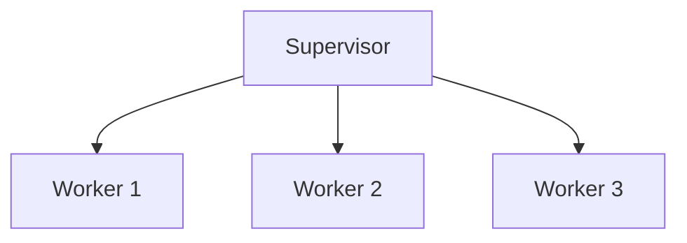

## 16.9. Best Practices and Performance Considerations

In the realm of data engineering and ETL (Extract, Transform, Load) processes, Elixir offers a robust platform for building scalable and efficient systems. This section will delve into best practices and performance considerations essential for expert software engineers and architects when working with Elixir in these domains. We will explore efficient coding practices, resource management, scalability, and security considerations, ensuring that your Elixir applications are not only performant but also secure and maintainable.

### Efficient Coding Practices

Efficient coding in Elixir is crucial for building maintainable and performant applications. Here are some key practices to consider:

#### Writing Clean and Maintainable Code

1. **Use Descriptive Names**: Choose meaningful names for variables, functions, and modules to convey their purpose clearly.

2. **Adopt Consistent Coding Style**: Follow the community's style guide to ensure readability and consistency. Use tools like `mix format` for automated code formatting.

3. **Leverage Pattern Matching**: Elixir's pattern matching is a powerful feature that can simplify code and reduce conditional logic. Use it extensively in function definitions and case statements.

   ```elixir
   defmodule DataProcessor do
     def process_data({:ok, data}), do: transform_data(data)
     def process_data({:error, reason}), do: {:error, reason}
   end
   ```

4. **Avoid Code Duplication**: DRY (Don't Repeat Yourself) is a fundamental principle. Extract common logic into reusable functions or modules.

5. **Write Idiomatic Elixir**: Embrace Elixir's functional programming paradigm. Use higher-order functions, pipelines, and immutability to write concise and expressive code.

6. **Document Your Code**: Use ExDoc to generate documentation for your modules and functions. Well-documented code is easier to understand and maintain.

#### Performance Optimization Techniques

1. **Profile Your Code**: Use tools like `ExProf` or `Benchee` to identify bottlenecks in your application. Focus optimization efforts on these areas.

2. **Optimize Data Structures**: Choose appropriate data structures based on access patterns. For example, use maps for fast key-value lookups and lists for ordered collections.

3. **Leverage Concurrency**: Elixir's lightweight processes make it easy to parallelize tasks. Use `Task.async` and `Task.await` for concurrent operations.

   ```elixir
   def fetch_data(urls) do
     urls
     |> Enum.map(&Task.async(fn -> HTTPoison.get(&1) end))
     |> Enum.map(&Task.await/1)
   end
   ```

4. **Minimize Memory Usage**: Be mindful of memory consumption, especially when processing large datasets. Use streams for lazy evaluation and avoid loading entire datasets into memory.

5. **Use ETS for In-Memory Storage**: Erlang Term Storage (ETS) provides a fast, in-memory storage solution for read-heavy workloads.

### Resource Management

Efficient resource management is critical for maintaining application performance and stability.

#### Managing RAM and CPU Usage

1. **Monitor Resource Usage**: Use tools like `Observer` and `Recon` to monitor CPU and memory usage in real-time. Identify processes consuming excessive resources.

2. **Optimize Process Count**: Avoid spawning too many processes, which can lead to excessive context switching. Use process pools for managing a large number of tasks.

3. **Control Process Lifecycles**: Use supervisors to manage process lifecycles, ensuring that processes are restarted in case of failure.

   ```elixir
   defmodule MyApp.Supervisor do
     use Supervisor

     def start_link(init_arg) do
       Supervisor.start_link(__MODULE__, init_arg, name: __MODULE__)
     end

     def init(_init_arg) do
       children = [
         {MyWorker, []}
       ]

       Supervisor.init(children, strategy: :one_for_one)
     end
   end
   ```

4. **Efficient Garbage Collection**: Tune the garbage collector settings based on application needs. Elixir's BEAM VM handles garbage collection efficiently, but understanding its impact can help optimize performance.

### Scalability

Designing scalable systems is essential for handling growing data volumes and user demands.

#### Designing for Scalability

1. **Decouple Components**: Use microservices or modular architectures to decouple components. This allows for independent scaling and deployment.

2. **Leverage Distributed Systems**: Use Elixir's built-in support for distributed systems to scale across multiple nodes. Consider using `libcluster` for automatic node discovery and clustering.

3. **Implement Load Balancing**: Distribute incoming requests across multiple nodes or processes to balance the load and prevent bottlenecks.

4. **Use GenStage for Backpressure**: Implement backpressure mechanisms using `GenStage` to handle varying data rates and prevent system overload.

   ```elixir
   defmodule Producer do
     use GenStage

     def start_link() do
       GenStage.start_link(__MODULE__, :ok, name: __MODULE__)
     end

     def init(:ok) do
       {:producer, 0}
     end

     def handle_demand(demand, state) do
       events = Enum.to_list(state..state + demand - 1)
       {:noreply, events, state + demand}
     end
   end
   ```

5. **Horizontal and Vertical Scaling**: Design your application to support both horizontal (adding more nodes) and vertical (upgrading existing nodes) scaling.

### Security Considerations

Security is paramount, especially when dealing with sensitive data in ETL processes.

#### Protecting Sensitive Data

1. **Data Encryption**: Encrypt sensitive data both at rest and in transit. Use libraries like `Comeonin` for hashing and `Plug.SSL` for secure connections.

2. **Access Control**: Implement robust authentication and authorization mechanisms. Use libraries like `Guardian` for JWT-based authentication.

3. **Sanitize Inputs**: Validate and sanitize all user inputs to prevent injection attacks. Use pattern matching and guards to enforce input constraints.

4. **Secure Configuration Management**: Store configuration secrets securely using environment variables or secret management tools like `Vault`.

5. **Audit Logging**: Implement audit logging to track access and changes to sensitive data. Use tools like `Logger` for centralized logging.

### Visualizing Resource Management

To better understand how Elixir's processes and supervisors manage resources, let's visualize a simple supervision tree.


```mermaid
graph TD;
    A[Supervisor] --> B[Worker 1]
    A --> C[Worker 2]
    A --> D[Worker 3]
```

**Caption**: This diagram illustrates a basic supervision tree with one supervisor managing three worker processes. The supervisor ensures that if any worker fails, it is restarted according to the specified strategy.

### Try It Yourself

Experiment with the code examples provided. Try modifying the `fetch_data` function to handle errors gracefully, or implement a custom GenStage producer-consumer pipeline to process a stream of data. Explore different data structures and concurrency patterns to see how they affect performance and scalability.

### Knowledge Check

- What are some key practices for writing clean and maintainable Elixir code?
- How can you optimize resource usage in an Elixir application?
- What strategies can be used to design scalable Elixir systems?
- How do you ensure the security of sensitive data in ETL processes?

### Embrace the Journey

Remember, mastering Elixir's best practices and performance considerations is a continuous journey. As you build and optimize your applications, keep experimenting, stay curious, and enjoy the process of creating efficient and scalable systems. The Elixir community is a valuable resource, so don't hesitate to engage and learn from others.

## Quiz Time!



### What is a key practice for writing clean and maintainable Elixir code?

- [x] Use descriptive names for variables and functions
- [ ] Avoid using pattern matching
- [ ] Write long, complex functions
- [ ] Use global variables

> **Explanation:** Using descriptive names helps convey the purpose of code elements, making the code more readable and maintainable.

### How can you optimize resource usage in an Elixir application?

- [x] Monitor CPU and memory usage
- [ ] Spawn as many processes as possible
- [ ] Avoid using supervisors
- [ ] Use global variables for state management

> **Explanation:** Monitoring CPU and memory usage helps identify bottlenecks and optimize resource allocation.

### What is a strategy for designing scalable Elixir systems?

- [x] Use microservices to decouple components
- [ ] Use a monolithic architecture
- [ ] Avoid using distributed systems
- [ ] Store all data in a single node

> **Explanation:** Microservices allow for independent scaling and deployment, making systems more scalable.

### What is a security consideration for protecting sensitive data?

- [x] Encrypt data at rest and in transit
- [ ] Store passwords in plain text
- [ ] Use hardcoded secrets in code
- [ ] Disable authentication

> **Explanation:** Encrypting data ensures that sensitive information is protected from unauthorized access.

### Which tool can be used for profiling Elixir code?

- [x] Benchee
- [ ] ExDoc
- [ ] Logger
- [ ] Plug.SSL

> **Explanation:** Benchee is a tool for benchmarking and profiling Elixir code to identify performance bottlenecks.

### What is a benefit of using GenStage in Elixir?

- [x] Implementing backpressure mechanisms
- [ ] Avoiding concurrency
- [ ] Reducing code readability
- [ ] Increasing memory usage

> **Explanation:** GenStage helps manage varying data rates and prevents system overload through backpressure mechanisms.

### How can you ensure secure configuration management?

- [x] Use environment variables for secrets
- [ ] Hardcode secrets in the source code
- [ ] Share secrets in public repositories
- [ ] Disable encryption

> **Explanation:** Environment variables provide a secure way to manage configuration secrets without exposing them in the source code.

### What is a common practice to avoid code duplication?

- [x] Extract common logic into reusable functions
- [ ] Write the same code in multiple places
- [ ] Use global variables for shared logic
- [ ] Avoid using functions

> **Explanation:** Extracting common logic into reusable functions follows the DRY principle and reduces code duplication.

### How can you minimize memory usage in Elixir?

- [x] Use streams for lazy evaluation
- [ ] Load entire datasets into memory
- [ ] Avoid using ETS
- [ ] Spawn excessive processes

> **Explanation:** Streams allow for lazy evaluation, processing data only as needed and minimizing memory usage.

### True or False: Elixir's pattern matching can simplify code and reduce conditional logic.

- [x] True
- [ ] False

> **Explanation:** Pattern matching is a powerful feature in Elixir that simplifies code by reducing the need for complex conditional logic.


