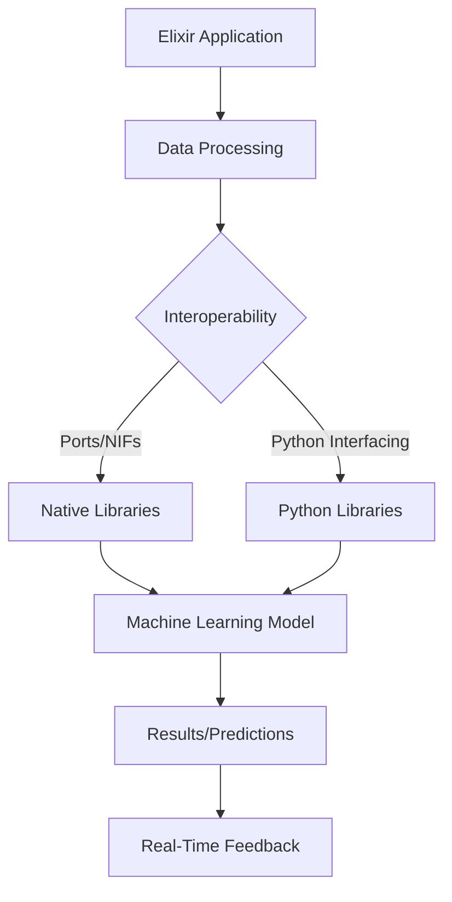

## 17.1. Overview of Machine Learning in Elixir

As we delve into the world of machine learning (ML) with Elixir, it's essential to understand how this functional programming language fits into the broader landscape of data science and ML. Elixir, known for its concurrency and fault-tolerance, offers unique advantages and challenges when applied to machine learning tasks. In this section, we will explore Elixir's role in ML, its strengths, limitations, and how it can be effectively combined with other tools and languages to create powerful ML solutions.

### Elixir's Role in Machine Learning

Elixir is a functional, concurrent language built on the Erlang VM (BEAM), which is renowned for its ability to handle large numbers of concurrent connections with minimal resource consumption. This makes Elixir particularly well-suited for applications that require real-time data processing and high availability. Let's explore how these strengths translate into the realm of machine learning.

#### Strengths of Elixir in Machine Learning

1. **Concurrency and Real-Time Data Handling**

   Elixir's concurrency model, based on the Actor model, allows for efficient handling of multiple tasks simultaneously. This is particularly beneficial in machine learning scenarios where real-time data processing is crucial, such as in streaming data applications or online learning algorithms.

   ```elixir
   defmodule DataStreamer do
     use GenServer

     def start_link(initial_state) do
       GenServer.start_link(__MODULE__, initial_state, name: __MODULE__)
     end

     def init(initial_state) do
       {:ok, initial_state}
     end

     def handle_info(:process_data, state) do
       # Simulate data processing
       new_state = process_data(state)
       {:noreply, new_state}
     end

     defp process_data(state) do
       # Implement data processing logic here
       state
     end
   end

   # Start the data streamer
   {:ok, _pid} = DataStreamer.start_link(%{})
   ```

   In this example, we use a GenServer to handle data processing concurrently, demonstrating Elixir's ability to manage real-time data streams efficiently.

2. **Fault Tolerance**

   Elixir inherits Erlang's robust fault-tolerance mechanisms, making it ideal for building reliable ML systems that can recover from failures without downtime. This is crucial in production environments where uptime is critical.

3. **Scalability**

   Elixir's lightweight processes and distributed nature allow for easy scaling of ML applications. This is particularly useful for handling large datasets or deploying models across multiple nodes.

#### Limitations of Elixir in Machine Learning

While Elixir offers several advantages, it also has limitations that must be considered:

1. **Smaller Ecosystem**

   Compared to languages like Python, Elixir's ecosystem for machine learning is relatively small. Python boasts a vast array of libraries and frameworks such as TensorFlow, PyTorch, and scikit-learn, which are not natively available in Elixir.

2. **Lack of Specialized Libraries**

   Elixir lacks specialized ML libraries, which means developers often need to rely on external tools or write custom implementations for complex algorithms.

3. **Performance Considerations**

   While Elixir is excellent for concurrent tasks, it may not match the raw computational performance of languages like C++ or Python with optimized libraries for heavy numerical computations.

### Interoperability: Combining Elixir with Other ML Tools and Languages

To overcome some of the limitations mentioned above, Elixir can be effectively combined with other ML tools and languages. This interoperability allows developers to leverage Elixir's strengths while utilizing the rich ecosystem of other languages.

#### Using Ports and NIFs

Elixir can interface with native code using Ports and Native Implemented Functions (NIFs), allowing it to call functions written in languages like C or Rust. This can be used to integrate high-performance ML libraries.

```elixir
defmodule MyNIF do
  use Rustler, otp_app: :my_app, crate: "my_nif"

  # Define a function that calls a Rust function
  def my_function(arg), do: :erlang.nif_error(:nif_not_loaded)
end
```

In this example, we define a NIF that allows Elixir to call a Rust function, enabling the use of Rust's performance for computationally intensive tasks.

#### Interfacing with Python

Elixir can also interface with Python using libraries like `erlport` or `Pyrlang`, allowing it to call Python functions and utilize its extensive ML libraries.

```elixir
defmodule PythonInterop do
  use ErlPort, otp_app: :my_app

  def call_python_function(arg) do
    :python.call(:my_python_module, :my_function, [arg])
  end
end
```

This approach allows Elixir to leverage Python's ML capabilities while maintaining its own strengths in concurrency and fault tolerance.

### Visualizing Elixir's Interaction with Machine Learning Tools

To better understand how Elixir can be integrated with other ML tools, let's visualize the process using a flowchart.



**Diagram Description:** This flowchart illustrates how an Elixir application can process data and interact with native libraries or Python libraries to perform machine learning tasks, ultimately providing real-time feedback.

### Knowledge Check

Before we move on, let's reinforce what we've learned with a few questions:

- What are the main strengths of Elixir in machine learning?
- How can Elixir overcome its limitations in the ML ecosystem?
- What are Ports and NIFs, and how do they help in Elixir's interoperability?

### Embrace the Journey

As we explore machine learning in Elixir, remember that this is just the beginning. The language's unique strengths in concurrency and fault tolerance offer exciting opportunities for innovation in ML applications. Keep experimenting, stay curious, and enjoy the journey!

### Key Takeaways

- Elixir's concurrency and fault tolerance make it well-suited for real-time ML applications.
- The smaller ecosystem and lack of specialized libraries are challenges that can be overcome through interoperability.
- Combining Elixir with other languages and tools allows developers to leverage the best of both worlds.

## Quiz: Overview of Machine Learning in Elixir



### What is one of Elixir's main strengths in machine learning?

- [x] Concurrency and real-time data handling
- [ ] Extensive ML libraries
- [ ] High computational performance
- [ ] Built-in ML algorithms

> **Explanation:** Elixir is known for its concurrency and real-time data handling capabilities, which are beneficial in ML applications.

### How can Elixir overcome its limitations in the ML ecosystem?

- [x] By interfacing with other languages and tools
- [ ] By using only Elixir-native libraries
- [ ] By avoiding ML tasks
- [ ] By focusing on non-ML applications

> **Explanation:** Elixir can overcome its limitations by interfacing with other languages and tools, such as Python, to leverage their ML capabilities.

### What are Ports and NIFs used for in Elixir?

- [x] Interfacing with native code
- [ ] Building web applications
- [ ] Managing databases
- [ ] Creating user interfaces

> **Explanation:** Ports and NIFs are used in Elixir to interface with native code, allowing it to call functions written in other languages.

### Which language is commonly used with Elixir for ML tasks?

- [x] Python
- [ ] Java
- [ ] Ruby
- [ ] JavaScript

> **Explanation:** Python is commonly used with Elixir for ML tasks due to its extensive ML libraries and tools.

### What is a limitation of Elixir in machine learning?

- [x] Smaller ecosystem compared to Python
- [ ] Lack of concurrency support
- [ ] Poor fault tolerance
- [ ] Inability to handle real-time data

> **Explanation:** Elixir's ML ecosystem is smaller compared to Python, which has a vast array of ML libraries and frameworks.

### What is the Actor model used for in Elixir?

- [x] Concurrency
- [ ] Data storage
- [ ] User authentication
- [ ] Network communication

> **Explanation:** The Actor model is used in Elixir for concurrency, allowing efficient handling of multiple tasks simultaneously.

### How does Elixir handle failures in ML applications?

- [x] Through fault tolerance mechanisms
- [ ] By ignoring errors
- [ ] By restarting the entire system
- [ ] By logging errors only

> **Explanation:** Elixir uses fault tolerance mechanisms to handle failures, ensuring reliability and uptime in ML applications.

### What is one way to integrate Elixir with Python?

- [x] Using erlport or Pyrlang
- [ ] By rewriting Python code in Elixir
- [ ] By using Elixir's built-in Python interpreter
- [ ] By avoiding Python altogether

> **Explanation:** Elixir can be integrated with Python using libraries like erlport or Pyrlang, allowing it to call Python functions.

### What is a benefit of using Elixir for ML applications?

- [x] Scalability
- [ ] Lack of concurrency
- [ ] Limited library support
- [ ] High computational cost

> **Explanation:** Elixir's lightweight processes and distributed nature allow for easy scaling of ML applications.

### True or False: Elixir is primarily used for building user interfaces in ML applications.

- [ ] True
- [x] False

> **Explanation:** Elixir is not primarily used for building user interfaces; it is more suited for backend tasks like data processing and real-time handling.



By understanding Elixir's strengths and limitations in machine learning, you can effectively leverage its capabilities to build robust and scalable ML applications. As you continue exploring this exciting field, remember to embrace the journey and keep pushing the boundaries of what's possible with Elixir.
