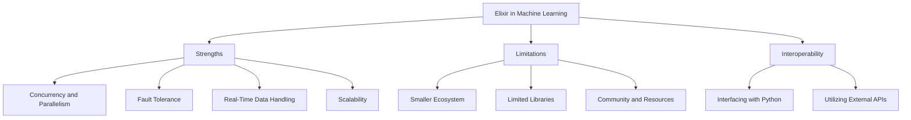

## 17.1. Overview of Machine Learning in Elixir

In the rapidly evolving landscape of machine learning (ML), Elixir offers a unique proposition. Known for its concurrency model and real-time data processing capabilities, Elixir provides a robust platform for certain ML applications. However, it also faces challenges due to its relatively smaller ecosystem compared to languages like Python. This section explores Elixir's role in machine learning, its strengths, limitations, and how it can be effectively combined with other ML tools and languages.

### Elixir's Role in ML

Elixir, a functional programming language built on the Erlang VM (BEAM), is renowned for its ability to handle concurrent processes efficiently. This makes it particularly well-suited for real-time data processing, a crucial aspect of many ML applications. Let's delve into some of the key strengths of Elixir in the context of machine learning.

#### Strengths of Elixir in Machine Learning

1. **Concurrency and Parallelism**

   Elixir's concurrency model is one of its standout features. Leveraging the Actor model, Elixir can efficiently manage thousands of lightweight processes. This capability is invaluable in ML applications that require real-time data processing or parallel computations.

   ```elixir
   defmodule ConcurrentML do
     def process_data(data) do
       data
       |> Enum.map(&Task.async(fn -> perform_computation(&1) end))
       |> Enum.map(&Task.await/1)
     end

     defp perform_computation(data_point) do
       # Simulate a complex computation
       :math.pow(data_point, 2)
     end
   end
   ```

   In this example, we utilize Elixir's `Task` module to perform computations concurrently, demonstrating how Elixir can handle parallel data processing efficiently.

2. **Fault Tolerance**

   Built on the Erlang VM, Elixir inherits its fault-tolerant nature. This is crucial for ML systems that need to maintain high availability and reliability, even in the face of errors or failures.

3. **Real-Time Data Handling**

   Elixir's ability to process data in real-time is a significant advantage for applications like real-time analytics and streaming data processing, which are becoming increasingly important in the ML domain.

   ```elixir
   defmodule RealTimeProcessor do
     use GenServer

     def start_link(initial_state) do
       GenServer.start_link(__MODULE__, initial_state, name: __MODULE__)
     end

     def handle_cast({:process, data}, state) do
       # Process data in real-time
       new_state = process_data(data, state)
       {:noreply, new_state}
     end

     defp process_data(data, state) do
       # Implement real-time data processing logic
       state + data
     end
   end
   ```

   Here, we use a GenServer to handle real-time data processing, showcasing Elixir's strength in managing real-time workloads.

4. **Scalability**

   Elixir's architecture allows for easy scalability, making it suitable for ML applications that need to handle large volumes of data or a high number of requests.

#### Limitations of Elixir in Machine Learning

While Elixir offers several strengths, it also has limitations that need to be acknowledged:

1. **Smaller Ecosystem**

   Compared to Python, Elixir's ecosystem for ML is relatively small. Python boasts a vast array of libraries and frameworks like TensorFlow, PyTorch, and scikit-learn, which are not natively available in Elixir.

2. **Limited Libraries and Tools**

   The lack of specialized ML libraries in Elixir means that developers often need to rely on external tools or languages to perform complex ML tasks.

3. **Community and Resources**

   The Elixir community, while growing, is still smaller than that of Python, which can limit the availability of resources, tutorials, and community support for ML-related projects.

### Interoperability: Combining Elixir with Other ML Tools

To overcome some of its limitations, Elixir can be effectively combined with other ML tools and languages. This interoperability allows developers to leverage Elixir's strengths while utilizing the rich ML ecosystem of other languages like Python.

#### Interfacing with Python

One of the most common approaches is to interface Elixir with Python, allowing developers to use Python's ML libraries while managing data flow and real-time processing with Elixir.

- **Ports and NIFs**

  Elixir provides mechanisms like Ports and Native Implemented Functions (NIFs) to interface with external programs. This can be used to call Python scripts from Elixir.

  ```elixir
  defmodule PythonInterface do
    def call_python_script(script_path, args) do
      Port.open({:spawn, "python #{script_path} #{args}"}, [:binary])
    end
  end
  ```

  This example demonstrates how to call a Python script from Elixir using Ports, enabling the integration of Python's ML capabilities with Elixir's real-time processing.

- **Libraries like `erlport`**

  Libraries such as `erlport` facilitate communication between Elixir and Python, allowing for seamless data exchange and function calls.

  ```elixir
  defmodule PythonInterop do
    use ErlPort

    def start_python do
      :python.start()
    end

    def call_python_function(module, function, args) do
      :python.call(module, function, args)
    end
  end
  ```

  Here, we use `erlport` to call a Python function from Elixir, showcasing the ease of interoperability between the two languages.

#### Utilizing External APIs

Elixir can also interact with external ML APIs, such as those provided by cloud services, to perform complex ML tasks.

- **HTTP Clients**

  Elixir's robust HTTP clients, like `HTTPoison`, can be used to make requests to ML APIs, allowing Elixir applications to leverage external ML services.

  ```elixir
  defmodule MLAPIClient do
    def get_prediction(data) do
      HTTPoison.post("https://api.example.com/predict", data, [{"Content-Type", "application/json"}])
    end
  end
  ```

  This example illustrates how to use `HTTPoison` to send data to an external ML API and retrieve predictions, integrating external ML capabilities into an Elixir application.

### Visualizing Elixir's Role in Machine Learning

To better understand Elixir's role in machine learning, let's visualize its strengths, limitations, and interoperability using a diagram.


```mermaid
graph TD;
    A[Elixir in Machine Learning] --> B[Strengths]
    A --> C[Limitations]
    A --> D[Interoperability]
    B --> E[Concurrency and Parallelism]
    B --> F[Fault Tolerance]
    B --> G[Real-Time Data Handling]
    B --> H[Scalability]
    C --> I[Smaller Ecosystem]
    C --> J[Limited Libraries]
    C --> K[Community and Resources]
    D --> L[Interfacing with Python]
    D --> M[Utilizing External APIs]
```

**Diagram Description:** This diagram illustrates Elixir's role in machine learning, highlighting its strengths, limitations, and interoperability options.

### Conclusion

Elixir offers a unique set of strengths for machine learning applications, particularly in areas requiring concurrency, fault tolerance, and real-time data handling. However, its smaller ecosystem and limited ML libraries necessitate interoperability with other languages and tools. By combining Elixir with languages like Python, developers can leverage the best of both worlds, utilizing Elixir's robust real-time capabilities alongside Python's rich ML ecosystem.

### Try It Yourself

To get hands-on experience, try modifying the code examples provided:

- Experiment with different concurrency models in the `ConcurrentML` module.
- Implement additional real-time data processing logic in the `RealTimeProcessor` module.
- Use `erlport` to call different Python ML functions from Elixir.

### Knowledge Check

Before moving on, let's test your understanding of Elixir's role in machine learning.

## Quiz Time!



### What is one of Elixir's key strengths in machine learning?

- [x] Concurrency and real-time data handling
- [ ] Vast machine learning libraries
- [ ] Built-in machine learning models
- [ ] Native support for TensorFlow

> **Explanation:** Elixir's concurrency model and real-time data handling capabilities are key strengths in machine learning applications.

### What is a limitation of Elixir in the context of machine learning?

- [x] Smaller ecosystem compared to Python
- [ ] Lack of concurrency support
- [ ] Inability to handle real-time data
- [ ] Poor fault tolerance

> **Explanation:** Elixir's ecosystem for machine learning is smaller compared to Python, which has a vast array of libraries and frameworks.

### How can Elixir interface with Python for machine learning tasks?

- [x] Using Ports and NIFs
- [ ] Directly importing Python libraries
- [ ] Running Python code natively
- [ ] Using Elixir's built-in Python interpreter

> **Explanation:** Elixir can interface with Python using Ports and NIFs to call Python scripts and functions.

### What library can facilitate communication between Elixir and Python?

- [x] `erlport`
- [ ] `numpy`
- [ ] `pandas`
- [ ] `tensorflow`

> **Explanation:** `erlport` is a library that facilitates communication between Elixir and Python.

### Which Elixir feature is particularly beneficial for real-time data processing?

- [x] GenServer
- [ ] Ecto
- [ ] Phoenix
- [ ] Mix

> **Explanation:** GenServer is an Elixir feature that is particularly beneficial for managing real-time data processing.

### What is a common approach to overcome Elixir's ML limitations?

- [x] Combining Elixir with other ML tools and languages
- [ ] Using Elixir's built-in ML libraries
- [ ] Avoiding ML tasks in Elixir
- [ ] Relying solely on Elixir's concurrency model

> **Explanation:** Combining Elixir with other ML tools and languages allows developers to leverage Elixir's strengths while utilizing the rich ML ecosystem of other languages.

### What is an example of an external ML API that Elixir can interact with?

- [x] Google Cloud ML API
- [ ] Elixir ML API
- [ ] Python ML API
- [ ] Erlang ML API

> **Explanation:** Elixir can interact with external ML APIs like Google Cloud ML API to perform complex ML tasks.

### Which Elixir module is used for concurrent data processing?

- [x] Task
- [ ] Enum
- [ ] Ecto
- [ ] Phoenix

> **Explanation:** The `Task` module in Elixir is used for concurrent data processing.

### True or False: Elixir has a larger ML ecosystem than Python.

- [ ] True
- [x] False

> **Explanation:** False. Elixir has a smaller ML ecosystem compared to Python, which is known for its extensive ML libraries and frameworks.

### Which of the following is NOT a strength of Elixir in machine learning?

- [x] Vast array of ML libraries
- [ ] Concurrency
- [ ] Fault tolerance
- [ ] Real-time data handling

> **Explanation:** Elixir does not have a vast array of ML libraries, which is a limitation rather than a strength.



Remember, this is just the beginning. As you progress, you'll discover more ways to integrate Elixir into your machine learning projects. Keep experimenting, stay curious, and enjoy the journey!
