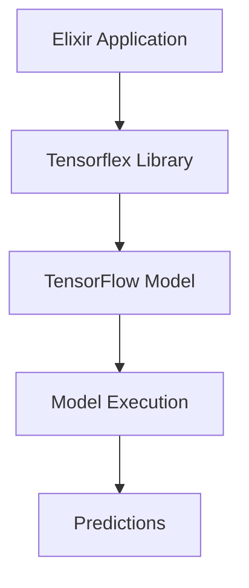
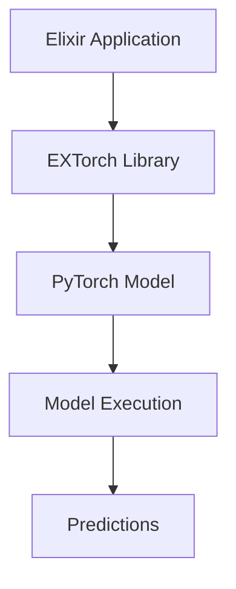
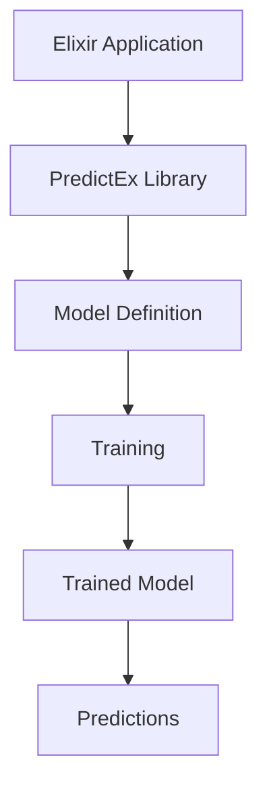
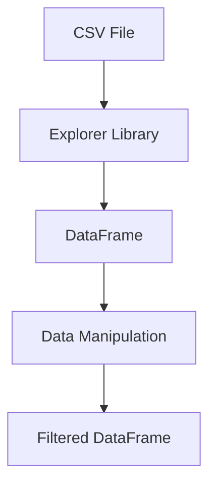

## 17.2. Libraries and Tools for Machine Learning (e.g., Tensorflex)

As the demand for machine learning (ML) continues to grow, Elixir, known for its concurrency and fault-tolerance, is emerging as a viable option for ML applications. In this section, we will explore several libraries and tools that facilitate machine learning in Elixir, including Tensorflex, EXTorch, PredictEx, and DataFrame libraries like `Explorer`. These tools enable developers to leverage the power of Elixir for machine learning tasks, integrating seamlessly with popular ML frameworks like TensorFlow and PyTorch.

### Tensorflex

**Tensorflex** is an Elixir library that provides bindings to TensorFlow, one of the most popular machine learning frameworks. Tensorflex allows Elixir developers to perform machine learning tasks using TensorFlow models without leaving the Elixir ecosystem.

#### Key Features of Tensorflex

- **TensorFlow Integration**: Tensorflex provides a direct interface to TensorFlow, allowing you to load, manipulate, and execute TensorFlow models.
- **Ease of Use**: With a straightforward API, Tensorflex makes it easy to integrate machine learning capabilities into Elixir applications.
- **Performance**: By leveraging TensorFlow's optimized C++ backend, Tensorflex ensures efficient execution of ML models.

#### Getting Started with Tensorflex

To use Tensorflex, you need to have TensorFlow installed on your system. You can then add Tensorflex to your Elixir project by including it in your `mix.exs` file:

```elixir
defp deps do
  [
    {:tensorflex, "~> 0.1.0"}
  ]
end
```

After adding Tensorflex to your project, you can start using it to load and execute TensorFlow models. Here's a simple example of loading a pre-trained model and making predictions:

```elixir
# Load the TensorFlow model
{:ok, model} = Tensorflex.load_graph("path/to/model.pb")

# Prepare input data
input_tensor = Tensorflex.create_tensor(:float, [1, 784], input_data)

# Run the model
{:ok, output_tensor} = Tensorflex.run_session(model, input_tensor)

# Extract predictions
predictions = Tensorflex.get_tensor_data(output_tensor)
IO.inspect(predictions, label: "Model Predictions")
```

#### Visualizing Tensorflex Workflow

To better understand how Tensorflex interacts with TensorFlow, let's visualize the workflow:



This diagram illustrates how an Elixir application uses Tensorflex to interface with a TensorFlow model, execute it, and retrieve predictions.

#### Try It Yourself

Experiment with Tensorflex by modifying the input data or using different TensorFlow models. This hands-on approach will help you understand how Tensorflex integrates with TensorFlow and how you can leverage it for various ML tasks.

### EXTorch

**EXTorch** is another powerful library that enables Elixir developers to integrate with PyTorch models. PyTorch is known for its dynamic computation graph and ease of use, making it a popular choice for research and development in machine learning.

#### Key Features of EXTorch

- **PyTorch Integration**: EXTorch provides seamless integration with PyTorch, allowing you to load and execute PyTorch models from Elixir.
- **Dynamic Computation Graphs**: Benefit from PyTorch's dynamic computation graphs, which are particularly useful for complex model architectures.
- **Interoperability**: EXTorch facilitates interoperability between Elixir and Python, enabling you to leverage existing PyTorch models.

#### Getting Started with EXTorch

To use EXTorch, you need to have PyTorch installed in your Python environment. You can then add EXTorch to your Elixir project:

```elixir
defp deps do
  [
    {:extorch, "~> 0.1.0"}
  ]
end
```

Here's an example of using EXTorch to load a PyTorch model and make predictions:

```elixir
# Load the PyTorch model
{:ok, model} = EXTorch.load_model("path/to/model.pt")

# Prepare input data
input_tensor = EXTorch.create_tensor([1, 3, 224, 224], input_data)

# Run the model
{:ok, output_tensor} = EXTorch.run_model(model, input_tensor)

# Extract predictions
predictions = EXTorch.get_tensor_data(output_tensor)
IO.inspect(predictions, label: "Model Predictions")
```

#### Visualizing EXTorch Workflow

Let's visualize how EXTorch interacts with PyTorch models:



This diagram shows the flow of data from an Elixir application through EXTorch to a PyTorch model, resulting in predictions.

#### Try It Yourself

Modify the model or input data to see how EXTorch handles different scenarios. This experimentation will deepen your understanding of EXTorch's capabilities and its integration with PyTorch.

### PredictEx

**PredictEx** is a high-level library that provides APIs for common machine learning tasks. It abstracts the complexities of model training and evaluation, allowing developers to focus on building applications.

#### Key Features of PredictEx

- **High-Level APIs**: Simplifies the process of training and evaluating models with user-friendly APIs.
- **Model Agnostic**: Works with various machine learning frameworks, providing flexibility in model selection.
- **Extensibility**: Easily extendable to support custom models and algorithms.

#### Getting Started with PredictEx

Add PredictEx to your Elixir project:

```elixir
defp deps do
  [
    {:predictex, "~> 0.1.0"}
  ]
end
```

Here's an example of using PredictEx to train a simple model:

```elixir
# Define the model
model = PredictEx.Model.new(:linear_regression)

# Prepare training data
training_data = [
  %{features: [1.0, 2.0], label: 3.0},
  %{features: [2.0, 3.0], label: 5.0}
]

# Train the model
{:ok, trained_model} = PredictEx.train(model, training_data)

# Make predictions
predictions = PredictEx.predict(trained_model, [%{features: [3.0, 4.0]}])
IO.inspect(predictions, label: "Predictions")
```

#### Visualizing PredictEx Workflow

Here's a diagram illustrating the PredictEx workflow:



This diagram shows how PredictEx simplifies the process of defining, training, and using machine learning models.

#### Try It Yourself

Experiment with different models and datasets to see how PredictEx handles various machine learning tasks. This will help you understand its flexibility and ease of use.

### DataFrame Libraries

Data manipulation is a crucial part of any machine learning workflow. In Elixir, libraries like `Explorer` provide powerful tools for working with data frames, similar to pandas in Python.

#### Key Features of DataFrame Libraries

- **Data Manipulation**: Perform complex data transformations and aggregations with ease.
- **Integration**: Seamlessly integrate with other Elixir libraries and tools.
- **Performance**: Optimized for performance, handling large datasets efficiently.

#### Getting Started with Explorer

Add Explorer to your Elixir project:

```elixir
defp deps do
  [
    {:explorer, "~> 0.1.0"}
  ]
end
```

Here's an example of using Explorer to manipulate data:

```elixir
# Load data into a DataFrame
df = Explorer.DataFrame.from_csv("path/to/data.csv")

# Perform data manipulation
df = df
|> Explorer.DataFrame.filter(fn row -> row["age"] > 30 end)
|> Explorer.DataFrame.select(["name", "age"])

# Display the result
IO.inspect(df, label: "Filtered DataFrame")
```

#### Visualizing DataFrame Workflow

Here's a diagram illustrating the data manipulation workflow with Explorer:



This diagram shows how Explorer processes data from a CSV file, performs manipulations, and outputs a filtered DataFrame.

#### Try It Yourself

Modify the data manipulation steps to explore different transformations and aggregations. This will help you understand the capabilities of Explorer and how it can be used in machine learning workflows.

### Conclusion

Elixir offers a range of libraries and tools for machine learning, each with its unique strengths and capabilities. Tensorflex, EXTorch, PredictEx, and DataFrame libraries like Explorer provide powerful solutions for integrating machine learning into Elixir applications. By leveraging these tools, developers can build efficient, scalable, and fault-tolerant machine learning systems.

### Key Takeaways

- **Tensorflex** provides seamless integration with TensorFlow, enabling efficient execution of ML models in Elixir.
- **EXTorch** allows for dynamic computation graph execution with PyTorch models, facilitating complex ML tasks.
- **PredictEx** offers high-level APIs for model training and evaluation, simplifying machine learning workflows.
- **DataFrame libraries** like Explorer provide powerful data manipulation capabilities, essential for ML tasks.

Remember, this is just the beginning. As you explore these libraries and tools, you'll discover new ways to leverage Elixir for machine learning. Keep experimenting, stay curious, and enjoy the journey!

## Quiz: Libraries and Tools for Machine Learning (e.g., Tensorflex)



### Which library provides bindings to TensorFlow in Elixir?

- [x] Tensorflex
- [ ] EXTorch
- [ ] PredictEx
- [ ] Explorer

> **Explanation:** Tensorflex is the library that provides bindings to TensorFlow in Elixir.

### What is a key feature of EXTorch?

- [x] Integration with PyTorch
- [ ] High-level APIs for ML tasks
- [ ] Data manipulation
- [ ] TensorFlow bindings

> **Explanation:** EXTorch integrates with PyTorch, allowing Elixir to execute PyTorch models.

### Which library offers high-level APIs for machine learning tasks?

- [ ] Tensorflex
- [ ] EXTorch
- [x] PredictEx
- [ ] Explorer

> **Explanation:** PredictEx provides high-level APIs for common machine learning tasks.

### What is the primary use of DataFrame libraries like Explorer?

- [ ] Model training
- [ ] TensorFlow integration
- [x] Data manipulation
- [ ] PyTorch execution

> **Explanation:** DataFrame libraries like Explorer are used for data manipulation.

### How does Tensorflex interact with TensorFlow models?

- [x] By providing a direct interface
- [ ] By using PyTorch
- [ ] Through high-level APIs
- [ ] By manipulating data

> **Explanation:** Tensorflex provides a direct interface to TensorFlow models.

### What is a benefit of using EXTorch?

- [x] Dynamic computation graphs
- [ ] High-level APIs
- [ ] Data manipulation
- [ ] TensorFlow bindings

> **Explanation:** EXTorch benefits from PyTorch's dynamic computation graphs.

### Which library is similar to pandas in Python?

- [ ] Tensorflex
- [ ] EXTorch
- [ ] PredictEx
- [x] Explorer

> **Explanation:** Explorer is similar to pandas in Python for data manipulation.

### What does PredictEx simplify?

- [ ] TensorFlow integration
- [ ] PyTorch execution
- [x] Model training and evaluation
- [ ] Data manipulation

> **Explanation:** PredictEx simplifies model training and evaluation with high-level APIs.

### What is a key feature of Tensorflex?

- [x] TensorFlow integration
- [ ] PyTorch integration
- [ ] High-level APIs
- [ ] Data manipulation

> **Explanation:** Tensorflex integrates with TensorFlow for executing ML models.

### True or False: Explorer is used for executing PyTorch models.

- [ ] True
- [x] False

> **Explanation:** Explorer is used for data manipulation, not executing PyTorch models.


