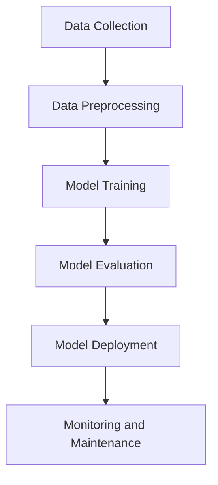

## 17.2. Libraries and Tools for Machine Learning (e.g., Tensorflex)

In this section, we'll delve into the exciting world of machine learning and data science using Elixir. While Elixir is renowned for its concurrency and fault-tolerance features, it is also making strides in the machine learning domain. We'll explore key libraries and tools that enable machine learning in Elixir, such as Tensorflex, EXTorch, PredictEx, and DataFrame libraries. These tools allow developers to harness the power of machine learning models and data manipulation within Elixir applications.

### Introduction to Machine Learning in Elixir

Machine learning (ML) is a subset of artificial intelligence (AI) that focuses on building systems that learn from data to make predictions or decisions. Traditionally, languages like Python and R have dominated this field, but Elixir offers unique advantages for building scalable and concurrent ML applications.

#### Why Use Elixir for Machine Learning?

- **Concurrency and Scalability**: Elixir's lightweight processes and the BEAM VM's ability to handle massive concurrency make it ideal for processing large datasets and parallel computations.
- **Fault Tolerance**: Elixir's "let it crash" philosophy and robust error handling ensure that ML applications are resilient.
- **Integration with Other Languages**: Elixir can seamlessly integrate with other languages, allowing developers to leverage existing ML libraries and tools.

### Tensorflex: Bringing TensorFlow to Elixir

Tensorflex is an Elixir library that provides bindings to TensorFlow, a popular open-source machine learning framework. It enables Elixir developers to run TensorFlow models, making it easier to incorporate ML capabilities into Elixir applications.

#### Key Features of Tensorflex

- **TensorFlow Integration**: Tensorflex allows you to load and execute pre-trained TensorFlow models.
- **Data Manipulation**: Offers functions for handling tensors and performing operations on them.
- **Ease of Use**: Provides a simple API to interact with TensorFlow models.

#### Getting Started with Tensorflex

To use Tensorflex, you need to have TensorFlow installed on your system. You can then add Tensorflex to your Elixir project by including it in your `mix.exs` file:

```elixir
defp deps do
  [
    {:tensorflex, "~> 0.1.0"}
  ]
end
```

After adding the dependency, run `mix deps.get` to fetch the library.

#### Loading and Running a TensorFlow Model

Here's a basic example of how to load and run a TensorFlow model using Tensorflex:

```elixir
# Load a pre-trained TensorFlow model
model = Tensorflex.Model.load_model("path/to/model.pb")

# Create a tensor for input data
input_tensor = Tensorflex.Tensor.create_tensor([1.0, 2.0, 3.0])

# Run the model with the input tensor
output_tensor = Tensorflex.Model.run_model(model, input_tensor)

# Retrieve the output data
output_data = Tensorflex.Tensor.to_list(output_tensor)

IO.inspect(output_data, label: "Model Output")
```

### EXTorch: Integrating with PyTorch Models

EXTorch is another library that allows Elixir to interact with PyTorch models, a popular machine learning library known for its dynamic computation graph and ease of use.

#### Why Use EXTorch?

- **Dynamic Computation Graphs**: PyTorch's dynamic graphs allow for more flexibility in model development.
- **Interoperability**: EXTorch enables Elixir applications to leverage PyTorch's capabilities without switching languages.

#### Setting Up EXTorch

To use EXTorch, ensure you have PyTorch installed and add EXTorch to your Elixir project:

```elixir
defp deps do
  [
    {:extorch, "~> 0.1.0"}
  ]
end
```

Run `mix deps.get` to install the library.

#### Using EXTorch to Run a PyTorch Model

Here's an example of using EXTorch to load and run a PyTorch model:

```elixir
# Load a PyTorch model
model = EXTorch.Model.load("path/to/model.pt")

# Create input data
input_data = EXTorch.Tensor.create([1.0, 2.0, 3.0])

# Run the model
output_data = EXTorch.Model.run(model, input_data)

IO.inspect(output_data, label: "PyTorch Model Output")
```

### PredictEx: High-Level APIs for Machine Learning

PredictEx is a library that provides high-level APIs for common machine learning tasks, making it easier to build and deploy models in Elixir.

#### Features of PredictEx

- **Simplified API**: Offers a user-friendly interface for training and evaluating models.
- **Model Management**: Includes tools for managing and deploying models.

#### Example: Training a Simple Model with PredictEx

```elixir
# Define a dataset
dataset = [
  %{input: [1.0, 2.0], output: 3.0},
  %{input: [2.0, 3.0], output: 5.0}
]

# Train a model
model = PredictEx.Model.train(dataset, algorithm: :linear_regression)

# Evaluate the model
accuracy = PredictEx.Model.evaluate(model, dataset)

IO.puts("Model Accuracy: #{accuracy}")
```

### DataFrame Libraries: Using Explorer for Data Manipulation

Data manipulation is a crucial part of machine learning workflows. Explorer is an Elixir library that provides DataFrame-like functionality, similar to Pandas in Python.

#### Key Features of Explorer

- **DataFrame Operations**: Supports common operations like filtering, grouping, and aggregating data.
- **Integration with Elixir**: Leverages Elixir's concurrency features for efficient data processing.

#### Example: Data Manipulation with Explorer

```elixir
# Import Explorer
alias Explorer.DataFrame

# Create a new DataFrame
df = DataFrame.new([
  %{name: "Alice", age: 30},
  %{name: "Bob", age: 25},
  %{name: "Charlie", age: 35}
])

# Filter rows where age is greater than 30
filtered_df = DataFrame.filter(df, fn row -> row.age > 30 end)

IO.inspect(filtered_df, label: "Filtered DataFrame")
```

### Visualizing Machine Learning Workflows

To better understand how these libraries fit into a machine learning workflow, let's visualize the process using a flowchart:


```mermaid
graph TD;
    A[Data Collection] --> B[Data Preprocessing];
    B --> C[Model Training];
    C --> D[Model Evaluation];
    D --> E[Model Deployment];
    E --> F[Monitoring and Maintenance];
```

**Description**: This flowchart represents a typical machine learning workflow, starting from data collection to model deployment and maintenance. Each step can be implemented using the libraries discussed above.

### References and Further Reading

- [Tensorflex GitHub Repository](https://github.com/anshuman23/tensorflex)
- [EXTorch GitHub Repository](https://github.com/elixir-nx/extorch)
- [PredictEx GitHub Repository](https://github.com/elixir-nx/predict_ex)
- [Explorer GitHub Repository](https://github.com/elixir-nx/explorer)

### Knowledge Check

- What are the benefits of using Elixir for machine learning?
- How does Tensorflex integrate with TensorFlow?
- What is the main advantage of using EXTorch with PyTorch models?
- How can PredictEx simplify machine learning tasks in Elixir?
- Describe a scenario where you would use Explorer for data manipulation.

### Try It Yourself

- Modify the Tensorflex example to use a different TensorFlow model.
- Experiment with different datasets in the PredictEx example.
- Use Explorer to perform more complex data manipulations, such as grouping and aggregating data.

### Embrace the Journey

Remember, the journey into machine learning with Elixir is just beginning. As you explore these libraries, you'll discover new ways to leverage Elixir's strengths in your machine learning projects. Keep experimenting, stay curious, and enjoy the journey!

## Quiz Time!



### What is the primary advantage of using Elixir for machine learning?

- [x] Concurrency and scalability
- [ ] Built-in machine learning algorithms
- [ ] Native support for GPU processing
- [ ] Pre-trained models included

> **Explanation:** Elixir's concurrency and scalability make it ideal for handling large datasets and parallel computations, which are crucial in machine learning.

### Which library provides bindings to TensorFlow in Elixir?

- [x] Tensorflex
- [ ] EXTorch
- [ ] PredictEx
- [ ] Explorer

> **Explanation:** Tensorflex is the library that provides bindings to TensorFlow, allowing Elixir applications to run TensorFlow models.

### What is the key feature of EXTorch?

- [x] Integration with PyTorch models
- [ ] Built-in data visualization tools
- [ ] Native support for TensorFlow
- [ ] Pre-trained models for NLP tasks

> **Explanation:** EXTorch allows Elixir applications to interact with PyTorch models, leveraging PyTorch's dynamic computation graph.

### How does PredictEx simplify machine learning tasks?

- [x] By providing high-level APIs
- [ ] By offering pre-trained models
- [ ] By including GPU acceleration
- [ ] By integrating with R

> **Explanation:** PredictEx offers high-level APIs for common machine learning tasks, making it easier to build and deploy models in Elixir.

### What functionality does Explorer provide in Elixir?

- [x] DataFrame-like operations
- [ ] GPU-based computations
- [ ] Pre-trained machine learning models
- [ ] TensorFlow integration

> **Explanation:** Explorer provides DataFrame-like functionality, allowing for efficient data manipulation similar to Pandas in Python.

### How can Tensorflex be added to an Elixir project?

- [x] By adding it to the `mix.exs` file
- [ ] By installing it via npm
- [ ] By downloading a binary package
- [ ] By using a Docker container

> **Explanation:** Tensorflex can be added to an Elixir project by including it in the `mix.exs` file and fetching the dependency.

### What is a typical step in a machine learning workflow?

- [x] Model Training
- [ ] GPU Setup
- [ ] Docker Configuration
- [ ] Network Monitoring

> **Explanation:** Model training is a typical step in a machine learning workflow, where the model learns from the data.

### Which library is used for data manipulation in Elixir?

- [x] Explorer
- [ ] Tensorflex
- [ ] EXTorch
- [ ] PredictEx

> **Explanation:** Explorer is used for data manipulation in Elixir, providing DataFrame-like operations.

### What is the purpose of using EXTorch with Elixir?

- [x] To leverage PyTorch's capabilities
- [ ] To provide GPU acceleration
- [ ] To integrate with TensorFlow
- [ ] To offer pre-trained models

> **Explanation:** EXTorch allows Elixir to leverage PyTorch's capabilities, such as dynamic computation graphs, without switching languages.

### True or False: Elixir has built-in machine learning algorithms.

- [ ] True
- [x] False

> **Explanation:** Elixir does not have built-in machine learning algorithms, but it can integrate with libraries like Tensorflex and EXTorch to perform machine learning tasks.


