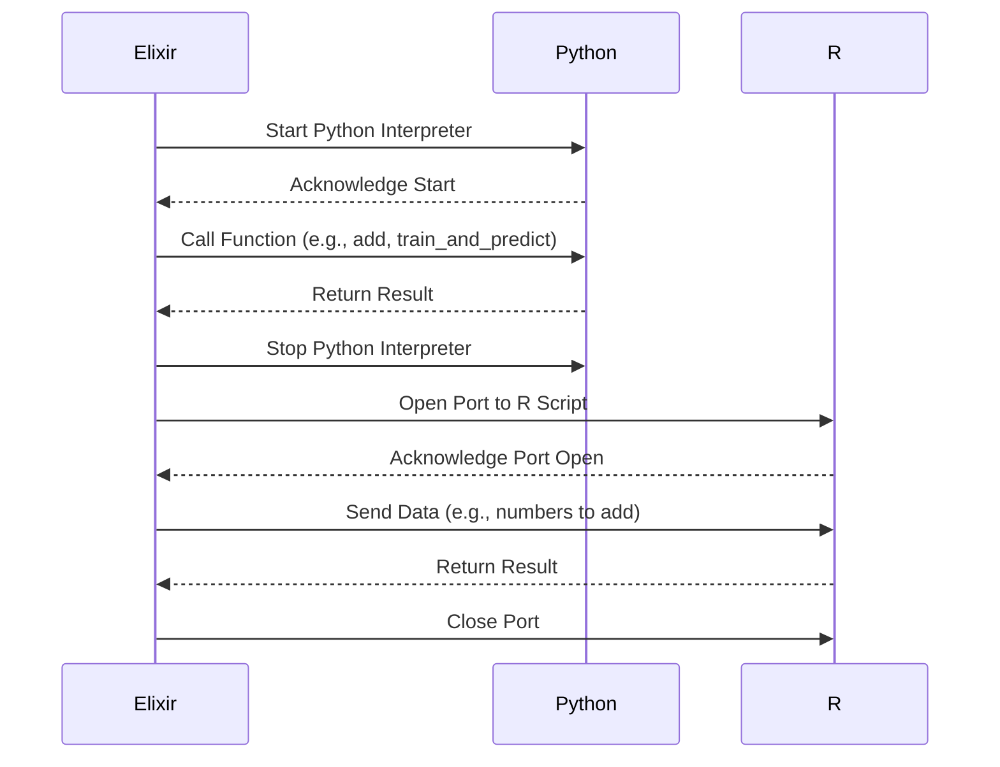

## 17.3. Interoperability with Python and R Using Ports and NIFs

In the realm of machine learning and data science, Python and R are two of the most popular languages due to their extensive libraries and frameworks. However, Elixir, with its robust concurrency model and fault-tolerant design, offers unique advantages for building scalable and reliable systems. By integrating Elixir with Python and R, developers can leverage the best of both worlds: Elixir's performance and reliability with Python's and R's rich data science ecosystems.

### Calling Python Code

#### Using Erlport

**Erlport** is a library that allows Elixir to communicate with external programs, including Python. It provides a simple way to call Python functions from Elixir, enabling seamless integration between the two languages.

**Installation and Setup:**

To use Erlport, add it to your `mix.exs` file:

```elixir
defp deps do
  [
    {:erlport, "~> 0.10.1"}
  ]
end
```

Run `mix deps.get` to fetch the dependency.

**Basic Usage:**

Here's a simple example of calling a Python function from Elixir using Erlport:

1. **Create a Python Script:**

```python
# my_script.py
def add(a, b):
    return a + b
```

2. **Call the Python Function from Elixir:**

```elixir
defmodule PythonInterop do
  use ErlPort, [:python]

  def add_numbers(a, b) do
    {:ok, pid} = :python.start()
    result = :python.call(pid, :my_script, :add, [a, b])
    :python.stop(pid)
    result
  end
end

IO.inspect(PythonInterop.add_numbers(5, 7)) # Output: 12
```

**Explanation:**

- **:python.start()**: Starts a Python interpreter.
- **:python.call/4**: Calls the specified Python function.
- **:python.stop()**: Stops the Python interpreter.

#### Using Pyrlang

**Pyrlang** is another library that facilitates communication between Elixir and Python. It allows Python to act as an Erlang node, enabling bidirectional communication.

**Installation and Setup:**

To use Pyrlang, you need to install it in your Python environment:

```bash
pip install pyrlang
```

**Basic Usage:**

1. **Create a Python Node:**

```python
# py_node.py
from pyrlang import Node
from term import Atom

node = Node("py@localhost", cookie="secret")

def add(a, b):
    return a + b

node.register(Atom("py_node"), add)
node.run()
```

2. **Connect from Elixir:**

```elixir
defmodule ElixirNode do
  def start do
    Node.start(:"elixir@localhost", cookie: "secret")
    Node.connect(:"py@localhost")
  end

  def add_numbers(a, b) do
    :rpc.call(:"py@localhost", :py_node, :add, [a, b])
  end
end

ElixirNode.start()
IO.inspect(ElixirNode.add_numbers(5, 7)) # Output: 12
```

**Explanation:**

- **Node.start/2**: Starts an Elixir node.
- **Node.connect/1**: Connects to the Python node.
- **:rpc.call/4**: Calls the registered function on the Python node.

### Executing R Scripts

R is renowned for its statistical computing capabilities. By integrating R with Elixir, you can perform complex statistical analyses and visualizations within your Elixir applications.

#### Communicating with R

To execute R scripts from Elixir, you can use Ports, which allow Elixir to communicate with external programs via standard input/output.

**Basic Usage:**

1. **Create an R Script:**

```r
# my_script.R
add <- function(a, b) {
  return(a + b)
}
```

2. **Call the R Script from Elixir:**

```elixir
defmodule RInterop do
  def add_numbers(a, b) do
    port = Port.open({:spawn, "Rscript my_script.R"}, [:binary])
    send(port, {self(), {:command, "#{a} #{b}\n"}})
    receive do
      {^port, {:data, result}} ->
        String.trim(result) |> String.to_integer()
    end
  end
end

IO.inspect(RInterop.add_numbers(5, 7)) # Output: 12
```

**Explanation:**

- **Port.open/2**: Opens a port to communicate with the R script.
- **send/2**: Sends data to the R script.
- **receive/1**: Receives the result from the R script.

### Benefits and Trade-offs

Integrating Elixir with Python and R provides several benefits:

- **Leverage Existing Libraries**: Access the vast array of machine learning and data science libraries available in Python and R.
- **Scalability**: Use Elixir's concurrency model to build scalable and fault-tolerant systems.
- **Flexibility**: Combine the strengths of different languages to solve complex problems.

However, there are trade-offs to consider:

- **Complexity**: Managing multiple languages and environments can increase complexity.
- **Performance**: Communication overhead between languages may impact performance.
- **Maintenance**: Keeping dependencies up-to-date across languages can be challenging.

### Examples

#### Running a Python ML Model from an Elixir Application

Let's demonstrate how to run a Python machine learning model from an Elixir application using Erlport.

1. **Create a Python Script for ML Model:**

```python
# ml_model.py
from sklearn.linear_model import LinearRegression
import numpy as np

def train_and_predict(data, target):
    model = LinearRegression()
    model.fit(data, target)
    prediction = model.predict([[5]])
    return prediction[0]
```

2. **Call the Python Script from Elixir:**

```elixir
defmodule MLInterop do
  use ErlPort, [:python]

  def predict do
    {:ok, pid} = :python.start()
    data = [[1], [2], [3], [4]]
    target = [2, 4, 6, 8]
    result = :python.call(pid, :ml_model, :train_and_predict, [data, target])
    :python.stop(pid)
    result
  end
end

IO.inspect(MLInterop.predict()) # Output: Predicted value for input 5
```

**Explanation:**

- **LinearRegression**: A simple linear regression model from scikit-learn.
- **:python.call/4**: Calls the `train_and_predict` function in the Python script.

### Visualizing Interoperability

To better understand the flow of data and control between Elixir and Python/R, let's visualize the process using a sequence diagram.



**Diagram Explanation:**

- **Elixir** initiates communication with Python or R.
- **Python/R** performs the requested computation and returns the result.
- **Elixir** processes the result and continues execution.

### Try It Yourself

To deepen your understanding, try modifying the examples:

- **Python Example**: Change the Python script to use a different machine learning model or dataset.
- **R Example**: Modify the R script to perform a different statistical operation.

### References and Links

- [Erlport Documentation](https://hexdocs.pm/erlport/readme.html)
- [Pyrlang GitHub Repository](https://github.com/Pyrlang/Pyrlang)
- [R Language Documentation](https://www.r-project.org/)

### Knowledge Check

- **Question**: What are the benefits of integrating Elixir with Python and R?
- **Exercise**: Modify the Python script to use a different machine learning model.

### Embrace the Journey

Remember, integrating multiple languages can be complex, but it opens up a world of possibilities. Keep experimenting, stay curious, and enjoy the journey!

## Quiz: Interoperability with Python and R Using Ports and NIFs



### What is the primary purpose of using Erlport in Elixir?

- [x] To enable communication between Elixir and external programs like Python
- [ ] To compile Elixir code into Python
- [ ] To convert Python code into Elixir syntax
- [ ] To create graphical user interfaces in Elixir

> **Explanation:** Erlport is used to facilitate communication between Elixir and external programs, such as Python, allowing Elixir to call Python functions.

### Which library allows Python to act as an Erlang node?

- [ ] Erlport
- [x] Pyrlang
- [ ] NIFs
- [ ] Ecto

> **Explanation:** Pyrlang allows Python to act as an Erlang node, enabling bidirectional communication between Python and Elixir.

### What is a potential trade-off of integrating Elixir with Python and R?

- [x] Increased complexity in managing multiple languages
- [ ] Reduced access to machine learning libraries
- [ ] Inability to perform statistical analysis
- [ ] Lack of concurrency support

> **Explanation:** Integrating multiple languages can increase complexity due to the need to manage different environments and dependencies.

### How does Elixir communicate with R scripts?

- [x] Using Ports to communicate via standard input/output
- [ ] Directly calling R functions
- [ ] Compiling R code into Elixir
- [ ] Using NIFs for direct integration

> **Explanation:** Elixir uses Ports to communicate with R scripts, allowing data to be sent and received via standard input/output.

### What is a benefit of using Elixir's concurrency model with Python/R?

- [x] Building scalable and fault-tolerant systems
- [ ] Directly executing Python/R code within Elixir
- [ ] Eliminating the need for external libraries
- [ ] Simplifying statistical computations

> **Explanation:** Elixir's concurrency model allows for the creation of scalable and fault-tolerant systems, which can be beneficial when integrating with Python/R.

### Which function is used to start a Python interpreter in Erlport?

- [x] :python.start()
- [ ] :python.init()
- [ ] :python.run()
- [ ] :python.execute()

> **Explanation:** The function :python.start() is used to start a Python interpreter when using Erlport.

### What is a key advantage of using Python for machine learning in Elixir applications?

- [x] Access to a vast array of machine learning libraries
- [ ] Improved performance over native Elixir code
- [ ] Simplified syntax for Elixir developers
- [ ] Built-in support for Elixir's concurrency model

> **Explanation:** Python offers a wide range of machine learning libraries, which can be leveraged in Elixir applications for advanced data processing.

### How can Elixir send data to an R script?

- [x] By sending data through a Port
- [ ] By embedding R code directly in Elixir
- [ ] By using NIFs for direct execution
- [ ] By converting R code to Elixir syntax

> **Explanation:** Elixir sends data to an R script through a Port, which allows communication via standard input/output.

### What is a common use case for integrating Elixir with R?

- [x] Performing complex statistical analyses
- [ ] Developing web applications
- [ ] Creating graphical user interfaces
- [ ] Building real-time chat applications

> **Explanation:** R is renowned for its statistical computing capabilities, making it a common choice for performing complex statistical analyses when integrated with Elixir.

### True or False: NIFs are primarily used for executing Python code in Elixir.

- [ ] True
- [x] False

> **Explanation:** NIFs (Native Implemented Functions) are used for executing native code, typically written in C, within Elixir. They are not primarily used for executing Python code.


