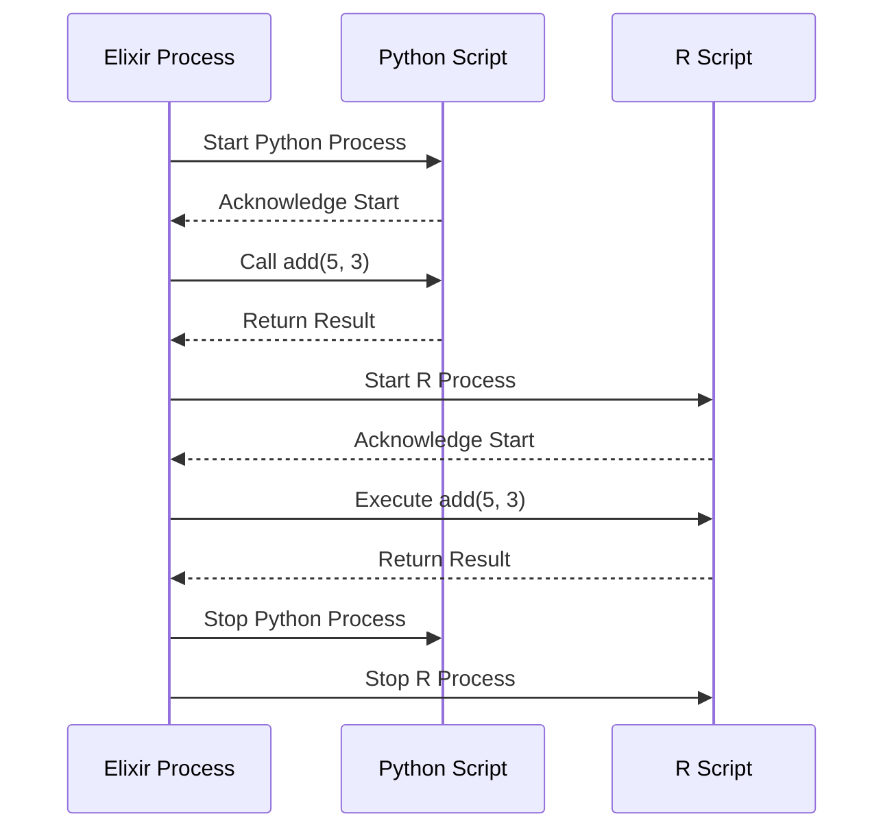

## 17.3. Interoperability with Python and R Using Ports and NIFs

In the realm of machine learning and data science, Python and R stand out as the most popular languages due to their extensive libraries and active communities. However, Elixir, with its inherent strengths in concurrency and fault tolerance, offers unique advantages for building scalable and reliable systems. Combining Elixir with Python and R allows developers to leverage the best of both worlds. This section will explore how to achieve this interoperability using Ports and Native Implemented Functions (NIFs).

### Calling Python Code

#### Using Erlport

Erlport is a library that facilitates communication between Erlang (and by extension, Elixir) and other languages such as Python. It allows you to run Python code from Elixir, enabling you to use Python's powerful machine learning libraries directly within your Elixir applications.

**Installation and Setup**

To get started with Erlport, you need to add it to your `mix.exs` dependencies:

```elixir
defp deps do
  [
    {:erlport, "~> 0.10.0"}
  ]
end
```

After adding the dependency, run `mix deps.get` to fetch the library.

**Example: Running Python Code**

Let's demonstrate how to call a simple Python function from Elixir using Erlport.

1. **Create a Python Script**

Create a file named `math_operations.py`:

```python
def add(a, b):
    return a + b
```

2. **Elixir Code to Call Python**

```elixir
defmodule PythonInterop do
  use ErlPort

  def start do
    {:ok, pid} = :python.start()
    result = :python.call(pid, :math_operations, :add, [5, 3])
    IO.puts("Result from Python: #{result}")
    :python.stop(pid)
  end
end

PythonInterop.start()
```

**Explanation:**

- We start a Python process using `:python.start()`.
- We call the `add` function from the `math_operations` module.
- Finally, we stop the Python process.

#### Using Pyrlang

Pyrlang is another library that allows you to run Python code from Elixir. It provides a more integrated approach by enabling Python to act as a node in an Erlang cluster.

**Installation and Setup**

First, install Pyrlang using pip:

```bash
pip install pyrlang
```

**Example: Running a Python Node**

1. **Create a Python Node**

```python
from pyrlang import Node
from term import Atom

class MathNode(Node):
    def __init__(self, node_name):
        Node.__init__(self, node_name)

    def handle_call(self, sender, message):
        if message == Atom('add'):
            return 5 + 3

if __name__ == "__main__":
    node = MathNode("py@localhost")
    node.run_forever()
```

2. **Elixir Code to Communicate with Python Node**

```elixir
defmodule PyNodeClient do
  def start do
    :net_kernel.start([:"elixir@localhost"])
    :rpc.call(:"py@localhost", :erlang, :apply, [fn -> :add end, []])
  end
end

PyNodeClient.start()
```

**Explanation:**

- We create a Python node using Pyrlang.
- We use Elixir's `:rpc.call` to communicate with the Python node.

### Executing R Scripts

R is renowned for its statistical computing capabilities. By integrating R with Elixir, you can perform complex statistical analyses and data visualizations.

#### Communicating with R

To execute R scripts from Elixir, you can use Ports, which allow external programs to communicate with Erlang/Elixir processes.

**Example: Running an R Script**

1. **Create an R Script**

Create a file named `stats_operations.R`:

```r
add <- function(a, b) {
  return(a + b)
}
```

2. **Elixir Code to Execute R Script**

```elixir
defmodule RInterop do
  def start do
    port = Port.open({:spawn, "Rscript stats_operations.R"}, [:binary])
    send(port, {self(), {:command, "add(5, 3)\n"}})
    receive do
      {^port, {:data, result}} ->
        IO.puts("Result from R: #{result}")
    end
    Port.close(port)
  end
end

RInterop.start()
```

**Explanation:**

- We open a Port to run the R script.
- We send a command to execute the `add` function.
- We receive and print the result.

### Benefits and Trade-offs

Interoperability between Elixir and languages like Python and R offers several benefits:

- **Leverage Existing Libraries:** Access to Python's extensive machine learning libraries and R's statistical packages.
- **Concurrent and Fault-Tolerant Systems:** Use Elixir's strengths to build robust systems.
- **Flexibility:** Choose the best tool for the job, combining Elixir's concurrency with Python/R's data processing capabilities.

**Trade-offs:**

- **Complexity:** Managing inter-language communication can add complexity.
- **Performance Overhead:** Inter-process communication may introduce latency.
- **Error Handling:** Different error handling paradigms between languages.

### Examples

#### Running a Python ML Model from Elixir

Let's run a simple Python machine learning model from Elixir.

1. **Python Script for ML Model**

Create a file named `ml_model.py`:

```python
from sklearn.linear_model import LinearRegression
import numpy as np

def predict(input_data):
    X = np.array([[1, 1], [1, 2], [2, 2], [2, 3]])
    y = np.dot(X, np.array([1, 2])) + 3
    model = LinearRegression().fit(X, y)
    return model.predict(np.array(input_data)).tolist()
```

2. **Elixir Code to Call Python ML Model**

```elixir
defmodule MLInterop do
  use ErlPort

  def start do
    {:ok, pid} = :python.start()
    input_data = [[3, 5]]
    result = :python.call(pid, :ml_model, :predict, [input_data])
    IO.inspect(result, label: "Prediction from Python ML Model")
    :python.stop(pid)
  end
end

MLInterop.start()
```

**Explanation:**

- We define a simple linear regression model in Python.
- We call the `predict` function from Elixir, passing input data.

### Visualizing Interoperability

To better understand the flow of data and control between Elixir and external languages like Python and R, let's visualize the process using a sequence diagram.


```mermaid
sequenceDiagram
    participant Elixir as Elixir Process
    participant Python as Python Script
    participant R as R Script

    Elixir->>Python: Start Python Process
    Python-->>Elixir: Acknowledge Start
    Elixir->>Python: Call add(5, 3)
    Python-->>Elixir: Return Result
    Elixir->>R: Start R Process
    R-->>Elixir: Acknowledge Start
    Elixir->>R: Execute add(5, 3)
    R-->>Elixir: Return Result
    Elixir->>Python: Stop Python Process
    Elixir->>R: Stop R Process
```

**Diagram Explanation:**

- The Elixir process initiates communication with both Python and R scripts.
- It sends commands to execute functions and receives results.
- Finally, it stops the external processes.

### Knowledge Check

- **What are the primary benefits of integrating Elixir with Python and R?**
- **How does Erlport facilitate communication between Elixir and Python?**
- **What are the trade-offs of using Ports for interoperability?**

### Try It Yourself

Encourage experimentation by modifying the code examples:

- **Change the Python or R functions** to perform different operations.
- **Experiment with different machine learning models** in Python.
- **Try using other R packages** for statistical analysis.

### References and Links

- [Erlport Documentation](https://hexdocs.pm/erlport/readme.html)
- [Pyrlang GitHub Repository](https://github.com/Pyrlang/Pyrlang)
- [R Project for Statistical Computing](https://www.r-project.org/)
- [Python Official Site](https://www.python.org/)

### Summary

Interoperability between Elixir and languages like Python and R enhances the capabilities of Elixir applications by leveraging the strengths of each language. While there are trade-offs in terms of complexity and performance, the benefits of accessing powerful libraries and building robust systems make it a worthwhile endeavor.

## Quiz Time!



### What is the primary purpose of using Erlport in Elixir?

- [x] To facilitate communication between Elixir and Python.
- [ ] To compile Elixir code into Python.
- [ ] To convert Python code into Elixir syntax.
- [ ] To run Elixir code within a Python environment.

> **Explanation:** Erlport is used to facilitate communication between Elixir and Python by allowing Elixir to call Python functions.

### Which library allows Python to act as a node in an Erlang cluster?

- [ ] Erlport
- [x] Pyrlang
- [ ] NIFs
- [ ] Ports

> **Explanation:** Pyrlang allows Python to act as a node in an Erlang cluster, enabling communication with Elixir.

### What is a trade-off of using Ports for interoperability?

- [x] Performance overhead due to inter-process communication.
- [ ] Lack of access to Python libraries.
- [ ] Inability to run R scripts.
- [ ] Limited to only statistical operations.

> **Explanation:** Ports introduce performance overhead due to the inter-process communication required.

### How do you start a Python process using Erlport in Elixir?

- [x] {:ok, pid} = :python.start()
- [ ] :python.spawn()
- [ ] :erlport.start()
- [ ] :python.init()

> **Explanation:** The correct way to start a Python process using Erlport is by calling `:python.start()`.

### What is a benefit of combining Elixir with Python and R?

- [x] Access to extensive machine learning libraries.
- [ ] Reduced code complexity.
- [ ] Elixir's ability to compile Python and R code.
- [ ] Elixir's native support for statistical operations.

> **Explanation:** Combining Elixir with Python and R provides access to extensive machine learning libraries and statistical packages.

### Which of the following is NOT a method for interoperability between Elixir and Python/R?

- [ ] Using Ports
- [ ] Using NIFs
- [ ] Using Erlport
- [x] Using Elixir macros

> **Explanation:** Elixir macros are not used for interoperability with Python or R.

### What is the role of the `Port` module in Elixir?

- [x] To enable communication with external programs.
- [ ] To compile Elixir code into other languages.
- [ ] To create distributed Elixir nodes.
- [ ] To manage Elixir processes.

> **Explanation:** The `Port` module in Elixir is used to enable communication with external programs.

### Why might you choose to use NIFs over Ports?

- [x] For performance-critical operations.
- [ ] For easier error handling.
- [ ] For simpler code structure.
- [ ] For better compatibility with R.

> **Explanation:** NIFs are chosen over Ports for performance-critical operations as they run native code directly.

### Which of the following is a benefit of using Elixir for machine learning applications?

- [x] Building scalable and fault-tolerant systems.
- [ ] Direct access to Python libraries.
- [ ] Native support for deep learning models.
- [ ] Simplified statistical analysis.

> **Explanation:** Elixir is beneficial for building scalable and fault-tolerant systems, which is crucial for machine learning applications.

### True or False: Pyrlang can be used to run R scripts from Elixir.

- [ ] True
- [x] False

> **Explanation:** Pyrlang is specifically designed for Python interoperability, not R.



Remember, this is just the beginning. As you progress, you'll build more complex and interactive applications by integrating Elixir with Python and R. Keep experimenting, stay curious, and enjoy the journey!
