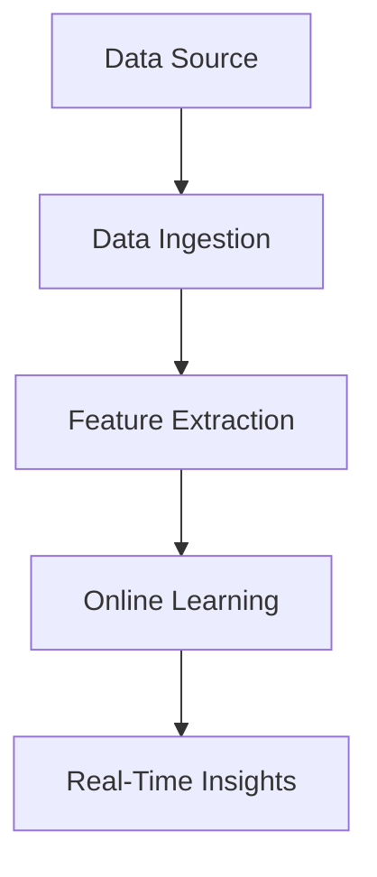

## 17.4. Streaming Data Processing for ML Applications

In the world of machine learning (ML), the ability to process data in real-time is becoming increasingly crucial. Streaming data processing allows us to analyze data as it arrives, enabling immediate insights and actions. This section will delve into how Elixir, with its robust concurrency model and fault-tolerant design, can be leveraged for streaming data processing in ML applications.

### Real-Time Data Streams

Real-time data streams are continuous flows of data generated by various sources such as sensors, user interactions, or financial transactions. Processing this data in real-time allows applications to react instantly, making it essential for scenarios like fraud detection or live recommendation systems.

#### Key Concepts

- **Data Ingestion**: The process of collecting and importing data for immediate use.
- **Data Processing**: Transforming raw data into a format suitable for analysis.
- **Data Output**: Delivering processed data to a destination for further use or storage.

#### Elixir's Role

Elixir's concurrency model, based on the Actor model, is ideal for handling real-time data streams. The language's lightweight processes and message-passing capabilities allow for efficient data ingestion and processing.

```elixir
defmodule DataStreamer do
  use GenServer

  # Starts the GenServer
  def start_link(initial_state) do
    GenServer.start_link(__MODULE__, initial_state, name: __MODULE__)
  end

  # Handles incoming data
  def handle_cast({:data, data}, state) do
    # Process the data
    processed_data = process_data(data)
    # Send the processed data to the next stage
    send_to_next_stage(processed_data)
    {:noreply, state}
  end

  defp process_data(data) do
    # Implement data processing logic here
    data |> String.upcase()
  end

  defp send_to_next_stage(data) do
    IO.puts("Processed Data: #{data}")
  end
end
```

In this example, a GenServer is used to handle incoming data streams. The `handle_cast/2` function processes each piece of data as it arrives, demonstrating Elixir's ability to handle concurrent tasks efficiently.

### Feature Extraction on the Fly

Feature extraction is a critical step in preparing data for machine learning models. In streaming scenarios, features must be extracted in real-time to ensure timely analysis.

#### Techniques for Real-Time Feature Extraction

- **Sliding Windows**: Use sliding windows to capture recent data points for feature extraction.
- **Incremental Statistics**: Calculate statistics incrementally to avoid recomputing from scratch.
- **Event-Based Triggers**: Extract features based on specific events or conditions.

#### Example: Sliding Window

```elixir
defmodule SlidingWindow do
  def extract_features(data_stream, window_size) do
    data_stream
    |> Enum.chunk_every(window_size, 1, :discard)
    |> Enum.map(&calculate_features/1)
  end

  defp calculate_features(window) do
    # Example feature: average value
    Enum.sum(window) / length(window)
  end
end
```

This code demonstrates how to use sliding windows to extract features from a data stream. By chunking the data into windows, we can calculate features like the average value for each window.

### Online Learning Algorithms

Online learning algorithms are designed to learn incrementally from streaming data. Unlike traditional batch learning, online learning updates the model continuously as new data arrives.

#### Benefits of Online Learning

- **Adaptability**: Models can adapt to changes in data distribution over time.
- **Efficiency**: Reduces the need for retraining from scratch.
- **Scalability**: Handles large volumes of data without requiring extensive computational resources.

#### Implementing Online Learning in Elixir

Elixir's concurrency and fault-tolerance features make it suitable for implementing online learning algorithms. By leveraging processes and message passing, we can build scalable and resilient learning systems.

```elixir
defmodule OnlineLearner do
  use GenServer

  def start_link(initial_model) do
    GenServer.start_link(__MODULE__, initial_model, name: __MODULE__)
  end

  def handle_cast({:update, data}, model) do
    # Update the model with new data
    new_model = update_model(model, data)
    {:noreply, new_model}
  end

  defp update_model(model, data) do
    # Implement model update logic here
    model + data
  end
end
```

In this example, an online learning algorithm is implemented using a GenServer. The model is updated incrementally as new data is received, showcasing Elixir's ability to handle continuous learning tasks.

### Use Cases

Streaming data processing is applicable in various domains, including:

- **Fraud Detection**: Monitor transactions in real-time to identify suspicious activities.
- **Live Recommendation Systems**: Provide personalized recommendations based on user interactions.
- **Predictive Maintenance**: Analyze sensor data to predict equipment failures.
- **Real-Time Analytics**: Gain insights from data as it is generated.

#### Fraud Detection Example

```elixir
defmodule FraudDetector do
  use GenServer

  def start_link(initial_state) do
    GenServer.start_link(__MODULE__, initial_state, name: __MODULE__)
  end

  def handle_cast({:transaction, transaction}, state) do
    if suspicious?(transaction) do
      alert_fraud(transaction)
    end
    {:noreply, state}
  end

  defp suspicious?(transaction) do
    # Implement fraud detection logic here
    transaction.amount > 1000
  end

  defp alert_fraud(transaction) do
    IO.puts("Fraud Alert: #{inspect(transaction)}")
  end
end
```

In this fraud detection example, transactions are monitored in real-time. If a transaction is deemed suspicious, an alert is triggered immediately.

### Visualizing Streaming Data Processing

To better understand the flow of streaming data processing, let's visualize the process using a flowchart.



**Figure 1: Streaming Data Processing Flowchart**

This flowchart illustrates the key stages of streaming data processing, from data ingestion to real-time insights.

### References and Further Reading

- [Elixir Official Documentation](https://elixir-lang.org/docs.html)
- [GenServer in Elixir](https://hexdocs.pm/elixir/GenServer.html)
- [Real-Time Data Processing with Apache Kafka](https://kafka.apache.org/documentation/streams/)
- [Online Learning Algorithms](https://en.wikipedia.org/wiki/Online_machine_learning)

### Knowledge Check

- What are the benefits of using Elixir for streaming data processing?
- How does feature extraction differ in streaming scenarios compared to batch processing?
- What are some common use cases for online learning algorithms?

### Embrace the Journey

Streaming data processing in Elixir opens up a world of possibilities for real-time applications. As you explore these concepts, remember that this is just the beginning. Keep experimenting, stay curious, and enjoy the journey!

### Try It Yourself

- Modify the `DataStreamer` example to handle different types of data.
- Implement a new feature extraction technique using sliding windows.
- Experiment with different online learning algorithms in the `OnlineLearner` module.

## Quiz: Streaming Data Processing for ML Applications



### What is a key advantage of using Elixir for streaming data processing?

- [x] Concurrency and fault tolerance
- [ ] High-level abstractions
- [ ] Object-oriented design
- [ ] Static typing

> **Explanation:** Elixir's concurrency model and fault tolerance make it ideal for handling streaming data efficiently.

### Which technique is commonly used for real-time feature extraction?

- [x] Sliding windows
- [ ] Batch processing
- [ ] Deep learning
- [ ] Static analysis

> **Explanation:** Sliding windows allow for capturing recent data points for feature extraction in real-time.

### What is the primary benefit of online learning algorithms?

- [x] Adaptability to changing data
- [ ] High computational cost
- [ ] Requires large datasets
- [ ] Static model updates

> **Explanation:** Online learning algorithms can adapt to changes in data distribution over time.

### In the fraud detection example, what triggers a fraud alert?

- [x] Transaction amount exceeding a threshold
- [ ] User login
- [ ] Data ingestion
- [ ] Feature extraction

> **Explanation:** A fraud alert is triggered when a transaction amount exceeds a specified threshold.

### What is the role of feature extraction in streaming data processing?

- [x] Transform raw data into a format suitable for analysis
- [ ] Store data for future use
- [ ] Generate random data
- [ ] Encrypt data

> **Explanation:** Feature extraction transforms raw data into a format suitable for analysis.

### Which Elixir feature is particularly useful for handling real-time data streams?

- [x] GenServer
- [ ] Protocols
- [ ] Structs
- [ ] Macros

> **Explanation:** GenServer is used to handle concurrent tasks efficiently in Elixir.

### What is a common use case for streaming data processing?

- [x] Live recommendation systems
- [ ] Static website hosting
- [ ] Batch data analysis
- [ ] Offline data storage

> **Explanation:** Streaming data processing is commonly used in live recommendation systems.

### How does Elixir's concurrency model benefit streaming data processing?

- [x] Allows efficient data ingestion and processing
- [ ] Increases computational complexity
- [ ] Reduces code readability
- [ ] Limits scalability

> **Explanation:** Elixir's concurrency model allows for efficient data ingestion and processing.

### What is the purpose of the `handle_cast/2` function in a GenServer?

- [x] Handle asynchronous messages
- [ ] Define data structures
- [ ] Perform synchronous operations
- [ ] Initialize state

> **Explanation:** The `handle_cast/2` function handles asynchronous messages in a GenServer.

### True or False: Online learning algorithms require retraining from scratch with each new data point.

- [ ] True
- [x] False

> **Explanation:** Online learning algorithms update the model incrementally, without retraining from scratch.


