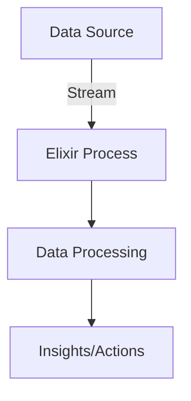

## 17.4. Streaming Data Processing for ML Applications

In the rapidly evolving field of machine learning (ML), the ability to process data in real-time is becoming increasingly crucial. As businesses and applications demand immediate insights, the traditional batch processing methods are often insufficient. Elixir, with its robust concurrency model and functional programming paradigm, provides a powerful platform for streaming data processing in ML applications. In this section, we will delve into the key components of streaming data processing, including real-time data streams, feature extraction on the fly, online learning algorithms, and practical use cases such as fraud detection and live recommendation systems.

### Real-Time Data Streams

Real-time data streams involve processing data as it arrives, enabling immediate analysis and decision-making. This is particularly important in scenarios where timely insights can lead to significant advantages, such as fraud detection or real-time recommendations.

#### Understanding Real-Time Data Streams

Real-time data streaming is the continuous flow of data generated by various sources, such as sensors, user interactions, or financial transactions. The challenge lies in processing this data quickly enough to provide actionable insights.

**Key Concepts:**

- **Latency:** The time delay between data generation and processing. Lower latency is crucial for real-time applications.
- **Throughput:** The amount of data processed in a given time frame. High throughput ensures that large volumes of data can be handled efficiently.
- **Scalability:** The ability to handle increasing volumes of data without degradation in performance.

#### Implementing Real-Time Data Streams in Elixir

Elixir's concurrency model, based on the Actor model, makes it an excellent choice for implementing real-time data streams. Processes in Elixir are lightweight and can handle multiple tasks concurrently, making it easy to manage data streams.

```elixir
defmodule DataStreamer do
  use GenServer

  # Start the GenServer
  def start_link(initial_state) do
    GenServer.start_link(__MODULE__, initial_state, name: __MODULE__)
  end

  # Handle incoming data
  def handle_cast({:new_data, data}, state) do
    # Process data
    IO.inspect("Processing data: #{data}")
    {:noreply, state}
  end

  # Simulate data streaming
  def stream_data(data) do
    GenServer.cast(__MODULE__, {:new_data, data})
  end
end

# Start the data streamer
{:ok, _pid} = DataStreamer.start_link([])

# Simulate incoming data
DataStreamer.stream_data("Sample data 1")
DataStreamer.stream_data("Sample data 2")
```

**Explanation:**

- **GenServer:** A generic server process in Elixir that handles state and messages. It's used here to manage the data stream.
- **handle_cast/2:** A callback function to handle asynchronous messages. It processes incoming data without blocking.

#### Visualizing Real-Time Data Streams


```mermaid
flowchart TD
    A[Data Source] -->|Stream| B[Elixir Process]
    B --> C[Data Processing]
    C --> D[Insights/Actions]
```

**Diagram Description:** This flowchart illustrates the flow of data from the source to processing in Elixir, leading to actionable insights.

### Feature Extraction on the Fly

Feature extraction is the process of transforming raw data into meaningful features that can be used in ML models. In streaming applications, this needs to be done in real-time.

#### Techniques for Real-Time Feature Extraction

1. **Windowing:** Dividing the data stream into fixed-size chunks (windows) for processing.
2. **Aggregation:** Calculating summary statistics (e.g., mean, sum) over the windowed data.
3. **Transformation:** Applying mathematical transformations to derive new features.

#### Implementing Feature Extraction in Elixir

Elixir's powerful pattern matching and functional programming capabilities make it well-suited for feature extraction.

```elixir
defmodule FeatureExtractor do
  # Extract features from a data stream
  def extract_features(data_stream) do
    data_stream
    |> Enum.map(&transform/1)
    |> Enum.chunk_every(5)
    |> Enum.map(&aggregate/1)
  end

  # Transform raw data
  defp transform(data) do
    # Example transformation
    String.to_integer(data)
  end

  # Aggregate data within a window
  defp aggregate(window) do
    Enum.sum(window)
  end
end

# Example usage
data_stream = ["1", "2", "3", "4", "5", "6", "7", "8", "9", "10"]
features = FeatureExtractor.extract_features(data_stream)
IO.inspect(features)
```

**Explanation:**

- **transform/1:** Converts raw data into a numerical format.
- **aggregate/1:** Sums the values within each window, demonstrating a simple aggregation technique.

### Online Learning Algorithms

Online learning algorithms are designed to learn incrementally from data as it arrives, as opposed to traditional batch learning methods. This is ideal for streaming data, where new information continuously flows in.

#### Key Characteristics of Online Learning

- **Incremental Updates:** Models are updated with each new data point, allowing them to adapt quickly.
- **Memory Efficiency:** Only the current state of the model is stored, reducing memory usage.
- **Real-Time Adaptation:** Models can adapt to changes in the data distribution over time.

#### Implementing Online Learning in Elixir

Elixir's concurrency and fault-tolerance features make it a strong candidate for implementing online learning algorithms.

```elixir
defmodule OnlineLearning do
  use GenServer

  # Define the initial state
  def start_link(initial_model) do
    GenServer.start_link(__MODULE__, initial_model, name: __MODULE__)
  end

  # Handle incoming data for learning
  def handle_cast({:learn, data}, model) do
    # Update the model with new data
    updated_model = update_model(model, data)
    {:noreply, updated_model}
  end

  # Simulate learning process
  def learn(data) do
    GenServer.cast(__MODULE__, {:learn, data})
  end

  # Update model function
  defp update_model(model, data) do
    # Example update logic
    model + data
  end
end

# Start the online learning process
{:ok, _pid} = OnlineLearning.start_link(0)

# Simulate learning with new data
OnlineLearning.learn(1)
OnlineLearning.learn(2)
```

**Explanation:**

- **GenServer:** Manages the state of the learning model.
- **handle_cast/2:** Updates the model incrementally with each new data point.

### Use Cases

Streaming data processing is particularly valuable in scenarios where immediate insights are crucial. Let's explore some practical use cases.

#### Fraud Detection

In financial systems, detecting fraudulent transactions in real-time can prevent significant losses. By analyzing transaction data as it streams in, anomalies can be identified and flagged for further investigation.

**Approach:**

- **Feature Extraction:** Extract features such as transaction amount, location, and time.
- **Anomaly Detection:** Use online learning algorithms to identify patterns indicative of fraud.

#### Live Recommendation Systems

Recommendation systems that update in real-time can enhance user experience by providing personalized suggestions based on the latest interactions.

**Approach:**

- **Data Streams:** Capture user interactions and preferences.
- **Model Updates:** Continuously update recommendation models with new data.

### Conclusion

Streaming data processing in Elixir offers powerful capabilities for real-time ML applications. By leveraging Elixir's concurrency model, developers can efficiently handle data streams, perform feature extraction on the fly, and implement online learning algorithms. These techniques enable applications to respond promptly to new information, providing timely insights and enhancing user experiences.

### Try It Yourself

Experiment with the code examples provided in this section. Try modifying the data streams, feature extraction logic, or learning algorithms to see how they impact the system's performance. Remember, this is just the beginning. As you progress, you'll build more complex and interactive applications. Keep experimenting, stay curious, and enjoy the journey!

## Quiz Time!



### What is a key advantage of real-time data streams?

- [x] Immediate analysis and decision-making
- [ ] Reduced data storage requirements
- [ ] Simplified data processing
- [ ] Enhanced data security

> **Explanation:** Real-time data streams allow for immediate analysis and decision-making, which is crucial in scenarios where timely insights are needed.

### Which Elixir feature is particularly useful for managing real-time data streams?

- [x] Concurrency model
- [ ] Pattern matching
- [ ] Immutable data structures
- [ ] Compile-time macros

> **Explanation:** Elixir's concurrency model, based on the Actor model, is particularly useful for managing real-time data streams.

### What technique is used to divide data streams into fixed-size chunks?

- [x] Windowing
- [ ] Aggregation
- [ ] Transformation
- [ ] Filtering

> **Explanation:** Windowing is the technique used to divide data streams into fixed-size chunks for processing.

### What is the purpose of feature extraction in streaming data?

- [x] Transform raw data into meaningful features for ML models
- [ ] Reduce the volume of data
- [ ] Enhance data security
- [ ] Simplify data storage

> **Explanation:** Feature extraction transforms raw data into meaningful features that can be used in ML models.

### What is a characteristic of online learning algorithms?

- [x] Incremental updates
- [ ] High memory usage
- [ ] Batch processing
- [ ] Static models

> **Explanation:** Online learning algorithms update models incrementally with each new data point, allowing them to adapt quickly.

### Which use case benefits from real-time data processing?

- [x] Fraud detection
- [ ] Batch reporting
- [ ] Monthly data analysis
- [ ] Historical data archiving

> **Explanation:** Fraud detection benefits from real-time data processing as it requires immediate insights to prevent losses.

### What is a key benefit of using Elixir for streaming data processing?

- [x] Robust concurrency and fault-tolerance
- [ ] Simplified syntax
- [ ] Extensive library support
- [ ] Strong typing

> **Explanation:** Elixir's robust concurrency and fault-tolerance make it ideal for streaming data processing.

### Which process in Elixir is used to manage state and messages?

- [x] GenServer
- [ ] Supervisor
- [ ] Task
- [ ] Agent

> **Explanation:** GenServer is used in Elixir to manage state and messages, making it suitable for handling data streams.

### What is the role of aggregation in feature extraction?

- [x] Calculate summary statistics over windowed data
- [ ] Transform data into a different format
- [ ] Filter out unnecessary data
- [ ] Encrypt sensitive data

> **Explanation:** Aggregation involves calculating summary statistics over windowed data, which is a key step in feature extraction.

### True or False: Online learning algorithms require storing the entire dataset in memory.

- [ ] True
- [x] False

> **Explanation:** False. Online learning algorithms are memory efficient as they only store the current state of the model, not the entire dataset.


