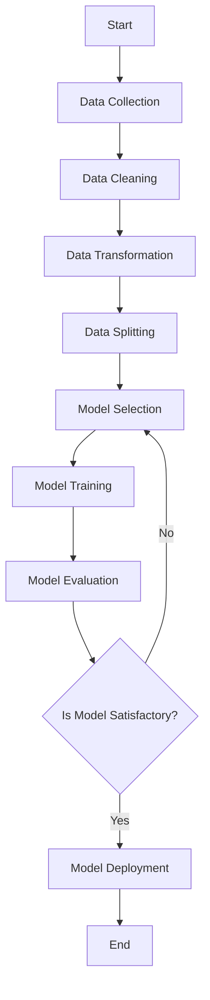

## 17.5. Building Predictive Models

In this section, we will delve into the process of building predictive models using Elixir. We'll cover the essential steps, from data preparation to model deployment, and discuss evaluation metrics to ensure your models are performing optimally. By the end of this guide, you'll have a comprehensive understanding of how to integrate machine learning capabilities into your Elixir applications.

### Data Preparation

Data preparation is the foundation of any successful predictive modeling project. It involves cleaning, structuring, and transforming raw data into a format suitable for analysis. Let's explore the key steps involved in preparing data for modeling.

#### Cleaning and Structuring Data

1. **Data Cleaning**: This step involves identifying and correcting errors in the dataset. Common tasks include handling missing values, removing duplicates, and correcting inconsistencies.

2. **Data Transformation**: Transform raw data into a structured format. This may involve normalizing or standardizing data, encoding categorical variables, and creating new features through feature engineering.

3. **Data Splitting**: Divide the dataset into training, validation, and test sets. This allows you to train your model on one subset of data and evaluate its performance on unseen data.

```elixir
# Example of data cleaning and transformation in Elixir
defmodule DataPreparation do
  def clean_data(data) do
    data
    |> Enum.filter(&valid_entry?/1) # Remove invalid entries
    |> Enum.map(&transform_entry/1) # Transform data entries
  end

  defp valid_entry?(entry) do
    # Check for missing or invalid data
    entry[:value] != nil
  end

  defp transform_entry(entry) do
    # Example transformation: normalize value
    %{entry | value: entry[:value] / 100.0}
  end
end
```

### Training Models

Training a predictive model involves selecting an appropriate algorithm and fitting it to the training data. In Elixir, you can leverage libraries like `Nx` and `Axon` for machine learning tasks, or integrate with external tools like Python's `scikit-learn` using ports or NIFs.

#### Using Elixir Libraries

Elixir's `Nx` library provides numerical computing capabilities, while `Axon` offers a high-level API for building and training neural networks.

```elixir
# Example of training a simple neural network with Axon
defmodule ModelTraining do
  import Axon

  def train_model(data) do
    model = 
      Axon.input({nil, 1})
      |> Axon.dense(10, activation: :relu)
      |> Axon.dense(1, activation: :sigmoid)

    model
    |> Axon.compile(optimizer: :adam, loss: :binary_cross_entropy)
    |> Axon.fit(data, epochs: 10, batch_size: 32)
  end
end
```

#### Integrating with External Tools

For more complex models, you might use Python libraries like `TensorFlow` or `PyTorch`. Elixir's interoperability with Python can be achieved through ports or NIFs, allowing you to leverage powerful machine learning frameworks.

### Deploying Models

Once a model is trained, the next step is deployment. This involves integrating the model into your Elixir application, ensuring it can make predictions in real-time or batch mode.

#### Integrating Predictive Models

You can deploy models as part of a web service using Phoenix, Elixir's web framework, or as a standalone application. Consider using `Plug` for creating lightweight HTTP interfaces for your models.

```elixir
# Example of deploying a model with Phoenix
defmodule MyAppWeb.PredictionController do
  use MyAppWeb, :controller

  def predict(conn, %{"input" => input}) do
    prediction = MyModel.predict(input)
    json(conn, %{prediction: prediction})
  end
end
```

### Evaluation Metrics

Evaluating a model's performance is crucial to ensure its predictions are accurate and reliable. Common evaluation metrics include accuracy, precision, recall, F1-score, and ROC-AUC.

#### Measuring Model Performance

1. **Accuracy**: The ratio of correctly predicted instances to the total instances.
2. **Precision**: The ratio of true positive predictions to the total positive predictions.
3. **Recall**: The ratio of true positive predictions to the actual positive instances.
4. **F1-Score**: The harmonic mean of precision and recall.
5. **ROC-AUC**: A measure of a model's ability to distinguish between classes.

```elixir
# Example of calculating evaluation metrics in Elixir
defmodule EvaluationMetrics do
  def calculate_accuracy(predictions, labels) do
    correct_predictions = Enum.zip(predictions, labels)
    |> Enum.count(fn {pred, label} -> pred == label end)

    correct_predictions / length(labels)
  end
end
```

### Visualizing the Predictive Modeling Process

To better understand the predictive modeling process, let's visualize the workflow using a flowchart.



*Figure 1: Predictive Modeling Workflow*

### Try It Yourself

Experiment with the code examples provided in this section. Try modifying the data cleaning functions, adjust the neural network architecture, or integrate a different machine learning library. This hands-on approach will deepen your understanding of building predictive models in Elixir.

### Knowledge Check

- What are the key steps in data preparation for predictive modeling?
- How can you integrate Python machine learning libraries with Elixir?
- What are some common evaluation metrics used to assess model performance?

### Summary

In this section, we've explored the process of building predictive models using Elixir. From data preparation to model deployment, each step is crucial for developing accurate and reliable models. Remember, this is just the beginning. As you continue to experiment and learn, you'll discover new techniques and tools to enhance your machine learning capabilities in Elixir.

## Quiz: Building Predictive Models



### What is the first step in data preparation for predictive modeling?

- [x] Data Cleaning
- [ ] Model Training
- [ ] Data Splitting
- [ ] Model Evaluation

> **Explanation:** Data cleaning is the initial step to ensure the dataset is free from errors and inconsistencies.

### Which Elixir library is used for numerical computing?

- [x] Nx
- [ ] Phoenix
- [ ] Plug
- [ ] Ecto

> **Explanation:** Nx is used for numerical computing in Elixir, providing capabilities for machine learning tasks.

### What is the purpose of data splitting?

- [x] To divide the dataset into training, validation, and test sets
- [ ] To clean the data
- [ ] To transform categorical variables
- [ ] To deploy the model

> **Explanation:** Data splitting allows for training the model on one subset and evaluating it on unseen data.

### Which metric measures the ratio of true positive predictions to the total positive predictions?

- [x] Precision
- [ ] Accuracy
- [ ] Recall
- [ ] F1-Score

> **Explanation:** Precision measures the ratio of true positive predictions to the total positive predictions.

### How can you deploy a predictive model in Elixir?

- [x] Using Phoenix to create a web service
- [ ] Using Ecto for database integration
- [ ] Using Plug for data transformation
- [ ] Using Nx for numerical computing

> **Explanation:** Phoenix can be used to create a web service for deploying predictive models.

### What is the role of Axon in Elixir?

- [x] It provides a high-level API for building and training neural networks
- [ ] It is a web framework
- [ ] It is a database library
- [ ] It is a numerical computing library

> **Explanation:** Axon offers a high-level API for building and training neural networks in Elixir.

### Which evaluation metric is the harmonic mean of precision and recall?

- [x] F1-Score
- [ ] Accuracy
- [ ] Precision
- [ ] Recall

> **Explanation:** The F1-Score is the harmonic mean of precision and recall.

### What is the purpose of using ports or NIFs in Elixir?

- [x] To integrate with external tools like Python libraries
- [ ] To create web services
- [ ] To manage database connections
- [ ] To handle HTTP requests

> **Explanation:** Ports or NIFs are used to integrate Elixir with external tools like Python libraries.

### Which of the following is not an evaluation metric?

- [x] Data Cleaning
- [ ] Accuracy
- [ ] Precision
- [ ] Recall

> **Explanation:** Data cleaning is part of data preparation, not an evaluation metric.

### True or False: The ROC-AUC metric measures a model's ability to distinguish between classes.

- [x] True
- [ ] False

> **Explanation:** ROC-AUC is a measure of a model's ability to distinguish between classes.


