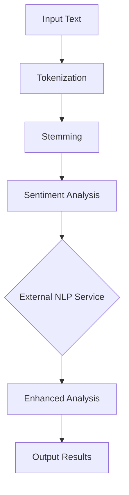

## 17.6. Natural Language Processing (NLP) with Elixir

Natural Language Processing (NLP) is a fascinating field that combines linguistics, computer science, and artificial intelligence to enable computers to understand, interpret, and respond to human language. In this section, we will explore how Elixir, a functional programming language known for its concurrency and fault-tolerance, can be utilized for NLP tasks. We will cover text processing techniques, useful libraries, integration with external NLP services, and practical applications.

### Text Processing

Text processing is the foundation of NLP, involving the manipulation and analysis of text data. Key tasks include tokenization, stemming, and sentiment analysis. Let's delve into each of these components.

#### Tokenization

Tokenization is the process of breaking down text into smaller units called tokens, which can be words, phrases, or symbols. This is a crucial step in NLP as it allows for the analysis of text at a granular level.

```elixir
defmodule Tokenizer do
  @moduledoc """
  A simple tokenizer for breaking text into words.
  """

  @doc """
  Tokenizes a given string into words.

  ## Examples

      iex> Tokenizer.tokenize("Hello, world!")
      ["Hello", "world"]

  """
  def tokenize(text) do
    text
    |> String.downcase()
    |> String.replace(~r/[^\w\s]/, "")
    |> String.split()
  end
end
```

In this example, we define a `Tokenizer` module that provides a `tokenize/1` function. This function converts the text to lowercase, removes punctuation, and splits the text into words.

#### Stemming

Stemming reduces words to their root form, which helps in understanding the core meaning of words despite variations. For example, "running" and "runner" can be reduced to "run".

```elixir
defmodule StemmerExample do
  @moduledoc """
  Demonstrates stemming using the Stemmer library.
  """

  def stem_words(words) do
    Enum.map(words, &Stemmer.stem/1)
  end
end

# Usage
words = ["running", "runner", "ran"]
StemmerExample.stem_words(words)
# Output: ["run", "run", "ran"]
```

Here, we use the `Stemmer` library to stem a list of words. The `stem_words/1` function applies stemming to each word in the list.

#### Sentiment Analysis

Sentiment analysis involves determining the sentiment expressed in a piece of text, such as positive, negative, or neutral. This can be useful for applications like social media monitoring or customer feedback analysis.

```elixir
defmodule SentimentAnalyzer do
  @moduledoc """
  A simple sentiment analyzer using a basic word list.
  """

  @positive_words ["happy", "joy", "love", "excellent", "good"]
  @negative_words ["sad", "hate", "bad", "terrible", "poor"]

  def analyze(text) do
    words = Tokenizer.tokenize(text)

    positive_count = Enum.count(words, &(&1 in @positive_words))
    negative_count = Enum.count(words, &(&1 in @negative_words))

    cond do
      positive_count > negative_count -> :positive
      negative_count > positive_count -> :negative
      true -> :neutral
    end
  end
end

# Usage
SentimentAnalyzer.analyze("I love this excellent product!")
# Output: :positive
```

In this example, we define a `SentimentAnalyzer` module that uses a simple word list to determine the sentiment of a given text. The `analyze/1` function counts the occurrences of positive and negative words and returns the overall sentiment.

### Libraries and Tools

Elixir offers several libraries and tools that facilitate NLP tasks. Two notable libraries are `Stemmer` and `Elasticlunr`.

#### Using `Stemmer`

The `Stemmer` library provides a straightforward way to perform stemming in Elixir. It supports various stemming algorithms, including the Porter stemmer.

```elixir
defmodule StemmerDemo do
  @moduledoc """
  Demonstrates the use of the Stemmer library.
  """

  def demo_stemming do
    words = ["running", "jumps", "easily", "flying"]
    Enum.map(words, &Stemmer.stem/1)
  end
end

# Usage
StemmerDemo.demo_stemming()
# Output: ["run", "jump", "easili", "fli"]
```

#### Using `Elasticlunr`

`Elasticlunr` is a full-text search library that can be used for indexing and searching text data. It supports tokenization, stemming, and more.

```elixir
defmodule SearchIndex do
  @moduledoc """
  Demonstrates text indexing and searching using Elasticlunr.
  """

  def create_index do
    index = Elasticlunr.new()
    |> Elasticlunr.add_field("title")
    |> Elasticlunr.add_field("body")

    index
    |> Elasticlunr.add_doc(%{id: 1, title: "Elixir NLP", body: "Learn natural language processing with Elixir."})
    |> Elasticlunr.add_doc(%{id: 2, title: "Elixir Programming", body: "Explore functional programming with Elixir."})

    index
  end

  def search(index, query) do
    Elasticlunr.search(index, query)
  end
end

# Usage
index = SearchIndex.create_index()
SearchIndex.search(index, "NLP")
# Output: [%{id: 1, title: "Elixir NLP", body: "Learn natural language processing with Elixir."}]
```

In this example, we create a search index using `Elasticlunr`, add documents to it, and perform a search query.

### Integration with NLP Services

While Elixir provides powerful tools for NLP, integrating with external NLP services can enhance capabilities. Services like Google NLP and IBM Watson offer advanced features such as entity recognition, language translation, and more.

#### Connecting to Google NLP API

To connect to Google NLP API, you need to set up authentication and make HTTP requests to the API endpoints.

```elixir
defmodule GoogleNLP do
  @moduledoc """
  Demonstrates integration with Google NLP API.
  """

  @api_url "https://language.googleapis.com/v1/documents:analyzeSentiment"

  def analyze_sentiment(text) do
    body = %{
      document: %{type: "PLAIN_TEXT", content: text},
      encodingType: "UTF8"
    }

    headers = [
      {"Content-Type", "application/json"},
      {"Authorization", "Bearer " <> get_access_token()}
    ]

    HTTPoison.post(@api_url, Jason.encode!(body), headers)
    |> handle_response()
  end

  defp get_access_token do
    # Implement OAuth2 token retrieval
  end

  defp handle_response({:ok, %HTTPoison.Response{status_code: 200, body: body}}) do
    {:ok, Jason.decode!(body)}
  end

  defp handle_response({:error, %HTTPoison.Error{reason: reason}}) do
    {:error, reason}
  end
end

# Usage
GoogleNLP.analyze_sentiment("I love programming with Elixir!")
```

In this example, we define a `GoogleNLP` module that sends a sentiment analysis request to Google NLP API. The `analyze_sentiment/1` function constructs the request body, sets the headers, and handles the API response.

#### Connecting to IBM Watson NLP

IBM Watson offers a suite of NLP services, including language translation and tone analysis. You can connect to these services using HTTP requests.

```elixir
defmodule WatsonNLP do
  @moduledoc """
  Demonstrates integration with IBM Watson NLP API.
  """

  @api_url "https://api.us-south.tone-analyzer.watson.cloud.ibm.com/instances/your-instance-id/v3/tone"

  def analyze_tone(text) do
    body = %{
      text: text
    }

    headers = [
      {"Content-Type", "application/json"},
      {"Authorization", "Basic " <> Base.encode64("apikey:your-api-key")}
    ]

    HTTPoison.post(@api_url <> "?version=2017-09-21", Jason.encode!(body), headers)
    |> handle_response()
  end

  defp handle_response({:ok, %HTTPoison.Response{status_code: 200, body: body}}) do
    {:ok, Jason.decode!(body)}
  end

  defp handle_response({:error, %HTTPoison.Error{reason: reason}}) do
    {:error, reason}
  end
end

# Usage
WatsonNLP.analyze_tone("I am excited about learning Elixir!")
```

This example demonstrates how to connect to IBM Watson's Tone Analyzer API. The `analyze_tone/1` function sends a request to analyze the tone of the given text.

### Applications

NLP has a wide range of applications, from chatbots to content analysis and language translation. Let's explore some practical use cases.

#### Chatbots

Chatbots are interactive applications that use NLP to understand and respond to user queries. They can be used for customer support, information retrieval, and more.

```elixir
defmodule Chatbot do
  @moduledoc """
  A simple chatbot that responds to greetings.
  """

  def respond_to(input) do
    case String.downcase(input) do
      "hello" -> "Hi there! How can I help you today?"
      "hi" -> "Hello! What can I do for you?"
      _ -> "I'm sorry, I don't understand."
    end
  end
end

# Usage
Chatbot.respond_to("Hello")
# Output: "Hi there! How can I help you today?"
```

This example shows a basic chatbot that responds to greetings. You can extend it with more sophisticated NLP techniques for better understanding and responses.

#### Content Analysis

Content analysis involves extracting meaningful insights from text data. This can be used for sentiment analysis, topic modeling, and more.

```elixir
defmodule ContentAnalyzer do
  @moduledoc """
  Analyzes content for sentiment and topics.
  """

  def analyze_content(text) do
    sentiment = SentimentAnalyzer.analyze(text)
    topics = extract_topics(text)

    %{sentiment: sentiment, topics: topics}
  end

  defp extract_topics(text) do
    # Implement topic extraction logic
  end
end

# Usage
ContentAnalyzer.analyze_content("Elixir is a great language for building scalable applications.")
```

In this example, we define a `ContentAnalyzer` module that analyzes content for sentiment and topics. The `analyze_content/1` function combines sentiment analysis with topic extraction.

#### Language Translation

Language translation involves converting text from one language to another. This can be achieved using external NLP services like Google Translate or IBM Watson Language Translator.

```elixir
defmodule Translator do
  @moduledoc """
  A simple language translator using Google Translate API.
  """

  @api_url "https://translation.googleapis.com/language/translate/v2"

  def translate(text, target_language) do
    body = %{
      q: text,
      target: target_language
    }

    headers = [
      {"Content-Type", "application/json"},
      {"Authorization", "Bearer " <> get_access_token()}
    ]

    HTTPoison.post(@api_url, Jason.encode!(body), headers)
    |> handle_response()
  end

  defp get_access_token do
    # Implement OAuth2 token retrieval
  end

  defp handle_response({:ok, %HTTPoison.Response{status_code: 200, body: body}}) do
    {:ok, Jason.decode!(body)}
  end

  defp handle_response({:error, %HTTPoison.Error{reason: reason}}) do
    {:error, reason}
  end
end

# Usage
Translator.translate("Hello, world!", "es")
```

This example demonstrates how to use Google Translate API for language translation. The `translate/2` function sends a translation request to the API.

### Visualizing NLP Processes

To better understand NLP processes, let's visualize the flow of text processing and integration with external services.



**Figure 1:** This diagram illustrates the flow of NLP processes, starting from input text, through tokenization, stemming, sentiment analysis, and integration with external NLP services for enhanced analysis.

### Knowledge Check

- **Question:** What is tokenization, and why is it important in NLP?
- **Exercise:** Modify the `SentimentAnalyzer` to include more complex sentiment analysis logic.

### Embrace the Journey

Remember, mastering NLP with Elixir is a journey. As you progress, you'll build more sophisticated applications that can understand and respond to human language. Keep experimenting, stay curious, and enjoy the journey!

### Quiz: Natural Language Processing (NLP) with Elixir



### What is the primary purpose of tokenization in NLP?

- [x] To break down text into smaller units for analysis
- [ ] To translate text from one language to another
- [ ] To encrypt text for security
- [ ] To generate text summaries

> **Explanation:** Tokenization is the process of breaking down text into smaller units called tokens, which are essential for further analysis in NLP.

### Which Elixir library is commonly used for stemming?

- [x] Stemmer
- [ ] Elasticlunr
- [ ] HTTPoison
- [ ] Jason

> **Explanation:** The `Stemmer` library is used in Elixir for stemming, which reduces words to their root form.

### What is sentiment analysis?

- [x] Determining the sentiment expressed in a piece of text
- [ ] Translating text from one language to another
- [ ] Encrypting text for security
- [ ] Generating text summaries

> **Explanation:** Sentiment analysis involves determining whether a piece of text expresses a positive, negative, or neutral sentiment.

### How can Elixir integrate with Google NLP API?

- [x] By making HTTP requests to the API endpoints
- [ ] By using built-in Elixir functions
- [ ] By writing custom machine learning algorithms
- [ ] By using the Elixir shell

> **Explanation:** Elixir can integrate with Google NLP API by making HTTP requests to the API endpoints, typically using libraries like HTTPoison.

### What is the role of the `Elasticlunr` library in Elixir?

- [x] Full-text search and indexing
- [ ] Tokenization
- [ ] Stemming
- [ ] Sentiment analysis

> **Explanation:** `Elasticlunr` is a full-text search library used for indexing and searching text data in Elixir.

### Which of the following is a practical application of NLP?

- [x] Chatbots
- [ ] Image processing
- [ ] Video editing
- [ ] Audio synthesis

> **Explanation:** NLP is commonly used in chatbots to understand and respond to user queries.

### What is the purpose of stemming in NLP?

- [x] To reduce words to their root form
- [ ] To translate text from one language to another
- [ ] To encrypt text for security
- [ ] To generate text summaries

> **Explanation:** Stemming reduces words to their root form, helping in understanding the core meaning of words despite variations.

### How can Elixir connect to IBM Watson NLP services?

- [x] By making HTTP requests to the API endpoints
- [ ] By using built-in Elixir functions
- [ ] By writing custom machine learning algorithms
- [ ] By using the Elixir shell

> **Explanation:** Elixir can connect to IBM Watson NLP services by making HTTP requests to the API endpoints, typically using libraries like HTTPoison.

### What is a common use case for language translation in NLP?

- [x] Converting text from one language to another
- [ ] Encrypting text for security
- [ ] Generating text summaries
- [ ] Performing image recognition

> **Explanation:** Language translation involves converting text from one language to another, which is a common use case in NLP.

### True or False: Sentiment analysis can only determine positive or negative sentiment.

- [ ] True
- [x] False

> **Explanation:** Sentiment analysis can determine positive, negative, or neutral sentiment, providing a more nuanced understanding of text.




